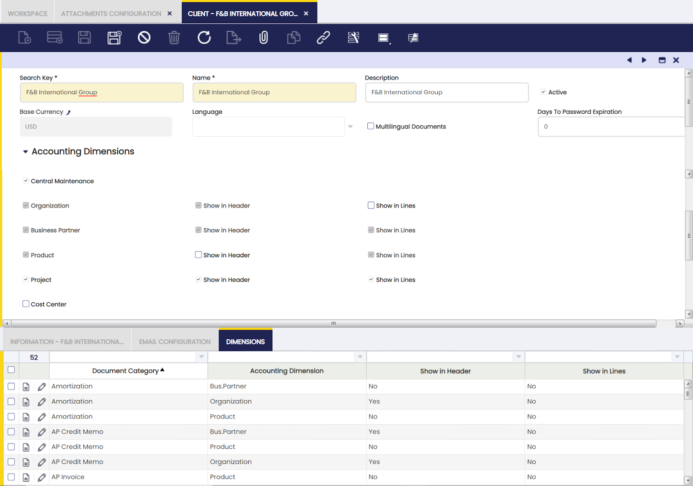
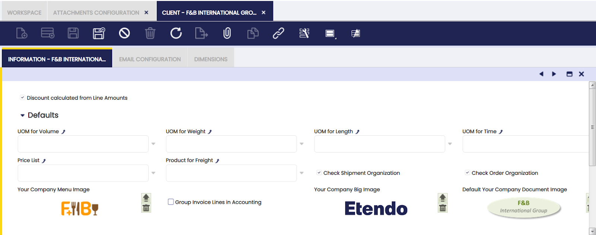
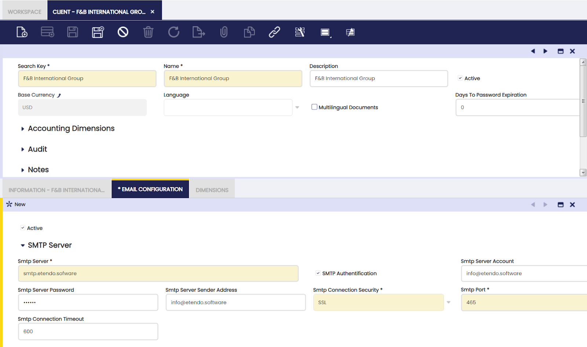
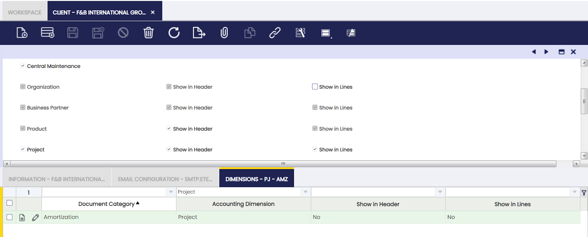

:material-menu: `Application` > `General Setup` > `Client` > `Client`

## Overview

A client is an independent entity composed of at least an organization. A client can include and manage master data such as users, customers and vendors. That master data is then shared among all the organizations which belong to that client.

Etendo allows the user to create more than one Client and more than one Organization within each Client to model your enterprise according to your needs.

Normally, it is enough creating just one Client which hosts multiple organizations that can be used to model your enterprise, the main reasons for this are:

- a client can manage master data that is therefore available to all organizations within that client
- besides, each organization can also manage its own master data and have its own transactional data
- finally, a Client cannot share any master data with another Client.

Clients are created by running the [Initial Client setup process](../../../../developer-guide/etendo-classic/how-to-guides/how-to-run-an-initial-client-setup-process.md) available for the "System Administrator" role.

Organizations are created by running the Initial Organization setup process available for the "Client Administrator" role.

## Client

The Client window allows the user to view and maintain the clients created by running the Initial Client Setup process.

!!! info
    The field "Days To Password expiration" allows the user to set a day limit during which a password may be valid for users. The limit will be reset every time a user changes his password.

The value of the field determines the day limit during which a password must be valid for users:

- If it is set to 0, no day limit will be applied.
- If the value is greater than 0, the day limit will apply after the last date of user update password date.

Setting the value will apply the configuration to all Users from that Client.

A relevant field to note is the **"Central Maintenance"** checkbox under the section "Accounting Dimensions".

This checkbox, if selected, allows the user to configure that the Client centrally maintains key accounting dimensions such as "Organization", "Business Partner" or "Cost Center", therefore the configuration set in here is shared by all the organizations of the client.

New Clients created by running the Initial Client Setup process are created as "Centrally Maintained" by default with the mandatory accounting dimensions (Organization, Business Partner, Product) selected.

The organizations of the Client which require to have additional dimensions not listed in here, for instance "Campaign" or "Sales Region", will have to configure them in the Dimension tab of the organization's general ledger configuration.

Existing clients are not set as "Central Maintained" by default because the accounting dimensions which were set are the ones which were configured in the Dimension tab of the corresponding organization's general ledger configuration.

It is now possible to change existing Clients as "Centrally Maintained", this action overrides what is configured for the organization in relation to the accounting dimensions that can be centrally maintained in the Client, those dimensions are:

- Mandatory dimensions:
  - Organization
  - Business Partner
  - and Product

Mandatory dimensions can be filled in or not depending on the document category being created. For instance, "Organization" needs to be always specified in the document's header regardless of the document being created, however "Business Partner" and "Product" are mandatory dimensions that need to be filled in a purchase invoice but can be filled in a G/L Journal if needed.

- Non Mandatory dimensions:
  - Project
  - Cost Center
  - 1st Dimension, this is a free text dimension which can be customized as required (i.e. it could be customized as "Department"), same as the next one
  - and 2nd Dimension

Non mandatory dimensions can be filled in or not depending on what is needed and regardless of the document category being created.

Above dimensions are then shown either in the header or/and in the lines of the documents to be posted to the ledger within a section named "Dimensions".

Besides, there is a financial report named Accounting Transaction Details which shows every ledger entry of an organization's general ledger detailing every dimension value entered.

!!! info
    It is important to remark that the settings displayed in the client window in both the "Accounting Dimensions" section and in the Dimensions tab is the defaulted configuration provided by Etendo.

This defaulted configuration is populated from the Dimension Mapping window.

It is always possible to customize the defaulted configuration, for instance:

- if a client needs to show and therefore make available the organization dimension in the lines of the documents, below actions need to happen:

    - check the checkbox "Show in Lines" for the Organization dimension
    - and delete or modify the records linked to the "Organization" accounting dimension in the Dimension tab as all those records are defaulted not to show Organization in any document category lines.

### Information

Information tab allows the user to add, edit and maintain client generic information such as default units of measure and images.

Additional information allowed to be specified:

- _Discount calculated from Line Amounts_ excluding taxes and charges
- Default _units of measure_ for:
      - _volume_
      - _weight_
      - _length_
      - and _time_
- _Price List_
- _Product for freight_
- _Check shipment Organization_ to monitor that the organization shipping the goods is the same as the organization of the customer.
- _Check Order Organization_ to monitor that the organization ordering the goods is the same as the organization of the vendor.
- _Group Invoice lines in accounting_ to get invoices having many invoice lines, do not generate as many accounting lines as invoice lines but a summarized number of accounting lines per account.
- Company _Logos_ for:
      - the _Company Image_
      - the _Company Menu_
      - and _Company Documents_
- _Allow Negative stock_ to do this, Etendo does not check stock if that is not required.

### Email Configuration

Documents such as orders or invoices can be sent out by email. Email configuration tab allows the user to configure the email server, account and password, variables which require to be properly set up prior to sending documents by email.

"Email Configuration" tab gathers the email configuration required for sending out documents such as orders or invoices.

!!! info
    It is important to know the smtp server configuration which is going to be used in order to properly fill the information below:

- **Smtp Server**, email server with SMTP
- **SMTP Authentication**, "yes/no" flag to define if the email server requires authentication or not before sending emails.
- **SMTP Server Account**, email server username in case of authentication required.
- **SMTP Server Password**, email server password in case of authentication required.
- **SMTP Server Sender Address**, email address to send emails from.
- **SMTP Connection Security**, security level needed for the SMTP servers connection. Available options are:
      - None
      - STARTTLS
      - SSL
- **SMTP Port**, port required for your SMTP server
- **SMTP Connection Timeout**, maximum amount of time (in seconds) allowed for an SMTP connection to connect or communicate.

In the provided screenshot, you can see a valid configuration for a gmail account:

- **Smtp Server**, [smtp.gmail.com](http://smtp.gmail.com)
- **SMTP Authentication**, "yes"
- **SMTP Server Account**, a valid gmail account (including the @gmail.com or @yourdomain)
- **SMTP Server Password**, the password for this gmail account
- **SMTP Server Sender Address**, email address to send emails from.
- **SMTP Connection Security**, SSL
- **SMTP Port**, 465
- **SMTP Connection Timeout**, 600 (10 minutes)

### Dimensions

Dimensions tab allows the user to configure whether a given accounting dimension is going to be available in the header and/or in the lines of a given document category or not.

This tab can be used to configure accounting dimensions availability at document level only if the client is set as "Centrally Maintained". This setting is specific to the document and accounting dimension and it overwrites the configuration in the header.

For example, if a client needs to display project dimension in the header and lines in all documents less in amortization document, the client window should have the following configuration:

The configuration in dimensions tab is populated by the configuration that exists in the Dimension Mapping window.

---
This work is licensed under :material-creative-commons: :fontawesome-brands-creative-commons-by: :fontawesome-brands-creative-commons-sa: [ CC BY-SA 2.5 ES](https://creativecommons.org/licenses/by-sa/2.5/es/){target="_blank"} by [Futit Services S.L](https://etendo.software){target="_blank"}.