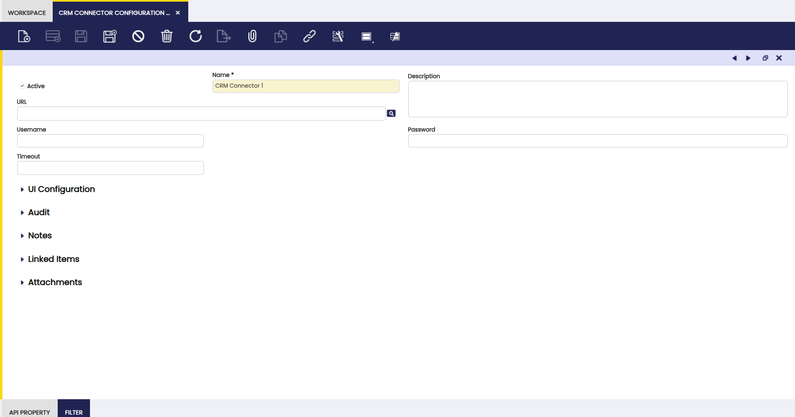

# CRM Connector Configuration

:material-menu: `Application` > `General Setup` > `CRM Connector` > `CRM Connector Configuration`

## Overview

The concrete CRM connector must add a configuration in this window to enable it to connect to the external system and to define the properties and filters used by Etendo to map with the external system information.

Fields to note:

- **Name**: Identifier of the connector.
- **Description**: Additional information about the connector. 
- **URL**: 	The URL defines an online address for this element.
- **Username**: Name that identifies the user in the System.
- **Password**: Indicates the Password for this User Id. Passwords are required to identify authorized users.
- **Timeout**: Timeout is the value in seconds set by the user for the request to the defined service.

## API Property

An API property is like a Map which matches an external API key with an Etendo Message. It defines the data type and any other related configuration.

### Property Options

It allows the user to define options accepted by parent property.

## Filter

Filters for external business partner integration. The filter has a defined type and it is linked to one or many properties.

### Filter Options

It allows the user to define options accepted by the parent filter.

### Address Mapping

In this tab, the user can define addresses and determine the properties that should be used for each location column mapping.

---

This work is a derivative of [General Setup](https://wiki.openbravo.com/wiki/General_Setup){target="_blank"} by [Openbravo Wiki](http://wiki.openbravo.com/wiki/Welcome_to_Openbravo){target="_blank"}, used under [CC BY-SA 2.5 ES](https://creativecommons.org/licenses/by-sa/2.5/es/){target="_blank"}. This work is licensed under [CC BY-SA 2.5](https://creativecommons.org/licenses/by-sa/2.5/){target="_blank"} by [Etendo](https://etendo.software){target="_blank"}.