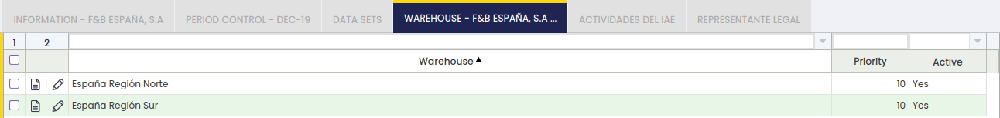
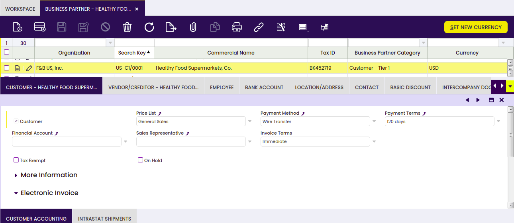
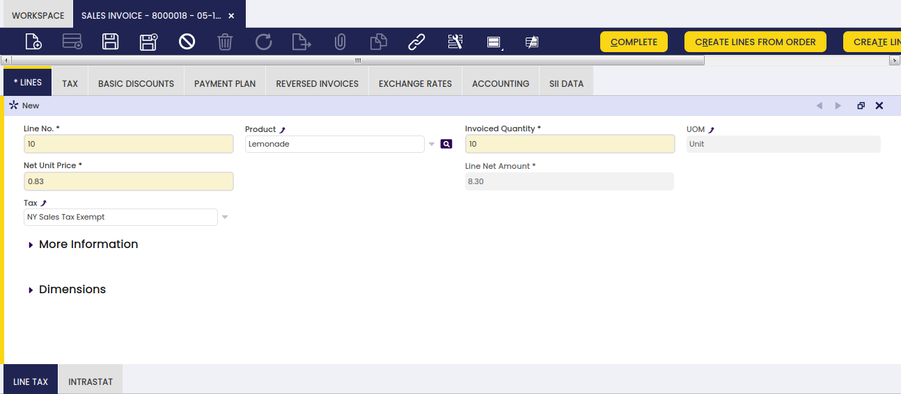

Enterprise Model folder allows the user to create and model the Organizations which belong to a Client.

## Initial Organization Setup

:material-menu: `Application` > `General Setup` > `Enterprise Model` > `Initial Organization Setup`

### Overview

An Organization is an enterprise of a Client. A client can have at least one or even more than one organization as the way of configuring different types of enterprise models.

Overall organizations can be:

- independent legal entities with a different Tax ID number
- enterprise groups with the aim of getting aggregated figures for the group
- or business areas of the client such as departments

Besides, organizations can be structured:

- by _country or region_
- by _area or function_
- and so on, according to the enterprise model needs.

All of the above provides an insight about the different scenarios which need to be covered while modeling the enterprise.

There could be organizations which require to share master data such as business partners and products while having its own chart of account, taxes, financial reporting and transactional data. That could be the case of independent legal entities belonging to the same enterprise group.

There could be organizations sharing master data and even the same chart of accounts. That could be the case of divisions or departments within the same independent legal entity.

There could be organizations created with the aim of just grouping data, for which its own transactional data is not required.

All of the above is possible due to the fact that there are different types of Organizations, see the section below, and besides organizations can be structured in a hierarchical way:

- At the highest level of the tree, there is an organization named (\*).
      - (\*) organization is created at the same time that the _system client_ is created, and it is shared among the different _client/s_ in the system.
      - Master data created at (\*) organization level is accessible for all the organization beneath it
      - (\*) organization is not an independent legal entity, therefore transactional data is not allowed.
      - Every organization created later on will be created below (\*) organization.
- At a lower level of the tree, there can be parent organization/s which can have child organization/s beneath it/them.
      - Master data such as business partners and products created at parent organization level is accessible for all the child organization/s beneath it.
- At the lowest level of the tree, there can be child organization/s with no organizations beneath it/them.
      - Master data such as business partners and products created at child organization level will not be accessible for the rest of the child organizations, if any.

### Initial Organization Setup

As already mentioned, Organizations are created by running the Initial Organization Setup process and not only that, once an organization has been created it must be set as "Ready" in the Organization window.

As shown in the image above, an organization can be created by providing the relevant data below:

- the name of the organization
- the name of the user of the organization
    - Etendo creates a new user and a new role which only has access to the newly created organization.
        - This user can be later on changed by assigning new roles to it.
        - And the role can also be later on changed by assigning new organizations to it.
- the organization type. The options available are:
    - Organization - an organization which is not a legal entity and does not allow transactional data entering.
        - This type of organization allows the creation and configuration of master data to be shared among a group of organizations of any type belonging to it, for instance Business Partners, Chart of Accounts, etc.
        - It does not require general ledger as it does not allow entering transactions, but it can have a given General Ledger configuration to be shared among the organizations underneath
        - The accounting periods can not be opened and closed independently at its level.
        - And there could be as many organizations type "organization" in a branch as required.
    - Legal with accounting - an independent legal entity with a unique Tax ID number which requires accounting, therefore:
        - This organization requires a General Ledger and therefore an Account Tree or Chart of Accounts, as well as a Fiscal Calendar because the accounting periods can and must be opened and closed at its level.
        - This organization type allows the "consolidation" of the Balance Sheet and P&L reports only for the Chart of Accounts it has assigned.
        - Transactions are allowed for this organization type.
        - And finally, there can only be one legal entity per tree branch, therefore the organizations underneath inherit the General Ledger configuration and the Fiscal Calendar of the legal with accounting organization.
    - Legal without accounting - an independent legal entity with a unique Tax ID number which does not require accounting because it is managed in a separated system, therefore:
        - This organization type does not need a general ledger nor a chart of accounts and will not support financial reports at its level.
        - Transactions are allowed for this organization type. Transactions which will not be posted to the ledger.
        - It can not have another legal entity in an upper/lower level of the enterprise tree structure.
    - Generic - an organization which is not a legal entity but must belong to a legal entity placed at an upper level in the organization tree structure. For instance, departments or divisions within an organization or legal entity.
        - There could be as many generic organizations as required per tree branch, but always under a legal entity.
        - This organization type allows transactional data entry, it can have its own general ledger configuration and can inherit the general ledger configuration of the legal entity with accounting they belong to.
        - The accounting periods can not be opened and closed independently at its level.
- the parent organization. While creating an organization, it is possible to select the organization to which the organization being created will belong to. The parent organization would need to be set as "Summary".
    - A generic organization can not be the parent organization of a legal entity organization, but the other way around.
- the organization location/address
- and the organization currency

Besides:

- There is a checkbox named "Include Accounting" which allows the user to select for an organization:
    - an accounting CSV file in the field "Accounting File"
    - or a Chart of Accounts module reference data in the section "Reference Data". Reference data coming from extensions modules is master data such as Taxes, Chart of Accounts, etc to be applied from the already installed modules.

This action creates:

- a General Ledger configuration which is automatically linked to the Organization being created
- and an Account Tree or Chart of Accounts which is also linked to the Organization being created

This step does not create a Fiscal Calendar as the [Initial Client Setup](../../../../developer-guide/etendo-classic/how-to-guides/how-to-run-an-initial-client-setup-process.md) process does, because Fiscal Calendars need to be created ad hoc for the "Legal with Accounting" Organizations for which "Allow Period Control" feature is going to be enabled.

!!! note
    This step does not imply to manage accounting within an organization, but just to include an accounting file or an accounting reference data in an organization.

Accounting management relies on the organization type being created.

It is not mandatory to select "Include Accounting" checkbox while creating a legal entity with accounting organization for instance because:

- a legal entity with accounting can inherit the client chart of accounts
- or, later, both the Chart of Accounts and the General Ledger configuration can be created manually and be linked to the organization.
- if the checkbox "Include Accounting" is selected, it is possible to select for the organization being created below dimensions to be used while posting the organization's documents to the ledger:
    - Mandatory accounting dimensions such as "Business Partner" and "Product" and not mandatory accounting dimensions such as "Project" and "Sales Region" while creating an Organization in a "Client" which does not centrally maintain the accounting dimensions.  
    In that case, the dimensions selected in here will all be listed in the dimensions tab of the organization's general ledger configuration, therefore will be available just for that organization.
    - Additional accounting dimensions such as "Project" or "Campaign" while creating an Organization in a "Client" which centrally maintains the accounting dimensions.  
    Once more, the dimensions selected in here will be listed in the dimensions tab of the organization's general ledger configuration, therefore will be available just for that organization.

It is possible to apply reference data such as:

- Document types and default algorithm for bank statements auto-matching, this one is similar to the previous one but for specific financial flows such as Payment Outs, Payment In and Financial Accounts.
- or reference data such as master data or configuration data (i.e. tax setup) created for Etendo extension modules.

Finally, it is important to remark that:

- Each organization, of any type, can have its own general ledger configuration/s and currency/ies (apart from the one inherited from its parent) if it is configured to be that way for the Organization
- A calendar is mandatory just for the legal entities with accounting. This organization type is the only one which can have a calendar assigned, the rest can inherit it.
- Financial reports are run by general ledger configuration and therefore by currency, as each general ledger configuration has only one currency allowed.
- Financial Reports such as the Balance Sheet and the P&L as well as Tax Reports can only be created at the level of Legal Entity with accounting.
    - Rest of reports such as sales, procurement and warehouse reports can be launched for any organization type.
- A general ledger configuration should not be assigned to the (\*) organization because that one will then be shared by all the organizations underneath.

### Examples

**1.** Etendo Demo Data:

Etendo includes demo data for demonstration purposes, which includes an "Enterprise Model" composed by a set of organizations.

- An organization type "Organization" named F&B International Group.
    - This organization is not a legal entity and it does not allow transactions
    - This organization allows the creation and configuration of master data to be shared among a group of organizations beneath it.
- Two "legal entities with accounting" named "F&B España" and "F&B US" that belong to F&B International Group.
- Below the legal entities with accounting organizations there are four "Generic" organizations, which are not legal entities but belong to a legal entity and besides allow transactional data entry:
    - F&B US West Coast
    - F&B US East Coast
    - F&B España - Region Norte
    - F&B España - Region Sur

**2.** How to create each Organization type:

The basic variables to take into account while creating an organization of the type "Organization" are:

- Organization Type = Organization
- Include Accounting = Yes  
    If the accounting configuration at this level needs to be shared by all the organizations underneath the one being created.
- Accounting Dimensions = Business Partner, Product and Project

The basic variables to take into account while creating an organization of the type "Legal with accounting" are:

- Organization Type = Legal with accounting
- Include Accounting = Yes
- Accounting Dimensions = Business Partner, Product and Project

The basic variables to take into account while creating an organization of the type "Legal without accounting" are:

- Organization Type = Legal without accounting
- Include Accounting = No

The basic variables to take into account while creating an organization of the type "Generic" are:

- Organization Type = Generic
- Include Accounting = Yes  
    If this organization requires its own accounting configuration besides the inherited one, otherwise include accounting = No
- Parent organization = should be a "Legal with Accounting" organization.

**3.** Enterprise Models examples:

## Enterprise Module Management

:material-menu: `Application` > `General Setup` > `Enterprise Model` > `Enterprise Module Management`

### Overview

Datasets allow the user to define reference data such as master data or configuration data for modules or even for Etendo core.

Reference data can be imported or applied to organizations in the "Enterprise Module Management" window by just selecting the organization for which the reference data needs to be applied and the reference data to apply or to import.

- If a reference data is applied at (\*) organization, every organization in the system will have access to that data.
- If a reference data is applied at a parent organization, all the organizations which belong to it will have access to that data.
- If a reference data is only applied to an organization which does not have any organization underneath in the tree, only that organization will have access to that data.

## Organization Type

:material-menu: `Application` > `General Setup` > `Enterprise Model` > `Organization Type`

### Overview

An organization can be a Legal Entity, a Business Unit or neither of both. You can also select if transactions are allowed or not for this organization type.

### Organization Type

Etendo default Organization types are:

**Organization** - an organization which is not a legal entity and does not allow transactional data entering.

- This type of organization allows the creation and configuration of master data to be shared among a group of organizations of any type belonging to it, for instance Business Partners, Chart of Accounts, etc.
- It does not require a general ledger as it does not allow entering transactions but it can have a given General Ledger configuration to be shared among the organizations underneath.
- The accounting periods can not be opened and closed independently at its level.
- And there could be as many organizations type "organization" in a branch as required.

**Legal with accounting** - an independent legal entity with a unique Tax Id number which requires accounting, therefore:

- this organization requires General Ledger and therefore an Account Tree or Chart of Accounts, as well as a Fiscal Calendar because the accounting periods can and must be opened and closed at its level.
- This organization type allows the "consolidation" of the Balance Sheet and P&L reports only for the Chart of Accounts it has assigned.
- Transactions are allowed for this organization type.
- And finally, there can only be one legal entity per tree branch, therefore the organizations underneath inherit the General Ledger configuration and the Fiscal Calendar of the legal with accounting organization.

**Legal without accounting**\- an independent legal entity with a unique Tax Id number which does not require accounting because it is managed in a separated system, therefore:

- this organization type does not need a general ledger nor a chart of accounts and will not support financial reports at its level.
- Transactions are allowed for this organization type. Transactions which will not be posted to the ledger.
- It can not have another legal entity in an upper/lower level of the enterprise tree structure.

**Generic** - an organization which is not a legal entity but must belong to a legal entity placed at an upper level in the organization tree structure. For instance departments or divisions within an organization or legal entity.

- There could be as many generic organizations as required per tree branch but always under a legal entity.
- This organization type allows transactional data entry, can have its own general ledger configuration and can inherit the general ledger configuration of the legal entity with accounting they belong to.
- The accounting periods can not be opened and closed independently at its level.

Additionally, an organization type can be configured as:  
**"Legal Entity"**  
**"Business Unit"**
**"Legal Entity with Accounting"**  
**"Transactions Allowed"**

!!! info
    Note that any of Etendo Organization types are configured as "Business Unit".

## Organization

:material-menu: `Application` > `General Setup` > `Enterprise Model` > `Organization`

### Overview

An organization is an enterprise of a Client. Each client must have at least one organization created by running the Initial Organization Setup process. The process of creating an organization ends after setting it as "Ready".

In other words, the process of creating an organization ends after setting it as "Ready" since Etendo requires performing some checking which validates that the organization has been properly created and that the organization structure is valid. If an organization is not properly created, Etendo will display an error when trying to set it up as ready.

Once an organization is set as ready, no changes can be made to the organization anymore. New organizations can be added, but cannot be placed above the current organization. They can be added underneath or at the same level.

### Organization

The Organization window allows the user to maintain the organizations created by the Initial Organization Setup process.

There are different types of data left to be entered or changed for an organization:

- The Legal Name of the organization, this name, if any, will be the one used in the financial and tax reports.
- The Summary level checkbox informs Etendo if an organization is going to be a parent organization or not.  
  If an organization is set as summary, it could be selected as "Parent Organization" while running the Initial Organization Setup process.  
  This flag can always be changed regardless if the organization is already set as ready, as it is always possible to add organizations underneath an existing one.
- The Allow Period Control checkbox is only shown for "legal with accounting" organizations.

If enabled, it allows selecting a Fiscal Calendar for which the corresponding fiscal periods can be opened or closed in the Open/Close Period Control window.

- Opening & Closing periods process impacts to the organizations underneath the "legal entity with accounting" organization.
- The organization's General Ledger.  
  For instance, legal entities with accounting organizations need to record and post the financial transactions such as invoices and payments to the ledger.  
  Etendo allows customizing the way that the financial transactions are posted to the ledger, that means customizing the General Ledger configuration to meet the organization's needs.  
  This field is automatically defaulted by Etendo, which means that a general ledger is created by default, if :
  - a Localization Pack containing a localized chart of accounts module
  - or an accounting CSV file
  - or the Generic Chart of Accounts Module is installed and then selected while creating the organization by running the Initial Organization Setup process.
- The Default G/L Item for Funds Transfer is used to set default value for G/L Item parameter in Funds Transfer Process from the Financial Account.

**Inherited Information**

This field group is collapsed by default with the following read-only fields.

- the organization's **Period Control Allowed Organization**.
- the organization's **Calendar Owner Organization**.
- Calendar of the organization's **Calendar Owner Organization**.
- the organization's **Legal Entity**.
- the organization's **Business Unit**.

Above fields are automatically fetched and set with proper values when setting organization as ready.

An organization can have only one general ledger configuration assigned unless:

1.  the organization has its own one and besides inherits another one from its parent organization
2.  or if the _advanced general ledger configuration feature_ is enabled at system level.

The way to allow an organization to have more than one general ledger configuration assigned is described below:

- As System Administrator, set your own "template" as "In Development". Save.
- Once done, navigate to the "Windows, Tabs, and Fields" window
- Find the "Organization" window
- Navigate to the "Tab" tab and double click on the "General Ledgers" tab
- Set it as "Active". Save.
- Above detailed steps shows the General Ledger tab, which allows assigning more than one general ledger configuration to an organization.

Food & Beverage (F&B) sample client shipped with Etendo illustrates scenario 1 above:

- Every F&B sample client organization has been created by running the "Initial Organization Setup" process.
- The "F&B International Group" is an "Organization" Organization Type.  
  An Accounting CSV file was selected while it was created, in the same way as the "USD" currency, therefore this organization has the "F&B International Group US/A/Dollar" general ledger configuration assigned.

This general ledger configuration can also be shared by the organizations underneath, for instance "F&B US, Inc" and "F&B España S.A."

- Same way, an accounting CSV file was also selected while creating the "Legal with Accounting" organization "F&B España S.A." same way as EUR currency, therefore this organization has the "F&B España, S.A US/A/Euro" general ledger configuration assigned.  
  As a consequence, "F&B España S.A." has two general ledger configurations assigned, its own one and the inherited one.
- Besides, each of the general ledger configurations mentioned above are linked to a different account tree or chart of accounts.
- Therefore, every time that an "F&B US Inc" transaction is posted to the ledger, Etendo opens a new window named "Journal Entries Report" which shows the journal entry created for the "F&B International Group US/A/Dollar" general ledger configuration in USD and in the corresponding accounts of a given Chart of Accounts.
- Every time that an "F&B España S.A." transaction is posted to the ledger, Etendo opens two new windows, one per each general ledger configuration, one of them in USD and the other one in EUR, both of them in different accounts.

The tree action button  allows dragging and dropping an organization within an enterprise model, whenever it is not "Set as Ready".

**"Set as Ready"** process takes into account the list of requirements below per organization type:

- _Organization type_:
    - No requirements
- _Generic type_
    - to have a "Legal Entity" organization type up in the enterprise model tree.
- _Legal without accounting_
    - not to have another "Legal Entity" organization type up in the enterprise model tree.
- Legal with accounting
    - to have its own general ledger configuration or an inherited one
    - to allow period control
    - to have a fiscal calendar assigned

Once an organization is set as ready:

- The organization newly created can not be moved up or down within the enterprise tree and can not be deleted.
- It is not possible to create new organizations up in the tree but underneath or at the same level.

### Information

Information tab allows the user to add relevant information of an organization, information such as location and tax ID number.

Fields to fill in are:

- the organization Location
- the Tax ID number, if required
- the DUNS number, if any
- the User who will act as the main organization Contact. This organization contact is used in some localized fiscal reports (Spanish fiscal reports), that requires a contact person.
- The purchase invoice number which will be used for payments. There are two options available:
    - "Invoice Document Number" (internal number)
    - or "Supplier's Invoice Number"  
        - Any of the above will be included in the payment description field to inform about the invoice number being paid.  
        - This also changes what is going to be shown in several purchase windows such as _Add Payment_ button in purchase invoice or _Add details_ in Payment Out

Finally, the checkbox Tax Not Deductible allows configuring an Organization as a _non tax deductible organization,_ if enabled.

That is the case of Organizations like Public Sector organizations for which tax deduction is not allowed. In this case:

- the purchase tax is posted as an expense
- and the issued sales invoices are tax-exempt

The field Sales Tax Exempt Rate allows entering a by default exempt sales tax rate to be used in the sales invoices by the non-tax-deductible organizations.

### Period Control

Period Control tab is a read-only tab which lists the fiscal calendar period status of an organization.

**The Status**

It is split in two columns. One that represents the Status with a color code, making it easier to understand the situation at a quick glance. The other one represents the Status by its name, making it possible to filter the records shown. The possible Status values are:

- All Never Opened, colored in gray. Recently created Periods.
- All Opened, colored in green. All the Document Types are open for this Period.
- All Closed, colored in red. All the Document Types are closed for this Period.
- Mixed, colored in orange. Not all the Document Types have the same Status value in this Period. For more information refer to the Documents Tab below.
- All Permanently Closed, colored in red. All the Document Types are Permanently Closed for this Period.

This tab can be used for searching for a period (i.e. Jan-19) and get its current status.

As shown in the image below, the period Feb-19 has a mixed status, meaning that not all the Document Types have the same Status value within the Organization "F&B España S.A." which has the "Calendario España" assigned.

For more information, see Open/Close Period Control.

### Documents

Documents tab is a read-only tab which lists the Document Category status for a selected period of an organization.

For more information, see Documents in the Open/Close Period Control window.

### Data Sets

Data sets tab allows viewing the reference data applied to the organization and informs in case there is any update of a reference data applied available.

### Warehouse

Relation of prioritized on-hand warehouses of the Organization.

In this tab, it is possible to define the organization's warehouse/s, that way the quantity on hand of an organization is the sum of the available stock of its warehouse/s.

It is possible to define the priority of each organization's warehouse/s therefore Etendo proposes first the goods of the warehouse with a higher priority.

## Intercompany

### Overview

This section describes the Intercompany module included in the Etendo Financial Extensions bundle.

### Description 

In case the user has to create orders or invoices among two or more organizations that are different but belong to the same client, this functionality allows automatically generating the corresponding inverse document. 

For example, if Organization A makes a sales transaction to organization B, once the sales invoice is manually created by Organization A, this functionality will automatically create a purchase invoice for Organization B.

### Installation

To be able to include this functionality, the Financial Extensions Bundle must be installed. To do that, follow the instructions from the marketplace: [_Financial Extensions Bundle_](https://marketplace.etendo.cloud/#/product-details?module=9876ABEF90CC4ABABFC399544AC14558).

### Set Up

### Organization Window

It is required for each organization using this module to have one business partner assigned.

#### Business Partner Window

!!! info
    When configuring a new Business Partner, take into account that this business partner should be visible in the inverse organization. 

The Business Partner has to be configured as both vendor and customer, using the corresponding checkboxes.

In the Intercompany Documents tab, it is necessary to select the required document types for this business partner.

!!! info
    It is not mandatory to create new document types, but it is recommended.

!!! info
    Note: The information in both the source business partner and the target business partner should be the same.

#### Invoices and Orders

!!! info
    The following information can be applied not only to sales and purchase invoices, but also to sales and purchase orders.

##### Header

The relevant fields are described below:

-   Organization: it is necessary to select an organization configured to work as an intercompany organization (In the following example, the organization “F&B US East Coast”).
-   Business Partner: it is necessary to select a business partner configured to work as an intercompany business partner (In the following example, “Be Soft Drinker, Inc.”).
-   Transaction document: it is necessary to select the document type defined in the intercompany document tab of the business partner (In the following example, the document type “AR Invoice Intercompany”).

##### Lines

The relevant fields are described below:

-   Product: The product must be visible for both organizations (In the following example, “Lemonade”). 
-   G/L items: The necessary G/L items must be visible for both organizations.

##### Product Window

The relevant fields are described below:

-   Price: The price must be equivalent and available in every price list. 
-   Currency: The currency must be the same for both organizations.
-   Tax: The tax in each organization must be equivalent.

##### Complete or book documents

When you complete invoices or book orders, these processes generate the corresponding inverse document and complete or book both the source and the target documents.

##### Reactivate documents

To reactivate intercompany documents, both documents should not have an associated payment.

!!! info
    Note: This process is only allowed for source documents.
