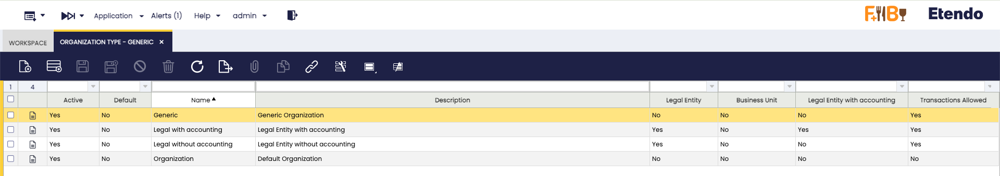

# Organization Type

:material-menu: `Application` > `General Setup` > `Enterprise Model` > `Organization Type`

## Overview

An **organization** can be a Legal Entity, a Business Unit or neither of both. In this window, you can also select if transactions are allowed or not for this organization type.

## Organization Type Window

Etendo default Organization types are:

- **Organization** - an organization which is not a legal entity and does not allow transactional data entering.

    - This type of organization allows the creation and configuration of master data to be shared among a group of organizations of any type belonging to it, for instance Business Partners, Chart of Accounts, etc.
    - It does not require a general ledger as it does not allow entering transactions but it can have a given General Ledger configuration to be shared among the organizations underneath.
    - The accounting periods can not be opened and closed independently at its level.
    - And there could be as many organizations type **organization** in a branch as required.

- **Legal with accounting** - an independent legal entity with a unique Tax Id number which requires accounting, therefore:

    - this organization requires General Ledger and therefore an Account Tree or Chart of Accounts, as well as a Fiscal Calendar because the accounting periods can and must be opened and closed at its level.
    - This organization type allows the consolidation of the Balance Sheet and P&L reports only for the Chart of Accounts it has assigned.
    - Transactions are allowed for this organization type.
    - And finally, there can only be one legal entity per tree branch, therefore the organizations underneath inherit the General Ledger configuration and the Fiscal Calendar of the legal with accounting organization.

- **Legal without accounting**\- an independent legal entity with a unique Tax Id number which does not require accounting because it is managed in a separated system, therefore:

    - this organization type does not need a general ledger nor a chart of accounts and will not support financial reports at its level.
    - Transactions are allowed for this organization type. Transactions which will not be posted to the ledger.
    - It can not have another legal entity in an upper/lower level of the enterprise tree structure.

- **Generic** - an organization which is not a legal entity but must belong to a legal entity placed at an upper level in the organization tree structure. For instance departments or divisions within an organization or legal entity.

    - There could be as many generic organizations as required per tree branch but always under a legal entity.
    - This organization type allows transactional data entry, can have its own general ledger configuration and can inherit the general ledger configuration of the legal entity with accounting they belong to.
    - The accounting periods can not be opened and closed independently at its level.

Additionally, an organization type can be configured as:  

- **Legal Entity**  
- **Business Unit**
- **Legal Entity with Accounting**  
- **Transactions Allowed**

!!! info
    Note that none of Etendo Organization types are configured as Business Unit.

---

This work is a derivative of [General Setup](https://wiki.openbravo.com/wiki/General_Setup){target="_blank"} by [Openbravo Wiki](http://wiki.openbravo.com/wiki/Welcome_to_Openbravo){target="_blank"}, used under [CC BY-SA 2.5 ES](https://creativecommons.org/licenses/by-sa/2.5/es/){target="_blank"}. This work is licensed under [CC BY-SA 2.5](https://creativecommons.org/licenses/by-sa/2.5/){target="_blank"} by [Etendo](https://etendo.software){target="_blank"}.