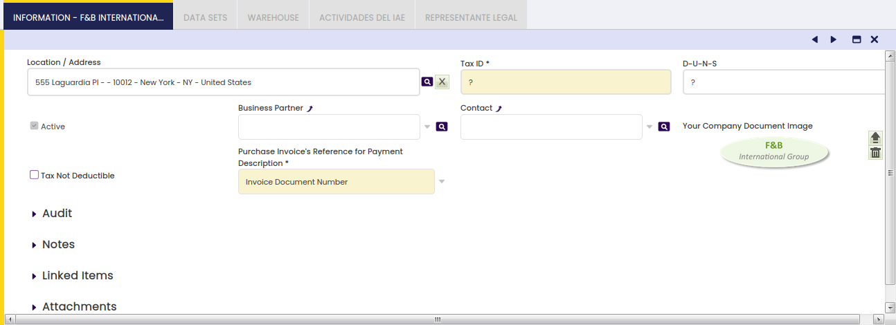

# Organization

:material-menu: `Application` > `General Setup` > `Enterprise Model` > `Organization`

## Overview

An **organization** is an enterprise of a Client. Each client must have at least one organization created by running the Initial Organization Setup process. The process of creating an organization ends after setting it as **Ready**.

In other words, the process of creating an organization ends after setting it as **Ready** since Etendo requires performing some checking which validates that the organization has been properly created and that the organization structure is valid. If an organization is not properly created, Etendo will display an error when trying to set it up as ready.

!!!warning
    Once an organization is set as ready, no changes can be made to the organization anymore. New organizations can be added, but cannot be placed above the current organization. They can be added underneath or at the same level.

## Organization

The **Organization** window allows the user to maintain the organizations created by the Initial Organization Setup process.

There are different types of data left to be entered or changed for an organization:

- The **Legal Name** of the organization, this name, if any, will be the one used in the financial and tax reports.
- The **Summary Level** checkbox informs Etendo if an organization is going to be a parent organization or not.  
If an organization is set as summary, it could be selected as Parent Organization while running the Initial Organization Setup process.  
This flag can always be changed regardless if the organization is already set as ready, as it is always possible to add organizations underneath an existing one.
- The **Allow Period Control** checkbox is only shown for Legal with Accounting organizations.

    

    If enabled, it allows selecting a Fiscal Calendar for which the corresponding fiscal periods can be opened or closed in the Open/Close Period Control window.

- The **Opening & Closing periods** process impacts on the organizations underneath the Legal entity with accounting organization.
- The organization's General Ledger.  
    For instance, legal entities with accounting organizations need to record and post the financial transactions such as invoices and payments to the ledger.  
    Etendo allows customizing the way that the financial transactions are posted to the ledger, that means customizing the General Ledger configuration to meet the organization's needs.  
    This field is automatically defaulted by Etendo, which means that a general ledger is created by default, if :
    - a Localization Pack containing a localized chart of accounts module
    - or an accounting CSV file
    - or the Generic Chart of Accounts Module is installed and then selected while creating the organization by running the Initial Organization Setup process.
- The Default G/L Item for Funds Transfer is used to set default value for G/L Item parameter in Funds Transfer Process from the Financial Account.

**Inherited Information**

This field group is collapsed by default with the following read-only fields.

- the organization's **Period Control Allowed Organization**.
- the organization's **Calendar Owner Organization**.
- Calendar of the organization's **Calendar Owner Organization**.
- the organization's **Legal Entity**.
- the organization's **Business Unit**.

Above fields are automatically fetched and set with proper values when setting organization as ready.

An organization can have only one general ledger configuration assigned unless:

1.  the organization has its own one and besides inherits another one from its parent organization
2.  or if the **advanced general ledger configuration feature** is enabled at system level.

The way to allow an organization to have more than one general ledger configuration assigned is described below:

- As System Administrator, set your own template as **In Development**. Save.
- Once done, navigate to the **Windows, Tabs, and Fields** window
- Find the **Organization** window
- Navigate to the **Tab** tab and double click on the **General Ledgers** tab
- Set it as **Active**. Save.
- Above detailed steps shows the General Ledger tab, which allows assigning more than one general ledger configuration to an organization.

Food & Beverage (F&B) sample client shipped with Etendo illustrates scenario 1 above:

- Every F&B sample client organization has been created by running the **Initial Organization Setup** process.
- The *F&B International Group* is an **Organization** Organization Type.  
  An Accounting CSV file was selected while it was created, in the same way as the *USD* currency, therefore this organization has the *F&B International Group US/A/Dollar* general ledger configuration assigned.

This general ledger configuration can also be shared by the organizations underneath, for instance *F&B US, Inc* and *F&B España S.A.*.

- Same way, an accounting CSV file was also selected while creating the **Legal with Accounting** organization *F&B España S.A.* same way as EUR currency, therefore this organization has the *F&B España, S.A US/A/Euro* general ledger configuration assigned.  
  As a consequence, *F&B España S.A.* has two general ledger configurations assigned, its own one and the inherited one.
- Besides, each of the general ledger configurations mentioned above are linked to a different account tree or chart of accounts.
- Therefore, every time that an *F&B US Inc* transaction is posted to the ledger, Etendo opens a new window named **Journal Entries Report** which shows the journal entry created for the *F&B International Group US/A/Dollar* general ledger configuration in USD and in the corresponding accounts of a given Chart of Accounts.
- Every time that an *F&B España S.A.* transaction is posted to the ledger, Etendo opens two new windows, one per each general ledger configuration, one of them in USD and the other one in EUR, both of them in different accounts.

The tree action button  allows dragging and dropping an organization within an enterprise model, whenever it is not **Set as Ready**.

**Set as Ready** process takes into account the list of requirements below per organization type:

- _Organization type_:
    - No requirements
- _Generic type_
    - to have a **Legal Entity** organization type up in the enterprise model tree.
- _Legal without accounting_
    - not to have another **Legal Entity** organization type up in the enterprise model tree.
- Legal with accounting
    - to have its own general ledger configuration or an inherited one
    - to allow period control
    - to have a fiscal calendar assigned

Once an organization is set as ready:

- The organization newly created can not be moved up or down within the enterprise tree and can not be deleted.
- It is not possible to create new organizations up in the tree but underneath or at the same level.

### Information

Information tab allows the user to add relevant information of an organization, information such as location and tax ID number.

Fields to fill in are:

- the organization Location
- the Tax ID number, if required
- the DUNS number, if any
- the User who will act as the main organization Contact. This organization contact is used in some localized fiscal reports (Spanish fiscal reports), that requires a contact person.
- The purchase invoice number which will be used for payments. There are two options available:
    - **Invoice Document Number** (internal number)
    - or **Supplier's Invoice Number**  
        - Any of the above will be included in the payment description field to inform about the invoice number being paid.  
        - This also changes what is going to be shown in several purchase windows such as _Add Payment_ button in purchase invoice or _Add details_ in Payment Out

Finally, the checkbox Tax Not Deductible allows configuring an Organization as a _non tax deductible organization,_ if enabled.

That is the case of Organizations like Public Sector organizations for which tax deduction is not allowed. In this case:

- the purchase tax is posted as an expense
- and the issued sales invoices are tax-exempt

The field Sales Tax Exempt Rate allows entering a by default exempt sales tax rate to be used in the sales invoices by the non-tax-deductible organizations.

### Period Control

Period Control tab is a read-only tab which lists the fiscal calendar period status of an organization.

**The Status**

It is split in two columns. One that represents the Status with a color code, making it easier to understand the situation at a quick glance. The other one represents the Status by its name, making it possible to filter the records shown. The possible Status values are:

- All Never Opened, colored in gray. Recently created Periods.
- All Opened, colored in green. All the Document Types are open for this Period.
- All Closed, colored in red. All the Document Types are closed for this Period.
- Mixed, colored in orange. Not all the Document Types have the same Status value in this Period. For more information refer to the Documents Tab below.
- All Permanently Closed, colored in red. All the Document Types are Permanently Closed for this Period.

This tab can be used for searching for a period (i.e. Jan-19) and get its current status.

As shown in the image below, the period Feb-19 has a mixed status, meaning that not all the Document Types have the same Status value within the Organization *F&B España S.A.* which has the **Calendario España** assigned.

For more information, see Open/Close Period Control.

#### Documents

Documents tab is a read-only tab which lists the Document Category status for a selected period of an organization.

For more information, see Documents in the Open/Close Period Control window.

### Data Sets

Data sets tab allows viewing the reference data applied to the organization and informs in case there is any update of a reference data applied available.

### Warehouse

Relation of prioritized on-hand warehouses of the Organization.

In this tab, it is possible to define the organization's warehouse/s, that way the quantity on hand of an organization is the sum of the available stock of its warehouse/s.

It is possible to define the priority of each organization's warehouse/s therefore Etendo proposes first the goods of the warehouse with a higher priority.

---

This work is a derivative of [General Setup](https://wiki.openbravo.com/wiki/General_Setup){target="_blank"} by [Openbravo Wiki](http://wiki.openbravo.com/wiki/Welcome_to_Openbravo){target="_blank"}, used under [CC BY-SA 2.5 ES](https://creativecommons.org/licenses/by-sa/2.5/es/){target="_blank"}. This work is licensed under [CC BY-SA 2.5](https://creativecommons.org/licenses/by-sa/2.5/){target="_blank"} by [Etendo](https://etendo.software){target="_blank"}.