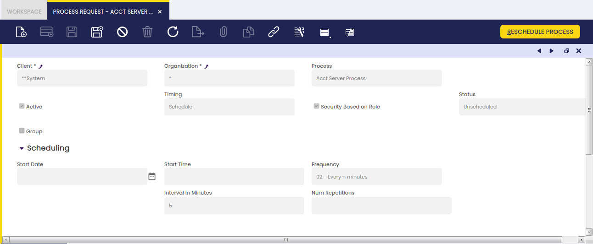
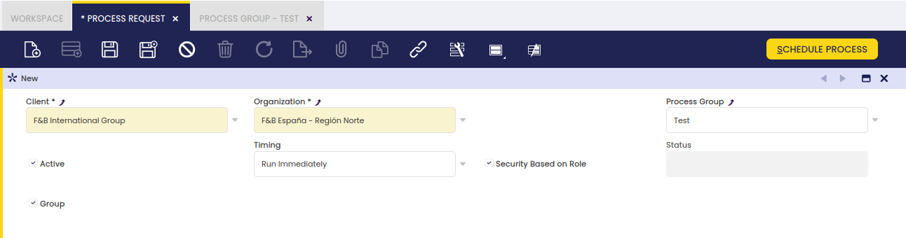
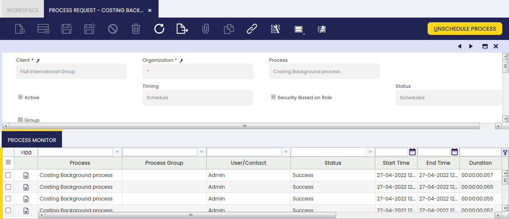
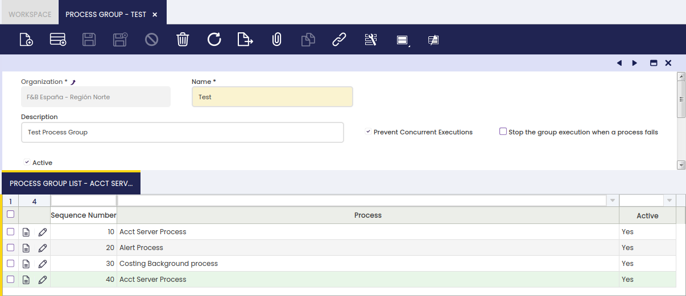
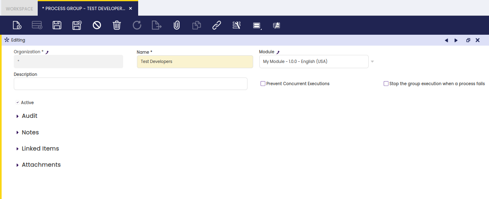

Process Scheduling folder allows the user to schedule and monitor Etendo background processes.

## Process Request

### Introduction

A background process is a system action requested by the user, who has to previously provide auxiliary parameter values to execute that action.

There are two background processes which are listed by default in the process request window, those are:

- the _Accounting Server Process_.  
  This process searches for and automatically "Posts" transactions in status "Completed" set as "Posted" = No.
    - Above means that this process allows documents such as purchase invoices, sales invoices or GL journals get automatically posted without any user action but to schedule this process.
- and the Heartbeat Process.  
  This process collects information about Etendo installations, if scheduled.

Besides, there are other background processes which can also be scheduled and therefore monitored:

- the _Costing Background Process_. This process calculates the cost of the material transactions.
- the _Alert Process_. This process checks if the SQL Query defined in each active alert rule returns any record in order to create the corresponding alert instance.  
    This process also removes the _fixed_ alerts instances to ensure they are not shown anymore.
- the _Execute Pending Payments_ process. This process checks and executes Payment In and Payment Out linked to a payment method having an "_Automatic_" _Payment Execution Process_, which are not set as "Deferred" and do not require any input to be executed.
- and the _Payment Monitor_ process. This process checks the invoice's payment status and updates the invoice's "Payment monitor" section.

!!! info
    All the processes above can be scheduled if logged as System Administrator.

### Process Request

Process Request window allows the user to review and add background processes, which can be scheduled or unscheduled as required.

The information to fill in to schedule a background process is:

- select the _Organization_ for which the background process is going to be scheduled
- select the _Process_ to schedule from the list of processes available
- select the _Timing_. Timing options available are:
    - _Run Immediately_, this one does not require entering any additional parameter values but just to press the action button "Schedule Process".
    - _Run Later_, this one requires entering additional parameter values prior to "Schedule the Process":
      - the Start Date
      - and the Start Time
    - _Schedule_, this one requires to also enter additional information:
      - the Start Date
      - the Start Time
      - the Frequency, options available are options such as "Every n seconds", "Every n minutes", "Hourly", "Daily", etc. Depending on the frequency selected, two new fields are populated to enter:
        - the "Interval in Seconds" and the "Number of Repetitions"
        - the "Interval in Minutes" and the "Number of Repetitions"
        - the "Hourly Interval" and the "Number of Repetitions"
        - the "Daily options" and the "Daily Interval"
        - etc.

!!! note
    "Number of Repetitions" is the number of times the process will be scheduled after its first execution. E.g. A value of 3 means that the process will be scheduled 4 times.

- select the _"Security based on Role"_ checkbox to get that only the user who schedules a process can monitor it in the process monitor window, otherwise any user sharing the same role as the one who scheduled the process will be allowed to monitor it.  
  In both cases, it is required that the role have access to the process in the process access tab of the Role window.
- and, finally, configure by when a process needs to finish. "_Finishes_" field allows entering:
    - a _Finish Date_
    - and a _Finish Time_

Process defined as "Run Immediately" and "Run Later" can either be _Scheduled_ or _Rescheduled_.

Processes defined as "Schedule" can either be _Scheduled_ or _Unscheduled_.

### Costing Background Process

The **Costing Background Process** is the process in charge of searching for goods transactions, such as:

- Goods Receipts
- Goods Shipments
- Physical Inventory
- Goods Movements
- Internal Consumptions
- and Productions

for which its cost has not been calculated yet.

This process considers only transactions having its **"Costing Status"** property as:

- **"Not Calculated"**
- or **"Pending"**.

Costing background process:

- calls the Costing Server process which calculates the cost of each transaction
- and takes into account what configured in the Costing Rule defined for the products, therefore either "Warehouse" dimension is taken into account while calculating the costs, or either "average" or "standard" cost is calculated for the products.

!!! info
    The "Costing Background process" needs to be configured for each Legal entity defined in the client, as this process runs at legal entity (Organization) level.

!!! note
    It is important to remark that if the process is scheduled at (\*) organization level, it will run for all the Legal Entities defined in the Client, therefore it would not be necessary to configure the process more than once.

The transactions are calculated sequentially ordered by the _Transaction Process_ date that is the date and time when the document that originated the transaction was processed.

If the _Costing Server_ shows an error, the background process stops and it is not possible to calculate any new transaction cost until the error is fixed.

The error message can be checked in the Process Monitor window.

!!! note
    Although the Costing Background might have failed the process monitor might show a _Success_. Please refer to the _Process Log_ field to get the real result message.

Some costing algorithms such as "FIFO" implement the "Pending" Costing Status as a way to delay the cost calculation of a given transaction/s until the next run.

This way, the costing calculation process is not stopped for the rest of the transactions having a _Not Calculated_ or _Pending_ status, for which it is possible to calculate the cost.

### Price Correction Background Process

Price correction background process searches for Goods Receipts that:

- either have a purchase order related which has been reactivated and booked after completing the Goods Receipts
- or have a purchase invoice related

After that, this process checks and compares whether:

- order purchase price has been changed before booking the invoice
- invoice purchase price is not the same as purchase order price

If the purchase price has changed, a Price Correction cost adjustment is created for the products included in the Goods Receipt(s).

There is a process named "Process Price Different Adjustment" that manually adjusts if required all Goods Receipts already invoiced prior to upgrading Etendo to manage the Cost Adjustments feature.

### Process Group

Process Request has been modified in order to be able to schedule a process group. There is a check Group. Marking the check, a field called Process Group will appear, and you will be able to select a Process Group.

The schedule of a process group will work exactly as the schedule of a single process. It is not possible to schedule a process group and a single process at the same time.

More information in [Process Group](/user-guide/etendo-classic/basic-features/general-setup/process-scheduling/#process-group_1).

### Process Monitor

Process monitor is a read-only tab that allows reviewing the status of processes executed by this request. 

More information in [Process Monitor](/user-guide/etendo-classic/basic-features/general-setup/process-scheduling/#process-monitor_1).

### Processes in Group

In case that the process executed by the process request is a process group, you will find here the information about the executions of the processes in the group for each process group execution. 

More information in [Process Group](/user-guide/etendo-classic/basic-features/general-setup/process-scheduling/#process-group_1).

## Process Monitor

### Introduction

Process monitor feature allows reviewing the status of processes executed by a user as well as the ones scheduled in the process request window.

In other words, there are two types of processes which can be monitored in this window:

- _transactional_ processes such as Generate Average Cost or Generate Invoices
- and _background_ processes scheduled in the process request

In any case, only the users having a role which have access to a given process/processes will be able to monitor it/them in this window.

Besides, and as already explained, _"Security based on role"_ definition at process request level will allow defining the users which will be able to monitor a given background process in this window.

### Process Execution

Process Monitor window shows read-only information about individual process execution.

As shown in the image above, process monitor window provides the information below per each process executed:

- the _Name_
- the _User_ who run the process
- the _Start and End time_
- the _Duration_
- the _Status_
- and the _Channel_. The options available are:
    - _Direct_ for transactional process executed manually by the user
    - Process Scheduler for background processes scheduled in the Process Request window.

### Processes in Group

In case the process executed is a process group, you will find here the information about the executions of the processes in the group. 

More information in [Process Group](/user-guide/etendo-classic/basic-features/general-setup/process-scheduling/#process-group_1).

## Process Group

### Introduction

Create a Process Group to be able to schedule and execute a group of processes as a single unit from the Process Scheduler. The batch of processes will be executed in series.

The purpose of this functionality is being able to schedule and execute a group of processes as a single unit from the Process Scheduler.

- The Process Group creates an entry in the Process Request Window and Process Monitor window.
- Each individual process executed in a Progress Group is broken out as a separate entry in the Process Request Window and Process Monitor window.
- Each individual process is listed in the Process Monitor window, regardless if it ran successfully or with error.
- The log for each is listed in its own entry.

### Process Group

It creates a Process Group to be able to schedule and execute a group of processes as a single unit from the Process Scheduler. The batch of processes will be executed in series.

A Process Group is a set of processes sorted in a certain sequence.

Process Group (Header): Contains information about the process group.

**Process Group Options**

There are two options that can be selected defining a Process Group

#### Prevent Concurrent Execution of a Process Group

As the Prevent Concurrent Executions of a single process, mark the Prevent Concurrent Executions checkbox in a Process Group means that just before launch an execution of a Process Group the system will check if there is another instance of the same Process Group running (for the same Client and same Organization). If there is, the system will abort the execution and will show an error message in the log: _Concurrent attempt to execute._

#### Stop the group execution when a process fails

By default, if a process that is part of a Process Group fails, the following processes will be executed.

Marking this check-box "Stop the group execution when a process fails" the execution of following processes will be aborted in case of a process failure.

!!!info
    This option is useful if the processes are dependent between them.

### Process Group List

It creates a Process inside a Process Group with a sequence number.

Process Group List contains the list of processes that are part of the group, sorted in a certain order.

### Other Considerations

### Error Result

A process group will show an Error result if it has one or more Error results in the processes that conform the group.

### Permissions

Process Group is a window, so you can manage permissions for creation of Process Group as you wish: Only System, some clients, some organizations, some roles, etc...

### Empty Groups

You can not launch executions of empty groups. If you try, you will receive this error: No processes on the group: nameOfTheGroup.

### Prevent Concurrent Execution Co-Exists

Prevent executions of single processes and group processes will co-exist. Which means that none of them overrides the other and both can be set at the same time.

### Process Group as Source Data

!!! info
    Only for developers

Process Group can be considered as Source Data which means that, working as System Administrator, you can assign a "Group Process" and/or a "Group Process List" to your module in order to distribute them as part of your module.

