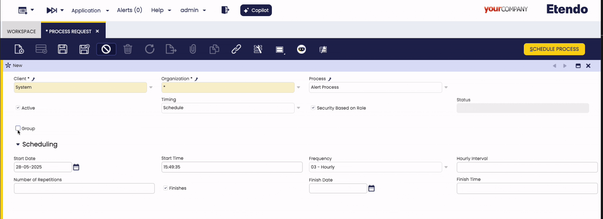
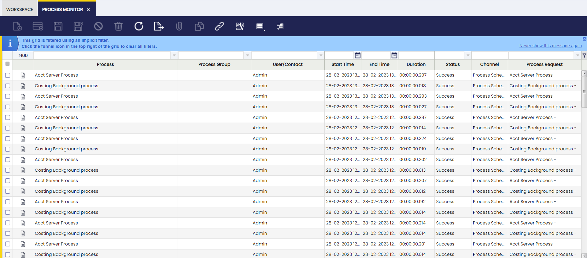

## Process Request Windows

:material-menu: `Application` > `General Setup` > `Process Scheduling` > `Process Request`

A background process is a system action requested by the user, who must provide auxiliary parameter values to execute that action.
Process Request window allows the user to review and add background processes, which can be scheduled or unscheduled as required.

The information to fill in to schedule a background process is:

1. Select the **Organization** for which the background process is going to be scheduled.

2. Select a **Process** or a **Process Group** from the corresponding list. To schedule a Process Group, check the **Group** flag, this will enable the _Process Group_ field.

    !!! info
        A Process Group is scheduled in the same way as a single process. However, you cannot schedule a Process Group and a single process at the same time. 
        
        See the [Process Group Window](#process-group-window) section for more details.

3. Select the **Timing**. Timing options are described in the options below:

    === "**Run Immediately**"
        
        - Executes the process immediately.
        - No additional configuration parameters are required.

    === "**Run Later** "
        
        - Executes the process once at a specified future time.
        - **Scheduling** section fields:
            - **Start Date** and **Start Time**: Define when the first execution will occur.

    === "**Schedule**"

        - Executes the process on a recurring basis.
        - **Scheduling** section fields:
            - **Start Date** and **Start Time**: Define when the first execution will occur.
            - **Frequency**: Select how often the process should run. Options include _every n seconds_, _every n minutes_, _hourly_, _daily_, _weekly_, _monthly_, or by entering a custom _cron expression_. Depending on the selected frequency, additional fields may appear for more precise scheduling.
            - **Number of Repetitions**: Set how many times the process should repeat after the initial run. For example, entering 3 will result in a total of 4 executions.
            - **Finishes**: Specify when the process should stop running. You can set a _Finish Date_ and _Finish Time_ to determine the end of the schedule.

    !!! info
        - Processes defined as **Run Immediately** and **Run Later** are one-time executions and can be either _Scheduled_ or _Rescheduled_.
        - Processes defined as **Schedule** are recurring executions and can be either _Scheduled_ or _Unscheduled_.

4. Select the **Security Based on Role** checkbox to ensure that only the user who schedules a process can monitor it in the process monitor window, otherwise any user sharing the same role as the one who scheduled the process will be allowed to monitor it.
    
    !!!tip
        In both cases, it is required that the role have access to the process in the **Process Access** tab of the **Role** window.

### Process Monitor Tab

Process monitor is a read-only tab that allows reviewing the status of processes executed by the current request. 
The information shown is the same as the [Process Monitor Window](#process-monitor-window).

#### Processes in Group Tab

In case that the process executed by the process request is a **process group**, you will find here the information about the executions of the processes in the group for each process group execution.

### Key Background Processes

There are some background processes which are configured by default in the process request window:

!!! info
    All these processes can be scheduled if logged as **System Administrator**.

- #### Acct Server Process

    This process searches for and automatically **Posts** transactions in status **Completed** set as **Posted = No**.

    This process allows documents such as purchase invoices, sales invoices or GL journals get automatically posted without any user action but to schedule this process.

- #### Alert Process

    This process checks if the SQL Query defined in each active alert rule returns any record in order to create the corresponding alert instance. 

    This process also removes the _fixed_ alerts instances to ensure they are not shown anymore.

- #### Payment Monitor Process

    This process checks the invoice's payment status and updates the invoice's **Payment monitor** section.  

Besides, there are other background processes which can also be scheduled and therefore monitored:

- #### Execute Pending Payments Process

    This process checks and executes Payment In and Payment Out linked to a payment method having an **Automatic** _Payment Execution Process_, which are not set as **Deferred** and do not require any input to be executed.

- #### Costing Background Process
    This process calculates the cost of the material transactions.

    The **Costing Background Process** is the process in charge of searching for goods transactions, whose cost has not yet been calculated. These include:

    - Goods Receipts
    - Goods Shipments
    - Physical Inventory
    - Goods Movements
    - Internal Consumptions
    - Productions

    This process considers only transactions having its **Costing Status** property as:

    - Not Calculated
    - Pending.

    The Costing background process calls the Costing Server process which calculates the cost of each transaction and takes into account what configured in the **Costing Rule** defined for the products, therefore either **Warehouse** dimension is taken into account while calculating the costs, or either **average** or **standard** cost is calculated for the products.

    The transactions are calculated sequentially ordered by the **Transaction Process** date that is the date and time when the document that originated the transaction was processed.

    Some costing algorithms such as **FIFO** implement the **Pending** Costing Status as a way to delay the cost calculation of a given transaction/s until the next run. This way, the costing calculation process is not stopped for the rest of the transactions having a _Not Calculated_ or _Pending_ status, for which it is possible to calculate the cost.

    !!! warning
        - The **Costing Background process** needs to be configured for each Legal entity defined in the client, as this process runs at legal entity (Organization) level.
        
        - It is important to remark that if the process is scheduled at (\*) organization level, it will run for all the Legal Entities defined in the Client, therefore it would not be necessary to configure the process more than once.

    !!! failure
        If the _Costing Server_ shows an error, the background process stops and it is not possible to calculate any new transaction cost until the error is fixed.
        The error message can be checked in the Process Monitor window.

    !!! info
        Although the Costing Background might have **failed** the process monitor might show a _Success_. Please refer to the **Process Log** field to get the real result message.

- #### Price Correction Background Process

    Price correction background process searches for Goods Receipts that either have a purchase order related which has been reactivated and booked after completing the Goods Receipts or have a purchase invoice related

    After that, this process checks and compares whether:

    - The purchase order price has changed before the invoice was booked
    - The purchase invoice price is not the same as purchase order price.

    If the purchase price has changed, a **Price Correction** cost adjustment is created for the products included in the Goods Receipt(s).

    !!! info
        There is a menu process named **Process Price Different Adjustment** that manually adjusts all already invoiced Goods Receipts, if required. 

    You can view the changes in the [Cost Adjustments](../warehouse-management/transactions.md#cost-adjustment) window.

## Process Monitor Window

:material-menu: `Application` > `General Setup` > `Process Scheduling` > `Process Monitor`

Process monitor window allows **reviewing the status of processes** executed by a user as well as the ones scheduled in the process request window.

In other words, there are two types of processes which can be monitored in this window:

- **Transactional** processes such as Generate Average Cost or Generate Invoices.
- **Background** processes scheduled in the process request.

In any case, only the users having a role which have access to a given process/processes will be able to monitor it/them in this window.

Besides, and as already explained, **Security Based on Role** definition at process request level will allow defining the users which will be able to monitor a given background process in this window.

Process Monitor window shows read-only information about individual process execution.

As shown in the image above, process monitor window provides the information below per each process executed:

- Process
- Process Group
- User who run the process.
- Start and End time
- Duration
- Status
- Channel. The options available are:
    - Direct: Transactional process executed manually by the user
    - Process Scheduler: For background processes scheduled in the Process Request window.
- Process Log

### Processes in Group Tab

In case the process executed is a process group, you will find here the information about the executions of the processes in the group. 

## Process Group Window

:material-menu: `Application` > `General Setup` > `Process Scheduling` > `Process Group`

A **Process Group** allows you to define and schedule a sequence of processes that will run one after another as a single batch. This is useful for automating workflows that require multiple processes to be executed in a specific order.

When a Process Group is scheduled:

- A single entry appears in the **Process Request** and **Process Monitor** windows.
- Each process within the group also appears separately in both windows with its own log and status, regardless of whether it succeeded or failed.

Fields to note:

- **Name**: Identifier of the process group.
- **Description**: Additional information about the group.
- **Prevent concurrent execution of the group**: When enabled, the system will check if another instance of the same process group is already running (for the same client and organization) before starting a new execution. If one is found, execution is canceled and an error message appears in the log: _Concurrent attempt to execute._
- **Stop group execution if a process fails**: By default, if a process in the group fails, the following processes will still execute. When this option is selected, the entire group execution will stop immediately upon a process failure.

    !!! info
        This is useful when processes are dependent on each other.

### Process Group List Tab

List of individual processes, each with an assigned sequence number that determines the execution order.

!!! failure "Error Result"
    A process group will show an Error result if it has one or more Error results in the processes that conform the group.

!!! failure "Empty Groups"
    You can not launch executions of empty groups. If you try, you will receive this error: No processes on the group: Name of the Group.

!!!warning "Prevent Concurrent Execution Co-Exists"
    Prevent executions of single processes and group processes will co-exist. Which means that none of them overrides the other and both can be set at the same time.

!!! tip "Permissions"
    Process Group is a window, so you can manage permissions for creation of Process Group as you wish: Only System, some clients, some organizations, some roles, among others.