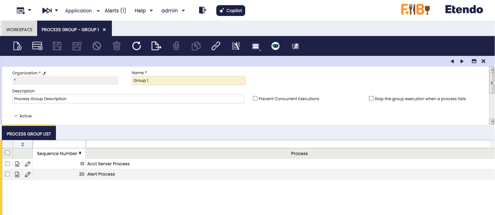

# Process Group

:material-menu: `Application` > `General Setup` > `Process Scheduling` > `Process Group`

## Overview

A **Process Group** allows the user to define and schedule a sequence of processes that will run one after another as a single batch. This is useful for automating workflows that require multiple processes to be executed in a specific order.

When a Process Group is scheduled:

- A single entry appears in the **Process Request** and **Process Monitor** windows.
- Each process within the group also appears separately in both windows with its own log and status, regardless of whether it succeeded or failed.

## Process Group Window 

Fields to note:

- **Name**: Identifier of the process group.
- **Description**: Additional information about the group.
- **Prevent concurrent executions**: When enabled, the system will check if another instance of the same process group is already running (for the same client and organization) before starting a new execution. If one is found, execution is canceled and an error message appears in the log: "Concurrent attempt to execute".
- **Stop group execution when a process fails**: By default, if a process in the group fails, the following processes will still execute. When this option is selected, the entire group execution will stop immediately upon a process failure.

    !!! info
        This is useful when processes are dependent on each other.

### Process Group List

List of individual processes, each with an assigned sequence number that determines the execution order.

!!! failure "Error Result"
    A process group will show an Error result if it has one or more Error results in the processes that conform the group.

!!! failure "Empty Groups"
    You can not launch executions of empty groups. If you try, you will receive this error: No processes on the group: Name of the Group.

!!!warning "Prevent Concurrent Execution Co-Exists"
    Prevent executions of single processes and group processes will co-exist. Which means that none of them overrides the other and both can be set at the same time.

!!! tip "Permissions"
    Process Group is a window, so you can manage permissions for creation of Process Group as you wish: Only System, some clients, some organizations, some roles, among others.

---

This work is a derivative of [General Setup](https://wiki.openbravo.com/wiki/General_Setup){target="_blank"} by [Openbravo Wiki](http://wiki.openbravo.com/wiki/Welcome_to_Openbravo){target="_blank"}, used under [CC BY-SA 2.5 ES](https://creativecommons.org/licenses/by-sa/2.5/es/){target="_blank"}. This work is licensed under [CC BY-SA 2.5](https://creativecommons.org/licenses/by-sa/2.5/){target="_blank"} by [Etendo](https://etendo.software){target="_blank"}.