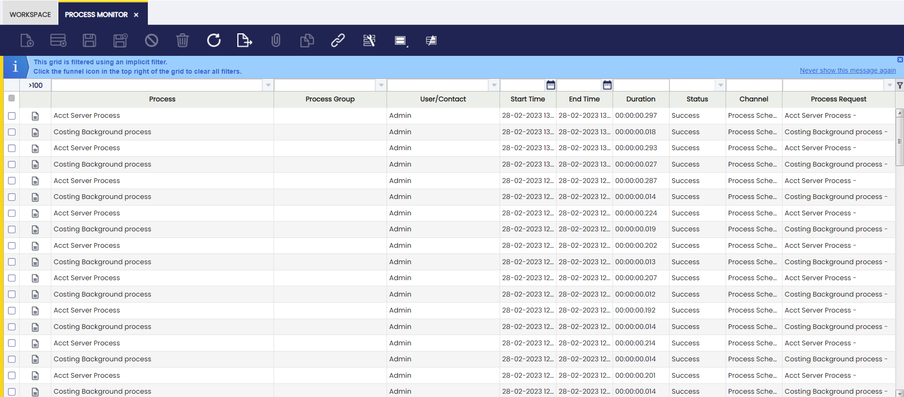
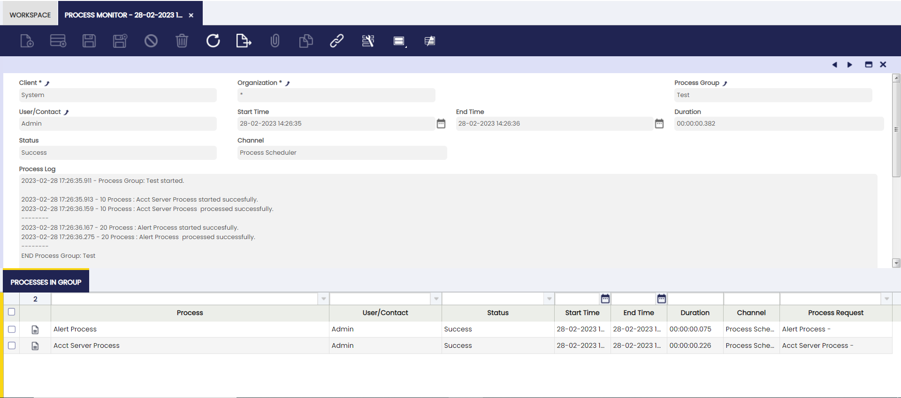

# Process Monitor

:material-menu: `Application` > `General Setup` > `Process Scheduling` > `Process Monitor`

Process monitor window allows **reviewing the status of processes** executed by a user as well as the ones scheduled in the process request window.

In other words, there are two types of processes which can be monitored in this window:

- **Transactional** processes, such as Generate Average Cost or Generate Invoices.
- **Background** processes scheduled in the process request.

In any case, only the users having a role which have access to a given process/processes will be able to monitor it/them in this window.

Besides, and as already explained, **Security Based on Role** definition at process request level will allow defining the users which will be able to monitor a given background process in this window.

The Process Monitor window shows read-only information about individual process execution.

As shown in the image above, process monitor window provides the information below per each process executed:

- Process
- Process Group
- User who runs the process
- Start and End time
- Duration
- Status
- Channel. The options available are:
    - Direct: Transactional process executed manually by the user
    - Process Scheduler: For background processes scheduled in the Process Request window.
- Process Log

## Processes in Group

In case the process executed is a process group, you will find here the information about the executions of the processes in the group.
 

---

This work is a derivative of [General Setup](https://wiki.openbravo.com/wiki/General_Setup){target="_blank"} by [Openbravo Wiki](http://wiki.openbravo.com/wiki/Welcome_to_Openbravo){target="_blank"}, used under [CC BY-SA 2.5 ES](https://creativecommons.org/licenses/by-sa/2.5/es/){target="_blank"}. This work is licensed under [CC BY-SA 2.5](https://creativecommons.org/licenses/by-sa/2.5/){target="_blank"} by [Etendo](https://etendo.software){target="_blank"}.