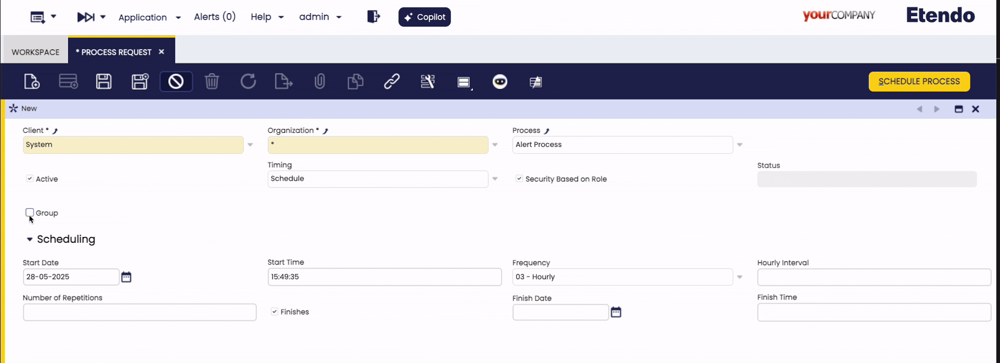
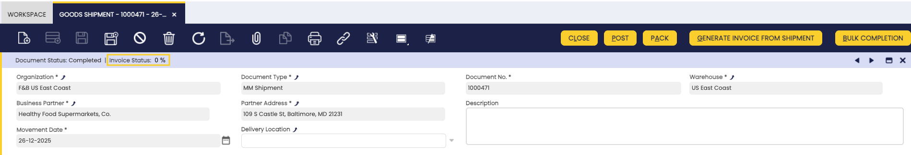

# Process Request

:material-menu: `Application` > `General Setup` > `Process Scheduling` > `Process Request`

## Overview

A background process is a system action requested by the user, who must provide auxiliary parameter values to execute that action.

The Process Request window allows the user to review and add background processes, which can be scheduled or unscheduled as required.

## Process Request Window

The information to fill in to schedule a background process is:

1. Select the **Organization** for which the background process is going to be scheduled.

2. Select a **Process** or a **Process Group** from the corresponding list. To schedule a Process Group, check the **Group** flag, this will enable the **Process Group** field.

    !!! info
        A Process Group is scheduled in the same way as a single process. However, you cannot schedule a Process Group and a single process at the same time. 
        
        See the [Process Group Window](../process-scheduling/process-group.md) section for more details.

3. Select the **Timing**. Timing options are described in the options below:

    === "**Run Immediately**"
        
        - Executes the process immediately.
        - No additional configuration parameters are required.

    === "**Run Later** "
        
        - Executes the process once at a specified future time.
        - **Scheduling** section fields:
            - **Start Date** and **Start Time**: Define when the first execution will occur.

    === "**Schedule**"

        - Executes the process on a recurring basis.
        - **Scheduling** section fields:
            - **Start Date** and **Start Time**: Define when the first execution will occur.
            - **Frequency**: Select how often the process should run. Options include *every n seconds*, *every n minutes*, *hourly*, *daily*, *weekly*, *monthly*, or by entering a custom *cron expression*. Depending on the selected frequency, additional fields may appear for more precise scheduling.
            - **Number of Repetitions**: Set how many times the process should repeat after the initial run. For example, entering 3 will result in a total of 4 executions.
            - **Finishes**: Specify when the process should stop running. You can set a *Finish Date* and *Finish Time* to determine the end of the schedule.

    !!! info
        - Processes defined as **Run Immediately** and **Run Later** are one-time executions and can be either *Scheduled* or *Rescheduled*.
        - Processes defined as **Schedule** are recurring executions and can be either *Scheduled* or *Unscheduled*.

4. Select the **Security Based on Role** checkbox to ensure that only the user who schedules a process can monitor it in the process monitor window, otherwise any user sharing the same role as the one who scheduled the process will be allowed to monitor it.
    
    !!!tip
        In both cases, it is required that the role have access to the process in the **Process Access** tab of the **Role** window.

### Process Monitor

Process monitor is a read-only tab that allows reviewing the status of processes executed by the current request. 
The information shown is the same as the [Process Monitor](../process-scheduling/process-monitor.md).

### Processes in Group

In case that the process executed by the process request is a **process group**, you will find here the information about the executions of the processes in the group for each process group execution.

## Key Background Processes

There are some background processes which are configured by default in the process request window:

!!! info
    All these processes can be scheduled if logged as **System Administrator**.

- ### Acct Server

    This process searches for and automatically **Posts** transactions in status **Completed** set as **Posted = No**.

    This process allows documents such as purchase invoices, sales invoices or GL journals get automatically posted without any user action but to schedule this process.

- ### Alert
    
    This process checks if the SQL Query defined in each active alert rule returns any record in order to create the corresponding alert instance. 

    This process also removes the fixed alerts instances to ensure they are not shown anymore.

- ### Payment Monitor

    This process checks the invoice's payment status and updates the invoice's **Payment monitor** section.  

Besides, there are other background processes which can also be scheduled and therefore monitored:

- ### Execute Pending Payments

    This process checks and executes Payment In and Payment Out linked to a payment method having an **Automatic** Payment Execution Process, which are not set as **Deferred** and do not require any input to be executed.

- ### Costing
    This process calculates the cost of the material transactions.

    The **Costing Background Process** is the process in charge of searching for goods transactions, whose cost has not yet been calculated. These include:

    - Goods Receipts
    - Goods Shipments
    - Physical Inventory
    - Goods Movements
    - Internal Consumptions
    - Productions

    This process considers only transactions having its **Costing Status** property as:

    - Not Calculated
    - Pending.

    The Costing background process calls the Costing Server process which calculates the cost of each transaction and takes into account what configured in the **Costing Rule** defined for the products, therefore either **Warehouse** dimension is taken into account while calculating the costs, or either **average** or **standard** cost is calculated for the products.

    The transactions are calculated sequentially ordered by the **Transaction Process** date that is the date and time when the document that originated the transaction was processed.

    Some costing algorithms such as **FIFO** implement the **Pending** Costing Status as a way to delay the cost calculation of a given transaction/s until the next run. This way, the costing calculation process is not stopped for the rest of the transactions having a Not Calculated or Pending status, for which it is possible to calculate the cost.

    !!! warning
        - The **Costing Background process** needs to be configured for each Legal entity defined in the client, as this process runs at legal entity (Organization) level.
        
        - It is important to remark that if the process is scheduled at (\*) organization level, it will run for all the Legal Entities defined in the Client, therefore it would not be necessary to configure the process more than once.

    !!! failure
        If the Costing Server shows an error, the background process stops and it is not possible to calculate any new transaction cost until the error is fixed.
        The error message can be checked in the Process Monitor window.

    !!! info
        Although the Costing Background might have **failed** the process monitor might show a Success. Please refer to the **Process Log** field to get the real result message.

- ### Price Correction

    Price correction background process searches for Goods Receipts that either have a purchase order related which has been reactivated and booked after completing the Goods Receipts or have a purchase invoice related

    After that, this process checks and compares whether:

    - The purchase order price has changed before the invoice was booked
    - The purchase invoice price is not the same as purchase order price.

    If the purchase price has changed, a **Price Correction** cost adjustment is created for the products included in the Goods Receipt(s).

    !!! info
        There is a menu process named **Process Price Different Adjustment** that manually adjusts all already invoiced Goods Receipts, if required. 

    You can view the changes in the [Cost Adjustments](../../warehouse-management/transactions.md#cost-adjustment) window.

- ### Match Sales Order Invoice and Shipment Lines

    !!! info
        This process is available starting from **Etendo 25.4**.

    This process updates the sales matching tables (Matched Sales Invoices and Matched Sales Orders) for existing sales documents.

    The process searches for completed, closed, voided or reversed sales invoices and goods shipments within a configurable period (defined by the `MatchedSalesDaysBack` preference), and creates or updates match records between:

    - Sales Orders and Goods Shipments
    - Sales Orders and Sales Invoices
    - Goods Shipments and Sales Invoices

    This matching information is used for traceability and invoice status calculations. The process does not post any accounting entries.
    
    !!! info
        This example shows the process should be executed. Starting from **Etendo 25.4**, this matching information is automatically populated when completing goods shipments. However, if the matched tables show zero records, it is necessary to run this process to recalculate and populate the data.

        
        
    !!! info
        The `MatchedSalesDaysBack` preference is set by default to 90 days. To increase this period, a new record for this preference can be created and the process can be rerun.

---

This work is a derivative of [General Setup](https://wiki.openbravo.com/wiki/General_Setup){target="_blank"} by [Openbravo Wiki](http://wiki.openbravo.com/wiki/Welcome_to_Openbravo){target="_blank"}, used under [CC BY-SA 2.5 ES](https://creativecommons.org/licenses/by-sa/2.5/es/){target="_blank"}. This work is licensed under [CC BY-SA 2.5](https://creativecommons.org/licenses/by-sa/2.5/){target="_blank"} by [Etendo](https://etendo.software){target="_blank"}.