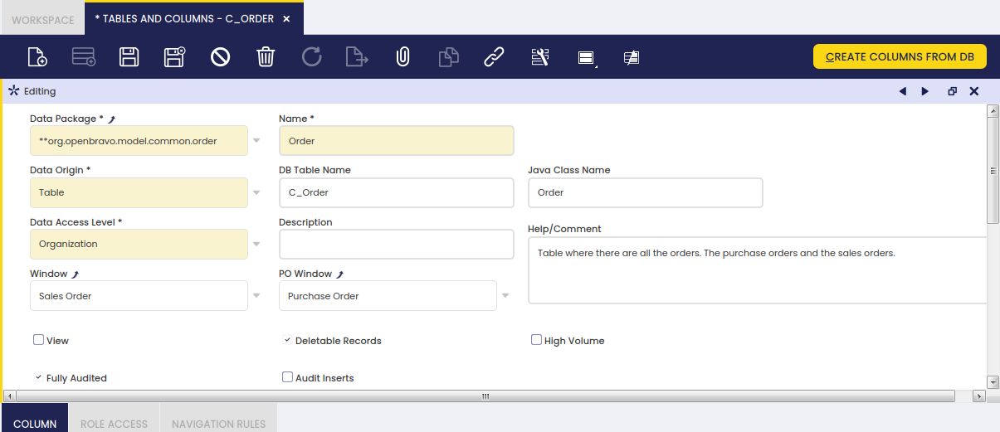
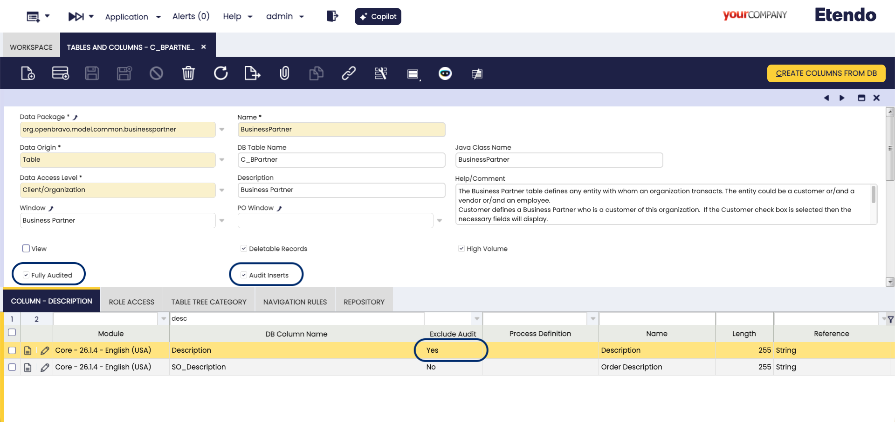
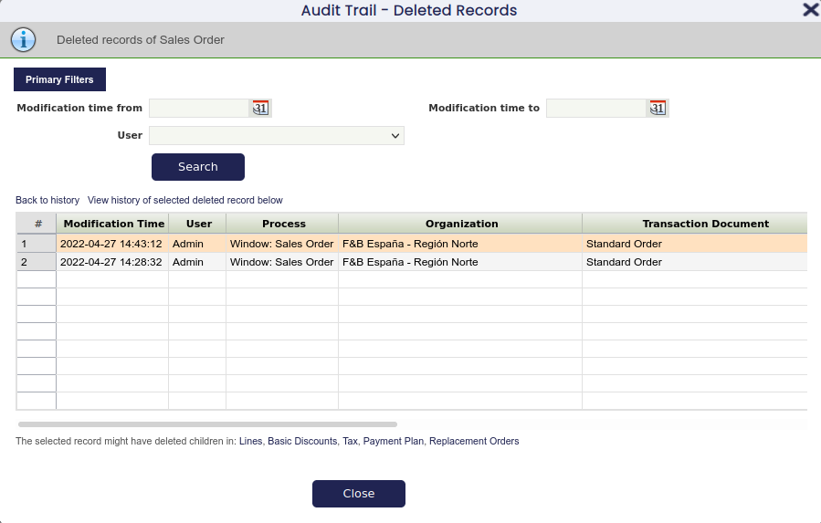
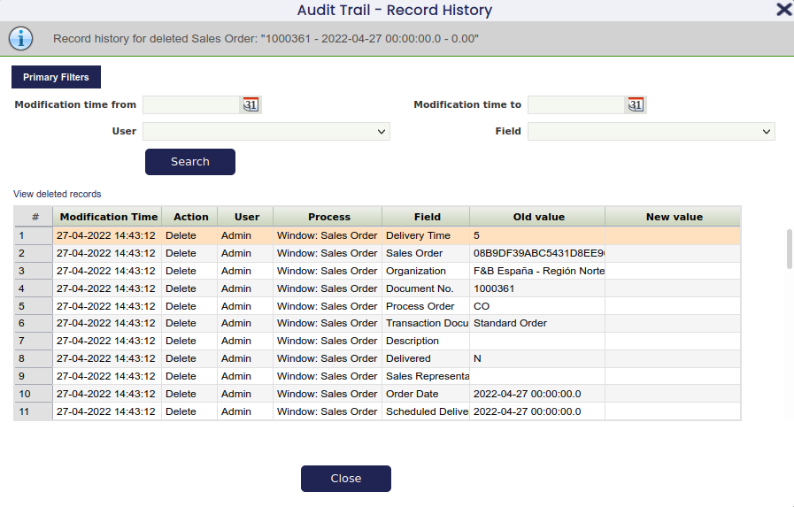
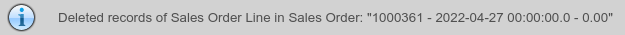
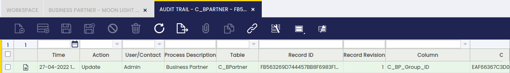
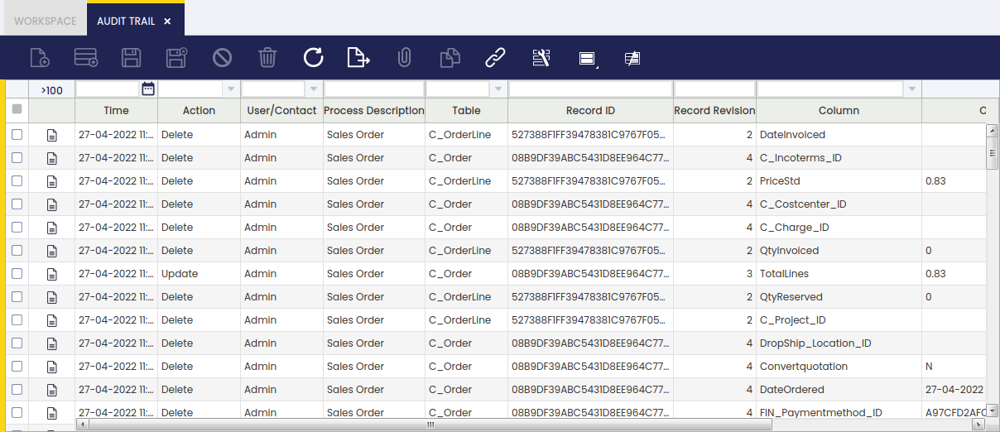

# Audit Trail

:material-menu: `Application` > `General Setup` > `Security` > `Audit Trail`

## Overview

Audit Trail allows you to monitor every data change made to any record in the system through the user interface. The feature tracks the following types of changes:

- **Insert** — a new record was created
- **Update** — an existing record was modified
- **Delete** — a record was removed

The System Administrator enables audit tracking for each table before any changes are recorded. See [Configuration](#configuration) below.

## Configuration

To track audit information, the System Administrator completes two steps:

1. Enable the audit trail for one or more tables.
2. Run the **Update Audit Trail Infrastructure** process.

Both steps are described in the following sections.

## Enabling Audit Trail for a Table

:material-menu: `Application Dictionary` > `Tables and Columns`

!!! info
    The **Application Dictionary** is a system configuration area accessible only to System Administrators. It is not part of the regular business menus.

The System Administrator enables or disables the Audit Trail for a table through the table definition in the Application Dictionary.

1. Switch to the **System Administrator** role.
2. Go to `Application Dictionary` > `Tables and Columns`.
3. Navigate to the table for which you want to enable the Audit Trail.
4. Switch to **Edit View**.
5. Mark the **Fully Audited** checkbox and save.

### Audit Inserts

By default, when a table is set to **Fully Audited**, the system records that a new record was created but does not save the values that were entered at that moment.

To also save those initial values, check the **Audit Inserts** field on that table. This is optional.

### Excluding Columns

By default, all fields in an audited table are tracked. To stop tracking changes to a specific field — for example, a notes field that changes frequently and is not important to audit — open the **Column** tab inside `Application Dictionary` > `Tables and Columns`, find the field, and check the **Exclude Audit** box.

## Update Audit Trail Infrastructure

After enabling or disabling the Audit Trail for a table, or after any change to that table's structure, run the **Update Audit Trail Infrastructure** process. Until this process is run, the audit trail does not reflect the latest settings.

Run the process through the [Process Request](../process-scheduling/process-request.md) window:

1. Go to `Application` > `General Setup` > `Process Scheduling` > `Process Request`.
2. Select the **Organization**.
3. Select **Update Audit Trail Infrastructure** in the **Process** field.
4. Set **Timing** to **Run Immediately**.
5. Click **Schedule Process**.

!!! tip
    To verify that the process completed successfully, go to `Application` > `General Setup` > `Process Scheduling` > [`Process Monitor`](../process-scheduling/process-monitor.md) and check the status of the execution.

## Viewing Audit Data

There are two ways to view audit data: the **Audit Trail Popup**, which shows the history of a specific record, and the **Audit Trail Window**, which allows searching across all audit records.

## The Audit Trail Popup

For each table where the audit trail is enabled, the button  appears in the toolbar of the corresponding window. It opens the Audit Trail Popup.

The popup shows the history of the record currently displayed in the window. It has two view modes:

- **Record History** — shows changes to a single record
- **Deleted Records** — shows records deleted from a single tab

## Record History View

This view opens when you click the audit trail button from an existing record.

The top area shows the record type (for example, **Sales Order**) and the specific record — such as *1000175 - 2016-04-03* — whose history is displayed. Below that, filters allow you to narrow the changes shown, which is useful for records with many modifications.

The grid shows all changes made to the record while the audit trail was enabled, sorted from the most recent change to the oldest.

!!! info
    Only fields visible in the corresponding tab are shown.

Each row represents one changed field. If a record was edited, one row appears for every field that changed. If a record was created or deleted, one row appears for every field in that record.

A link above the grid switches to the Deleted Records view, showing deleted records for the tab from which the popup was opened.

## Deleted Records View

This view shows records that have been deleted from a tab and are no longer accessible through the normal interface.

The top area shows the record type. Below it, filters let you narrow the records shown. The grid displays one row per deleted record, with the same columns as the normal grid view for that tab.

### Navigation Options

#### Back to History

Select **Back to history** to return to the Record History view, showing the same records as before.

#### History of Selected Record

Select **View history of selected deleted record** to see the full change history of a specific deleted record. This opens the Record History view, which indicates that the history of a deleted record is being displayed.

The screenshot below shows the history of a deleted Sales Order. It includes entries for the deletion as well as the earlier creation and modification of the record.

#### Child Tabs

The popup supports filtering deleted records by a parent record. This is useful for finding deleted lines that belonged to a sales order.

**If the parent record still exists:**

1. Go to the lines tab of the Sales Order.
2. Click the audit trail icon to open the Record History view.
3. Click the **Deleted Records** link to switch to the Deleted Records view.

Because the lines tab has a parent (the Sales Order), the view automatically filters to show only lines belonging to that Sales Order. The top area confirms the filter is active:

**If the parent record has also been deleted:**

1. Go to the Deleted Records view of the Sales Order tab.
2. Find the Sales Order whose deleted lines you want to view.
3. Click the **Lines** link below the grid.

The view then shows the deleted lines belonging to that Sales Order.

## Disable Filtering by User

The User filter can be removed from both the Record History and Deleted Records views. This is useful when the number of users in the system is large and affects performance.

Go to `Application` > `General Setup` > `Application` > [`Preference`](../application/preference.md) and create a new preference record with the property **Show Audit Trail User filter** set to value `Y`.

## Audit Trail Window

The Audit Trail window displays a read-only view (meaning you can look but not change anything here) of all recorded data changes in the tables for which the audit trail is enabled.

This window shows audit data as it is stored internally by the system. Some values may look different from what you see in the normal screens — for example, a date may appear in a different format, or an item may be identified by an internal code rather than its name. This is expected. Use this window to search or filter across all audit records.

For each tracked change, the window shows which table and field was modified, along with a unique ID that identifies the specific record that was changed.

## Limitations

The audit trail records all data changes for enabled tables, with the following exceptions:

- Very long text fields (such as notes or descriptions exceeding a certain length) are not audited.
- Files or binary data attached to records (such as document attachments) are not audited.

To track changes to these types of fields, contact your system administrator.

## Etendo Advanced Security

The **Etendo Advanced Security** module allows you to customise several security features, including:

- Password Security
- Password History
- User Lockout
- Multiple Session Verification
- Changing Password after Login
- Expiration Time (Autolock Password)

!!! info
    For more information, visit the [Etendo Advanced Security module User Guide](../../../optional-features/bundles/platform-extensions/etendo-advanced-security.md).

---

This work is a derivative of [General Setup](https://wiki.openbravo.com/wiki/General_Setup){target="_blank"} by [Openbravo Wiki](http://wiki.openbravo.com/wiki/Welcome_to_Openbravo){target="_blank"}, used under [CC BY-SA 2.5 ES](https://creativecommons.org/licenses/by-sa/2.5/es/){target="_blank"}. This work is licensed under [CC BY-SA 2.5](https://creativecommons.org/licenses/by-sa/2.5/){target="_blank"} by [Etendo](https://etendo.software){target="_blank"}.
