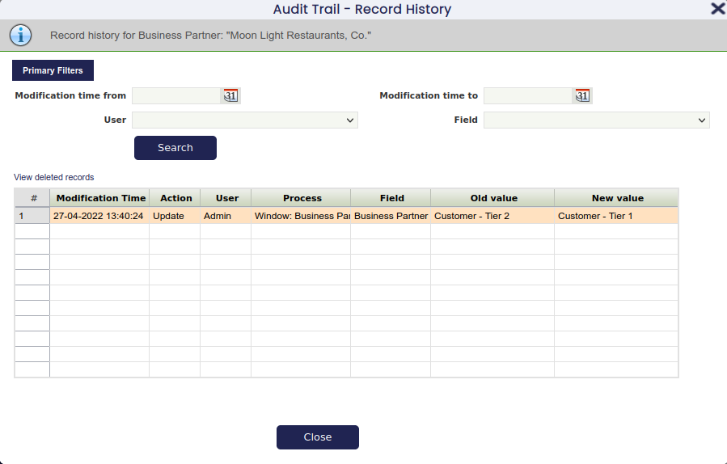

# Audit Trail

:material-menu: `Application` > `General Setup` > `Security` > `Audit Trail`

## Overview

Audit Trail allows users to monitor every data change made to any record in the system through the user interface.

The Audit trail feature monitors data changes such as:

- Insert
- Update
- Delete

This feature must be enabled by the System Administrator. To do this, the administrator configures which data tables should be tracked — this is done in a technical administration area called the Application Dictionary.

Once a change has been made in a table for which the audit trail feature has been enabled, it is possible to monitor that change through the user interface by using the action button **Audit Trail**.

## Audit Trail Window

Audit Trail view displays read-only information about all the recorded data changes done in the tables for which the audit trail feature has been enabled.

For each tracked change, the window shows which table and field was modified, along with a unique ID that identifies the specific record that was changed.

## Configuration

In order to track audit information, the system administrator needs to perform two tasks:

- **Enable the audit trail** for one or more tables in the system
- Run the **Applying Configuration Changes** process

In the following sections, a step-by-step guide with more detailed information is provided.

## Enabling Audit Trail for a Table

The System Administrator enables or disables the Audit Trail for a table by opening the table definition in the Application Dictionary.

- Switch to the **System Administrator** role
- Go to the Application menu, then navigate to **Application Dictionary** > **Tables and Columns**
- **Navigate to the table** for which you want to enable the Audit Trail
- Switch to **Edit View**
- Mark the **Fully Audited** checkbox and save

### Audit Inserts

By default, when a table is set to **Fully Audited**, the system does not record a separate entry for every new item added — it only records that a new record was created. If you also need to capture the exact values that were entered when a record was first created, check the **Audit Inserts** field on that table. This is optional and is usually not needed.

### Excluding columns

By default, all fields in an audited table are tracked. If you want to stop tracking changes to a specific field — for example, a notes field that changes frequently and is not important to audit — you can exclude it. To do this, open the **Column** tab inside **Application Dictionary** > **Tables and Columns**, find the field you want to exclude, and check the **Exclude Audit** box.

## Applying Configuration Changes

After enabling or disabling the Audit Trail for a table, or after any changes to that table's structure, a system administrator must run the Applying Configuration Changes process to apply the update. Until this process is run, the audit trail will not reflect the latest settings. Contact your system administrator if you are not sure whether this has been done.

## The Audit Trail Popup

For the set of tables for which the audit trail feature has been enabled, the button  is shown in the toolbar of the corresponding windows. It gives access to the Audit Trail Popup.

This popup allows examination of the history of the record which is currently shown in the window. It has two main view modes which allow examining the following data:

- **Record history** of a single record
- **Deleted records** of a single tab

## Record History View

This view is displayed when the popup is opened from an existing record via the new toolbar button.

The top area always shows the record type (for example, **Sales Order**) and the specific record — such as *1000175 - 2016-04-03* — whose history is displayed.

Then a number of filters are available which allow some restriction on the changes displayed to ease the use of records with many modifications.

The grid in the lower area shows all changes done to this record while the audit trail feature was enabled. The changes are shown sorted from the most recent change back to earlier changes.

!!! info
    Only fields which are visible in the corresponding tab are shown here.

Each row in the grid shows one changed field. If a record was edited, you will see one row for every field that was changed. If a record was created or deleted, you will see one row for every field in that record.

Finally, a link just on top of the grid allows switching to the Deleted Records view. Following that link will show deleted records for the tab from which the Audit Trail popup was opened.

## Disable Filtering by User

The User filter can be removed from both the **Record History** and the **Deleted Records** view. This can be interesting for performance reasons when the number of users available is high. In order to do this, go to **Application** > **General Setup** > **Application** > [`Preference`](../application/preference.md) and add the following preference: Show Audit Trail User filter with value Y.

## Deleted Records View

This view allows examination of records which have been deleted from a tab and are otherwise no longer accessible in the user interface.

The general layout of the view is similar to the record history view.

The top area shows the record type for which the deleted records are displayed. Directly below, a number of filters is available to restrict the records shown.

Then a grid displays all deleted records belonging to this tab. Here one row shown corresponds to a single deleted record and the columns shown are the same as the ones shown in the normal grid view of the same tab.

This view offers a number of **navigation choices** to view related or more detailed information.

### Navigation Choices

#### Back to History

The first one is Back to history. Following this link, the view is just switched back to Record History showing the same records as shown before going to the deleted records view.

#### History of Selected Record

The next one, View history of selected deleted record below, allows examining the detailed history of a deleted record, instead of the summary view which is shown here.

This detailed history is displayed in the same 'Record History' view, however its top info area notes the fact that the history of a deleted record is displayed.

The following screenshot shows an example of the history view of the same deleted Sales Order entry. Compared with the previous example of this view, new history entries corresponding to the deletion are shown in addition to the older information about the record creation and modification.

#### Child Tabs

As the last method of navigation, the popup allows filtering records based on a parent record. This can be useful to search for deleted lines belonging to a sales order.

There are two possible ways based on the status of the parent record: still existent or already deleted.

If the parent record (i.e. a Sales Order) does still exist, then the following steps can be done to view its deleted lines:

1. Go to the lines tab of the Sales Order
2. Click the audit trail icon to open the record history view
3. Use the 'Deleted Records' links to switch to deleted records view

As the lines tab is not a top level tab (it has a parent tab Sales Order) the deleted records view is automatically filtered to only show lines belonging to the current Sales Order. As visual information that the information shown is filtered, the top info area shows:

If the parent record (i.e. a Sales Order) does not exist anymore, then the same can be accomplished by using the following steps:

1. Go to the Deleted Records view of the Sales Order tab
2. Search the Sales Order for which the deleted lines should be shown
3. Click the Lines link just below the grid

Then the deleted records view will show the deleted lines belonging to the selected (deleted) Sales Order.

## A generated Audit Trail Window

The second way to view audit data is a standard search window. Open the **Application** menu, go to **General Setup** > **Security**, and select **Audit Trail**. This window allows browsing all audit information filtered by the currently active client.

This window shows the unformatted audit data exactly as it is stored in the system. Values appear as they are recorded internally — for example, dates or code references may not display with the same labels you see elsewhere in the application. Use this window when you need to search or filter across all audit records.

This window also offers more flexible filtering and searching options than the popup view.

## Limitations

The audit trail feature will record all data changes (for the table for which it has been enabled) with the following exceptions:

- Very long text fields (typically those used to store notes or descriptions exceeding a certain length) will not be audited.
- Files or binary data attached to records (such as document attachments) will not be audited.

If you need to track changes to these types of fields, contact your system administrator.

## Etendo Advanced Security

The **Etendo Advanced Security** module allows the user to customize several security features such as the following:

- Password Security
- Password History
- User Lockout
- Multiple Session Verification
- Changing Password after Login
- Expiration Time (Autolock Password)

!!! info
    For more information, visit the [Etendo Advanced Security module User Guide](../../../optional-features/bundles/platform-extensions/etendo-advanced-security.md).

---

This work is a derivative of [General Setup](https://wiki.openbravo.com/wiki/General_Setup){target="_blank"} by [Openbravo Wiki](http://wiki.openbravo.com/wiki/Welcome_to_Openbravo){target="_blank"}, used under [CC BY-SA 2.5 ES](https://creativecommons.org/licenses/by-sa/2.5/es/){target="_blank"}. This work is licensed under [CC BY-SA 2.5](https://creativecommons.org/licenses/by-sa/2.5/){target="_blank"} by [Etendo](https://etendo.software){target="_blank"}.