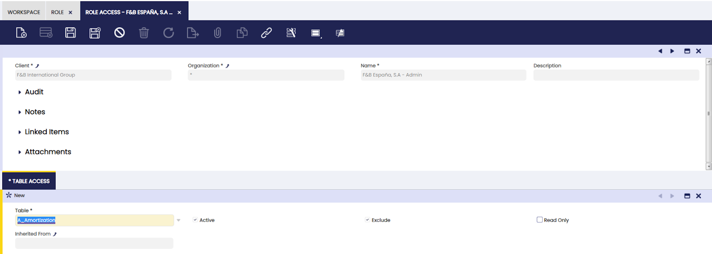

# Role Access

:material-menu: `Application` > `General Setup` > `Security` > `Role Access`

This window defines access to DB /database tables and columns for selected roles.  
Here, the user can edit a role to give or withhold the necessary access to tables and columns tables.

## Table Access

It is possible to create or edit access to DB tables for a selected role. The user can give access to the needed information by selecting the options displayed in the table tab.

---

This work is a derivative of [General Setup](https://wiki.openbravo.com/wiki/General_Setup){target="_blank"} by [Openbravo Wiki](http://wiki.openbravo.com/wiki/Welcome_to_Openbravo){target="_blank"}, used under [CC BY-SA 2.5 ES](https://creativecommons.org/licenses/by-sa/2.5/es/){target="_blank"}. This work is licensed under [CC BY-SA 2.5](https://creativecommons.org/licenses/by-sa/2.5/){target="_blank"} by [Etendo](https://etendo.software){target="_blank"}.