# Role

:material-menu: `Application` > `General Setup` > `Security` > `Role`

## Overview

The aim of a role is to group user/s depending on what parts of Etendo they are allowed to access to and therefore to work in.

!!! info
    Etendo comes with a "super" user named **admin** (password **admin**) which can be used to sign in for the first time.

The admin user has several roles assigned:

- the **System Administrator Role** (this one is assigned to it by default)
    - this role enables admin users to have admin rights to all the existing Clients.
- the **F&B International Group Admin Role** demo data (this one is also assigned to it by default)
    - this role enables admin users to have **F&B demo data** Client admin rights.
- and besides:
    - every time a new **Client** is created by running the [Initial Client Setup process](../../../../../developer-guide/etendo-classic/how-to-guides/how-to-run-an-initial-client-setup-process.md), Etendo automatically creates for that Client a **Client Admin** user linked to a **Client Admin role**:
      - the client admin role enables Client Admin user to have admin access rights to that Client and all the organization/s of that client once signed in.
      - the newly created client admin role is also assigned to the admin user by default, therefore it will be possible for the admin user to access the newly created Client.

Finally, every time a new Organization is created by running the Initial Organization Setup process, a new user and a new role are created and linked to each other, this time the new user role will only enable the user to access that Organization once signed in.

Having said that, Etendo allows the creation of as many new roles as required to be later on assigned to the existing and/or new users.

!!! info
    Roles group user/s depend on the tasks they do and therefore the parts of Etendo they should have access to parts such as windows, processes, forms, widgets and views.

## Permissions Inheritance

It is possible to configure roles to retrieve their access to the different Etendo elements automatically, by inheriting them from other parent roles. This configuration is possible thanks to a feature known as Role Inheritance.

Having a role, it is possible to assign one or more template roles to it. This way, all the elements which are accessible by these template roles will be available automatically for that role as well.

Besides, any change done in a permission of a template role will be propagated automatically to every role inheriting from it.

!!! note
    It is only possible to inherit permissions from template roles, which are manual roles as well.

When inheriting from multiple roles, the permission application order is determined by the sequence number of each inheritance. This means that if a particular permission is inherited from multiple inheritance, the permission will be taken from the inheritance with higher sequence number.

This process eases the role management, specially when the number of roles defined for a Client is high. Thus, it is possible to define template roles to give access for a particular set of elements, and then create multiple combinations of functional roles in order to give personalized access for the different users. This is illustrated in the picture below.

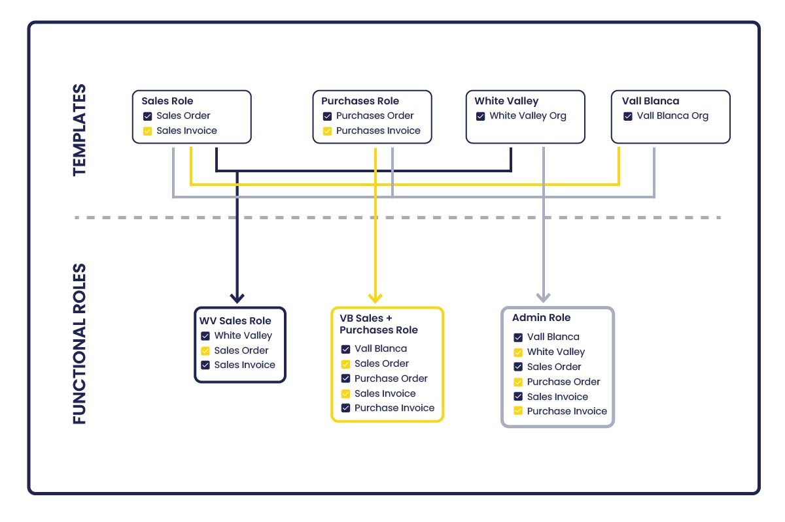

The current list of inheritable elements include the following: organizations, windows, tabs, fields, processes, forms, widgets, views, process definitions, preferences and alert recipients.

For the case of preferences and alert recipients, there are some restrictions to make them inheritable:

- A preference is inheritable if it has a template role set in the Visible At Role field.
- It is not possible to create more than one preference with exactly the same visibility settings for a template role.
- An alert recipient is inheritable if it has the User field empty.
- It is not possible to create more than one inheritable alert recipient with the same alert rule for a template role.

!!! note
    This mechanism takes into account the permissions manually given to the roles. This kind of not inherited access is not affected (not modified) in any case by the inheritance process.

It is also possible to force the recalculation of the permissions of a role, using the Recalculate Permissions process. But following the common flows of a Role configuration, all the inheritances are calculated automatically, so this process is not necessary. For this reason, it remains hidden.

As mentioned before, the changes (create, edit or remove) done in a permission which belongs to a template role will be propagated automatically to all the roles currently inheriting from it. For this reason, a warning message is displayed on the User Interface in order to inform users about the implications of this kind of action.

This warning message is similar to the one shown below. It appears when creating or editing a record that belongs to a template role, in a tab of an inheritable entity.

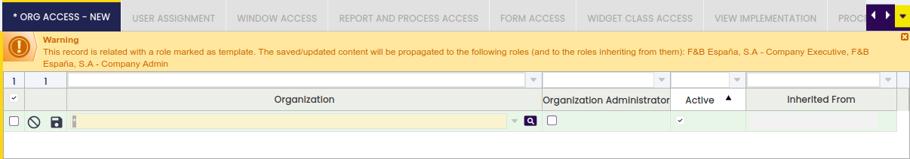

## Role

The Role window allows the user to review, create, configure and maintain the roles to use in a given client.

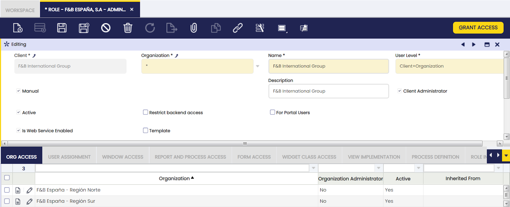

As already described, there are roles automatically created by Etendo which can be reviewed in this window.

Besides, this window allows the user to create new roles for a given client. Roles creation can properly be done by using a Client Admin user & role.

The fields to fill in are:

- the **Name** and a brief **Description** of the role
- the **User Level** which is a step forward Data Access Level to be defined at Role level.
    - User level allows the user to limit the records which will be accessible in entities such as windows, processes or forms for a role; or even to limit the access to a given entity for a role:
      - Every table in Etendo has a Data Access Level defined. The options available are:
        - System, this level allows the user to see System Client records and (\*) organization records, for instance application dictionary records.
        - System/Client, this level allows the user to see any Client record and (\*) organization records, for instance master data related records such as Countries.
        - Client/Organization, this level allows the user to see any Client record but System Client and any Organization including (\*) Organization, for instance master data related records such as Products.
        - Organization, this level allows the user to see any Client record but System Client and any Organization record but (\*) Organization records, for instance transactional data records such as Purchase Orders.
    - User Level available options are:
      - **System**, if a table is defined as System data access level, a user role which has this user level assigned will be able to see the records of any Client including System Client records, in an entity such as a given window or form.
      - **Client**, if a table is defined as System/Client data access level, a user role which has this user level assigned will be able to see the records belonging to any Client but System Client, in an entity such as a given window or form.
        - On the other hand, if a table is defined as System data access level, a user role which has this user level assigned will not be able to see any record as all of them will belong to System Client.
      - **Client + Organization**, if a table is defined as Client/Organization data access level, a user role which has this user level assigned will be able to see the records belonging to any Client but System Client and any Organization including (\*) organization, in an entity such as a given window or form.
      - **Organization**, if a table is defined as client/Organization data access level, a user role which has this user level assigned will only be able to see the records belonging to a given organization but (\*) organization, in an entity such as a given window or form.
    - Additionally, depending on the role's user level, no data at all is visible based on the table's access level. This restriction can be bypassed by setting Bypass Access Level Entity Check preference to Y, the cases when entity is not accessible are:
      - If access level is System and user level is not System
      - If access level is Organization and user level is not Organization or Client+Organization
      - If access level is Client/Organization and user level is not Client, Organization not Client/Organization
      - If access level is System/Client and user level is not System or Client/Organization
- **Manual** check. The role automatically gets all standard user plus admin privileges, even when new elements such as windows, processes, forms, widget classes, organizations are added unless the Manual check is enabled.
    - If the manual check is enabled, it will be possible to manually assign access to windows, processes, etc by manually selecting them in the corresponding tab or by using the process button **Grant Access**.
    - Grant Access process button allows the user to select:
      - the **module** or application area for which access is required, modules such as Financial Management or Production Management among others.
      - and the **entities** of the module selected for which access is required, entities such as windows, processes or forms among others.
    - If the Grant Access process is executed for a role marked as **template**, the granted accesses will be propagated automatically to the roles inheriting from it.
- **Template** check is shown for roles which have a manual access assignment (Manual flag is Yes). Roles marked as template are those that can be used by other roles to retrieve their permissions automatically, using the Role Inheritance mechanism.
    - For this reason, just template roles can be selected in the Inherit From field of the Role Inheritance tab.
- **Restrict backend access**: If checked, this role will not have access to the backend (ERP). It will however have access to other applications (such as the WebPOS).
- **For Portal Users**: If checked, this role will have a simplified (portal) interface, where he only has available the workspace widgets. Portal interface changes the look and feel of the workspace. Top page menu and left-side menu are hidden. Usually a role for Portal Users gives access to users only to their own information using widgets.
- **Portal Admin**: If checked, the Portal Role will have Portal Administrator privileges.
- **Is Web Service Enabled**: If checked, web services will be able to obtain data for users with this role. It applies to both JSON REST and XML REST web services.
- **Advanced** check is shown for roles that have an automatic access assignment (Manual flag is No) and automatically grants access for such roles to all Advanced Features.
    - Manually created roles (Manual flag is Yes) have their own configuration which can include advanced features or not so this flag is not shown for them.
- **Client Administrator** checkbox allows a role to admin other users' Workspace as well as Customized Forms:
    - In other words, a client administrator role can assign widgets to the workspace of any client user as well as customized forms.

### Org Access

Org Access tab allows the user to define the organization/s to which a given role will have access rights to.

As already mentioned, every record in Etendo belongs to an organization, therefore the only way for a user role to edit a record which belongs to an organization is to provide that user role with access to that organization.

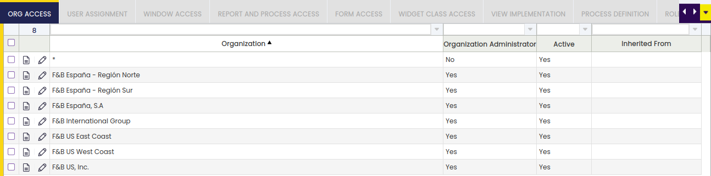

- **Organization Administrator** checkbox allows a role to admin other users' Workspace as well as Customized Forms:
    - In other words, an organization administrator can assign widgets to the workspace of any user of the organization as well as customized forms.

### User Assignment

The User Assignment tab allows the user to add users to a given role.

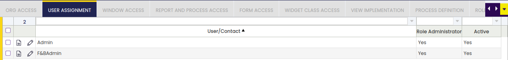

**Role Administrator** checkbox allows the user to administer the given role for:

- **Widgets**: they will be able to set default widgets that will be seen by other users with the same role.
- **Saved Views**: this user will be able to share with other users with the same role the views she saved.

!!! info
    As **Role Administrator** flag allows the user to modify behavior of other users with the same role, it should only be granted to trusted users.

### Window Access

This tab lists and/or allows the user to add the windows to which a role will have access to.

As already mentioned, every time a new role is created and saved without selecting the **Manual** checkbox, Etendo automatically fills in all the windows in the Window Access tab.

The information above means that the newly created role will have access to every Etendo window.

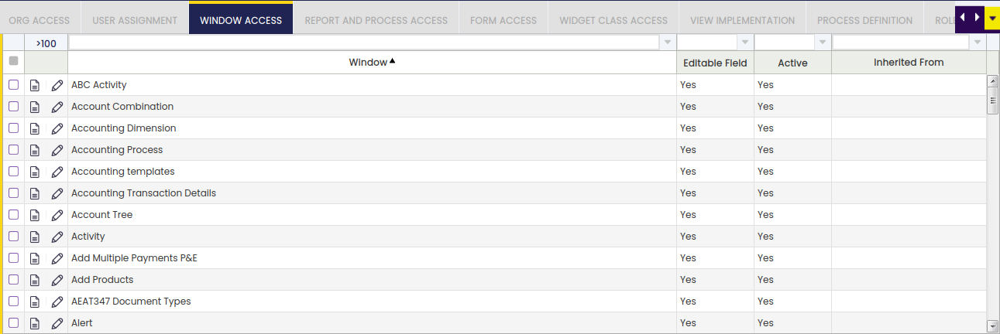

Having said that, if the **Manual** checkbox is selected, it will be required to manually add a subset of windows which will be accessible for a given role, or it will be required to automatically add them by using the action process **Grant Access**. This process will allow window access for a given Etendo module or area such as Projects, Finance or Sales.

**Editable Field** checkbox defines if the accessible data in a window can be edited by the role or not.

#### Tab Access

It defines whether a tab is editable or read-only for a concrete role.

In a window accessible by a role, it is possible to define for each of its tabs if they are editable or not through the **Editable Tab** check.

If the window is editable (**Editable Field** is checked), by default all its tabs will be editable. But it is possible to define some of them not to be editable for this role by adding them in this tab and setting to false the **Editable Tab** check. Note this is only true if the table behind the tab is editable for the role.

In the same way, having a non-editable window, it is possible to define some of its tabs as editable by checking **Editable Tab**.

#### Field Access

It defines whether a field is editable or read-only for a concrete role.

**Field** Access tab works very similarly to Tab Access tab, allowing the user to define write access up to a field granularity level.

So if a tab is editable for a role, a concrete set of fields can be made read-only for that role, adding a new row in this tab for each field and setting false **Editable Field** of each of them. Or in the other way around: in a non-editable tab, fields can be editable if they are added and their **Editable Field** property is checked.

When editing a tab with some fields defined not to be editable in this way, backend checks modifications in that tab to prevent this to happen. Note this also affects the field in case it was modified by, for example, a callout or a default expression. This is controlled by the **Check on Save** property, unflagging it, this check will not be performed allowing thus the field to be modified by a callout.

### Report and Process Access

This tab lists and/or allows the user to add the reports and processes to which a role will have access to.

As already mentioned, every time a new role is created and saved without selecting the **Manual** checkbox, Etendo automatically fills in all the reports and processes in the Report and Process Access tab.

Above means that the newly created role will have access to every Etendo report and process.

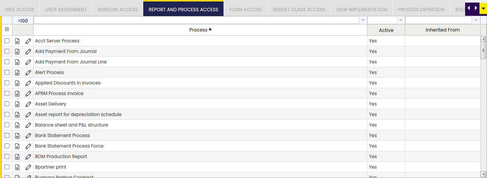

Having said that, if the **Manual** checkbox is selected, it will be required to manually add a subset of report and process which will be accessible for a given role, or it will be required to automatically add them by using the action process **Grant Access**. This process will allow report or process access for a given Etendo module or area such as Projects, Finance or Sales.

**Editable Field** checkbox defines if the accessible data in a report or process can be edited by the role or not.

By default, access to processes in a standard window given from a button is inherited from the permission to the window. So if the role has access to the window, it will be possible to execute all the processes defined in that window, regardless if there are explicit entries for them in **Report and Process Access** tab. This default behavior can be changed in two different ways:

- To revoke this inherited access and manually decide case by case which are the accessible processes, it is possible to define a **Secured Process** Preference (at system level or for that specific window) with Y as value.
- If the developer defined the process as Requires Explicit Access Permission. In this case, permissions will never be inherited for that process.

### Form Access

This tab lists and/or allows adding the forms to which a role will have access to.

As already mentioned, every time a new role is created and saved without selecting the Manual checkbox, Etendo automatically fills in all the forms in the Form Access tab.

The information above means that the newly created role will have access to every Etendo form.

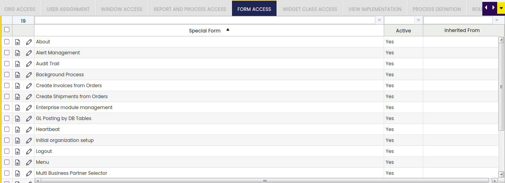

Having said that, if the Manual checkbox is selected, it will be required to manually add a subset of forms which will be accessible for a given role, or it will be required to automatically add them by using the action process Grant Access. This process will allow form access for a given Etendo module or area such as Projects, Finance or Sales.

Editable Field checkbox defines if the accessible data in a form can be edited by the role or not.

### Widget Class Access

This tab lists and/or allows adding the widget classes to which a role will have access to.

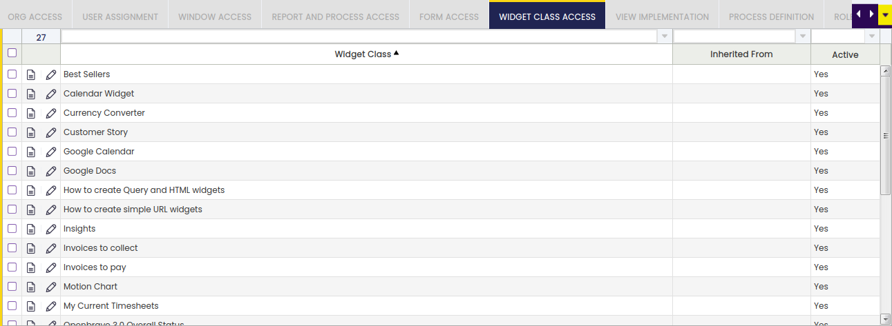

Widgets are User Interface elements which can either be placed in the Users' Workspace tab or be part of a generated window.

### View Implementation

View implementation tab allows the user to select customized views.

A view implementation is a completely custom implementation of a main view.

The access to a custom view can be controlled through this role access tab.

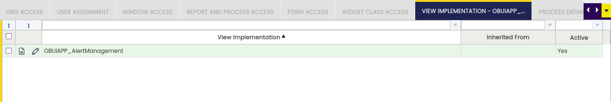

For additional information about views, visit How to implement a new main view.

### Process Definition

Grants access to Process Definition. By default, access to process definitions in a window (given from a button), is inherited from the permission to the window. To cancel this inherited access and manually decide case by case which are the accessible processes, it is necessary to define a Secured Process Preference (at system level or for that specific window) with Y as value.

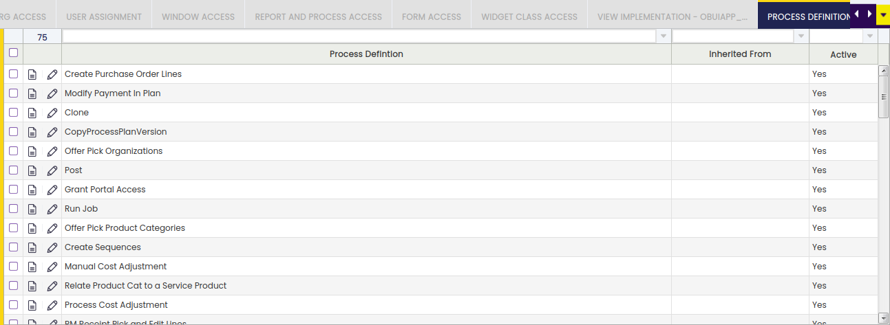

Access when the process is invoked from a standard window button is inherited in the same way that for Processes.

### Role Inheritance

It allows defining an inheritance for a role. An inheritance is a relationship between two roles: if role A inherits from role B, that means that all the permissions that role B has for different application elements like organizations, windows, reports, processes, widgets etc. will be automatically inherited by role A, allowing it to access those elements in the same way as B. It is also possible to define an inheritance hierarchy, i.e., a role can inherit from different roles, and the priority (order) to inherit the permissions is defined by the sequence number. 

This means that if two inheritances have accesses in common, the accesses of the inheritance with lower sequence number will be overridden with the accesses of the inheritance with higher sequence number.

Within this tab is where the Role Inheritance configuration of a particular role is set.

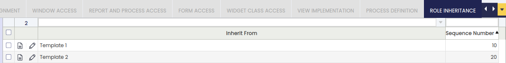

The fields to fill in are:

- **Inherit From**: In this field, it should be selected the role whose permissions will be inherited. It defines the role that will be used to retrieve access to its permissions automatically.
- **Sequence Number**: It defines the order in the application of the role inheritance, when having multiple records in the tab. The lower this value is, the earlier will be retrieved the permissions of the related template role. This means that if the same permission is accessed by two template roles selected to inherit from them, the permission related to the inheritance with higher sequence number will override the other one.

---

This work is a derivative of [General Setup](https://wiki.openbravo.com/wiki/General_Setup){target="_blank"} by [Openbravo Wiki](http://wiki.openbravo.com/wiki/Welcome_to_Openbravo){target="_blank"}, used under [CC BY-SA 2.5 ES](https://creativecommons.org/licenses/by-sa/2.5/es/){target="_blank"}. This work is licensed under [CC BY-SA 2.5](https://creativecommons.org/licenses/by-sa/2.5/){target="_blank"} by [Etendo](https://etendo.software){target="_blank"}.