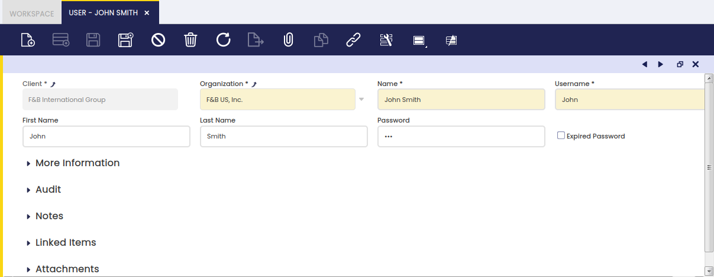
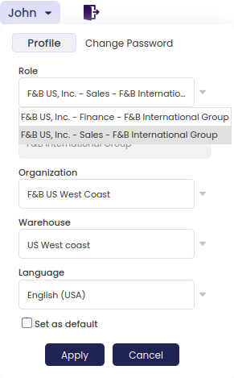
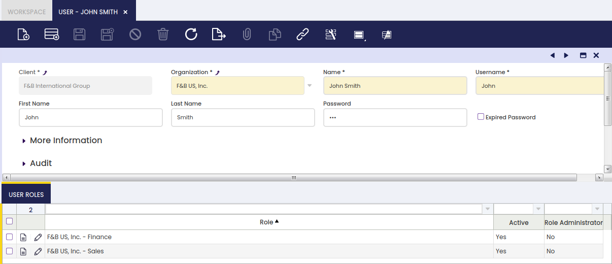

:material-menu: `Application` > `General Setup` > `Security` > `User`

### Overview

A user is an entity which can log into Etendo whenever it has a password and at least one role assigned to it.

As shown in the image above, Etendo allows the user to sign in by entering a username and a password previously created in Etendo. The user assigned to that username will be able to sign in only in case it has at least one user role assigned to it.

### User

User window allows the user to create as many Etendo users as required. Each person accessing Etendo can have a different user assigned.

As shown in the image above, a user can be created by entering the basic information below:

- the _User First and Last Name_
- the _"User Name"_ and the _"Password"_ to use for logging into Etendo
- and in the case of being an "Employee", the employee business partner records in the field "Business Partner", under the "More Information" section.
- the _"Expired Password"_ checkbox: if it is checked, the user's password will be set as expired and when the user logs in, he will be forced to change it.

### User Roles

Roles are the connection between users and access rights. Each user can have more than one role assigned, however, a user can only log into Etendo by using just one role.

For instance, it is possible to create and configure a role for Sales, a role for Finance, a role for Warehouse, and another role for Procurement.

Those roles will have to be configured to allow access to either sales, finance, warehouse or procurement windows, processes and forms. To learn more about how to do this, visit Role.

Whenever there is a new member in the organization, a new user could be created and assigned to any of the existing roles instead of creating and configuring new users permissions every time.

There can be a user having a given role set up as "Role Administrator", that user will be able to add new users to that role.

---

This work is a derivative of [General Setup](https://wiki.openbravo.com/wiki/General_Setup){target="_blank"} by [Openbravo Wiki](http://wiki.openbravo.com/wiki/Welcome_to_Openbravo){target="_blank"}, used under [CC BY-SA 2.5 ES](https://creativecommons.org/licenses/by-sa/2.5/es/){target="_blank"}. This work is licensed under [CC BY-SA 2.5](https://creativecommons.org/licenses/by-sa/2.5/){target="_blank"} by [Etendo](https://etendo.software){target="_blank"}.