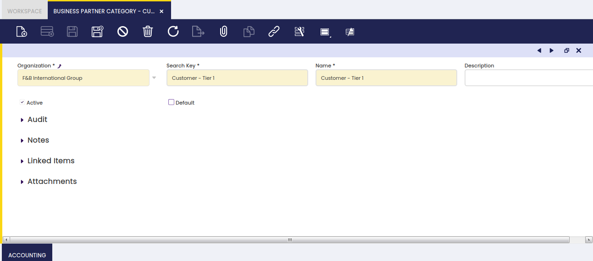
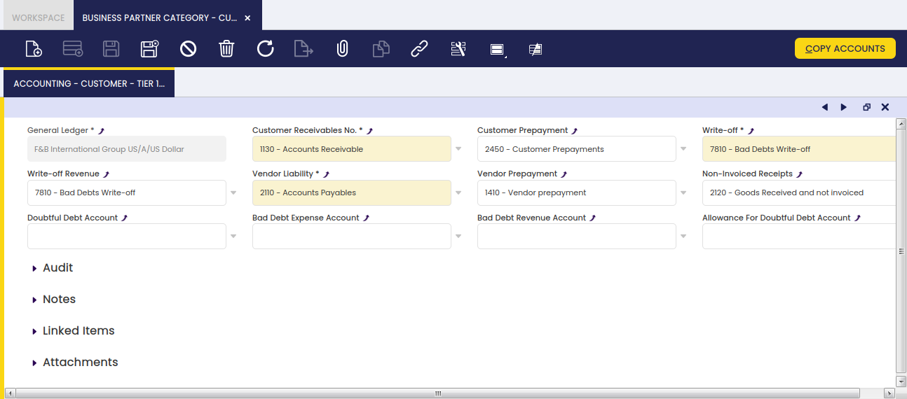

## Overview

Business partners can be grouped into different categories with the aim of helping their management and analysis.

You may want to group the suppliers of a certain type of products within the same category, in order for you to compare the purchase prices your company got from them in relation to the same type of products.

Or you may want to group the customers located in your country within the same category, a different one than the one which groups the customers located abroad, in order for you to compare national and foreign sales figures.

All of the above is possible due to the fact that Business Partner Group is a dimension of Purchase and Sales Reports.

To learn more, visit Procurement Analysis Tools and Sales Analysis Tools.

Finally, it is also important for you to take into account that each business partner category allows the user to set up a different set of ledger accounts to be used while posting transactions such as customer receivables or vendor liabilities.

## Business Partner Category

:material-menu: `Application` > `Master Data Management` > `Business Partner Setup` > `Business Partner Category`

Business partner category window allows the user to create and configure every business partner category your organization may need.

As shown in the image above, the creation of a business partner category requires entering below listed information for each category:

- a Search Key or short name which helps to easily find a category
- a Name
- and a Description

### Accounting

Each business partner category allows the user to configure a different set of ledger accounts.

There are several business partner related accounts which need to be properly set up for the organization's general ledger configuration.

The "Copy Accounts" process of the Defaults tab of the General Ledger Configuration screen allows the user to automatically populate at least the mandatory ones shown in the image above.

The accounts automatically defaulted by Etendo can always be changed if required.

These ledger accounts are the ones to be used while posting business partner related transactions such as:

- Customer Receivables, sales invoices posting.  
  To learn more, visit Sales Invoice
- Customer Prepayments, customer payments in advanced posting.  
  To learn more, visit Payment In
- Vendor Liabilities, purchase invoices posting.  
  To learn more, visit Purchase Invoice
- Vendor Prepayments, vendor payments in advanced posting.  
  To learn more, visit Payment Out
- Non-invoiced Goods Receipts, Goods Receipt posting  
  To learn more, visit Goods Receipt
- Write-off amounts, or amounts your company expected to get paid by a customer which are not going to be paid anymore.  
  To learn more, visit Payment In
- Revenue Write-off amounts, or amounts to be paid by your company to a supplier which are not going to be paid anymore.  
  To learn more, visit Payment Out
- Doubtful Debt Account, doubtful debts posting.  
  To learn more, visit Doubtful Debt Run
- Bad Debt Expense Account, expense amount classified as bad debt.  
  To learn more, visit Doubtful Debt Run
- Bad Debt Revenue Account, revenue amount classified as bad debt.  
  To learn more, visit Doubtful Debt Run
- Allowance for Doubtful Debt Account, amount used to provision against possible bad debts.  
  To learn more, visit Doubtful Debt Run

The "Copy Accounts" action button allows the user to copy the accounts defaulted in this window to either:

- the Customer Accounting tab
- or the Vendor Accounting tab
