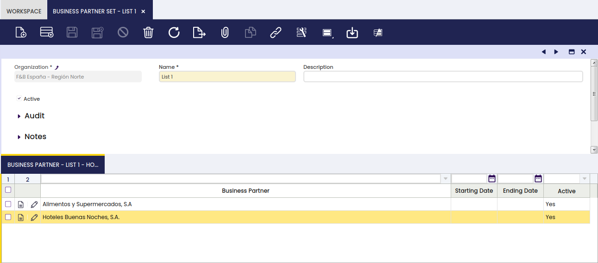

## Business Partner Set

:material-menu: `Application` > `Master Data Management` > `Business Partner Setup` > `Business Partner Set`

### Overview

In this window the user can define lists of business partners to use in other functionalities.

### Header

In the Business Partner Set header the fields to complete are the organization and the name of the list of business partners. It is also possible to add a description when necessary.

### Lines

The lines tab allows the user to add the required business partners to the corresponding business partner set.

