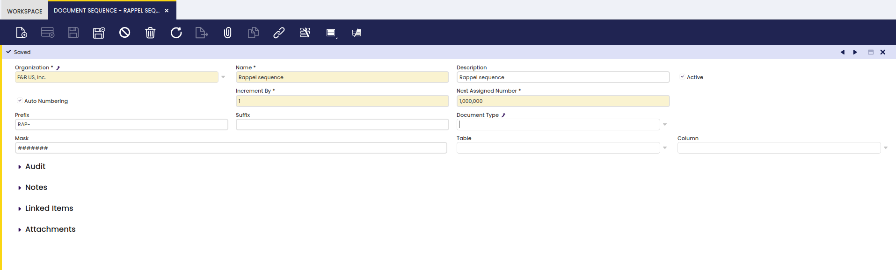
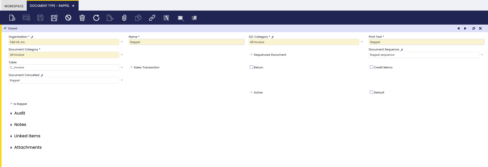
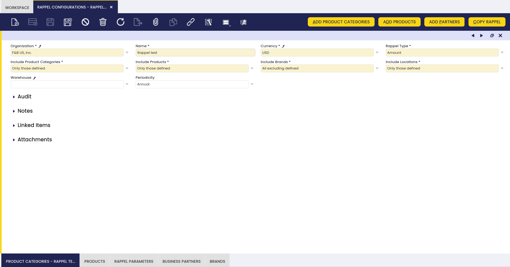

## Rappel Configurations

:material-menu: `Application` > `Master Data Management` > `Business Partner Setup` > `Rappel Configurations`

!!! info
    To be able to include this functionality, the Advanced Rappels module of the Sales Extensions Bundle must be installed. To do that, follow the instructions from the marketplace: [Sales Extensions Bundle](https://marketplace.etendo.cloud/#/product-details?module=22CF01FC620140A6AA92CF550EB8DA36){target="_blank"}. For more information about the available versions, core compatibility and new features, visit [Sales Extensions - Release notes](../../../../../whats-new/release-notes/etendo-classic/bundles/sales-extensions/release-notes.md).

Rappels are discounts based on the volume of consumption of a business partner in a given period of time. This functionality allows the user to configure and grant rappels to business partners.

### Requirements

Before the user is able to use this functionality, it is necessary to configure a new document sequence and a new document type to be used for Rappels.

#### Document sequence

A specific document sequence for rappels is necessary to distinguish them from other transactions.
In this window, create a new record and fill the corresponding fields:

- **Organization**: The name of the corresponding organization.
- **Name**: The name of the document sequence, in this case, "Rappel sequence"
- **Active**: Yes
- **Auto Numbering**: Yes
- **Increment by**: 1
- **Next assigned number**: 1,000,000
- **Prefix**: It is optional and, in this case, "RAP-" is entered to indicate that these transactions are Rappels.

Save the record and the document sequence for rappels is available.

!!! info
    For more information, visit [Document Sequence](../../financial-management/accounting/setup/document-sequence.md)

#### Document type

A specific document type is necessary for rappels.
In this window, create a new record and fill the corresponding fields:

- **Organization**: The name of the corresponding organization
- **Name**: The name of the document type, in this case, "Rappel"
- **G/L Category**: In this case, select "AR invoice"
- **Print text**: In this case, "Rappel"
- **Document Category**: "AR Invoice"
- **Sequenced Document**: Yes
- **Document Sequence**: In this case, "Rappel sequence"
- **Table**: C_invoice
- **Sales Transaction**: Yes
- **Is rappel**: Yes

Save the record and the document type for rappels is available.
After saving it, it is necessary to select "rappel" in the field "Document Cancelled" and save again.

!!! warning
    For each organization, it is possible to configure only one "rappel" document type.

!!! info
    For more information, visit [Document Type](../../financial-management/accounting/setup/document-type.md)

### Rappel Configurations

In this window, the user can configure all the necessary aspects to grant rappels to certain business partners.

#### Header

This window contains the general data of the configuration. The relevant fields are described below:

- **Name**: It indicates the name assigned to the rappel.
- **Currency**: The user can select the currency of the rappel.
- **Include Products**: The user can define if the selected products are to be included or excluded ("all excluding defined" or "only those defined").
- **Include Product categories**: The user can define if the selected product categories are to be included or excluded ("all excluding defined" or "only those defined").
- **Include Brands**: The user can select certain brands to be included or excluded ("all excluding defined" or "only those defined").
- **Include Locations**: The user can select certain locations to be included or excluded ("all excluding defined" or "only those defined").
- **Warehouse**: It provides information about the warehouse of the products. By default, this field is empty. This is the case except for invoices created from goods shipments.
- **Periodicity**: It provides information about the suggested periodicity of the rappel ("annual", "biannual", "monthly" or "quarterly").
- **Type of Rappel**: The user can select the type of rappel, it can be according to the amount of the consumption or the quantity of products consumed ("amount" or "quantity").

Once this information is completed, the user is able to save the configuration and use the buttons in the window to configure specific aspects of each rappel.

#### Buttons

At the top of this window, four different buttons can be found.

- **Add product categories**: With this button, the user can select one or more product categories and add them to the rappel.
- **Add products**: With this button, the user can add one or more products to the rappel.
- **Add partners**: With this button, the user can add one or more partners to the rappel, and a date from and a date to must be assigned to determine the validity period for the created rappel.
- **Copy rappel**: With this button, the user can copy the characteristics of an existing rappel to the selected rappel.

#### Tabs

- **Product Category**: In this tab, product categories assigned to the Rappel are shown. It is also possible to assign new categories from this tab.
- **Product**: In this tab, products assigned to the Rappel are shown. It is also possible to assign new products from this tab.
- **appel Parameters**: In this tab, the discount percentage, minimum and maximum amounts can be assigned to the rappel.
- **Business Partners**: In this tab, the business partner to which the Rappel applies is shown. Here, it is possible to select the "from date" and "to date". This tab also contains a sub tab called "B. Partners Location", where the location of the business partner is indicated.
- **Brand**: In this tab, the brands of the products to which the Rappel applies or not can be selected.

Remember that the options selected in the tabs "Product Category","Product", and "Brand" must follow a certain logic: the priority is the option selected in the tab "Product Category". This means that more specific filters apply to the included or excluded product categories.

When selecting the option "only those defined" in the fields "include product categories" and "include products" of the header, if in the "product category" tab the user selects "water", and in the "product" tab the user selects "white wine", the rappel will only include the products belonging to the category "water" and not "white wine".
>
!!! warning
    When selecting the option "All excluding defined" in the "Include product categories" field and the option "Only those defined" in the "include products" field, if in the "product category" tab the user selects "water", and in the "product" tab the user selects "sparkling water", the rappel will not include the product "sparkling water" despite what is defined in the "product" tab, since the priority is in the defined "product category".
