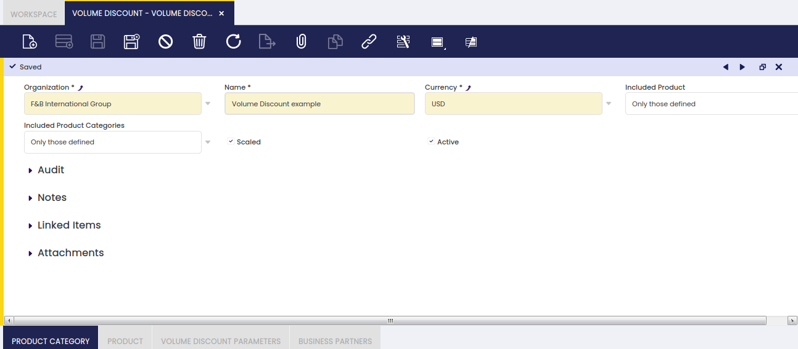

## Volume Discount

:material-menu: `Application` > `Master Data Management` > `Business Partner Setup` > `Volume Discount`

### Overview

Volume discounts are discounts which apply after getting a certain volume of sales of specific products or product groups.

Volume discounts are incentives intended to encourage the purchase of goods in greater quantities. This incentive is normally offered to pass on some of the economic efficiencies gained through larger orders, to improve customer relations, and to increase total volume of sales.

### Volume Discounts

Volume Discount window allows the user to create and properly configure volume discounts related to specific products and/or product groups, which are later on assigned to selected business partners.

As shown in the image above, a volume discount can be created by just entering below data in the "Volume Discount" header window:

- the "**Name**" of the volume discount
- the "**Currency**"
- the "**Included Products**" to which the volume discount will apply. Available options are:
  - Only those defined - which means applicable to all the products defined in the "Product" tab below.
  - or All excluding defined - which means all products but the ones defined in the "Product" tab below.
- the "**Included Product Categories**" to which the volume discount will apply. Available options are:
  - Only those defined - which means applicable to all the product categories defined in the "Product Category" tab below.
  - or All excluding defined - which means all product groups but the ones defined in the "Product Category" tab below.
- **Scaled** - A volume discount can be scaled which means that it is possible to define a set of amount ranges having a different discount. To learn more, visit the "Volume Discount Parameters" tab below.

### Product Category

A volume discount can be configured for a set of product categories or can be configured for all product categories but for a set of them.

Therefore, and depending on the criteria taken, you could select here the products to either include or exclude of a given volume discount.

### Product

A volume discount can be configured for a set of products or can be configured for all products but a set of them.

Therefore, and depending on the criteria taken, you could select here the product groups to either get included or excluded of a given volume discount.

### Volume Discount Parameters

Volume discount parameters are a discount % as well as the minimum amount up to which the discount % is applied.

Besides, it is also possible to configure not just a minimum amount up to which a given discount % will apply, but a set of amount ranges to which a different discount % will apply.

As an example, you could configure a volume discount which applies:

- a 2% to the amount range =0,00 to 9,999.99
- a 5% to the amount range = 10,000.00 to 24,999.99
- and a 10% to a minimum amount up to 25,000.00

### Business Partners

Volume Discounts can be assigned to selected business partners within a given time period.

You can also get a volume discount applied to a selected business partner starting from a given "Valid From Date".

Regardless volume discount makes more sense for "Sales Transaction", it is also possible to create and configure volume discounts to be applied to selected suppliers or vendors by:

- removing the "Sales Transactions" flag
- and by removing the filter "Customer" while selecting business partners in the business partner selector.
