:material-menu: `Application` > `Master Data Management` > `Product`

## Overview

The Product window is where you create and manage the catalog of everything your organization buys, sells, or manufactures: physical goods, services, and raw materials. For each product, you can define its price, the accounts used for posting, stock levels, vendors, and manufacturing data. Each of these aspects is managed in a separate tab within the window.

The Product window is organized into the following tabs:

- **Product**: Main header fields — product type, unit of measure, category, pricing flags, attributes, and deferred revenue/expense configuration.

    - **Price**: Price list assignments and pricing rules.
    - **Accounting**: Ledger accounts for transactions.
    - **Bill of Materials**: Components for bundle products.
    - **Costing Rule**: Cost calculation method by date range.
    - **Costing**: Cost history and manual cost entry.
    - **Transactions**: Read-only inventory movement log.
    - **Purchasing**: Vendor and purchasing data.
    - **Manufacturing**: Manufacturing plan data.
    - **Translation**: Product name translations.
    - **Characteristics**: Product variant characteristics.
    - **Unit Cost**: Calculated unit cost.
    - **Stock**: Available stock by storage bin.
    - **Alternate UOM**: Alternative units of measure.

## Header

Product window allows the creation of items such as products, raw materials, resources, services, etc.

The information required to create a Product in Etendo is determined by the nature of the Product, its Product Type.

There are four product types available:

- **Item**. The most frequently used product type is *Item*. Inventory held for resale, materials that are placed into a production process, and semifinished or finished goods created through production are examples of products defined using the product type *Item*.
    - An item should be flagged as **Stocked**, if quantity tracking is required for the item, otherwise there is no need to flag the item as **Stocked**.
    - An item should be flagged as **Production**, if the item is used in manufacturing.
    - If an item is an intermediate or finished good, its bill of material (BOM) should be detailed on the **Bill of Materials** tab.
- **Service**. This product type is used to identify such provisions as professional services, transportation, telephony, and other items which do not correspond with material goods.
    - Therefore, a Service is not stockable but can be purchased or sold.
    - A service can have a bill of materials to be defined in the **Bill of Materials** tab.
- **Resource** and **Expense**. These product types can be used to distinguish between different types of products which can be purchased or sold but cannot be stocked.
    - Resource type can be used to configure resources such as Financial, Legal or Natural resources used by the organization.
    - Expense type can be used to configure expenses such as travel expenses to be used while reporting Employee expenses.

!!! info
    Product types do not affect how transactions are posted to the general ledger. All product types are accounted for in the same way when purchased, stocked, or sold, using the ledger accounts defined in the **Accounting** tab.

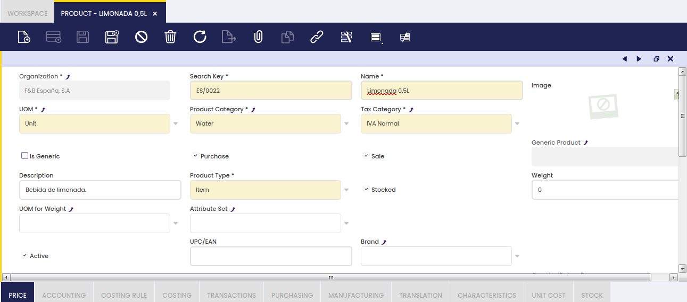

Additional key data to fill in are:

- **UOM**, that is the unit of measure to be used while purchasing, storing and selling a product, for instance *Units*.  
    A product can also have alternative UOM besides product's UOM.
- **Product Category**, it is mandatory to select a product category to which the product is going to belong to.  
    To learn more, visit [Product Category](../product-setup/product-category.md).
- **Tax Category**, this category is key for managing the taxes related to the product. Taxes such as VAT depends on the type of product.  
    To learn more, visit [Tax Category](../../financial-management/accounting/setup/tax-category.md).
- **Purchase** checkbox can be selected to indicate that the product can be purchased to an external supplier. This checkbox is mainly an informative one, as it does not add any business logic behind but regarding MRP.  
    In that case, if selected, MRP will then purchase the product if needed, otherwise it will produce it.
- **Sales** checkbox can be selected to indicate that the product is sold or can be sold to an external parties or customers. This checkbox is an informative one, as it does not add any business logic behind.
- **Stocked** checkbox is selected if the product is part of the inventory, therefore proper inventory movement transactions are registered in Etendo.  
    This flag can not be changed anymore for a product, if that product is part of any sales, purchase, inventory or production document related, whatever document status is.
- **Production** checkbox is selected if the product is part of a production process. Once selected, an additional field appears to select a **Process Plan**.  
    To learn more, visit [Process Plan](../../production-management/setup.md#process-plan).
- **Attribute Set**, a product can have a group of features or an attribute set, such as **Color and Size**, to take into account while ordering or storing the product.
    
    - If an Attribute Set is selected here, Etendo displays a new field named **Attribute Set Value**. To learn more, visit [Attribute Set](../product-setup/attribute-set.md).

- **Attribute Set Value**, if an Attribute Set value such as *Blue and Large* is selected, Etendo displays a new field named **Use Attribute Set Value As**.
- **Attribute Set Value As**, once an attribute set has been selected, that one could be used as described below depending on the criteria selected in this field:
    
    - **Default**: The system pre-fills the attribute value (for example, Size = *Medium*), but the user can change it on each transaction.
    - **Overwrite Specification**: The attribute value fully defines the product (for example, *Alcohol Free Beer* = 0% alcoholic proof), but can be changed to record exceptions (for example, a production deviation).
    - **Specification**: The attribute value is fixed and cannot be changed on any transaction (for example, *Large Blue Jeans* always has Size *Large* and Color *Blue*).

    !!! info 
        To learn more about attributes, visit the [Attribute](../product-setup/attribute.md) and [Attribute Set](../product-setup/attribute-set.md) articles.

- **UPC/EAN**, used to store bar-code information
- **Bill of Materials** checkbox is selected when the product is a bundle of other products as listed in the Bill of Materials tab.

- **Deferred Revenue** applies when a product is sold but the income should be recorded over time rather than all at once — for example, an annual software subscription. When this flag is enabled, you define how many months the income should be spread across and when it starts.

    This flag is visible only for products having the **Sale** checkbox enabled. When checked, the **Revenue Plan** field group becomes visible with the following fields:

    - **Revenue Plan Type**: this field specifies the default frequency of the revenue distribution. At the moment, only monthly revenue plans are supported.
    - **Period Number**: this field specifies the default duration of a revenue plan. For example, an annual subscription to a magazine will be defined with a revenue plan of 12 monthly periods, while a season ski pass will have revenue plan of 5 monthly periods.
    - **Default Period**: this field specifies the first period in which revenue is going to be recognized. The options available are:
        
        - _Current Month_. This option will set the Revenue Plan Starting Period to the same period as the invoice accounting period.
        - _Next Month_. This option will set the Revenue Plan Starting Period to the invoice accounting next period.
        - _Manual_. This option will not set any revenue plan starting period, therefore a starting period can be selected while creating the sales invoice line.

- **Deferred Expense** applies when a product is purchased but the cost should be recorded over time — for example, a prepaid service. When this flag is enabled, you define the distribution period and starting month.

    This flag is visible only for products having the **Purchase** checkbox enabled. When checked, the **Expense Plan** field group becomes visible with the following fields:

    - **Expense Plan Type**: this field specifies the default frequency of the expense distribution. At the moment, only monthly expense plans are supported.
    - **Period Number**: this field specifies the default duration of an expense plan.
    - **Default Period**: this field specifies the first period in which expense is going to be recognized. The options available are:
        
        - _Current Month_. This option will set the Expense Plan Starting Period to the same period as the invoice accounting period.
        - _Next Month_. This option will set the Expense Plan Starting Period to the invoice accounting next period.
        - _Manual_. This option will not set any expense plan starting period, therefore a starting period can be selected while creating the purchase invoice line.

    These values are used when an invoice is created for a product having an expense plan and/or a revenue plan.

    In the same way, these values are also used when an invoice is created from another document (for example: the Generated Invoices process that creates invoices from sales orders). In the same way, these values can be modified on a transaction by transaction basis.

    !!! info 
        To learn more, visit the [How to Manage Deferred Revenue and Expenses](../../../how-to-guides/how-to-manage-deferred-revenue-and-expenses.md) article.

- **Book Using Purchase Order Price**: This flag is used when posting a Goods Receipt or a Matched Purchase Invoice document to the ledger.  
    Normally, the product cost is used while posting those transactions, however this checkbox allows using the product purchase price instead.  
    This feature only works for *Expense* product type not having the **Sales** checkbox selected.

    !!! info
        Notice that in this case a Purchase Order needs to be related to the Goods Receipt, otherwise an error message will be shown as the purchase product price is required.

- **Returnable**: Select this checkbox to indicate that the product can be returned by a customer. When this checkbox is selected, the **Overdue Return Days** field becomes available. If you try to return a non-returnable product from the **Return from Customer** window, Etendo will display an error message.

    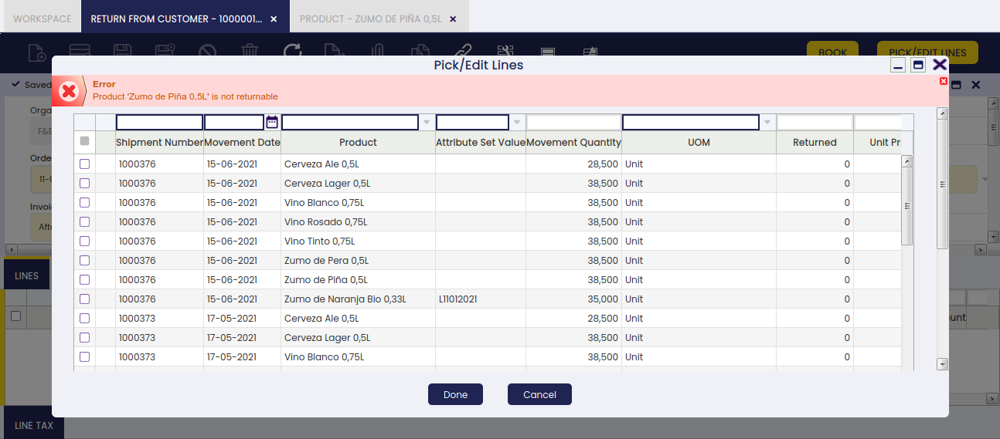

- **Overdue Return Days**: In this field, it is possible to configure the maximum amount of days before a product can not be returned. If the field is left blank, the product can be returned without time limitations. When trying to return a product whose period has expired, a warning message will appear.

    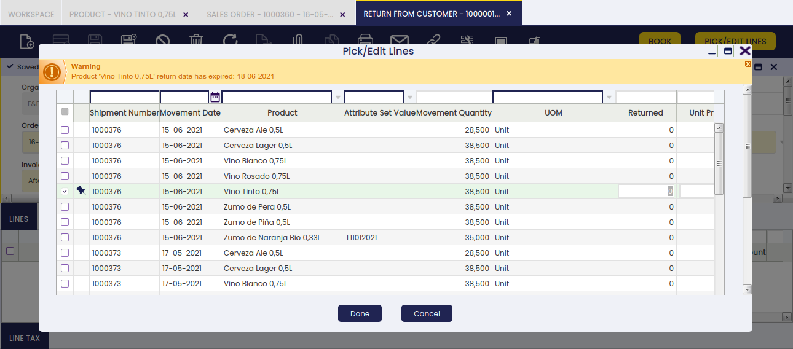

    !!! info
        If the **Stocked** checkbox is not selected and the **Bill of Materials** checkbox is selected, the product price must be set to 0. In this case, the total price is calculated automatically from the prices of the individual components listed in the **Bill of Materials** tab. To apply promotions or discounts, use the Discounts and Promotions feature.

### Variants

A product can be marked as **Is Generic**. This means that variants of this product will be created based on some characteristics such as colour, size, etc. The definition of these characteristics takes place in the generic product, so it can be said that a generic product is like a template where new variants will inherit all the attributes (taxes, prices, image) of this product. Due to this, a generic product cannot be used for transactions but its variants.

!!! info
    Products that are marked as generic cannot be used in transactions operations such as sales orders, purchase orders, goods receipts, etc.

When this flag is marked, two buttons are shown:

- The **Manage Variants** button shows all possible variant combinations for the generic product — both those already created and those not yet created. It is useful in two situations:

    

    - You want to create only some combinations, not all of them. The button lets you review and select specific combinations before creating them.
    - You have added a new characteristic value (for example, Red, when Blue and White already existed) and want to see which new combinations are now available.

    For example, imagine generic product *T-Shirt Model A* has the characteristics:

    - Color: Blue, White
    - Size: S,M,L

    But still variants have not been created. If you press the button, you can see all possible combinations:

    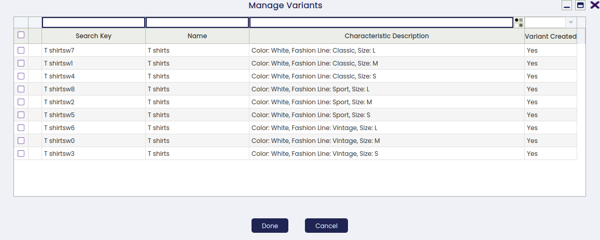

    Then all combinations can be selected or just pick some of them. Once you press **Done**, the selected combinations are created as individual product records. Each new product is linked to the original generic product through the **Generic Product** field — this link means the variant inherits prices, taxes, and images from the generic product.

- The **Create Variants** button, creates all product variants — that is, all combinations based on the characteristics defined.
    
    

- Another button that might appear is **Update Characteristic**. It only shows up when the generic product or the new product variant has a non-variant characteristic related. Two scenarios:

    
    
    1.  **Generic product**: This button allows entering the value of that characteristic.  
    Imagine the characteristic is Fashion Line that has three values: Sport, Vintage, Classic.  
    Unlike the characteristics that are variants users cannot enter the value through the **Characteristic Configuration** tab.
    
    2.  **Variant Product**: This button allows the user to enter/update the characteristic that is not variant.

Once a variant has been created, its characteristics and values can be viewed either in the grid or in form view:

- Grid view: There is a new column **Characteristic Description**. This column is calculated and is not editable. It shows the characteristics with their values as text. This column has a new search-selector in order to find product variants based on their characteristics.

    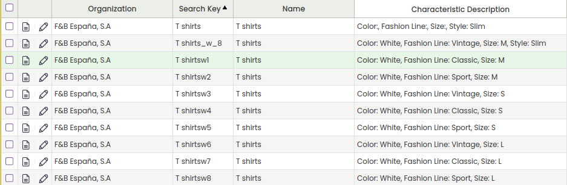

- Form view: Product variants have a new section named **Characteristic Description**. This section contains as many fields as different characteristics the product has.

    The **Show Product Characteristics Parents** preference controls how many levels of a characteristic hierarchy are displayed in the **Product** window form view. Set it to a number (1, 2, 3, etc.) to control how many parent levels appear above a value. For example, if the hierarchy is `Color` > `Green` > `Green light` > `0034` and the preference is set to `2`, the form will show Green light and its parent Green, but not the higher-level Color or the code `0034`. This preference is set in the **Preferences** window. Contact your system administrator if you need to change it.

    New values of an existing characteristic can be added. For example, colour *Red* when already having *Blue* and *White*. When it happens, this new value is automatically added to all generic products that already have the characteristic Color. This new value will be present in the configuration tab but deactivated. If the user wants to use it in a specific product in order to create new variants he can just activate the value and use the **Manage Characteristics** button.

### Modify Tax

**Modify Tax** allows a service product (such as installation) to automatically change the tax rate applied to the goods it accompanies — for example, furniture sold with installation may have a different tax rate than furniture sold alone. This functionality applies only to Orders; documents created afterwards take the tax information from the Order. This feature is configured by an administrator.
This tax modification is implemented through a service linked to the product. This service has to be marked as able to modify taxes of the products linked to, and the configuration of the products to modify taxes and the new tax to apply must be also specified.

To configure it, go to the **Product** window and create a new service. A service is just a product with the field **Product Type** set to *Service*. It has to be activated also the field **Linked To Product** and the field **Modify Tax**. When this field is activated, a new tab named **Modify taxes categories** is visible. In this tab, it is defined the configuration of the tax categories of products this service will modify when linked and the new tax category to apply.

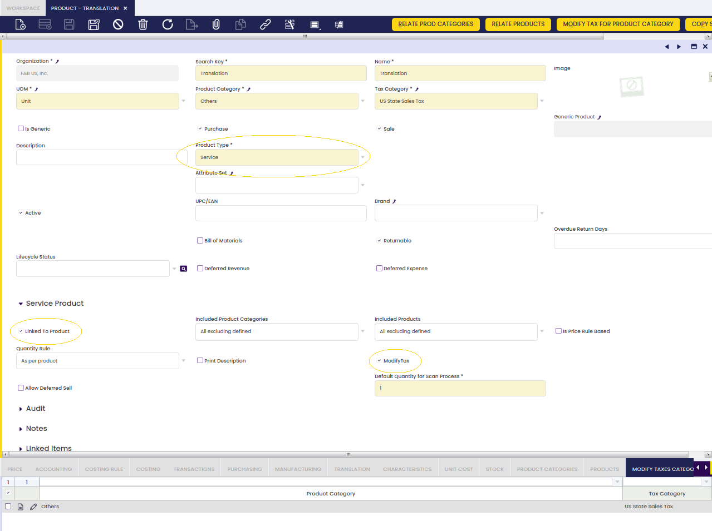

To ease the configuration process, two components have been added:

1. **Modify Tax for Product Category** (Button): Pick and Execute window to assign the product categories and tax categories in the same action.

    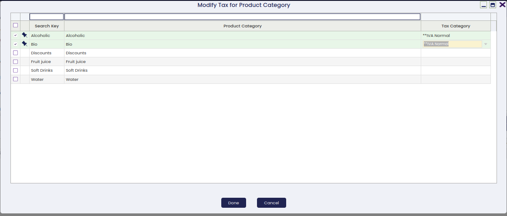

2. **Copy Service Modify Tax Configuration** (Button): Pick and Execute window where services which modify taxes are displayed. The user can select one or many services, and current configuration will be assigned to selected services. Once the process has been executed, the old configuration (if it exists) will be deleted and a new one will be added. This process helps in deploying the same configuration to multiple services.

    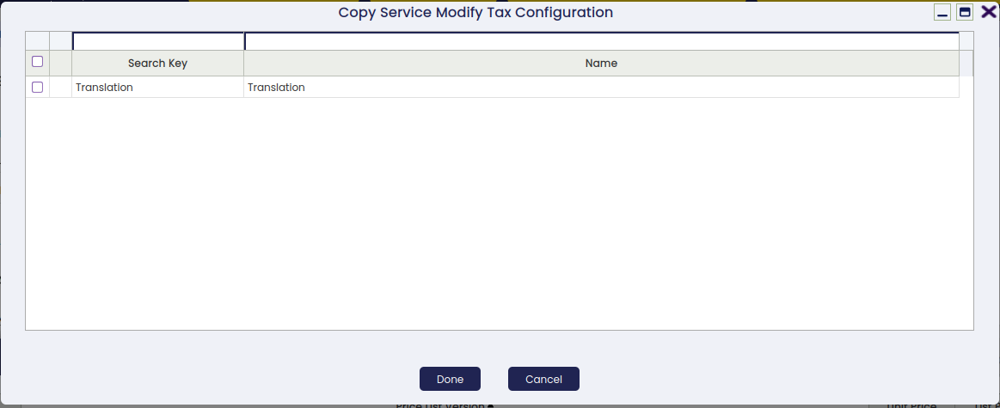

**Modify Taxes Categories**

It defines tax modification for products linked to service. Products linked to this service that belong to the configured category will change the tax category when linked to this service.

## Tabs and Subtabs

The Product window is organized into the following tabs, each covering a specific aspect of the product record:

### Price

A product can be part of many Price List Versions which are valid for a given time period.

There are two ways in which the user can get a product to be part of a Price List:

1.  by **selecting the Price List/s** and entering both the *Net Unit Price* and the *Net List Price* values in the Price List tab, while creating the product.  
    As a consequence of that, the product being created will also be part of the Price List selected.
2.  by **selecting the product** and entering both the *Net Unit Price* and the *Net List Price* values, while creating the *Price List*.  
    As a consequence of that, the Price List as well as both *Net Unit Price* and *Net List Price* values will be automatically shown in the *Price List* tab of the product.  
    To learn more, visit [Price List](../pricing/price-list.md).

### Price Rule Version

This tab will only be available when fields **Linked To Product** and **Is Price Rule Based** are selected. This tab gives the possibility of adding Service Price Rules to the Service starting from a certain date.

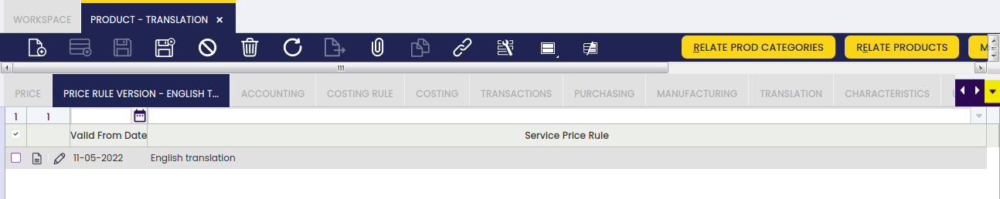

In this window it is also possible to define a maximum and minimum amounts that will be taken into account when showing services.

Those amounts define an interval between product prices so that the service will only be available to be added in case the sum of the selected products is between the interval.

For services of quantity rule: Unique Quantity the quantity of the line matters, as it will be only added one service.

For services of quantity rule: As per Product the quantity of the line does not matter, the price of the product only matters as there will be added as many services as products are selected. Only if all the product prices fall within the defined price range (between the minimum and maximum amounts), the service will be shown.

Also, if once a service (not yet delivered) has been added to the receipt, the price of the related product changes, a validation will be triggered, and in case the service no longer falls within the defined price range, it will be removed from the current receipt and a notification will appear.

### Product Categories

The user can define if a product of a certain product category can be related to a product of *Service* type by creating a relation between an Order Line of the Service product and another Sales Order Line of the product belonging to included/excluded product categories.

This tab will only be available when the **Included Product Categories** field of the Service has a value. It contains all the product categories related to the service.

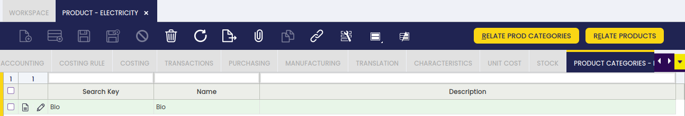

The following information about related products is available in the tab:

- **Search Key**: Search Key of the Product Category.
- **Name**: Name of the Product Category.
- **Description**: Description of the Product Category.

This tab is not editable, it is not possible to add records manually or edit them. It only allows to delete records. To add new records, it is necessary to click the **Relate Prod Categories** button (visible only when the **Included Product Categories** field has a value). This button will open a Pick & Edit displaying all product categories not related to the service.

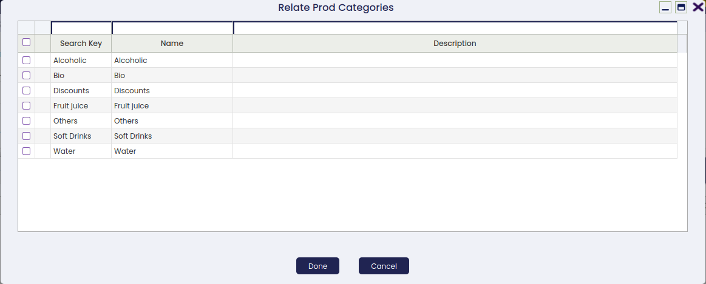

### Category Price Rule Version

This tab will only be available when the field **Is Price Rule Based** is selected. It allows defining price rule versions that apply when the service is linked to products belonging to specific product categories.

### Products

The user can define if a product can be related to a product of *Service* type by creating a relation between an Order Line of the Service product and another Sales Order Line of the product included/excluded.

This tab will only be available when the **Included Products** field of the Service has a value. It contains all the products related to the service.

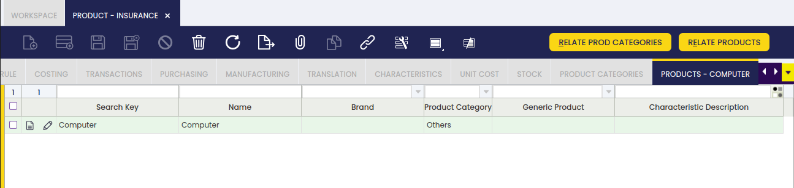

The following information about related products is available in the tab:

- **Search Key**: Search Key of the Product.
- **Name**: Name of the Product.
- **Brand**: Brand Key of the Product.
- **Product Category**: Product Category to which belongs the product.
- **Generic Product**: Generic Product of the Product, if it has any.
- **Characteristic Description**: Characteristics of the Product, if it has any.

This tab is not editable, it is not possible to add records manually or edit them. It only allows to delete records. To add new records, it is necessary to click the **Relate Products** button (visible only when the **Included Products** field has a value). This button will open a Pick & Edit displaying all products not related to the service.

#### Product Price Rule Version

This tab will only be available when the field **Is Price Rule Based** is selected. It allows defining price rule versions that apply when the service is linked to specific individual products.

### Accounting

Accounting tab allows the user to configure the ledger accounts to be used while posting product related transactions such as product purchase or sales to the general ledger.

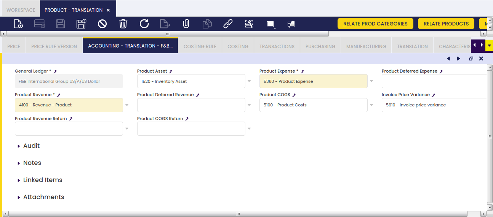

As shown in the screen above, you can configure for each product and general ledger some accounts to be used in the below listed transactions:

- **Product Assets**: this field stores the default account to be used to record inventory transactions such as:
    - Inventory Counts
    - Inventory Movements
    - and Goods Receipt

This account is typically an asset account.

- **Product Expense**: this field stores the default account to be used to record product's purchases:
    - Normally, this account can be configured as an *Expense* account type in case of not managing *Perpetual Inventory*.  
    In that case, the expense is accounted at the time the goods are purchased at the purchase price.  
    The revenue is accounted at the time the goods are sold at the sales price.  
    Not managing *Perpetual Inventory* implies the need of manually adjusting the inventory value at the end of the year.  
    That inventory adjustment implies calculating the difference between the *Final Inventory Value* and the *Initial Inventory Value*.
    - However, this account can also be configured as an *Asset* account in case of *Perpetual Inventory* management.  
    In that case, the expense needs to be accounted when the product is sold to the customer as *Cost of the Goods Sold* at the product cost.  
    In Etendo, the revenue is accounted at the time the goods are sold at the sales price and the cost of the goods sold is accounted at the time of shipping the goods at the product cost.  
    Managing *Perpetual Inventory* does not imply the need of adjusting the inventory value at the end of the year.
- **Product Deferred Expense**: this field stores the default account to be used to record deferred expenses.  
    This account is typically an asset account.
- **Product Revenue**: this field stores the default account to be used to record product sales revenues.  
    This account is typically a revenue account.
- **Product Deferred Revenue**: this field stores the default account to be used to record deferred revenues.  
    This account is typically a liability account.
- **Product COGS**: this field stores the default account to be used to record the cost of the goods sold.  
    This account is typically an expense account.
- **Product Revenue Return**: this field stores the default account to be used to record sales returns.  
    This account is typically a revenue account.
- **Product COGS Return**: this field stores the default account to be used to record the cost of goods sold on sales returns.  
    This account is typically an expense account.
- **Invoice Price Variance**: this field stores the default account to be used to record price differences between posted Goods Receipts and booked Purchase Invoices.  
    This account is typically an asset account.

At first, these accounts are inherited from the Defaults accounts of the organization's general ledger configuration for which the product is being created. The end-user can always change them.

!!! info
    Besides, it is important to remark that it is possible to configure the creation of new correlative accounts for the products as described in the **General Ledgers** tab of the **Organization** window.

### Bill of Materials

This tab allows editing the bill of materials components the selected product consists of.

Bill of Materials apply to products flagged as **Bill of Materials**.

This tab provides information of the list of products contained and its quantity for the Bill of Materials production.

If the product Tax_Category is flagged as **As per BOM**, this tab also provides information for the price of each product in the Bill of Materials list. The price and quantity in this list is used to perform the division of the base amount to calculate the taxes based on the taxes configured for each product of the list.

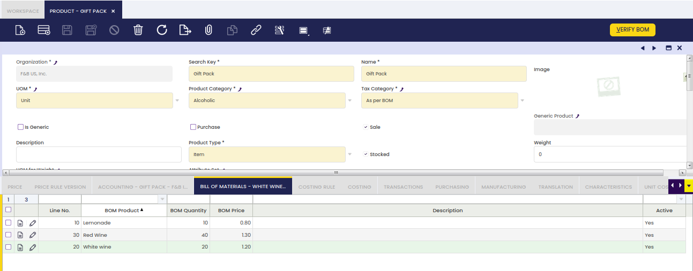

After adding all components, click the **Verify BOM** button on the product record. This validates the BOM structure — confirming that all required components and quantities are correctly entered — and marks the product as ready for use in [Bill of Materials Production](../../warehouse-management/transactions/bill-of-materials-production.md).

### Costing Rule

Costing rule tab allows the user to review the costing rules that apply to the product within a given date range.

Costing Rules apply to products set as *Item* type flagged as **Stocked**.

This tab provides information about the validated costing rule(s) which applies on a given date range to the product, as well as the Costing Algorithm defined for that rule.

Costing rules can be created and validated in the **Costing Rules** window related to the corresponding legal entity / organization.

Currency used by the costing rule is the currency set for the organization.

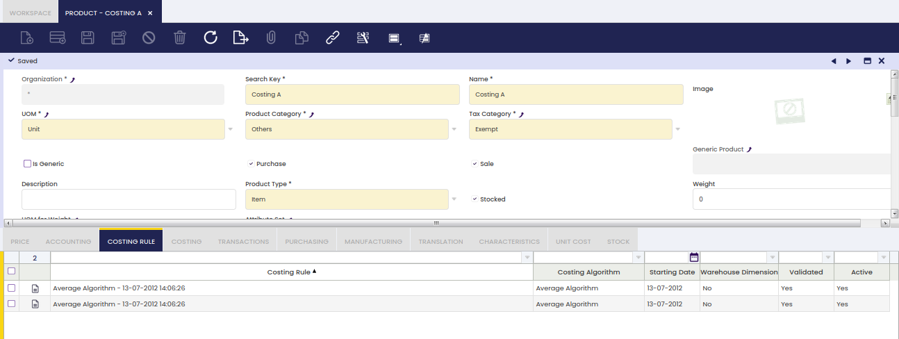

### Costing

The Costing tab shows the cost history of the product and allows entering an initial cost when a product is first added to the system. This section is typically managed by the accounting team. If you need to adjust a product's cost, contact your system administrator or accountant.

Costing tab collects and summarizes product cost related information as a result of every product transaction. Product's costs are valid during a fixed date range and can be calculated either by using an Average or a Standard costing algorithm.

One of the first things to do while creating or importing a product into Etendo is to inform Etendo about:

1.  the initial **Cost** of the products, if any, by entering it in this tab.  
    Keep reading to learn how to do it.
2.  and the initial **Stock** of the products, if any, by creating and booking a Physical Inventory.

Overall, this tab allows to:

- **define the Cost** of stockable products, that cost can either be a standard cost or an average cost.
- **define the Cost** of non stockable products, that needs to be a standard cost.

In the same way, either a *Standard* or an *Average* Costing Rule needs also to be defined for the Organization as the way to calculate the cost of the products' transactions within that organization.

- **review the average cost** calculated by the Costing Server when using an *Average* Costing Algorithm.

Note that when using a *Standard* costing algorithm the cost of every product transaction is the *default standard cost* entered in this tab.  
!!! info
    The *default standard cost* can be used by the Default Cost method whenever it is not possible to get the price of a transaction for which its cost needs to be calculated.

Average algorithms override the behavior of the *Default Cost* method prioritizing the use of the current *Average Cost* if any.

- and finally to have a view of all the input transactions of the product which have impacted on product cost calculation.
    - Input transactions such as vendor receipts are the ones which impact on product cost calculation, therefore the *Inventory Transaction* field clearly reflects those one by one.
    - Similarly, a *permanent* manual cost adjustment executed in an output transaction, such as a *Goods Movement From* (M-) impacts on product cost calculation, therefore the *Inventory Transaction* field clearly reflects these type of output transactions.
    - The very last transaction informs about:
    - the last cost, valid until a given ending date
    - and the total amount of units of that product which are valued at that cost.

Costs calculated by older versions of the costing engine (before the current costing module was installed) are also shown here as read-only historical records.

It is possible to recognize them by their cost type:

- **Legacy Average**
- and **Legacy Standard**.

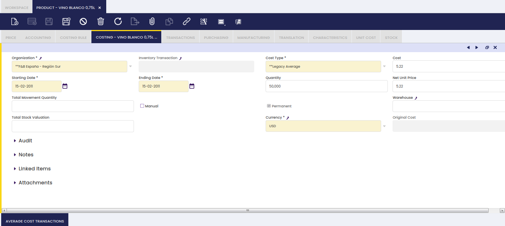

The way to define the **Cost** of a product implies to enter below detailed information:

- The **Organization** for which the calculated costs apply to. Note that the organization needs to be a *Legal Entity*type organization.
- The **Cost Type**. There are two cost types available _Standard_ and _Average_.
- The **Cost** of the product, that cost can either be the standard unit cost of the product or the average unit cost of the product.
- An **Starting Date** when the initial product cost entered is valid from.
- An **Ending Date**, when the initial product cost entered is valid until, i.e. 31-12-9999.  
    That is the same as saying that the cost entered is valid until a new movement of that product is dated on a given date prior to 31-12-9999. Obviously that new input movement will change the product cost.

Besides:

- the **Manual flag**, allows the user to differentiate the cost transactions you have manually entered from the ones automatically created by Etendo.
    - manual ones created by you while entering default product cost information should be checked as Manual.
    - automatic ones related to Material Transactions bookings will not be checked as Manual.
- the **Permanent flag** blocks the ability to delete the cost manually. All costs should be set as Permanent.
- the **Warehouse** allows having a different cost by warehouse when desired and whenever the Costing Rule defined allows to do that.

!!! warning
    Note that you should not fill this field if the Costing Rule does not have the **Warehouse Dimension** field checked.

#### Manual Cost Adjustment

Additionally, the cost of a transaction can be modified by clicking the Manual Cost Adjustment process button. After clicking this button, a new popup is opened:

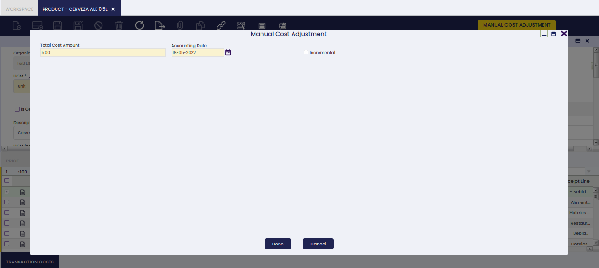

This pop-up allows entering below detailed data:

- **Total Cost Amount**: that is the new total cost of the product transaction
- **Accounting Date**: that is the date when this manual change which will imply a cost adjustment is going to be post to the ledger
- **Incremental**:
    - if not checked, the amount entered in the total cost amount field is the new Total Cost of the transaction which, besides that, will be set as a *Permanent* cost which cannot be adjusted anymore.
    - if checked, the amount entered in the total cost amount field is going to be added to the current total cost, besides *Unit Cost* checkbox is shown.
- **Unit Cost**: This checkbox is shown only if *Incremental* checkbox is selected.
    - if not checked, the incremental amount entered in the field total cost amount is not going to be considered part of the transaction unit cost but total cost. This is like entering an *extra* cost such as *Landed Cost*, which does not change the unit cost of that transaction but the total cost.
    - if checked, the incremental amount entered in the field total cost amount is going to be considered part of the unit cost of the transaction.

For more information about cost adjustments and which ones affect unit cost, contact your accounting team or system administrator.

Once done, a *manual cost correction* cost adjustment will be created.

This cost adjustment can be reviewed and posted to the ledger in the **Cost Adjustment** window.

In the same way, this cost adjustment can also be reviewed in the **Transaction Cost** tab.

### Transactions

Transaction tab is a summarized view of all the transactions of a product.

There is not a way for the user to directly create new product transactions in the transactions tab.

Product transactions of any type are automatically saved and listed in this tab as they are booked in Etendo.

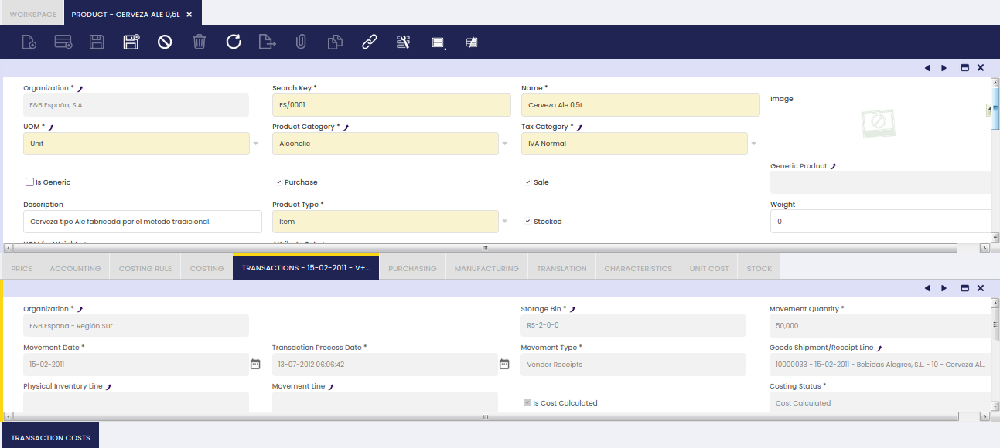

As shown in the image above, Etendo saves and informs us about below relevant data for each product transaction type:

- **Storage Bin** where the product has been stored in or taken from
- **Movement Quantity**, as the number of product units moved internally or either in or out
- **Movement Date**, as the date of the product transaction
- **Movement Type**, such as:
    - **Customer Shipment**, this type can have:
    - a negative movement quantity whenever a product is shipped to a customer in a Goods Shipment document.
    - a positive movement quantity whenever a product is returned from a customer in a Return Material Receipt.
    - Internal Consumption, as the units consumed in internal activities such as projects, reparations. This type can be:
    - **Positive** if the units of the product reduce stock from the warehouse
    - or **Negative** if an internal consumption transaction is canceled, this works like when a shipment is canceled.
    - Inventory In, this one relates to a Physical Inventory Count higher than the Stock booked for a product in Etendo.
    - Inventory Out, this one relates to a Physical Inventory Count lower than the Stock booked for a product in Etendo.
    - Movement From, this one relates to Goods Movements from a Warehouse & Storage Bin
    - Movement To, this one relates to Goods Movements to a Warehouse & Storage Bin
    - Production, as the units of a product included in a work effort. This type can be:
    - **Positive**, for P+ when products are added to the warehouse
    - or **Negative**, for P- when products are consumed
    - **Vendor Receipts**, this type can have:
    - a positive movement quantity whenever a product is received from a vendor in a Goods Receipt document.
    - a negative movement quantity whenever a product is returned to a vendor in a Return to Vendor Shipment.

Etendo also informs us about the specific:

- **Goods Receipt/Shipment Line**
- **Physical Inventory Line**
- **Movement Line**
- **Production Line**
- or **Project Issue**

information of the product transaction, as applicable.

It is also possible to review:

1\. The **Costing Status** of a transaction.

Costing status of a transaction can be any of the ones listed below and has a lot to do with the **Costing Background Process**:

- **Not Calculated**. This status means that the **Costing Background Process** has not taken the transaction yet to calculate its cost.
- **Cost Calculated**. This status means that the **Costing Background Process** has already taken the transaction and its cost has been calculated.
- **Pending**. This status has been implemented to get that the **Costing Background Process** does not throw an error whenever it is not possible to calculate the cost of a transaction.  
    This status is not used by the Costing Algorithms currently implemented in Etendo but can be used by other costing algorithms such as FIFO for those cases where a product output transaction is booked without booking its corresponding product input transaction.
- **Skip**. This status has been implemented to make the **Costing Background Process** not taking into account the transactions set as *Skip* while calculating costs.  
    This status is not used by the Costing Algorithms currently implemented in Etendo but could be used by other costing algorithms.

2\. and whether the cost of a transaction has been calculated or not.

As soon as a product transaction gets its cost calculated by the **Costing Background Process** the field **Is Cost Calculated** gets the value *Yes*.

Once the cost of a transaction is calculated you can also view the:

- **Trx Original Cost**, that is the original cost of the transaction
- **Total Cost**, that is the sum of the original cost of the transaction and all adjustment costs of any type.
- **Unit Cost**, that is the sum of the original cost and all the *unit cost* type adjustments.
- **Currency** used for the calculations.

Additionally, **Is Cost Permanent** field informs whether the cost of a transaction is permanent or not. In case it is permanent, it will not be changed anymore.

Finally, it is important to remark that in the case of *Average* cost algorithm, the *average* cost of a product is calculated as *Moving Average*.

The average cost of a product is calculated based on the product's transaction flow, therefore it is the sum or subtraction of the *Total Cost* of the transactions listed for the product, divided by the sum of the *Total Movement Quantity* of the transactions.

For instance the average cost of a product which transactions are listed below is equal to 23.33 = (2000.00-1000.00+2500.00)/(100-50+100):

- goods receipt for Movement Qty 100 for a Total cost of 2000
- goods shipment for Movement Qty -50 for a Total cost of 1000
- goods receipt for Movement Qty 100 for a Total cost of 2500

#### Transaction Costs

Transaction Costs records are automatically created by the **Costing Background Process** and then listed for the product in this tab.

As soon as a product transaction gets its cost calculated, a new record is created in this tab.

As soon as a product transaction gets its cost adjusted, a new record is created in this tab referring to a **Cost Adjustment Line**.

Some relevant fields to note are:

- **Cost Date**: that is the date when the cost has been calculated (i.e. accounting date of a goods receipt)
- **Cost**: that is the total cost calculated by the costing background process
- **Currency**: that is the currency used to calculate the cost.  
    Currency cost is legal entity currency, therefore product transaction having a different currency (price list in USD currency for instance) gets its cost calculated in the legacy currency (i.e. EUR)
- **Cost Adjustment Line**: if a calculated cost comes from a cost adjustment, this field populates the cost adjustment line that causes that cost.  
    At the end, the total cost of a product transaction is the sum of all the costs listed in this tab, original and adjusted ones which could be part of the unit cost or not (i.e landed costs).
- **Unit Cost**: this field details whether the calculated cost is part of the unit cost of the product or not.
- **Accounting Date**: that is the accounting date when the cost has been calculated and post to the ledger (i.e. accounting date of a goods receipt post to the ledger)

### Purchasing

The Purchasing tab stores vendor and planning data for products managed through the Purchasing Plan. Fill in this tab when you want Etendo to automatically suggest or create Purchase Orders for this product.

Also, the Requisition process uses the Business Partner information for the automatic creation of Purchase Orders.

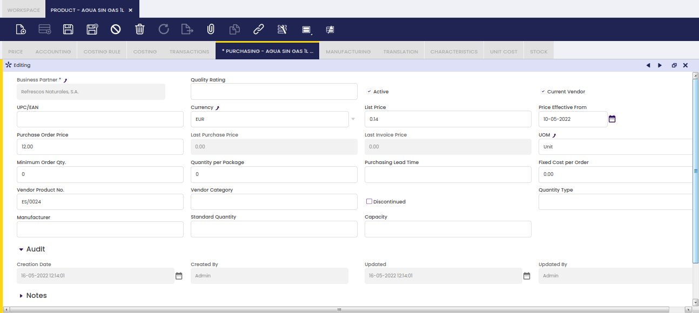

- **Business Partner**, the vendor that will appear on the Purchase Order when created automatically from the Requisition or from the Purchasing Plan.
- **Quality Rating**: quality rating of the vendor. Information only field that is not used by the MRP process.
- **Current Vendor**: indication of the default vendor that will be taken into account by the MRP process.
- **UPC/EAN**: Universal Product Code/European Article Number (barcode) of the product as used by the selected vendor. Information only, this information does not appear on a created Purchase Order.
- **Currency**: currency of the purchase order.
- **Net List Price**: information only field of the Net List Price that has to be updated manually on the automatically created Purchase Order from the Purchasing Plan.
- **Price Effective From**: the date that the entered prices became valid. Information only, not used by the MRP process.
- **Purchase Order Price**: information only field of the Net Unit Price that has to be updated manually on the automatically created Purchase Order from the Purchasing Plan.
- **Last Purchase Order Price**: the Net Unit Price on the most recently added Purchase Order.
- **Last Invoice Price**: the Net Unit Price on the most recently added Purchase Invoice.
- **UOM**: the unit of measure of the product.
- **Minimum Order Qty.**: a minimum order quantity for the vendor. In the Purchasing plan, the quantity for suggested purchase orders is this value or above.
- **Quantity per Package**: information only for the packaging of the product. This information is not taken into account for the creation of the information in the Purchasing Plan nor for the creation of Purchase Orders.
- **Purchasing Lead Time**: time in calendar days between when the product is ordered from the vendor and when it is received in stock. In the Purchasing Plan, this information is used to calculate when purchase orders should be placed, resulting in the Planned Order Date for the suggested purchase order.
- **Fixed Cost per Order**: information only field of a fixed amount that has to be added manually to the automatically created Purchase Order from the Purchasing Plan.
- **Vendor Product No.**: the vendor reference for the product
- **Vendor Category**: information-only field to add vendor category information.
- **Discontinued**: information-only field to indicate that this product is no longer used. The Purchasing Plan does not take this set up into account when generating the plan and when creating Purchase Orders. When selected, the field Discontinued by date to indicate when the product is discontinued. For information-only purposes.
- **Quantity Type**:
    - **Exact**: each suggested purchase order is for the exact required quantity. For example, if the demand is for 85 units, the quantity for the suggested purchase order is 85 units.
    - **Multiple**: the quantity that appears as the quantity for the suggested purchase order is a multiple of the standard quantity (as defined on this screen). For example, if the standard quantity is 20 units and the demand is for 85 units, the quantity for the suggested purchase order is 100.
- **Manufacturer**: information-only field to indicate the manufacturer of the product.
- **Standard Quantity**: quantity that is taken into account in combination with the Quantity Type for the quantity value for the suggested purchase order.
- **Capacity**: quantity per day the vendor is able to supply. Based on this field and the lead time, the purchase order date is calculated. The number of days is calculated as the max value of the lead time and the required quantity / capacity.

### Manufacturing

Manufacturing tab is used for products that are planned by the manufacturing plan.

The information in this tab is mainly used by MRP to process the Manufacturing Plan and Purchasing Plan. The storage bin field is filled out for products in production to indicate the default storage bin the product will be stored in when coming out of production.

- **Storage Bin**: default location in the warehouse of the product.
- **Planning Method**: definition of the elements of supply and demands that are taken into account and with which percentage for the creation of the Manufacturing Plan and Purchasing Plan. For more details, see the  [Planning Method](../../material-requirement-planning/setup.md#planning-method) section.
- **Planner**: the person responsible for the execution of the MRP plan of the product. For more details, see the [Planner](../../material-requirement-planning/setup.md#planner) section.
- **Capacity**: production capacity per day for the product.
- **Min. Quantity:** minimum quantity to be entered on a work requirement.
- **Quantity Type**:
    - **Exact**: each suggested work requirement is for the standard quantity (as defined on this screen). Multiple suggested work requirements appear for the total demand. For example, if the standard quantity is 20 units and the demand is for 85 units, 5 lines of suggested work requirements with quantity 20 appear.
    - **Multiple**: the quantity that appears as the quantity for the suggested work requirement is a multiple of the standard quantity (as defined on this screen). For example, if the standard quantity is 20 units and the demand is for 85 units, the quantity for the suggested work requirement is 100.
- **Standard Quantity**: quantity that is taken into account in combination with the Quantity Type for the quantity value for the suggested work requirement.
- **Minimum Lead Time**: manufacturing lead time of the product.
- **Safety Stock**: the minimum level of stock that has to always be in the warehouse. For example, if there is a safety stock for 1000 units and stock is 900 units, a work requirement (Manufacturing Plan) or purchase order (Purchasing Plan) is suggested for 100 units. Typically, low cost products or products with a very long lead time are set up with a safety stock level.
- **Max not reserved stock**: Maximum stock without taking into account the pre-reserved stock. This field is only visible when Stock reservation feature is enabled. See the below example to understand how it works:

1.  **Safety Stock** and **Max not reserved stock** are 200 and 1000 units, respectively
2.  There are several sales orders to be delivered by 3000 units in total
3.  These sales orders will generate the corresponding purchase orders (pre-reserved) when launching the MRP
4.  There are currently in stock 80 units
5.  When MRP is launched it will create the corresponding pre-reserved and because being after below safety stock it will create another purchase order:
    1.  As the **Max not reserved stock** is defined, the system will create a purchase order of 920 units (1000-80)
    2.  If this parameter was not defined, it would work as usual and it would create a purchase order of 120 units (200-80)

- **ABC Classification**: a ranking (A, B, or C) used in warehouse management to categorize products by their combined stock level and cost value. A = high value/priority, C = low value/priority.

### Translation

Product names can be translated to any language.

The way to get that is as simple as:

- select first the language required
- and then enter the product name translated into that language.

### Characteristics

Relation of characteristics assigned to the Product.

Fields:

- **Sequence number**: Order of the characteristics
- **Characteristic**: List all the characteristic defined in the **Product Characteristics** window
- **Variant**: When it is marked, it will explode/create combinations with its values. If it is not marked, it will not create combinations with other characteristics. For example
    - Characteristic Color: Variant marked with value *Blue* and *White*
    - Characteristic Size: Variant marked with value *M* and *L*
    - Characteristic Fashion line: Variant not marked with value *Sport*
    - It will create four variants/products and for all of them with the characteristic *Sport*
- **Explode Configuration Tab**: Flag available on Generic Products and Variant Characteristics. When it is checked, the values of the selected variant characteristic are automatically inserted in the **Characteristic Configuration** tab. If it is not checked, the values must be added manually.
- **Defines Price**: Every value of that characteristic will define the price of the new product. It will overwrite the price defined for the generic product. This price is defined in the **Characteristic Configuration** tab.
- **Price List Type**: It is shown when **Defines Price** is marked. It allows the user to select in which type of price list you want to overwrite the price. For example:
    - The generic product has two price lists: One is for sales and the other for purchase
    - You select *Sales Price List* value. Then when creating the product variants it will only overwrite the price in price lists defined as Sales
    - The opposite if the value selected is *Purchase Price List*
- **Define image**: Every value of that characteristic will define the image of the new product. It will overwrite the image of the generic product. This image is defined in the **Characteristic Configuration** tab.
- **Characteristic Subset**: List all the subsets included for the selected Characteristic (i.e. *Pants*)

Once the record is saved, all the values of the characteristic are populated into the **Characteristic Configuration** tab.

**Characteristic Configuration**

Characteristic Configuration tab contains the available values for each characteristic assigned to the generic product. Price modifiers to create the variants are defined in this tab as well.

Fields to take into account:

- **Characteristic value**: Cannot be editable since it is populated automatically when selecting the characteristic
- **Code**: Code for the value. It inherits what has been defined in product characteristic window
- **Unit Price**: This field is displayed when the characteristic is marked as **Defines Price**. The aim of this field is to have different prices per value. For example, depending on the Sizes.
- **Image**: This field is displayed when the characteristic is marked as **Defines Image**. The aim of this field is to have different images per value. For example, depending on the colour.

### Stock

This Tab shows the available Stock for this Product in the application. It only shows Storage Bins for which the quantity available of the Product is not 0

For each not empty storage bin, it also shows information about the:

- reserved quantity
- and the allocated quantity

### Unit Cost

Unit Cost Tab displays information about the actual *Unitary Cost* (Unit Cost) of the product.

The *Unitary Cost* of a Product is the value of each stocked unit of the product no matter the costing algorithm used to calculate the cost of that product.

This cost is calculated using the *Total Stock* of a product and the *Total Value* of the stock of the product, as per formula below:

- Unit Cost = Total Stock Value / Total Stock

This way, the unitary cost calculated is independent of the *Costing Algorithm* used to calculate the cost of each transaction and product, therefore this unitary cost is compatible with all *Costing Algorithms* (Average, Standard, FIFO, ...)

In this Tab, there is going to be a record for:

- each Organization that is a Legal Entity that has a Costing Rule defined
- or each Organization and Warehouse, whenever Warehouse Dimension is defined as a costing dimension of the current Costing Rule defined for the *Legal Entity*.

### Alternate UOM

!!! info
    To enable this tab, go to `General Setup` > `Application` > `Preferences`, create a new preference with the property **Enable UOM Management** and set its value to Y. If you do not have access, ask your system administrator.

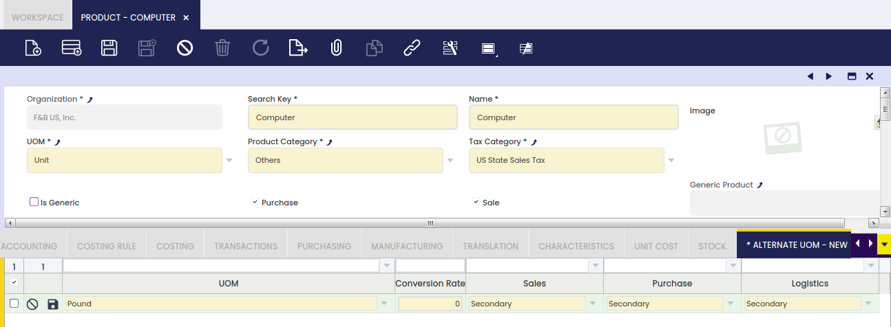

Fields to note:

- **UOM**, that is the alternative unit of measure of the product, for instance *Pallet*. It is important to remark that any unit of measure needs to be created and configured in [Unit of Measure](../product-setup/unit-of-measure.md) window.
- **Conversion Rate**, that is the conversion between product's alternative unit of measure (AUM) to product's unit of measure. For instance, if product's AUM conversion to product's UOM is 50; that means that 1 Pallet represents 50 Units.
- **Gtin**, that is the *Global Trade Item Number* for the product defined in the corresponding AUM
- **Sales**, **Purchase** and **Logistics**, those fields allow defining the use of product's AUM within Sales, Purchase and Inventory flows.  
    Values allowed are:
    
    - **Primary**: Product's AUM defined in this tab is used as default unit of measure in the selected flow (Sales or Purchase), when creating a sales or purchase document such as an order or receipt/shipment.  
    Only one Primary AUM can be defined per Product and flow.  
    For instance, if *Pallet* is the primary AUM defined for a product within Purchase flow, that means that every time that a purchase document is created, *Pallet* will be the default unit of measure shown.
    - **Secondary**: Product's AUM defined in this tab can be selected for the selected flow when creating a Document.  
    For instance, if *Pallet* is the secondary AUM defined for a product within Sales flow, while *Pack* is primary one; that means that every time that a sales document is created, *Pack* will be the default unit of measure shown, but the end-user can change it to *Pallet*.
    - **Not Applicable**: The AUM defined in this tab for the product will not be available for selection when creating Documents for the selected flow.  
    That is the option to select for **Logistics** as the use of alternative units of measure is currently implemented just for sales and purchase. Inventory transactions/documents always refer to the product's unit of measure.

### Stock By Logistic Unit

!!! info
    To be able to include this functionality, the **Stock Logistic Unit** module, part of Warehouse Extensions Bundle, must be installed. To do that, follow the instructions from the marketplace: [_Warehouse Extensions Bundle_](https://marketplace.etendo.cloud/?#/product-details?module=BAE67A5B5BC4496D9B1CA002BBCDC80E){target="_blank"}. For more information about the available versions, core compatibility and new features, visit [Warehouse Extensions - Release notes](../../../../../whats-new/release-notes/etendo-classic/bundles/warehouse-extensions/release-notes.md).

It allows viewing stock by logistics units (referenced inventory) in a clearer and more organized way.

!!! info
    For more information, visit [Stock Logistic Unit](../../../optional-features/bundles/warehouse-extensions/stock-logistic-unit.md#product-stock-by-logistic-unit).

*[AUM]: Alternative Unit of Measure
*[BOM]: Bill of Materials
*[COGS]: Cost of Goods Sold
*[EAN]: European Article Number
*[FIFO]: First In, First Out
*[GTIN]: Global Trade Item Number
*[MRP]: Material Requirements Planning
*[UOM]: Unit of Measure
*[UPC]: Universal Product Code
*[VAT]: Value Added Tax

---

This work is a derivative of [Master Data Management](https://wiki.openbravo.com/wiki/Master_Data_Management){target="\_blank"} by [Openbravo Wiki](http://wiki.openbravo.com/wiki/Welcome_to_Openbravo){target="\_blank"}, used under [CC BY-SA 2.5 ES](https://creativecommons.org/licenses/by-sa/2.5/es/){target="\_blank"}. This work is licensed under [CC BY-SA 2.5](https://creativecommons.org/licenses/by-sa/2.5/){target="\_blank"} by [Etendo](https://etendo.software){target="\_blank"}.
