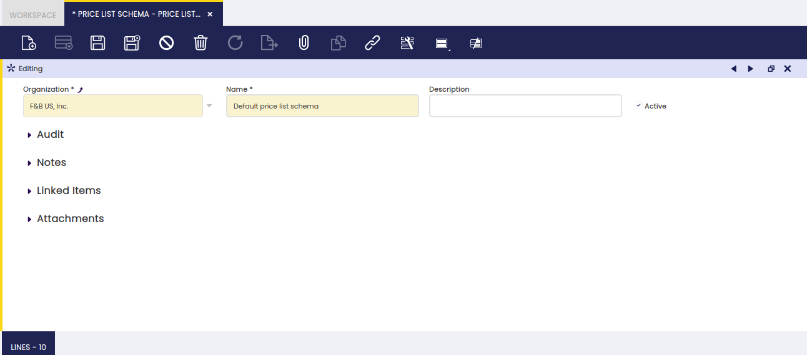
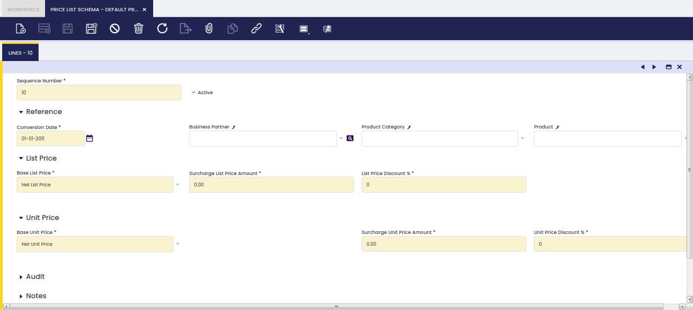
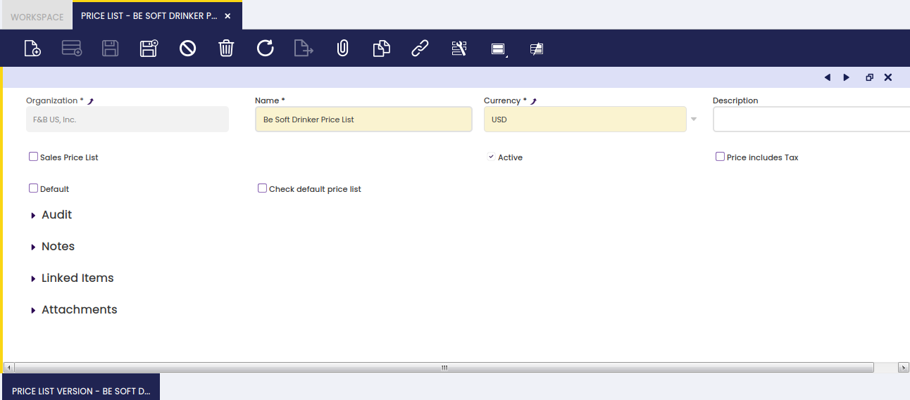
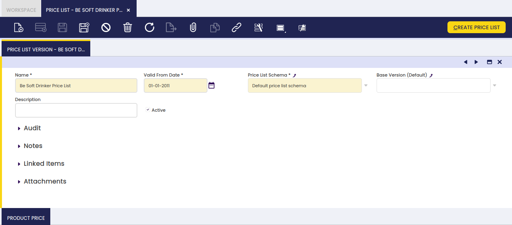
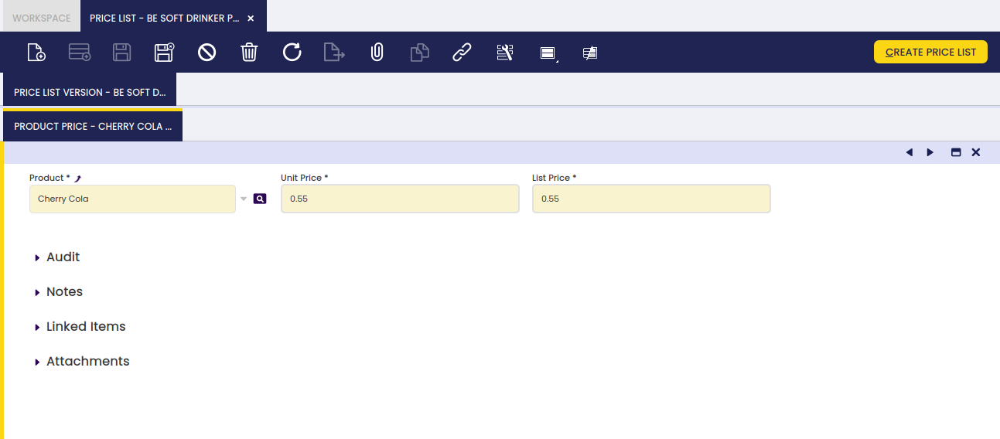
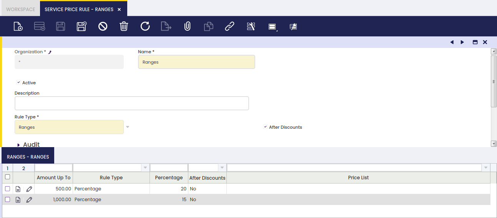

## Price List Schema

:material-menu: `Application` > `Master Data Management` > `Product Setup` > `Price List Schema`

### Overview

A price list schema is a template used to automatically populate a new version of a price list.

Price List management is not an easy task to handle, mainly in competitive markets where the margins are very tight.

Nowadays, organizations have to deal with a huge variety of products, which have different prices depending on the season and other pricing variables.

Etendo manages prices through three pricing related concepts:

- the **Price List**
- the **Price List Schema**
- and the **Price List Version**

And it allows the creation of:

- **General** Sales and/or Purchase Price List
- **Specific** Price Lists for a specific supplier or customer, or a group of them.
- **Based on cost** Price list based on product cost

The way these concepts work in Etendo is described below:

1.  **Creation of Price List/s**:
    1.  A "Default Price List Schema", with no configuration at all, is created by default after creating an organization.
    2.  The "Default Price List Schema" is the schema to be used in the creation of the price lists which are NOT a "Price List Version".
    3.  The Price Lists linked to the "Default Price List Schema" might contain both the net list price and the net unit prices of the products.  
        To learn more, visit Price List.
    4.  The Price list/s created can be linked to the business partners as required.  
        To learn more, visit Business Partner
2.  **Creation of Price List Schema/s**:
    1.  New Price List Schema can be created as a way to configure a set of commercial rules to be applied to existing price lists.  
        To Learn how, keep reading.
3.  **Creation of Price List Version/s**:
    1.  A new version of an existing Price List is created as a combination of a base price list and a given "Price List Schema".  
        To learn more, visit Price List.
    2.  The Price list/s versions created can be linked to the business partners as required.  
        To learn more, visit Business Partner.

### Header

Price list schema window supports the creation of as many price list schemas as required with the aim of obtaining an easy management of price lists and price list versions.

As shown in the image below, the creation of a price list schema is as easy as to create it and give it a Name.

The set of price and discount rules which might apply to a set of product categories or specific products must be configured in the "Lines" tab.

### Lines

Price list schema lines tab allows defining a set of price rules such as to apply a discount % to the net unit price of a given product category or specific product.

First thing to notice is that, as shown in the image above, "Lines" tab is split into two sections:

- the first section allows the user to:
  - Inform Etendo about:
    - the "Business Partner" and/or
    - the "Product Category" and/or
    - the "Product"  
      to which the price/discount rules to be defined in the next section are going to apply.
- the second section allows the user to:
  - configure which price of the existing price list is going to be taken as "Base List Price" in the new price list version. The options available are:
    - **Net List Price** which is the price published in the price list
    - **Net Unit Price** which is the final price used in purchase and sales order/invoice lines
    - **Fixed Price**, as it is possible to configure that for the new price list version, therefore the net list price is equal to a given fixed price.
    - **Cost**, which is the price published in the price list, will be the product cost (costing tab in product window) and a margin.
    - **Fixed Price or Cost Based** combines the previous two options with the following condition:
      - If the fixed price is higher than the cost, then the defined fixed price is selected.
      - If the fixed price is lower than the cost, then the cost (plus the defined margin) is selected.
    - **Fixed Price or Cost plus Margin Based** combines fixed price and cost options with the following condition:
      - If the set fixed List/Unit price is higher than the current cost plus List/unit Price margin, the price list will be created with the fixed price.
      - If the set fixed List/Unit price is lower than the current cost plus List/Unit Price margin, then the price list will be created using the cost plus the margin.
  - configure which price of the existing price list is going to be taken as "Base Unit Price" in the new price list version. The options available are the same as above:
    - **Net List Price**
    - **Net Unit Price**
    - **Fixed Price**, as it is possible to configure that for the new price list version, the net unit price is equal than a given fixed price
    - **Cost**
    - **Fixed Price or Cost based**
    - **Fixed Price or Cost plus Margin Based**
  - configure the discounts if any to apply to the net unit price and/or to the net list price in the fields:
    - **List Price Discount %**
    - **Unit Price Discount %**
  - configure the margin on the product cost to apply to the net unit price and/or to the net list price in the fields:
    - **List Price Margin %**
    - **Unit Price Margin %**

Second thing to notice is that the set of price rules and/or discounts could be configured in a "hierarchical" way, that's line by line or applying the last valid price rule (non-hierarchical way).

!!! info
    The Enable Hierarchical Price List preference is available in order to select the desired behavior applying the price list rules.

Let us imagine that the rules which need to be part of a price list schema are:

- to apply a net unit price discount of 5% to the products which belong to a Product Category X.
- to apply a net unit price discount of a 10% to the products which belong to the Product Category Y.
- to apply a net unit price discount of 15% to the Product X that belongs to Product Category X.

The way this works in Etendo is:

- the price list schema must contain 2 lines one per each discount rule to be applied:
  - First Line will contain information such as:
    - Sequence Number = 10
    - Conversion Rate Type = Spot
    - Product Category = Product Category X
    - Base Net Unit Price = Net Unit Price
    - Net Unit Price Discount = 5.00
  - Second Line will contain information such as:
    - Sequence Number = 20
    - Conversion Rate Type = Spot
    - Product Category = Product Category Y
    - Base Net Unit Price = Net Unit Price
    - Net Unit Price Discount = 10.00
  - Third Line will contain information such as:
    - Sequence Number = 30
    - Conversion Rate Type = Spot
    - Product Category = Product Category X
    - Product = Product X
    - Base Net Unit Price = Net Unit Price
    - Net Unit Price Discount = 15.00

Using hierarchical behavior:

- unit price discount of 5% is applied to the products which belong to a Product Category X.
- unit price discount of 10% is applied to the products which belong to a Product Category Y.
- unit price discount 15% is applied to Product X, in addition to the 5% discount for belonging to Product Category X.

Using non-hierarchical behavior:

- unit price discount of 5% is applied to the products which belong to a Product Category X, except to Product X.
- unit price discount of 10% is applied to the products which belong to a Product Category Y.
- unit price discount of 15% is applied to Product X.

## Price List

:material-menu: `Application` > `Master Data Management` > `Product Setup` > `Price List`

### Overview

A price list is a listing of prices for different products or services.

!!! info
    It is possible to create as many price list and price list versions as required depending on the organization's needs.

The process of creating a price list is slightly different to the process of creating a price list version.

Price List creation:

1.  Price List Name and Type (sales or purchase) is detailed in the Price List window header. It is also mandatory to define whether the price includes taxes or not.
2.  There exists the possibility of Price list based on cost, for this, the price list should be a sales price list.
3.  The Default Price List Schema with no configuration at all, as well as the valid from date information, must be detailed in the Price List Version tab
4.  The Unit / List price of each product which must be included in the price list is detailed in the Product Price sub-tab.
5.  The price list is ready and can be linked to the business partners as required and used.

Price List version creation:

1.  Price List Name and Type (sales or purchase) is detailed in the Price List window header.
2.  A Price List Schema which contains the new commercial rules to apply, the valid from date and the Base Price List for which the price list version is created and must be detailed in the Price List Version tab.
3.  The process Create Price list populates the "Product Price" tab by including:
    1.  every product contained in the original price list
    2.  each product will have a new unit and/or list price, depending on what was configured in the price list schema used.
4.  The price list version is ready and can be linked to the business partners as required and therefore used.
5.  Documents will automatically default the most recent version of a price list.
6.  There is no end date on price list versions, but old versions can be deactivated.

### Price List

Price List window allows creating purchase and sales price lists to be assigned to the business partners for its use in purchase and sales transactions such as orders and invoices.

As shown in the image above, a price list or a price list version can be created by just entering below relevant information:

- By selecting the field "**Sales Price List**" it will be for sales transactions, otherwise it will be a purchase price list.
- **Default** field allows defining a given price list as the default one to be used in case a business partner does not have a specific price list assigned.
- **Price list based on cost**, this field is shown if the price list is a Sales Price List. This option allows creating a price list based on the cost price plus a margin.
  - the cost price is the one defined in the Costing tab of the product window.
  - the margin is defined in the Price List Schema window.
  - when the price list is a price list based on cost, the price list schema should be configured with cost and a margin.
- **Price includes taxes**. This flag is very important and depending on this the behavior of sales and procurement flows will be affected.
  - If it is marked, then the price defined is the gross unit price
  - If it is not marked, then the price defined is the net unit price

**How does this affect the flows?**

- When the price list includes taxes, the _gross unit price_ and _line gross amount_ are filled and the _net unit price_ is calculated based on the _gross unit price_ and the corresponding tax rate. What cannot be changed is the gross and, due to this, there might be some rounding issues that the system automatically handles adding or subtracting these differences in the tax amount.

As an example : If price inclusive of tax is originally 135.50 and rate is 4.5 % then the rounded price before tax would be 129.67

The order line would stay:

Quantity: 1 Net Unit Price: 129.67 Line Net Amount: 129.67 Gross Unit Price: 135.50 Line Gross Amount: 135.50

But the total gross amount (calculated by the system) would be 135.51 (tax base amount:129.67 + tax amount:5.84) and what it has to be clear is that the final result must be 135.50 (The customer bought 1 unit whose price is 135.50). This difference is going to be solved adjusting taxes:

The system will adjust the difference by summing or subtracting this difference with the tax that has the highest amount. So, in this example, instead of having a tax line where the amount is €5.84, the amount will be €5.83 (5.84-0.01)

Finally, the total gross amount for the sales order would be 135.50 (129.67+5.83) which is the desired amount.

Due to this (Net amount vs Gross amount), when using prices that include taxes, it is recommended to work with greater precision (price precision) to avoid rounding differences.

- When the price list does not include taxes, the _gross unit price_ and _line gross amount_ fields are not displayed and both fields are not calculated at all in the line of the document. The final gross amount of the document will be the result of the sum of the lines net amounts plus the tax amounts.
- The price list is defined at document level (header) so there cannot be lines where the price includes taxes and others where not. This is clear for orders, but for invoices where orders can be grouped in one just invoice the rule is also applied. One invoice cannot have orders where the price list includes taxes and orders where the price list does not include taxes.

### Price List Version

There could be as many versions of an existing price list as required, versions which can be valid for a given time period and which can be defined according to certain commercial rules.

As shown in the image above, there are two types of "Price List Versions":

- generic and original ones linked to the "Default Price List Schema"
- further price list versions (not based on the cost) which requires both:
  - a Price List Schema
  - and a Base Price List version
- price list versions based on cost require a Price List Schema with Cost configuration in Base list price and Base unit price.

The process button named "Create Price List" must be used only in the case of creating further price list versions as it requires a Base Price List if the price list is not based on cost. If the price list is based on cost, it is mandatory to select the price list schema and optionally the base version.

- if Base version is blank, the application calculates the unit price and list price for all the products (excluding discounts products) plus the margin defined.
- if Base version value is selected, the application calculates the unit price and list price for all the products defined in the base price list as cost plus margin.

### Product Price

Product Price tab allows the user to either add or edit products and their prices for a selected price list.

In other words:

- Add products in the case of creating a price list
- Edit products in the case of modifying a price list version:
  - as the required products at their new prices are automatically populated by Etendo in this tab while running the process "Create Price List".

Overall, this tab includes two main fields:

- 'the _List Price'_ field, as the price used as a reference in a given price list or price list version. This price can be the result of a discount or any other commercial rule applied by a Price List Schema.
- and the **Unit Price** field, as the final price used in documents such as orders and invoices. This price can be the result of a discount or any other commercial rule applied by a Price List Schema.

## Create All Price Lists

:material-menu: `Application` > `Master Data Management` > `Product Setup` > `Create All Price Lists`

### Overview

On daily sales, especially on retail and distribution, price lists are very important. Therefore, Etendo includes plenty of information to manage and update price list versions per business partner.

This functionality includes different price lists, price list versions per each price list and price list schemes. Have a look at these concepts to better understand Create all Price Lists functionality.

Etendo allows hierarchical price list structure and this hierarchy is based on price list schemes.

#### Functionality

Follow this example about what _Create all Price Lists_ is used for:

Example 1:

Imagine you own a bakery and you sell different bread types to different customers. You may have French bread, rolls, bagels, etc. And for each type you may have different sizes small, medium and extra.

You use a main price list (with a price list version) containing a price per bread when they are medium size. Based on this price list we build 2 other price lists applying a price list schema. For small bread, 5% off and for extra breads 4% more. This way, you will be able to manage price updates easily. Suppose flour price rises 10%, and you want to increase all prices for all breads. You could follow this steps:

- Create a new price list schema increasing the price 10%.
- Create a new version for the main price list, based on the new price list schema.
- Regenerate all price lists based on the main price list automatically. For this third step, you may use the Create All Price Lists feature.

#### Process

The Create All Price Lists generates all price lists pending from the selected price list. The process checks for all child price lists, and applying the defined price list schema, it generates a new version for each price list.

## Discounts and Promotions

:material-menu: `Application` > `Master Data Management` > `Product Setup` > `Discounts and Promotions`

### Overview

Discounts and Promotions is a mechanism that allows the user to adjust prices based on different rules. External modules can extend this definition by providing additional rules (Discount Types) implementations.

Discounts and Promotions, formerly Price Adjustments, defines rules to be applied to invoice and order lines to adjust prices.

This feature requires to set as "Active":

- the "Read-Only" Tab "Discounts and Promotions" is found in below listed windows:
  - Purchase Order
  - Sales Order
  - Purchase Invoice
  - Sales Invoice
  - and Sales Quotation

#### How Promotions are applied

Rules are applied to order or invoice lines based on the filters in that rule, for example to a specific Business Partner Category acquiring a concrete set of products during a fixed period of time.

When the line is saved, the actual price shown in it does not take into account promotions. Promotions are calculated when the invoice/order is processed or by clicking the _Calculate Promotions_ button.

!!! info
    _Promotions and Discounts_ can be extended to implement complex rules that attend not to a single line but to all lines in the invoice, being impossible for those to be calculated in advance. 

Etendo manages prices in 3 chunks:

- Price List: it is the base price defined as Product Price. It is the base price reference.
- Price Standard: it is the first discount applied to the price. It can come directly from the Price List, or can be manually edited while entering the line.
- Actual price: it is the real price that will be used in the document. Promotions are applied to the Price Standard to obtain this one.

Multiple promotions can be chained in cascade, in this case the one applied in 2nd position will use as base the actual price obtained after applying the first one. An alternative mechanism to apply promotions in _WebPOS_ is implemented by the Promotions Best Deal Case module.

#### How Promotions are defined

The main fields to take into account when defining a promotion are:

- _Name_ and _Printed Name_: is the way to identify the promotion. _Printed Name_ is used to display the rule to the final user, whereas name is intended for internal usage, although in case _Printed Name_ is empty, _Name_ is used instead.
- _Filter Options_ section: filter options configure in which cases it can be applied.
  - _Starting_ and _Ending_ dates: The period of time the promotion is valid.
  - _Priority_: As explained in the previous section, multiple promotions can be applied in cascade. _Priority_ field defines which is the order these promotions are applied in. When more than one promotion can be applied to a single line, these promotions are sorted by ascending priority, this is, the promotion with priority 1 will be applied before the one with priority 2.

!!! info
    Note it is very important to set priority in case of defining rules that can be applied in cascade.

- _Apply Next_: It allows stopping the promotion cascade chain. When it is flagged, in case   there is another promotion that is applicable, after applying the current promotion, it will be applied. If it is not flagged, this rule will be the last in the chain.
- _Included method_: There are 6 drop down fields to define how _Business Partner Categories_, _Business Partners_, _Product Categories_, _Products_, _Price Lists_ and _Organizations_ are filtered. The actual values for the filters are added in the subtabs with the same names, these fields only define the strategy to filter each of them, values here can be:
  - _All excluding defined_ (default value). It removes from the filter the items selected. For example if we set it to products and add product A, the promotion will apply to any product but A. Note this is the default value for all filters, in case it is left as it is for all of them, and no filter option is added in any sub tab, the promotion will be always applicable.
  - _Only those defined_: Restricts the filter to just the items that are included in the correspondent sub tab.
- _Definition_ section: Fields shown in this section vary depending on the selected promotion type. Here it is typically defined how much to discount and additional conditions to be met to apply the rule.

#### Price Adjustment

_Price Adjustment_ is the promotion type included by default, it behaves almost in the same way _Price Adjustments_ did before they were extended to _Promotions and Discounts_.

As opposed to the rest of Promotions and Discounts, in order to maintain backwards compatibility, prices with adjustments are calculated while the order/invoice line is being edited. So the final price is shown there even before processing it. Promotions and Discounts lines are not created until the document is processed.

!!! warning
    Due to this different behavior between Price Adjustments and the rest of Discounts and Promotions, it is advisable not to use both of them together, so in case Price Adjustments are defined and applied, do not define other types to be applied to the same products.

To define a promotion of _Price Adjustment_ type, follow the indications in the section above for filtering. In the _Definition_ section these are the fields to be taken into account:

- _Discount Amount_: It is a fixed amount discounted to the price.
- _Discount %_: Percentage discounted to the price. In case _Discount Amount_ field is not 0, percentage is applied to the price obtained after subtracting _Discount Amount_ value.
- _Fixed Unit Price_: Sets the price per unit. If this field is set, the two mentioned above are not used.
- _Min_ and _Max_ quantities: Specifies which is the quantity range to apply the rule, values here are included and any (or both) of them can be empty. For example, a promotion with _Min Quantity_ 5 to product A (which UOM is unit) would apply whenever there is a line with 5 or more units of product A.

### Discounts and Promotions

Defines the Discounts and Promotions main characteristics such as Discount Type, how it is filtered and actual discount information based on type.

### Translation

Maintains translations of Discounts and Promotions to different languages.

### Business Partner Category

The user can add business partner categories in order to include or exclude them from a selected Promotion/Discount.

### Business Partner

The user can add business partners in order to include or exclude them from a selected Promotion/Discount.

### Business Partner Set

The user can define business partner sets for the discount.

### Product Category

The user can add product categories in order to include or exclude them from a selected Promotion/Discount.

### Products

The user can add products in order to include or exclude them from a selected Promotion/Discount..

### Price List

The user can add price lists in order to include or exclude them from a selected Promotion/Discount.

### Organization

The user can add organizations in order to include or exclude them from a selected Promotion/Discount.

## Service Price Rule

:material-menu: `Application` > `Master Data Management` > `Product Setup` > `Service Price Rule`

### Overview

In this window Price Rules assigned to Price Rule Based services will be configured. Instead of having a fixed price, there will be rules that will determine the price of the Service.

### Service Price Rule

Configuration fields:

- **Name**: Name of the Service Price Rule.
- **Description**: Description of the Service Price Rule.
- **Rule Type**: There are two values to select in the dropdown
  - Percentage: If selected, a Percentage field will be displayed allowing to set a Percentage. To determine the price of the service, this amount will be applied to the amount of the lines related to the service.
    - **Percentage**: Percentage to be applied.
    - **After Discounts**: If selected, the percentage will be applied after adding the discounts to the ticket.
  - **Ranges**: If selected, a new tab Ranges will be displayed allowing to create different Ranges based on the amount of the related lines.

### Ranges

In this tab, different Ranges can be created based on the amount of the related order lines. Configuration fields:

- **Amount Up To**: If the summed amount of related order lines is equal or less than this amount, the configuration of this range will be taken into account.
- **Rule Type**: There are two values to select in the dropdown
  - Percentage: If selected, a Percentage field will be displayed allowing to set a Percentage. To determine the price of the service, this amount will be applied to the amount of the lines related to the service.
    - **Percentage**: Percentage to be applied.
    - **After Discounts**: If selected, the percentage will be applied after adding the discounts to the ticket.
  - **Fixed Price**: If selected, a field ‘Price List’ will be displayed.
    - **Price List**: Price List from which the price of the service will be obtained.