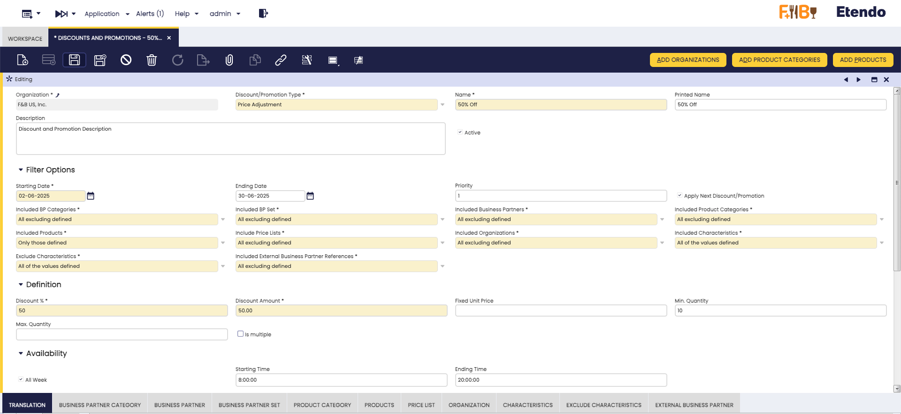
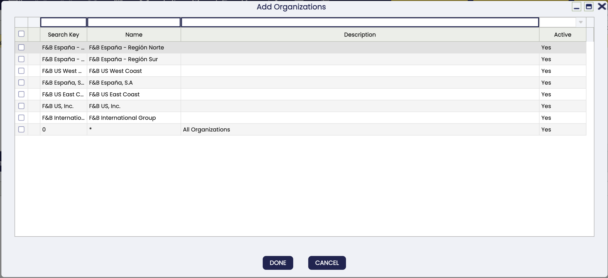
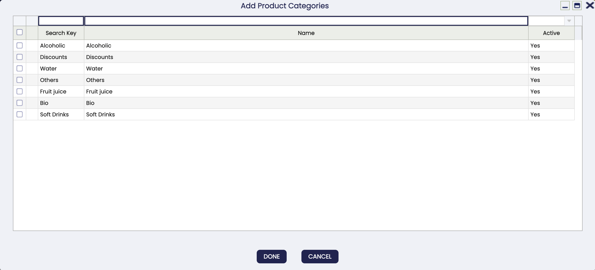
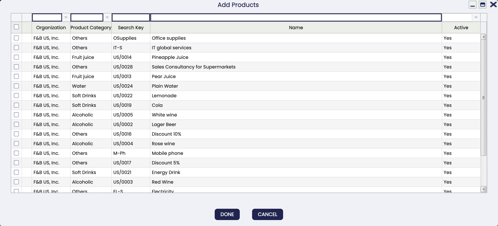

## Discounts and Promotions Window

:material-menu: `Application` > `Master Data Management` > `Picing` > `Discounts and Promotions`

### Overview

Discounts and Promotions is a flexible feature that allows you to automatically adjust prices on order and invoice lines according to configurable business rules. You can define when and how promotions apply using filters (such as Business Partners, Products, Price Lists, and Characteristics), configure the type of discount (percentage, fixed amount, or fixed price), and control promotion availability by day and time. Multiple promotions can be applied in a prioritized cascade. The configuration also supports translating promotion names and tracking applied discounts on processed documents through an optional read-only tab.

### Header
Defines the core settings and conditions for applying Discounts and Promotions to orders and invoices.

Fields to note:

#### Main Section

- **Organization**: Organization to which the discount or promotion will be available.
- **Discount/Promotion Type**: Defines the type of rule used to adjust prices. By default, Etendo includes the _Price Adjustment_ type, but it is possible to extend and add custom types according to the organization's needs.
- **Name**: Internal identifier for the promotion.
- **Printed Name**: Label shown to end-users and in reports. Defaults to Name if empty.
- **Description**: Optional short text describing the promotion (up to 255 characters).
- **Active**: Enables the promotion for use. Inactive records are retained for auditing/reporting.

#### Filter Options 

- **Starting Date**: Date when the promotion becomes valid.
- **Ending Date**: Date until the promotion remains valid (inclusive).
- **Priority**: Order of application when multiple promotions apply. Lower number = higher priority.
- **Apply Next Discount/Promotion**: If checked, subsequent applicable promotions will also be applied.
- **Filters**:

    Each of the following fields supports two filtering methods that define how the related records configured in the tabs will be treated during promotion evaluation.These options provide flexibility for defining the scope of a promotion in relation to Business Partners, Products, Price Lists, and Organizations.

    - **Included BP Categories**
    - **Included BP Set**
    - **Included Business Partners**
    - **Included Product Categories**
    - **Included Products**
    - **Include Price Lists**
    - **Included Organizations**
    - **Included External Business Partner References**

        | Method                    | Description                                                                                          |
        |---------------------------|------------------------------------------------------------------------------------------------------|
        | **All excluding defined** | **(Default)** The promotion applies to all records **except** those listed in the corresponding tab. |
        | **Only those defined**    | The promotion applies **only** to the records listed in the corresponding tab.                       |

    Some filters have different filtering methods, which are described below:

    - **Included Characteristics**: Defines how product characteristics are filtered to apply the promotion. Three methods are available:
    
        | Method                        | Description                                                                       |
        |-------------------------------|-----------------------------------------------------------------------------------|
        | **All Characteristics**       | **(Default)** The promotion applies regardless of product characteristics.        |
        | **All of the values defined** | The product must match **all** defined characteristic for the promotion to apply. |
        | **Any of the ones defined**   | The product must match **any** defined characteristic for the promotion to apply. |

    - **Exclude Characteristics**:  Defines how product characteristics are filtered to exclude the promotion. Two methods are available:

        | Method                        | Description                                                                                         |
        |-------------------------------|-----------------------------------------------------------------------------------------------------|
        | **All of the values defined** | **(Default)** The product must match **all** defined characteristic for the promotion not to apply. |
        | **Any of the ones defined**   | The product must match **any** defined characteristic for the promotion not to apply.                       |

#### Definition

- **Discount %**: Percentage discount to apply to the price.
- **Discount Amount**: Fixed amount to subtract from the price.
- **Fixed Unit Price**: Final price assigned to the product when the promotion is applied.
- **Min. Quantity**: Minimum quantity required for the promotion to apply.
- **Max. Quantity**: Maximum quantity eligible for the promotion.
- **Is multiple**: Discount applies only if quantity is a multiple of a defined value.
    - **Units per package**: This option is displayed only if _Is Multiple_ is enabled. It defines the number of units considered per package.

#### Availability
This section defines the days and times when the promotion is active. If no availability is configured, the promotion will always be applied.

- **All Week**: Flag to enable the promotion throughout the entire week.
    - **Starting Time**: Daily start time for the promotion.
    - **Ending Time**: Daily end time for the promotion.
- **Monday – Sunday**: Flags to enable the promotion on individual days of the week.
    - **Starting Time**: Start time for the specified weekday.
    - **Ending Time**: End time for the specified weekday.

### Tabs

- **Translation**: Allows defining the language, as well as the corresponding translated **Name** and **Printed Name** for each language.
- **Business Partner Category**: Allows inclusion or exclusion of Business Partner Categories from a promotion or discount.
- **Business Partner**: Allows inclusion or exclusion of specific Business Partners from a promotion or discount.
- **Business Partner Set**: Enables defining Business Partner Sets that a promotion or discount will apply to.
- **Product Category**: Allows inclusion or exclusion of Product Categories from a promotion or discount.
- **Products**: Allows inclusion or exclusion of individual Products from a promotion or discount.
- **Price List**: Enables selection of Price Lists to include or exclude from a promotion or discount.
- **Organization**: Allows selecting Organizations to include or exclude from a promotion or discount.
- **Charesteristics**: Allows selecting Product Charesteristics to include from a promotion or discount.
- **Exclude Charesteristics**: Allows selecting Product Charesteristics to exclude from a promotion or discount.
- **External Business Partner** Allows selecting External Business Partner to include or exclude from a promotion or discount.

### Buttons

- **Add Organizations**: Adds Organization records in the *Organization* tab to include or exclude them from the promotion.
    
- **Add Product Categories**: Adds Product Category records in the *Product Category* tab to include or exclude them from the promotion.
    
- **Add Products**: Adds Product records in the *Products* tab to include or exclude them from the promotion.
    

### How Promotions are Defined?

The process for setting up a promotion is straightforward:

1. **Identify the promotion**: Use the fields **Name** and **Printed Name** to identify the promotion. _Printed Name_ will be shown to the final user, while _Name_ is used internally.

2. **Define the active period**: Set **Starting Date** and **Ending Date** to define when the promotion will be valid.

3. **Control promotion priority and cascade**: Use **Priority** to determine the order in which promotions will apply if more than one is valid. Enable **Apply Next** if you want subsequent promotions to apply after this one.

4. **Configure filters**: Use the **Filter Options** section to determine where the promotion applies:
    - Select **Included method** for each filter (Business Partners, Products, Price Lists, Characteristics, and Organizations).
    - Define the actual filter values in the corresponding sub-tabs or use the available buttons.

    !!! tip
        Filter configuration is key to ensuring the promotion applies only in the intended scenarios.

5. **Define discount logic**: In the **Definition** section, configure the discount:
    - **Discount Amount** and/or **Discount %** to adjust the price.
    - **Fixed Unit Price** to override the final price.
    - **Min and Max Quantities** to apply the promotion only for certain quantities.

    !!! tip
        Use **Fixed Unit Price** for promotions that should force a specific price, and **Min/Max Quantities** for volume-based promotions.

6. **Set promotion availability (optional)**: In the **Availability** section, configure when the promotion will be active, ff no availability is configured, the promotion will always be applied:

    - Use **All Week** to apply the promotion every day.
    - Optionally, enable individual days (**Monday** to **Sunday**) to fine-tune when the promotion is active.
    - For each day (or All Week), set **Starting Time** and **Ending Time** to define the valid time range.

    !!! tip
        Setting availability ensures promotions are correctly applied based on business hours, special days, or time-based marketing strategies.

### How Promotions are Applied?

Discount and Promotion rules are automatically applied to [sales order lines](../../sales-management/transactions.md#lines-1) and [sales invoice lines](../../sales-management/transactions.md#lines-5) based on the filters you configure. For example, targeting certain Business Partner Categories or specific products during a defined time period.

Etendo calculates the final price in three steps:

- **Price List**: The base price defined in the product price list.
- **Price Standard**: The first discount level. This may come from the price list or can be manually adjusted on the line.
- **Actual Price**: The final price that will appear on the document after applying promotions.

If multiple promotions apply, they will be applied in order of priority. Each new promotion is applied to the price resulting from the previous one (cascade).

Price adjustments are visible immediately when editing the line, you will see the final price before processing the document.

!!! info
    Although the discount is shown instantly, the **Discounts and Promotions** record is only created once the document is processed. See the [Optional Configuration](#optional-configuration) section to learn how to display this information in the document window.

### Optional Configuration

The **Discounts and Promotions** read-only tab can be added to the following windows to display the discounts applied to each price:

- Purchase Order
- Sales Order
- Purchase Invoice
- Sales Invoice
- Sales Quotation

!!! tip
    To display this tab in the mentioned windows, simply check the **Active** box in the corresponding tab in the **windows, tabs and fields** window. 
    This action should be performed by a developer, with system administrator role, and  using a development **template** to export the configuration and prevent changes from being lost.

---

This work is a derivative of [Master Data Management](https://wiki.openbravo.com/wiki/Master_Data_Management){target="\_blank"} by [Openbravo Wiki](http://wiki.openbravo.com/wiki/Welcome_to_Openbravo){target="\_blank"}, used under [CC BY-SA 2.5 ES](https://creativecommons.org/licenses/by-sa/2.5/es/){target="\_blank"}. This work is licensed under [CC BY-SA 2.5](https://creativecommons.org/licenses/by-sa/2.5/){target="\_blank"} by [Etendo](https://etendo.software){target="\_blank"}.
