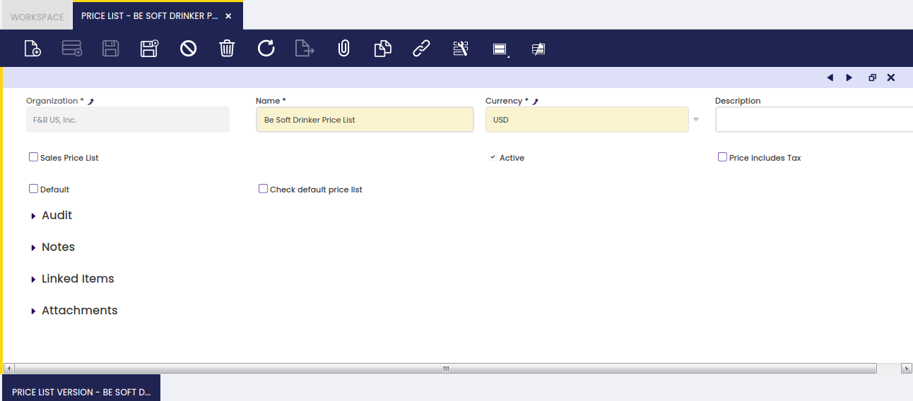
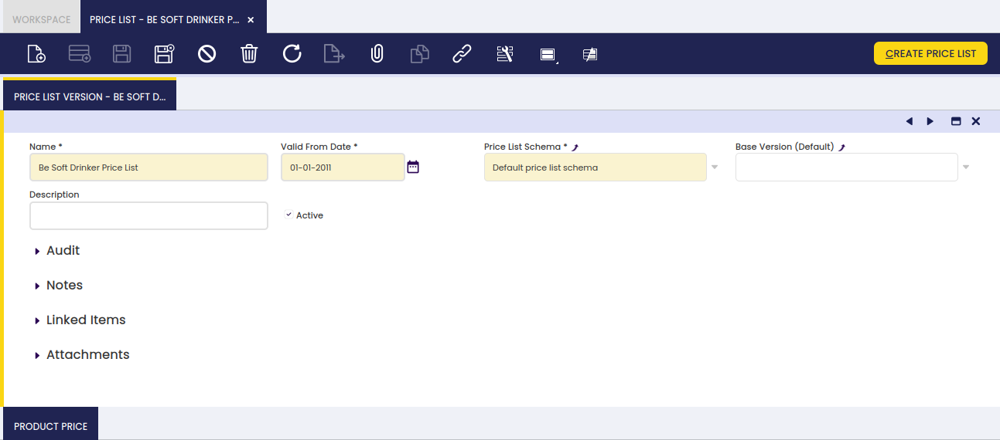
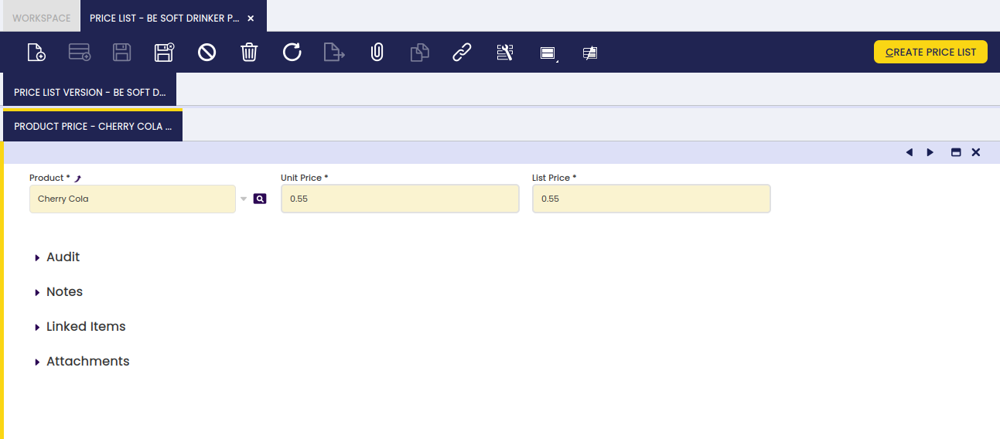

## Price List

:material-menu: `Application` > `Master Data Management` > `Picing` > `Price List`

### Overview

A price list is a listing of prices for different products or services.

!!! info
    It is possible to create as many price list and price list versions as required depending on the organization's needs.

The process of creating a price list is slightly different to the process of creating a price list version.

Price List creation:

1.  Price List Name and Type (sales or purchase) is detailed in the Price List window header. It is also mandatory to define whether the price includes taxes or not.
2.  There exists the possibility of Price list based on cost, for this, the price list should be a sales price list.
3.  The Default Price List Schema with no configuration at all, as well as the valid from date information, must be detailed in the Price List Version tab
4.  The Unit / List price of each product which must be included in the price list is detailed in the Product Price sub-tab.
5.  The price list is ready and can be linked to the business partners as required and used.

Price List version creation:

1.  Price List Name and Type (sales or purchase) is detailed in the Price List window header.
2.  A Price List Schema which contains the new commercial rules to apply, the valid from date and the Base Price List for which the price list version is created and must be detailed in the Price List Version tab.
3.  The process Create Price list populates the "Product Price" tab by including:
    1.  every product contained in the original price list
    2.  each product will have a new unit and/or list price, depending on what was configured in the price list schema used.
4.  The price list version is ready and can be linked to the business partners as required and therefore used.
5.  Documents will automatically default the most recent version of a price list.
6.  There is no end date on price list versions, but old versions can be deactivated.

### Price List

Price List window allows creating purchase and sales price lists to be assigned to the business partners for its use in purchase and sales transactions such as orders and invoices.

As shown in the image above, a price list or a price list version can be created by just entering below relevant information:

- By selecting the field "**Sales Price List**" it will be for sales transactions, otherwise it will be a purchase price list.
- **Default** field allows defining a given price list as the default one to be used in case a business partner does not have a specific price list assigned.
- **Price list based on cost**, this field is shown if the price list is a Sales Price List. This option allows creating a price list based on the cost price plus a margin.
  - the cost price is the one defined in the Costing tab of the product window.
  - the margin is defined in the Price List Schema window.
  - when the price list is a price list based on cost, the price list schema should be configured with cost and a margin.
- **Price includes taxes**. This flag is very important and depending on this the behavior of sales and procurement flows will be affected.
  - If it is marked, then the price defined is the gross unit price
  - If it is not marked, then the price defined is the net unit price

**How does this affect the flows?**

- When the price list includes taxes, the _gross unit price_ and _line gross amount_ are filled and the _net unit price_ is calculated based on the _gross unit price_ and the corresponding tax rate. What cannot be changed is the gross and, due to this, there might be some rounding issues that the system automatically handles adding or subtracting these differences in the tax amount.

As an example : If price inclusive of tax is originally 135.50 and rate is 4.5 % then the rounded price before tax would be 129.67

The order line would stay:

Quantity: 1 Net Unit Price: 129.67 Line Net Amount: 129.67 Gross Unit Price: 135.50 Line Gross Amount: 135.50

But the total gross amount (calculated by the system) would be 135.51 (tax base amount:129.67 + tax amount:5.84) and what it has to be clear is that the final result must be 135.50 (The customer bought 1 unit whose price is 135.50). This difference is going to be solved adjusting taxes:

The system will adjust the difference by summing or subtracting this difference with the tax that has the highest amount. So, in this example, instead of having a tax line where the amount is €5.84, the amount will be €5.83 (5.84-0.01)

Finally, the total gross amount for the sales order would be 135.50 (129.67+5.83) which is the desired amount.

Due to this (Net amount vs Gross amount), when using prices that include taxes, it is recommended to work with greater precision (price precision) to avoid rounding differences.

- When the price list does not include taxes, the _gross unit price_ and _line gross amount_ fields are not displayed and both fields are not calculated at all in the line of the document. The final gross amount of the document will be the result of the sum of the lines net amounts plus the tax amounts.
- The price list is defined at document level (header) so there cannot be lines where the price includes taxes and others where not. This is clear for orders, but for invoices where orders can be grouped in one just invoice the rule is also applied. One invoice cannot have orders where the price list includes taxes and orders where the price list does not include taxes.

### Price List Version

There could be as many versions of an existing price list as required, versions which can be valid for a given time period and which can be defined according to certain commercial rules.

As shown in the image above, there are two types of "Price List Versions":

- generic and original ones linked to the "Default Price List Schema"
- further price list versions (not based on the cost) which requires both:
  - a Price List Schema
  - and a Base Price List version
- price list versions based on cost require a Price List Schema with Cost configuration in Base list price and Base unit price.

The process button named "Create Price List" must be used only in the case of creating further price list versions as it requires a Base Price List if the price list is not based on cost. If the price list is based on cost, it is mandatory to select the price list schema and optionally the base version.

- if Base version is blank, the application calculates the unit price and list price for all the products (excluding discounts products) plus the margin defined.
- if Base version value is selected, the application calculates the unit price and list price for all the products defined in the base price list as cost plus margin.

### Product Price

Product Price tab allows the user to either add or edit products and their prices for a selected price list.

In other words:

- Add products in the case of creating a price list
- Edit products in the case of modifying a price list version:
  - as the required products at their new prices are automatically populated by Etendo in this tab while running the process "Create Price List".

Overall, this tab includes two main fields:

- 'the _List Price'_ field, as the price used as a reference in a given price list or price list version. This price can be the result of a discount or any other commercial rule applied by a Price List Schema.
- and the **Unit Price** field, as the final price used in documents such as orders and invoices. This price can be the result of a discount or any other commercial rule applied by a Price List Schema.

---

This work is a derivative of [Master Data Management](https://wiki.openbravo.com/wiki/Master_Data_Management){target="\_blank"} by [Openbravo Wiki](http://wiki.openbravo.com/wiki/Welcome_to_Openbravo){target="\_blank"}, used under [CC BY-SA 2.5 ES](https://creativecommons.org/licenses/by-sa/2.5/es/){target="\_blank"}. This work is licensed under [CC BY-SA 2.5](https://creativecommons.org/licenses/by-sa/2.5/){target="\_blank"} by [Etendo](https://etendo.software){target="\_blank"}.
