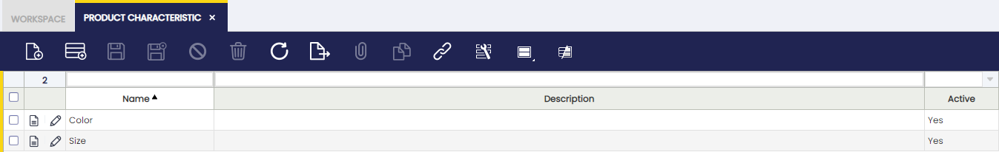
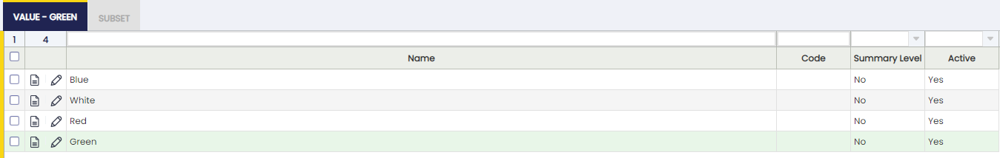
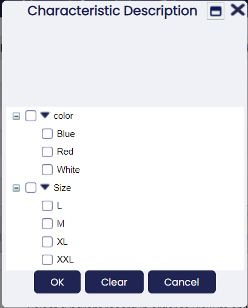
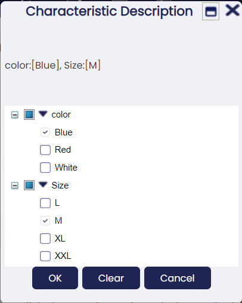
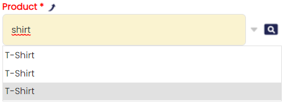
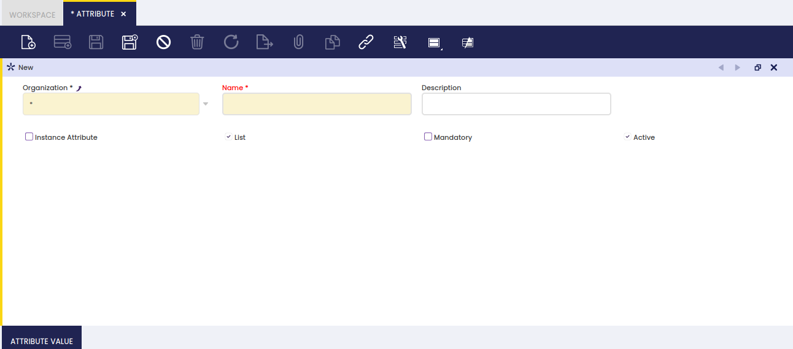
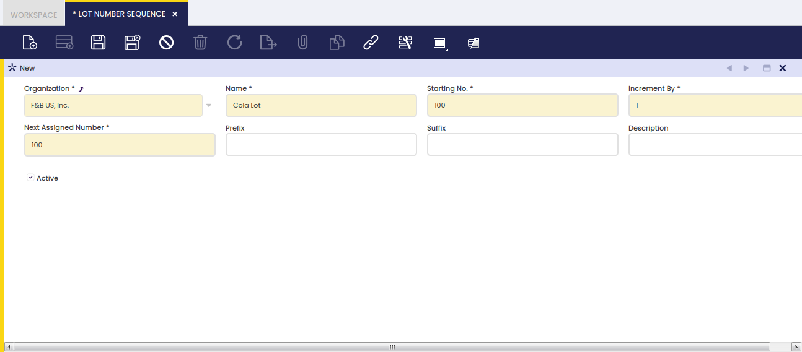
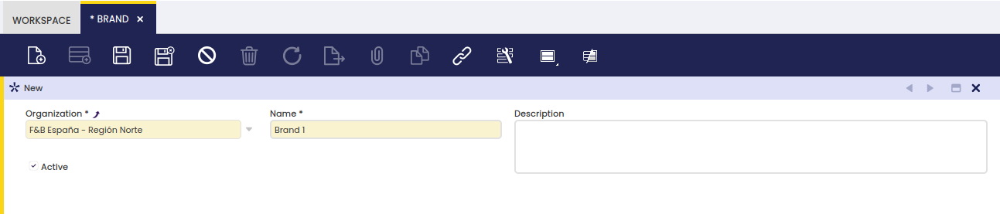

## **Product Characteristic**

### **Introduction**

Product Characteristic can be defined to complete the definition of a product using variants.

_Product Characteristics_ are attributes that can be added to the product definition to extend the description of each product. Examples of Characteristics are _Size_, _Color_, _Quality_, _Shape_ or _Weight_. These characteristics can be used later to filter or search products.

Once the definition of the characteristics is created, these can be assigned to a product and then create other products or SKU based on this **Generic Product** and its characteristics. This is a generic product where common attributes like tax or prices are defined. By default, products inherit all the attributes of the _Generic Product_ such as taxes, prices, etc. They can be overridden on each product. Generic products cannot be purchased or sold or used in any document.

For example, the Generic product _Shirts Summer Season 2013 by My Provider_ implements the Characteristics _Size_ and _Color_ as variants. This _Generic Product_ will have as Product Variant each combination of Color and Size.

### **Characteristic**

**Characteristic Definition**

Field to take into account:

- **Variant**: When it is marked, it will explode/create combinations with its values. If it is not marked, it will not create combinations with other characteristics. For example:
  - Characteristic Color: Variant marked with value Blue and White
  - Characteristic Size: Variant marked with value M and L
  - Characteristic Fashion line: Variant is not marked with value Sport, Classic, Vintage
- **Explode Configuration Tab**: Flag available on Variant Characteristics. When it is checked, the values of the selected variant characteristic are automatically inserted in the _Characteristic Configuration_ tab when the variant is assigned to a generic product. If it is not checked, the values must be added manually.

These three characteristics are assigned to the product in this way:

- Color: Blue, White
- Size: M,L
- Fashion line: Sport

It will create four variants/products and for all of them with the characteristic Sport. We can say that a characteristic that is not a variant is like a tag that is added to each new product.

### **Value**

Each of the values of a characteristic.

Fields to be into account:

- Name: Value
- Code: To be used later when creating the variant. It will put in the _Search Key_ field
- Summary level: It is allowed to create a tree structure. For example, if the characteristic is color and for the same value(i.e Green) there are different references depending on the supplier:

#### **Button Add Products**

The " Add Products" button is shown when a product characteristic value is NOT a "Variant", therefore it can be assigned to any product.

It does not update current values. That is why the button only shows products where the characteristic is not assigned to.

- Scenario 1:
  - Product A has the characteristic Color (defined as variant) with values White, Pink, Blue and Black
  - After creating the product variants, the user creates the non-variant characteristic Fashion line: Women, Men
  - Non-variant characteristic can be assigned to the product in Product window by using Update Characteristics process button.
- Scenario 2:
  - Not variant product characteristic is created in Product Characteristic window as "Variant" = No.
  - Once a product characteristic has been entered in "Value" tab, a process button "Add Products" is shown.
  - "Add Products" button opens a pick/execute window where any product or set of products can be related to that product characteristic value.

### **Subset**

A subset is a collection of values of a Product Characteristic.

Subset feature is a powerful functionality that allows the user to share the same characteristics for different purposes. For example, lots of colors and sizes can be created for different products:

- Color:
  - Green
  - Gray
  - White
  - Blue
  - Yellow
  - Red
  - Orange

But finally you have different products, for example t-shirts and pants:Subsets:

- Pants
  - Green
  - White
  - Gray
  - Blue
- T-shirts
  - Green
  - White
  - Orange
  - Blue

The aim of this feature is to avoid having duplicate values (blue, blue, green, green) because of different purposes. With this subset when selecting a product that is a pant, for example, instead of selecting the characteristic _Color_ you select the subset _Pants_. This way, instead of retrieving seven values, it will retrieve just four. Another advantage of doing this is when searching for variants instead of having blue two times (and you would not know if the blue is for pants or t-shirts), you will have blue one time. So when searching for variants which have the characteristics _Blue,_ the system will retrieve pants and t-shirts.

### **Subset Value**

Each of the values of the product characteristic assigned to the subset.

- Sequence number: To order the way of seeing the values
- Name: Value. Notice that only values from the characteristic can be selected.
- Code: If it is filled, it will overwrite the code setup in the characteristic

### **Filtering**

Fields based on columns whose reference is Product Characteristics can be filtered in grid assisted with a popup where the tree of available characteristics is displayed.

!!! info
    The characteristics available in this popup are limited to the ones applicable to data filtered in the grid where it is displayed with the current filtering criteria for the rest of the fields.

### **Configuration**

Product Characteristics is ready to be used out of the box.

Anyway, some new features can be displayed as well with some simple configuration options (these changes need to be exported to the template).

#### **Improving product selector**

You can select between the different product characteristics using the product selector. There you have a column showing product characteristics description (See image).

That is not the case when selecting from the suggestion box. There, just product names are used. Taking into account that the product with the characteristics share the name, it becomes impossible to distinguish one from another (See image).

User experience in this case would be completely different if products could be identified from the suggestion box (See image).

This can be easily improved by enabling some options of the selector.

Follow these simple steps to enable this configuration, and please do not forget to export those changes to your template.

- Log as System Administrator
- Go To Tables and Columns and select C_OrderLine
- Go to lines tab and select product (M_Product_ID)
- Navigate to selector (see image)

- Go to Defined Selector tab and then to Defined Selector field tab and select Characteristics Description field.
- Edit and flag "Search in suggestion box" and "Show in Picklist" check boxes (See image)

- Last point would be to export these changes to the template. This is really important to avoid problems in future update processes and to keep these changes after the update.

## **Update Product Characteristics Description**

### **Introduction**

Every variant has its product _Characteristic Description_ and this field is calculated automatically when:

- Variants are created
- When the value of a characteristic is change, for example from _Blue_ to _Hard Blue_

For example, if the characteristics of a variant are Color and Size and the values are Blue and XL the result of the description would be: _Color: Blue, Size: XL_

If later on you change Blue for Hard Blue, the new description would be _Color: Hard Blue, Size: XL_

In all of these scenarios, the _Characteristic Description_ is updated without the need of coming to this process.

This process should be used just in some special cases:

- When the name of the Characteristic is changed, for example from Color to Tint
- When through the database characteristics or values are changed

## **Unit of Measure**

### **Introduction**

A unit of measure is a standard unit or combination of units to be used alongside the quantity of a product.

There are many units of measure which can be used to count product quantity on hand, or to purchase or sell a product.

Units of measure can also be used for measuring time. There are products such as services or resources which must be measured that way.

Below, you can find a list of the unit of measure you could setup in Etendo:

- **Unit**
- **Box**
- **Hour**
- **Kilogram**
- **KWh** (Kilowatt hour)
- **Litre**
- **Pallet**
- **Pack**
- etc.

### **Unit of Measure**

Products of any type are managed in non-monetary units of measure.

As shown in the image above, a non-monetary unit of measure can be created in Etendo by filling in below relevant data:

- the **EDI Code**, if any.
- the **UOM Name**
- the **Standard Precision** to be used while rounding calculated quantities of the products having that unit of measure
- the **Costing Precision** to be used while rounding calculated cost of the products having that unit of measure.
- and the **Symbol** or commonly used unit of measure abbreviation

### **Translation**

Units of Measure can be translated to any language required.

The way to get that is as simple as:

- select first the language required
- and then enter the unit of measure translated into that language.

### **Conversion**

Edit the conversion rate of one unit of measure into another one.

## **Product Category**

### **Introduction**

Similar products can be grouped into different categories, which must be created with the aim of helping their management and analysis.

You may want to group similar products within the same category in order to get procurement and sales information summarized by each category. This is possible due to the fact that "Product Group" is one of the "Dimensions" of Purchase and Sales Reports.

To learn more, visit Procurement Analysis Tools and Sales Analysis Tools.

Besides, each product category allows the user to set up a different set of ledger accounts to be used while posting product related transactions such as purchase and sales invoices.

### **Product Category**

Product category window allows the user to create and configure every product group your company may need.

As shown in the image above, the creation of a product category requires entering below listed information for each category:

- a **Search Key** or short name which helps to easily find the category
- a **Name**
- a **Description**
- and the **Summary Level** flag which helps to arrange product categories into a hierarchical structure.

Product categories can be arranged into a hierarchical structure, which can be later on exploited by other reports or processes. For more information about how to work with trees, visit the Tree structure section.

### **Accounting**

Each product category allows the user to configure a different set of ledger accounts.

There is a set of product related accounts which needs to be properly set up for the organization's general ledger configuration.

The "Copy Accounts" process of the Defaults tab of the General Ledger Configuration screen allows to automatically populate at least the mandatory ones shown in the image above.

The accounts automatically defaulted by Etendo can always be changed if required.

The whole list of product related accounts is:

- **Product Assets**: this field stores the default account to be used to record inventory transactions such as:
  - Inventory Counts
  - Inventory Movements
  - and Goods Receipt

This account is typically an asset account.

- **Product Expense**: this field stores the default account to be used to record product purchase expenses.  
  This account is typically an expense account.
- **Product Deferred Expense**: this field stores the default account to be used to record deferred expenses.  
  This account is typically an asset account.
- **Product Revenue**: this field stores the default account to be used to record product sales revenues.  
  This account is typically a revenue account.
- **Product Deferred Revenue**: this field stores the default account to be used to record deferred revenues.  
  This account is typically a liability account.
- **Product COGS**: this field stores the default account to be used to record the cost of the goods sold.  
  This account is typically an expense account.
- **Product Revenue Return**: this field stores the default account to be used to record sales returns.  
  This account is typically a revenue account.
- **Product COGS Return**: this field stores the default account to be used to record return material receipts.  
  This account is typically an expense account.
- **Invoice Price Variance**: this field stores the default account to be used to record price differences between posted Goods Receipts and booked Purchase Invoices.  
  This account is typically an asset account.

!!! info
    The "Copy Accounts" action button allows the user to copy the accounts defaulted in this window to the Product Accounting tab.

### **Assigned Products**

Assigned products is a view of all the products which belong to a product category.

As a side note, not real products such as discount products should belong to a specific product group, named by example "Others", as a way of keeping them isolated from the real ones.

To learn more about discount products, visit Discount.

### **Translation**

It maintains translations of Product Categories to different languages.

## **Attribute**

### **Introduction**

Products can have an attribute or a set of attributes which makes them different to the rest.

An attribute is a feature of a product, such as color or size.

The capacity for managing product attributes allows a proper definition of the products and besides assure compliance with the tracking requirements imposed by the majority of industries.

Etendo allows managing product attributes by following below steps:

1.  Creation of every Product Attribute. An Attribute can be a unique identifier such as a Serial Number, or can have a predefined list of values such as blue, white and red colors.  
    To learn more, keep reading this section.
2.  Creation of Attribute Set/s which can contain just one attribute or mix a set of attributes.  
    To learn more, visit Attribute Set
3.  Set up the relationship between the product and the attribute set.  
    To learn more, visit Product

### **Attribute**

Attribute window allows the user to create and edit attributes such as color or size to be assigned to attribute sets.

As shown in the image above, an attribute can be easily defined by entering the relevant data below:

- the **Name** of the attribute
- a short **Description** if required
- If the attribute is unique for each instance of the product, for example a lot number or a serial number, select the **Instance Attribute** checkbox.
- **List** flag allows the user to state that the attribute has a predefined list of values to be entered in the "Attribute Value" tab.  
  To learn more, visit Attribute Value.
- **Mandatory** flag defines the attribute as mandatory, therefore it must always be specified for the product.

### **Attribute Value**

An attribute can have several values or individual characteristics to be detailed for each attribute.

Above applies to attributes such as color or size.

Attribute Value tab allows the creation of as many attribute values as required for an attribute.

## **Attribute Set**

### **Introduction**

An attribute set can be defined by a single attribute or by a set of attributes to apply to specific products.

If **an attribute set** includes among others **an attribute which is unique for each instance of the product**, for example, a lot number or a serial number, this window is the place to define which **Lot Number Sequence** or **Serial Number Sequence** must apply to get that unique attribute.

The steps to follow are:

- **Creation of the Lot Number Sequence/s**. To learn how, visit Lot Number Sequence
- **Creation of the Serial Number Sequence/s**. To learn how, visit Serial Number Sequence
- **Set up the relationship between** the previously created **Lot/Serial Number Sequence/s** and the **Attribute Set**, in the Attribute Set window.  
  To learn how, keep reading this section.

### **Attribute Set**

Attribute Set window allows creating as many combinations of attributes as required to define products with few or multiple characteristics.

As shown in the image above, an attribute set to be assigned to a specific product/s can contain:

- a **Name** of the attribute Set
- a brief **Description** if needed
- a **Lot** or unique identifier given to a particular quantity of that product.  
  If **Lot flag is checked,** a new field named "**Lot Control**" is shown for you to select the Lot Number Sequence to follow by the products linked to that particular attribute set.
- a **Serial No** or a unique identifier given to each unit of the product.  
  If **Serial No flag is checked,** a new field named "**Serial No Control**" is shown for you to select the Serial Number Sequence to follow by the products linked to that particular attribute set.
- an **Expiration Date** or date upon which product quality is guaranteed.  
  If **Expiration Date flag is checked,** a new field named "**Guaranteed Days**" is shown for you to enter the number of days a product can be guaranteed.
- finally, the flag "**Require At Least One Value**" implies that at least one attribute set value will be required in product related transactions.

### **Assigned Attribute**

An attribute set can have a single or a set of attributes assigned.

As shown in the image above, an attribute set can have only one attribute, for example Color or as many attributes as required, for example Size, Lot Number and Serial Number.

The way to get that is just to select the previously created attributes in this tab.

You should take into account that:

- if one of the selected attributes is a "Lot" or a "Serial N?" type attribute, the corresponding Number Sequence must have been properly set up in the Attribute Set window.

## **Lot Number Sequence**

### **Introduction**

A product attribute can be a Lot Number.

Some products require lot numbering to assure compliance with the tracking requirements imposed by the majority of industries, which implies that a given quantity of a product has always to be linked to a unique lot number.

### **Lot Control**

A Lot Number is a unique number given to a particular quantity of a product, which can be defined to have a prefix or a suffix among other characteristics.

A Lot Number Sequence can be setup:

- by defining the first number or **Starting Number** that will be used as Lot Number
- by specifying the value by which the Lot Number will be **incremented by**
- by defining which is the **Next Assigned Number** that will be used. Etendo updates the next assigned number value as the Lot Numbers are assigned.
- by entering a **Prefix** such as **Lot N?/** which easily helps to understand that the number in question is a lot number.
- by entering a **Suffix** such as **/2011** which helps to provide additional information if needed.

## **Serial Number Sequence**

### **Introduction**

A product attribute can be a serial number.

Some products require serial numbering to assure compliance with the tracking requirements imposed by the majority of industries which implies that:

- each unit of a product has always to be linked to a unique serial number.

### **Number Control**

A Serial Number is a unique number given to each unit of a product/item which can be defined to have a prefix or a suffix among other characteristics.

A Serial Number Sequence can be setup:

- by defining the first number or **Starting Number** that will be used as Serial Number
- by specifying the value by which the Serial Number will be **incremented by**.  
  In the case of Serial Numbers it will always be "1".
- by defining which is the **Next Assigned Number** that will be used. Etendo updates the next assigned number value as the Serial Numbers are assigned.
- by entering a **Prefix** such as **Serial N?/** which easily helps to understand that the number in question is a serial number.
- by entering a **Suffix** such as **/2011** which helps to provide additional information if needed.

## **Brand**

### Introduction

This window allows the user to enter brands associated with one product.
The brands are manufacturers or commercial names used by manufacturers to identify a product line.

### Header

To use this functionality, select an organization and add a new brand in the corresponding fields. It is also possible to enter a description when necessary.

