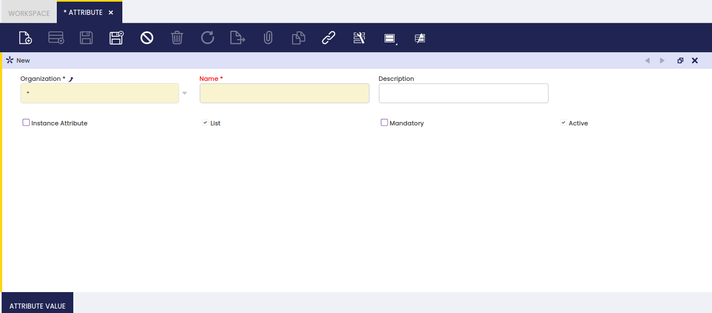

## Attribute

:material-menu: `Application` > `Master Data Management` > `Product Setup` > `Attribute`

### Overview

Products can have an attribute or a set of attributes which makes them different to the rest.

An attribute is a feature of a product, such as color or size.

The capacity for managing product attributes allows a proper definition of the products and besides assure compliance with the tracking requirements imposed by the majority of industries.

Etendo allows managing product attributes by following below steps:

1.  Creation of every Product Attribute. An Attribute can be a unique identifier such as a Serial Number, or can have a predefined list of values such as blue, white and red colors.  
    To learn more, keep reading this section.
2.  Creation of Attribute Set/s which can contain just one attribute or mix a set of attributes.  
    To learn more, visit Attribute Set
3.  Set up the relationship between the product and the attribute set.  
    To learn more, visit Product

### Attribute

Attribute window allows the user to create and edit attributes such as color or size to be assigned to attribute sets.

As shown in the image above, an attribute can be easily defined by entering the relevant data below:

- the **Name** of the attribute
- a short **Description** if required
- If the attribute is unique for each instance of the product, for example a lot number or a serial number, select the **Instance Attribute** checkbox.
- **List** flag allows the user to state that the attribute has a predefined list of values to be entered in the "Attribute Value" tab.  
  To learn more, visit Attribute Value.
- **Mandatory** flag defines the attribute as mandatory, therefore it must always be specified for the product.

### Attribute Value

An attribute can have several values or individual characteristics to be detailed for each attribute.

Above applies to attributes such as color or size.

Attribute Value tab allows the creation of as many attribute values as required for an attribute.
