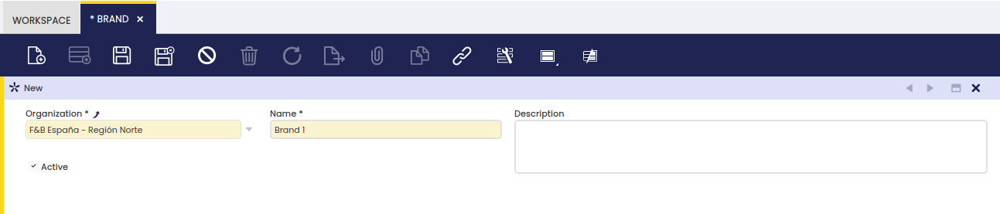

## Brand

:material-menu: `Application` > `Master Data Management` > `Product Setup` > `Brand`

### Overview

This window allows the user to enter brands associated with one product.
The brands are manufacturers or commercial names used by manufacturers to identify a product line.

### Header

To use this functionality, select an organization and add a new brand in the corresponding fields. It is also possible to enter a description when necessary.

