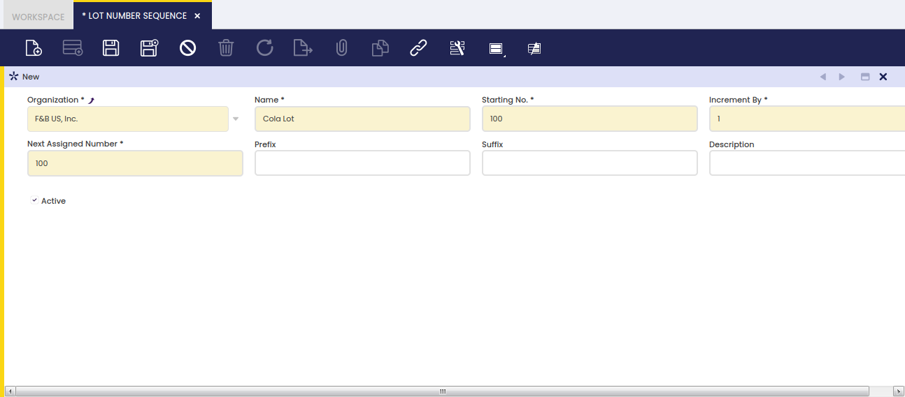

## Lot Number Sequence

:material-menu: `Application` > `Master Data Management` > `Product Setup` > `Lot Number Sequence`

### Overview

A product attribute can be a Lot Number.

Some products require lot numbering to assure compliance with the tracking requirements imposed by the majority of industries, which implies that a given quantity of a product has always to be linked to a unique lot number.

### Lot Control

A Lot Number is a unique number given to a particular quantity of a product, which can be defined to have a prefix or a suffix among other characteristics.

A Lot Number Sequence can be setup:

- by defining the first number or **Starting Number** that will be used as Lot Number
- by specifying the value by which the Lot Number will be **incremented by**
- by defining which is the **Next Assigned Number** that will be used. Etendo updates the next assigned number value as the Lot Numbers are assigned.
- by entering a **Prefix** such as **Lot N?/** which easily helps to understand that the number in question is a lot number.
- by entering a **Suffix** such as **/2011** which helps to provide additional information if needed.
