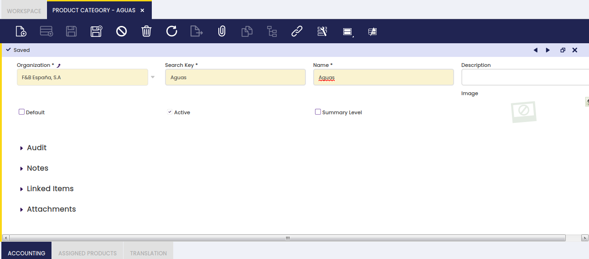
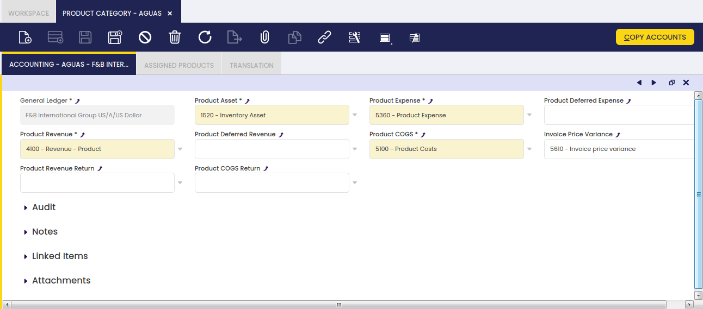

## Product Category

:material-menu: `Application` > `Master Data Management` > `Product Setup` > `Product Category`

### Overview

Similar products can be grouped into different categories, which must be created with the aim of helping their management and analysis.

You may want to group similar products within the same category in order to get procurement and sales information summarized by each category. This is possible due to the fact that "Product Group" is one of the "Dimensions" of Purchase and Sales Reports.

To learn more, visit Procurement Analysis Tools and Sales Analysis Tools.

Besides, each product category allows the user to set up a different set of ledger accounts to be used while posting product related transactions such as purchase and sales invoices.

### Product Category

Product category window allows the user to create and configure every product group your company may need.

As shown in the image above, the creation of a product category requires entering below listed information for each category:

- a **Search Key** or short name which helps to easily find the category
- a **Name**
- a **Description**
- and the **Summary Level** flag which helps to arrange product categories into a hierarchical structure.

Product categories can be arranged into a hierarchical structure, which can be later on exploited by other reports or processes. For more information about how to work with trees, visit the Tree structure section.

### Accounting

Each product category allows the user to configure a different set of ledger accounts.

There is a set of product related accounts which needs to be properly set up for the organization's general ledger configuration.

The "Copy Accounts" process of the Defaults tab of the General Ledger Configuration screen allows to automatically populate at least the mandatory ones shown in the image above.

The accounts automatically defaulted by Etendo can always be changed if required.

The whole list of product related accounts is:

- **Product Assets**: this field stores the default account to be used to record inventory transactions such as:
  - Inventory Counts
  - Inventory Movements
  - and Goods Receipt

This account is typically an asset account.

- **Product Expense**: this field stores the default account to be used to record product purchase expenses.  
  This account is typically an expense account.
- **Product Deferred Expense**: this field stores the default account to be used to record deferred expenses.  
  This account is typically an asset account.
- **Product Revenue**: this field stores the default account to be used to record product sales revenues.  
  This account is typically a revenue account.
- **Product Deferred Revenue**: this field stores the default account to be used to record deferred revenues.  
  This account is typically a liability account.
- **Product COGS**: this field stores the default account to be used to record the cost of the goods sold.  
  This account is typically an expense account.
- **Product Revenue Return**: this field stores the default account to be used to record sales returns.  
  This account is typically a revenue account.
- **Product COGS Return**: this field stores the default account to be used to record return material receipts.  
  This account is typically an expense account.
- **Invoice Price Variance**: this field stores the default account to be used to record price differences between posted Goods Receipts and booked Purchase Invoices.  
  This account is typically an asset account.

!!! info
    The "Copy Accounts" action button allows the user to copy the accounts defaulted in this window to the Product Accounting tab.

### Assigned Products

Assigned products is a view of all the products which belong to a product category.

As a side note, not real products such as discount products should belong to a specific product group, named by example "Others", as a way of keeping them isolated from the real ones.

To learn more about discount products, visit Discount.

### Translation

It maintains translations of Product Categories to different languages.
