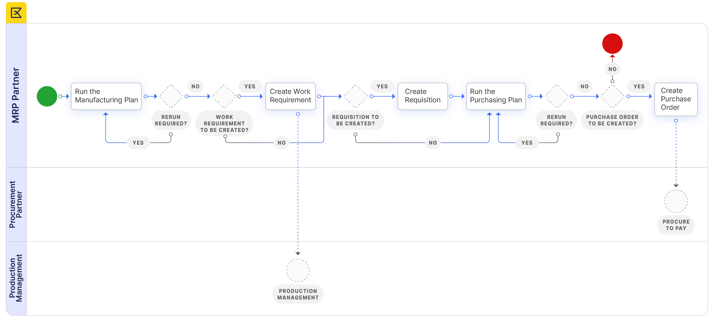

# Material Requirement Planning - Getting Started

## Overview

<iframe width="560" height="315" src="https://www.youtube.com/embed/2fGUSzo2ACI?si=h1BqAWPYXf6S1Pnj" title="YouTube video player" frameborder="0" allow="accelerometer; autoplay; clipboard-write; encrypted-media; gyroscope; picture-in-picture; web-share" allowfullscreen></iframe>

In Material Requirement Planning the application is used to *automatically review the demand and display suggestions concerning required supply*. In the *Manufacturing Plan*, the application suggests required *Work Requirements* and *Requisitions*. In the *Purchasing Plan*, the application suggests required *Purchase Orders*.

## Material Requirement Planning

The Material Requirement Planning consists of two plans:

- Manufacturing Plan: plan to display calculations related to products that go through Production. The suggested documents to be created in this plan are the [Work Requirement](../production-management/transactions.md#work-requirement) and the [Requisition](../procurement-management/transactions.md#requisition).
- Purchasing Plan: plan to display calculations related to products that are procured. The suggested document to be created in this plan is the [Purchase Order](../procurement-management/transactions.md#purchase-order).

**Planning Methods** are entered to define what supply components are taken into account with the calculations of these plans.

### **Configuration**

!!!info
    Apart from the set up screens in the MRP module that are configured, additional set ups are required.
    For the products that are planned in the *Manufacturing Plan*, the following configurations are required:

- the [Process plan](../production-management/setup.md#process-plan)  is set up for the product.
- the *production checkbox* and the Process Plan name are selected in the [Product](../master-data-management/master-data.md#product) screen.
The [Manufacturing](../master-data-management/master-data.md#manufacturing) tab in the Product screen is filled out with the information required for MRP to make the calculations for the Manufacturing plan.

For the products that are planned in the *Purchasing Plan*, the following configurations are required:

- the purchase checkbox is selected in the [Product](../master-data-management/master-data.md#product) screen.
- the [price](../master-data-management/master-data.md#price) of the product is defined for the price list of the vendor that is entered in the Purchasing tab.
- the [Purchasing](../master-data-management/master-data.md#purchasing)  tab in the Product screen is filled out with the information required for MRP to make the calculations for the Purchasing Plan.
- the vendor that is reflected as the Business Partner in the above mentioned Purchasing tab is filled out in the Business Partner screen:

    - [Vendor/Creditor](../master-data-management/master-data.md#vendorcreditor) tab with at least the following fields filled out:
        - Purchase Price List
        - PO Payment Method
        - PO Payment Terms
    - [Location/Address](../master-data-management/master-data.md#locationaddress) tab

- The [Manufacturing](../master-data-management/master-data.md#manufacturing) tab in the Product screen is filled out with the *Planning Method* and *Planner* information.

### **Execution** 

The material planner enters a Manufacturing Plan for a product for a certain time period and processes the plan.

In the created overview the *material planner reviews and analyzes* the lines. Based on the information that is processed by MRP, the plan suggests *Work Requirements* and *Requisitions* for certain quantities and certain dates.

- If required, adjustments to the set ups for example the planning method, are done. The lines of the plan are recalculated by clicking the *Recalculate Dates/Quantities* button.
- If required, manual changes to the created lines with regards to quantities and dates are made.
- Once the plan is correct, any suggested requisitions are created by clicking the *Generate Material Requisitions* button and any suggested Work Requirements are created by clicking the *Generate Work Requirements* button.
- The material planner completes the created requisition(s) and processes the created Work Requirement(s).

The material planner then enters a Purchasing Plan for a product for a certain time period and processes the plan.
In the created overview the material planner reviews and analyzes the lines. Based on the information that is processed by MRP, the plan suggests *Purchase Orders* for certain quantities and certain dates.

- If required, adjustments to the set ups for example the planning method, are done. The lines of the plan are deleted and the plan is reprocessed.
- If required, manual changes to the created lines with regards to quantities and dates are made.
- Once the plan is correct, any suggested purchase orders are created by clicking the *Create Purchase Orders* button.
- The material planner completes the created purchase order.

## Relationship with other areas

The MRP interacts with the following modules:

- [Procurement Management](../procurement-management/getting-started.md):
    - [Requisitions](../procurement-management/transactions.md#requisition) are created from the Manufacturing Plan
    - [Purchase Orders](../procurement-management/transactions.md#purchase-order) are created from the Purchasing Plan
- [Sales Management](../sales-management/getting-started.md):
    - [Sales Orders](../sales-management/transactions.md#sales-order) are optionally taken into account in the calculations of both plans
- [Warehouse Management](../warehouse-management/getting-started.md):
    - [Stock levels](../warehouse-management/analysis-tools.md#stock-report) are automatically taken into account in the calculations of both plans
- [Production Management](../production-management/getting-started.md):
    - the [Process Plan](../production-management/setup.md#process-plan) is used for the calculation of the Manufacturing Plan
    - [Work Requirements](../production-management/transactions.md#work-requirement) are created from the Manufacturing Plan

---

- This work is a derivative of [Material_Requirement_Planning](https://wiki.openbravo.com/wiki/Material_Requirement_Planning){target="_blank"} by [Openbravo S.L.U](http://wiki.openbravo.com/wiki/Welcome_to_Openbravo){target="_blank"}, licensed under [CC BY-SA 2.5 ES](https://creativecommons.org/licenses/by-sa/2.5/es/){target="_blank"}.