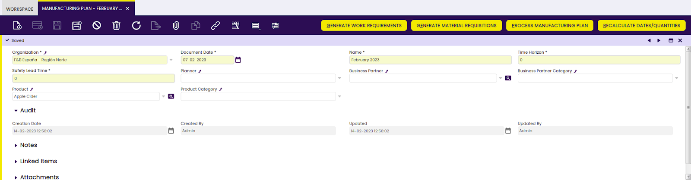
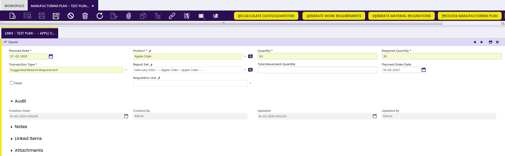
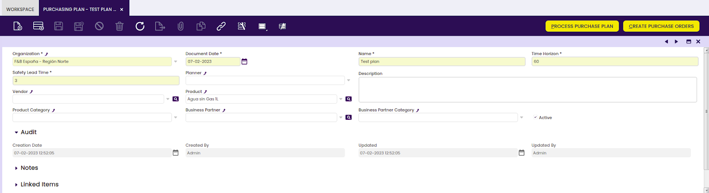
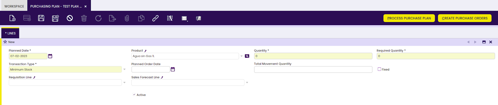
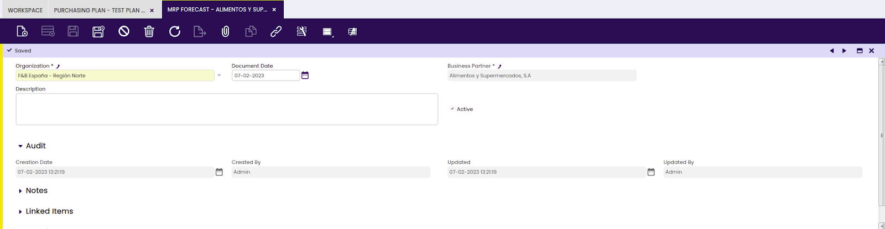
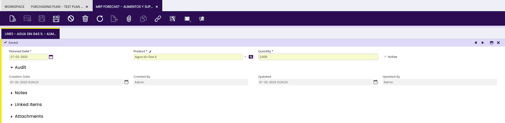

## Overview

Material Requirement Planning (MRP) deals with all activities related to the planning of a manufacturing and suggestions for the required supply. 

## Manufacturing Plan

### Overview

Create a comprehensive work requirement in order to request materials over a specified time period.

The Manufacturing Plan suggests work requirements and requisitions that need to be created and, just by clicking a button, these documents are created automatically.

In the main section of the document the information of what needs to be planned and for which time period is entered. The Process Manufacturing Plan button creates the lines in the plan with information of supply and demand:

-   current stock level (supply)
-   pending work requirements (supply)
-   booked Sales Orders without a goods shipment (demand)
-   safety stock (demand)
-   sales forecast (demand)

The information that is listed depends on the planning method used for the product.

The MRP process balances the demand with the supply, taking into account the dates of both and based on this information, it suggests work requirements and requisitions to be created. The generated lines can be updated manually. Also, changes to demand and supply can be made and the plan recalculated to see a new plan.

The Manufacturing Plan shows the demand for raw material that is required for the suggested work requirements, and suggests requisitions without reviewing the supply and demand for the raw material. Once the requisitions are completed by the planner, they are entered to the Purchasing Plan to calculate if any purchase orders need to be placed.

Once the plan is as desired, by clicking different buttons the work requirements and requisitions are created automatically.

### Header

Create and edit a manufacturing plan.

-   Document Date: date the manufacturing plan is entered
-   Name: name of the manufacturing plan
-   Time Horizon: the number of days that are being taken into account for the calculation of the manufacturing plan
-   Safety Lead Time: number of days that are added to the offset for the calculation of the planned order date of the suggested work requirements and requisitions. For example, the manufacturing lead time is used to indicate how long it will take for a product between being produced and arriving in the warehouse, and the safety lead time is added on for any time that it takes to put the product into stock (due to quality check or other internal processes).
-   Planner: filter to select only products managed by a certain planner, as configured in the [Product](/user-guide/etendo-classic/basic-features/master-data-management/master-data/#product) tab in the Master Data Management section.
-   Business Partner: filter to only select products ordered by a certain customer
-   Business Partner Category: filter to only select business partners of a certain business partner category.
-   Product: filter to select only a certain product
-   Product Category: filter to select only products related to a certain product category

!!! info
    Once the information is added in the main section, the lines can be created. If necessary, changes are made to set ups by clicking the Recalculate Dates/Quantities button.

### Lines

Add products to be included in your plan. Each product is shown on its own line.

!!! info
    Only products that are set up with the Production checkbox and Process Plan selected in the product are executed by the MRP process.

Depending on the product, different transaction types may appear in the lines. All supply transactions have a positive quantity, all demand transactions have a negative quantity.

-   Stock: by default appearing for the product
-   Sales Forecast: the information appears if:
    -   forecast is set up in the sales forecast screen
    -   the forecast is defined in the planning method
    -   the planned method is linked to the product
-   Minimum Stock: by default appearing for the product if set up in the Safety Stock field in the product.
-   Pending Sales Order: the information appears if:
    -   pending sales order is defined in the planning method
    -   the planned method is linked to the product
    -   there are booked sales orders without a related goods shipment for the product
-   Suggested Work Requirement: advice generated by MRP to create a purchase order.
    -   the required quantity is the quantity that is the outcome of the balance of all supply and all demand
    -   the Quantity is the quantity to appear on the work requirement(s) that is created. Based on the set ups in the product the quantity can differ from the required quantity, for example due to min. quantity for production, quantity type, etc.
    -   the Planned Order Date is the date that the Work Requirement needs to be created and processed. This is an offset of the dates in wich the demand is required with the manufacturing lead time set up in the product and the safety lead time in the set up in the main section of this plan. If the demand is required within the timeframe of the lead times, the date is reflected as past due to indicate that in order to get the product on time, an action should have been taken already and it indicates exactly how overdue the action is.
-   Suggested Material Requirement: advice generated by MRP to create requisitions for the raw material that is required to be used in the suggested work requirements. The correct raw material information is generated if the information in the Process Plan is correct.
    -   the Planned Order Date is the date that the Requisition needs to be created and completed. These dates equal the planned order dates of the suggested work requirements.
    -   the Quantity appears on the requisition that is created. The quantity is based on the one that is on the suggested work requirement combined with the component use as defined in the Process Plan. 

!!! info
    By clicking the Generate Work Requirements button, the work requirements are created automatically. The documents need to be processed please see the [Work Requirement](/user-guide/etendo-classic/basic-features/production-management/transactions/#work-requirement) section in the Production Management section for details.

!!! info
    By clicking the Generate Material Requisitions button, the requisitions are created in draft automatically. The documents need to be completed, please see the [Requisition](/user-guide/etendo-classic/basic-features/procurement-management/transactions/#requisition) section in the Procurement Management section for details.

The requisitions can be selected as input in the planning method of the Purchasing Plan to be included in the calculations of that plan, in order to calculate if Purchase Orders need to be created.

Once the documents are created automatically, the numbers of the documents appear in the Work Requirement and the Requisition Line columns of the lines. The created purchase order is in draft status and needs to be booked. 

!!! info
    For more information please check the [_Purchase Order_](/user-guide/etendo-classic/basic-features/procurement-management/transactions/#purchase-order) section.

## Purchasing Plan

### Overview 

Create a comprehensive and organized plan to request purchases over a specified time period.

The Purchasing Plan suggests purchase orders that need to be created and, just by clicking a button, these purchases are created automatically.

In the main section of the document the information of what needs to be planned and for which time period is entered. The Process Purchase Plan button creates the lines in the plan with information of supply and demand. 

-   current stock level (supply)
-   booked Purchase Orders without a goods receipt (supply)
-   booked Sales Orders without a goods shipment (demand)
-   completed requisitions (demand)
-   safety stock (demand)
-   sales forecast (demand)

The information that is listed depends on the planning method used for the product.

The MRP process balances the demand with the supply, taking into account the dates of both and based on this information, it suggests purchase orders to be created. The generated lines can be updated manually. Also, changes to demand and supply can be made, the current lines deleted and the plan reprocessed to see a new situation.

Once the plan is as desired, by clicking a button purchase orders are created automatically.

### Header

Create and edit a purchase plan.

-   Document Date: date the purchasing plan is entered
-   Name: name of the purchasing plan
-   Time Horizon: the number of days that are taking into account for the calculation of the purchasing plan
-   Safety Lead Time: number of days that are added to the offset for the calculation of the planned order date of the suggested purchase order. For example, the purchasing lead time is used to indicate how long it will take for a product between being ordered and arriving in the warehouse, and the safety lead time is added on for any time that it takes to put the product into stock (due to quality check or other internal processes).
-   Planner: filter to select only products managed by a certain planner, as configured in the [Product](/user-guide/etendo-classic/basic-features/master-data-management/master-data/#product) tab in the Master Data Management section.
-   Vendor: filter to select only products for a certain vendor as configured in the Purchasing tab of the product.
-   Product: filter to select only a certain product
-   Product Category: filter to select only products related to a certain product category
-   Business Partner: filter to only select products ordered by a certain customer
-   Business Partner Category: filter to only select business partners of a certain business partner category.
-   Process Purchase Plan button: once the information is added in the main section, the lines are created by the Process Purchase Plan button. If necessary, the lines are deleted, changes are made to set ups and new lines are created by clicking the Process Purchase Plan button again.
-   Create purchase order: Generates the corresponding purchase orders
-   Create reservations: This button is only visible when Stock reservations feature is enabled. It reserves stock for the sales orders that are not reserved, if there is stock, and for the ones that cannot be reserved because there is not stock it creates the corresponding purchase orders and link to the sales order

### Lines

Add products to be included in your plan. Each product is shown on its own line.

!!! info
    Only products that are set up with the Purchase checkbox selected in the product are executed by the MRP process.

Depending on the product, different transaction types may appear in the lines. All supply transactions have a positive quantity, all demand transactions have a negative quantity.

-   Stock: by default appearing for the product
-   Sales Forecast: the information appears if:
    -   forecast is set up in the sales forecast screen
    -   the forecast is defined in the planning method
    -   the planned method is linked to the product
-   Minimum Stock: by default appearing for the product if set up in the Safety Stock field in the product. 
-   Pending Purchase Order: the information appears if:
    -   pending purchase order is defined in the planning method
    -   the planned method is linked to the product
    -   there are booked purchase orders without a related goods receipt for the product
-   Pending Sales Order: the information appears if:
    -   pending sales order is defined in the planning method
    -   the planned method is linked to the product
    -   there are booked sales orders without a related goods shipment for the product
-   Suggested Purchase Order: advice generated by MRP to create a purchase order.
    -   the required quantity is the quantity that is the outcome of the balance of all supply and all demand
    -   the Quantity is the quantity to appear on the purchase order(s) that is created. Based on the set ups in the Product the quantity can differ from the required quantity, for example due to minimum order quantity, quantity type, etc.
    -   the Planned Order Date is the date that the Purchase Order needs to be booked. This is an offset of the dates in which the demand is required with the purchasing lead time set up in the product and the safety lead time in the setup in the main section of this plan. If the demand is required within the timeframe of the lead times, the date is reflected as past due to indicate that in order to get the product on time, an action should have been taken already and it indicates exactly how overdue the action is.

By clicking the Create Purchase Orders button, the purchase order is created, provided that all setups were correctly entered:

-   the vendor information is complete
-   the product is set up with the required information in the purchasing tab
-   the price for the vendor is entered in the product

Once the purchase order is created automatically, the number of the document appears in the Order Line column of the line. The created purchase order is in draft status and needs to be booked. 

!!! info
    For more information, please check the [Purchase Order](/user-guide/etendo-classic/basic-features/procurement-management/transactions/#purchase-order) section.

## MRP Forecast

### Overview

Create and edit MRP forecasts over a specified time period in order to help plan necessary purchases.

A forecast of demand for a certain customer is entered so that it can be included in the planning method and therefore in the calculations of Manufacturing Plan and the Purchasing Plan. A forecast is based on expectations of future demand, not on existing data. Therefore, once the actual information is entered in the application in a Sales Order, the forecast has to be deleted to avoid duplications.

### Header

Create a MRP forecast.

-   Document Date: date the forecast is entered.
-   Business Partner: the customer for whom the demand is expected. This applies to forecast both in the Manufacturing Plan and the Purchasing Plan.

### Lines

Add products to be included in your MRP forecast. Each product is added by creating a line.

-   Planned Date: the date that is taken into account for the demand on the Manufacturing Plan and Purchasing Plan as Planned Order Date.
-   Product: the product that is planned on a Manufacturing Plan or Purchasing Plan.
-   Quantity: the amount of the product that is required by the planned date.