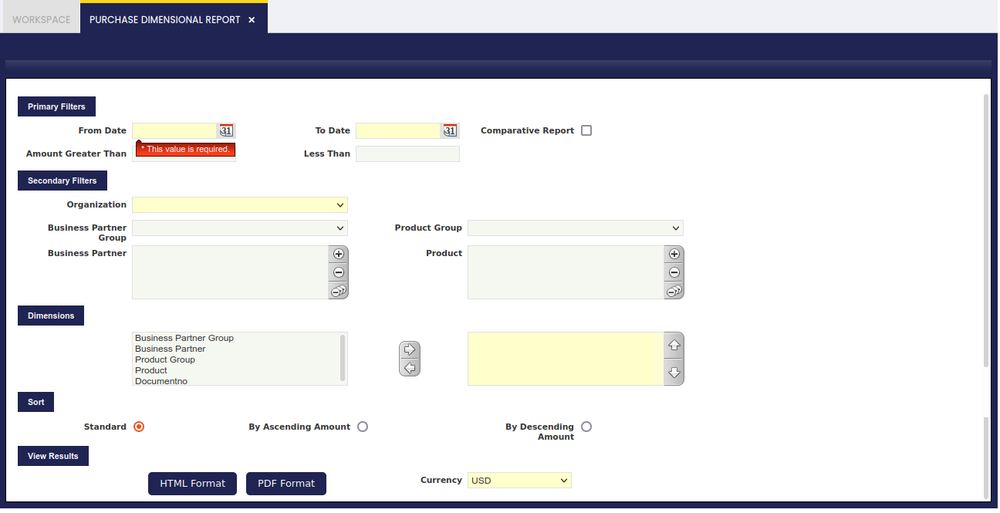
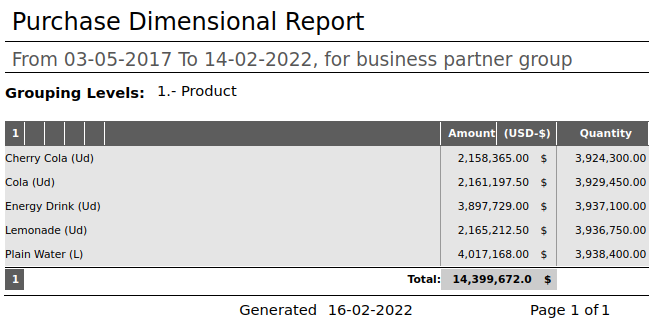
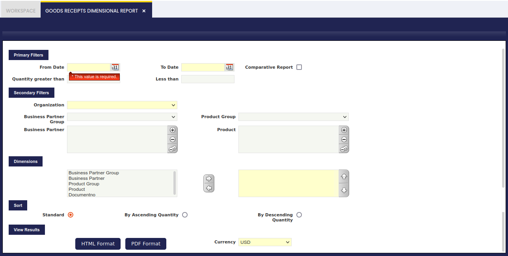
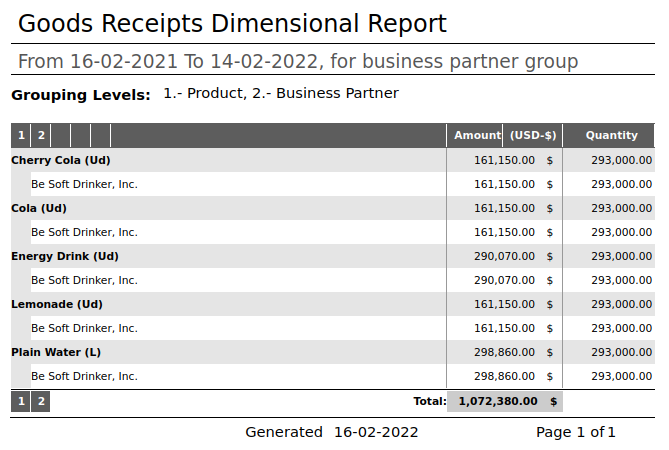
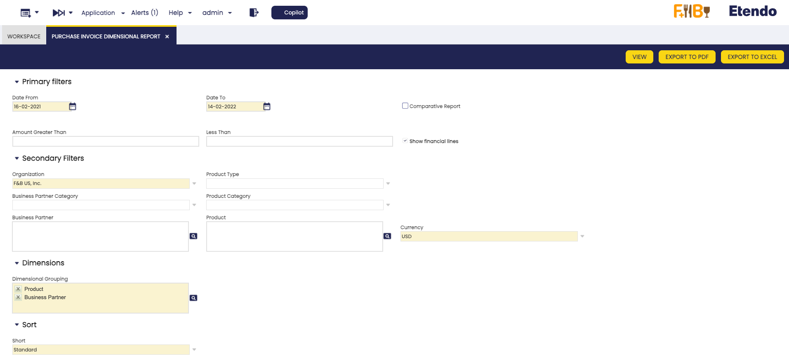
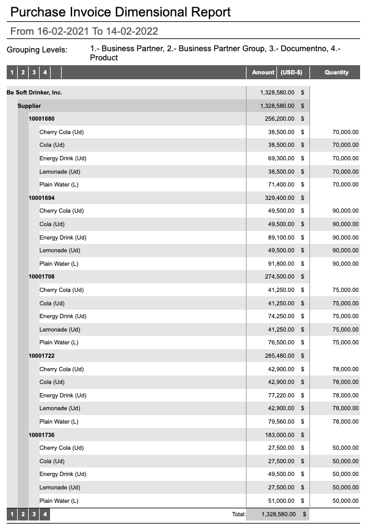
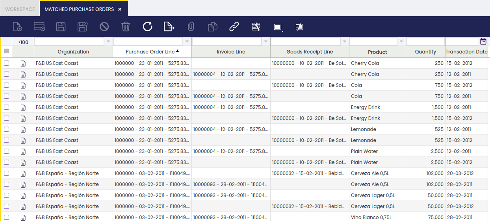
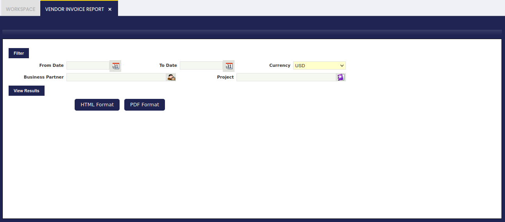
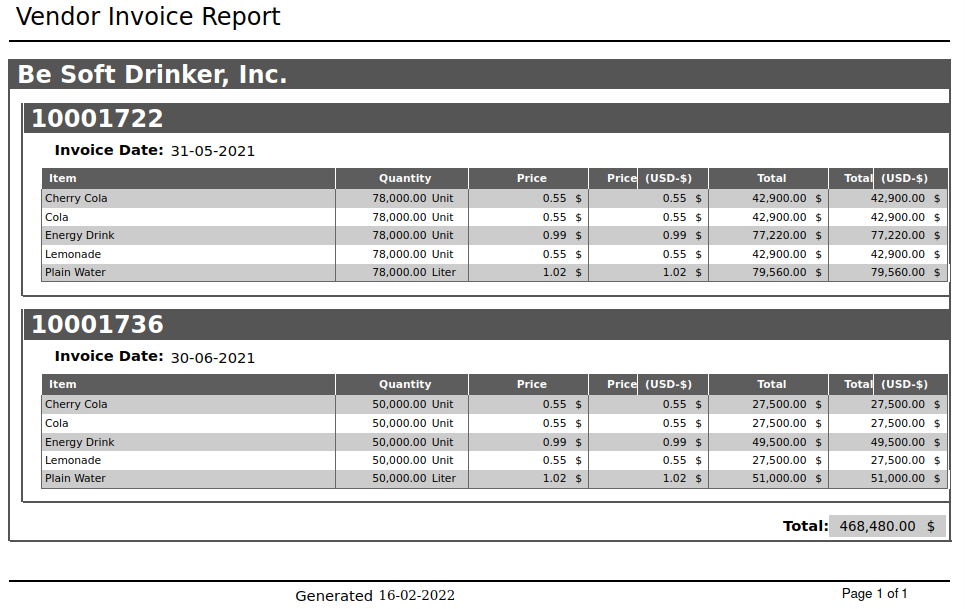

## Overview

This section describes the windows related to procurement reports in Etendo. These are:

[:material-file-document-outline: Purchase Order Report](../../../../user-guide/etendo-classic/basic-features/procurement-management/analysis-tools.md#purchase-order-report){ .md-button .md-button--primary }  

[:material-file-document-outline: Purchase Dimensional Report](../../../../user-guide/etendo-classic/basic-features/procurement-management/analysis-tools.md#purchase-dimensional-report){ .md-button .md-button--primary }  

[:material-file-document-outline: Goods Receipt Dimensional Report](../../../../user-guide/etendo-classic/basic-features/procurement-management/analysis-tools.md#goods-receipts-dimensional-report){ .md-button .md-button--primary }  

[:material-file-document-outline: Purchase Invoice Dimensional Report](../../../../user-guide/etendo-classic/basic-features/procurement-management/analysis-tools.md#purchase-invoice-dimensional-report){ .md-button .md-button--primary }  

[:material-file-document-outline: Matched Purchase Orders](../../../../user-guide/etendo-classic/basic-features/procurement-management/analysis-tools.md#matched-purchase-orders){ .md-button .md-button--primary }  

[:material-file-document-outline: Vendor Invoice Report](../../../../user-guide/etendo-classic/basic-features/procurement-management/analysis-tools.md#vendor-invoice-report){ .md-button .md-button--primary }  

## Purchase Order Report

:material-menu: `Application` > `Procurement Management` > `Analysis Tools` > `Purchase Order Report`

This report displays a detailed list of the purchase orders issued to the suppliers. 

## Purchase Dimensional Report

:material-menu: `Application` > `Procurement Management` > `Analysis Tools` > `Purchase Dimensional Report`

### Overview

This report displays information about the purchase orders issued and sent to the suppliers.

It is a dimensional type of report that shows information about registered purchases (Purchase Orders in a status Booked or Closed) during a selected period of time.

This report can display information about the most frequently used suppliers as well as the most frequently purchased goods, along with purchase amounts and ordered quantities information.

### Parameters window

There is no specific field to note, but just the dimensional primary and secondary filters which can be used to narrow down the information to be displayed.

### Sample Report Output

-   **Amount:** is the **net** amount from the Purchase Order converted to the report **Currency**.

## Goods Receipts Dimensional Report

:material-menu: `Application` > `Procurement Management` > `Analysis Tools` > `Goods Receipts Dimensional Report`

### Overview

This report displays information about the goods received in the organization.

This is a dimensional type of report that shows information about registered receipts during a selected period of time.

This report can display information about the most frequently used suppliers as well as the most frequently received goods, together with receipt amounts and receipt quantities information.

### Parameters window

There is no specific field to note but just the dimensional primary and secondary filters which can be used to narrow down the information to be displayed.

!!! tip
    The outcome of this report can be viewed in HTML format and PDF format.

### Sample Report Output

## Purchase Invoice Dimensional Report

:material-menu: `Application` > `Procurement Management` > `Analysis Tools` > `Purchase Invoice Dimensional Report`

!!! info
    To be able to include this functionality, the Financial Extensions Bundle must be installed. To do that, follow the instructions from the marketplace: [Financial Extensions Bundle](https://marketplace.etendo.cloud/#/product-details?module=9876ABEF90CC4ABABFC399544AC14558){target="_blank"}. For more information about the available versions, core compatibility and new features, visit [Financial Extensions - Release notes](../../../../../whats-new/release-notes/etendo-classic/bundles/financial-extensions/release-notes.md).

!!! warning
    If you do not have the [Financial Extensions Bundle](https://marketplace.etendo.cloud/#/product-details?module=9876ABEF90CC4ABABFC399544AC14558){target="_blank"}, the report will remain in a legacy version.

### Overview

This report displays information about the purchase invoices received in the organization. It is a dimensional type of report that shows information about registered purchase invoices (Purchase Invoices in a status *Completed* or *Voided*) during a selected period of time.

This report can display the total purchase amount of a given supplier, split by product and purchase invoice.

### Parameters Window

This report includes several filters and configuration options that allow you to customize the information displayed:

**Primary Filters:**

- **Date From / Date To** *(Mandatory)*: Define the time period for which you want to generate the report. These fields filter invoices based on their invoice date.
- **Amount Greater Than / Less Than**: Set monetary range filters to include only invoices above or below specific amounts. 
- **Comparative Report**: Checkbox to enable comparative analysis between different periods or criteria. When enabled, additional date fields are displayed to define the comparison period *(Default: No)*.
- **Show Financial Lines**: Checkbox to include or exclude financial lines in the report display *(Default: Yes)*.

**Secondary Filters:**

- **Organization** *(Mandatory)*: Filter invoices by the specific organization.
- **Business Partner Category**: Filter invoices by the category assigned to the business partner (vendor).
- **Business Partner**: Select one or multiple vendors to view only their invoices. Multiple business partners can be selected for broader filtering.
- **Product Type**: Filter by the type of products included in the invoices. Available options are:
    - **Expense type**: Products classified as expense items.
    - **Item**: Standard inventory items or goods.
    - **Resource**: Resources used in production or services.
    - **Service**: Service-type products.
- **Product Category**: Filter by the category of products included in the invoices.
- **Product**: Select one or multiple products to view invoices containing those particular items. Multiple products can be selected for broader filtering.
- **Currency** *(Mandatory)*: Select the currency in which amounts will be displayed in the report.

**Dimensions:**

- **Dimensional Grouping** *(Mandatory)*: Configure how data is grouped and displayed in the dimensional analysis. This determines both the dimensions by which data is grouped and the order in which they are applied. The available dimension options are:
  - **Business Partner**: Group data by vendor.
  - **Business Partner Group**: Group data by business partner categories.
  - **Product**: Group data by individual products.
  - **Product Group**: Group data by product categories.
  - **Document No**: Group data by invoice document numbers.

**Sort:**

- **Sort** *(Mandatory)*: Define the sorting criteria for the report results. Available sorting options are:
    - **Standard**: Default alphabetical sorting order by the selected dimensions.
    - **By Ascending Amount**: Sort results by amount from lowest to highest.
    - **By Descending Amount**: Sort results by amount from highest to lowest.

### Sample Report Output

This sample output shows the dimensional grouping with four grouping levels as indicated in the header: "1.- Business Partner, 2.- Business Partner Group, 3.- Document No, 4.- Product". The report displays:

- **Level 1 (Business Partner)**: "Be Soft Drinker, Inc." as the main vendor grouping with total amount of $1,328,580.00
- **Level 2 (Business Partner Group)**: "Supplier" category showing the vendor classification
- **Level 3 (Document No)**: Invoice numbers (10001680, 10001694, 10001708, 10001722, 10001736) with their respective subtotals
- **Level 4 (Product)**: Individual products (Cherry Cola, Cola, Energy Drink, Lemonade, Plain Water) showing amounts and quantities for each invoice

Each grouping level shows subtotals, and the report concludes with a grand total of $1,328,580.00, demonstrating the hierarchical structure of the dimensional analysis.

There is also the possibility to export this report to a PDF or a XLS file.

PDF format shows the same fields explained before, but in XLS format, it shows information related to selected invoices columns:

-   Organization
-   Business Partner Group
-   Business Partner
-   Document No.
-   Invoice Date
-   Product Category
-   Product
-   Product Search Key
-   Unit Price
-   Amount
-   Quantity

## Matched Purchase Orders

:material-menu: `Application` > `Procurement Management` > `Analysis Tools` > `Matched Purchase Orders`

### Overview

This window informs about the matching between each purchase order, goods receipt and invoice line.

### Matched Purchase Order

Matched purchase order view informs about which purchase order line is linked to which receipt line and invoice line, if any.

In other words, this window provides valuable information which helps to get a quick understanding of what order lines of a product have already been receipt and invoiced.

## Vendor Invoice Report

:material-menu: `Application` > `Procurement Management` > `Analysis Tools` > `Vendor Invoice Report`

### Overview

This report provides information about the total amount invoiced by each supplier within a given time period and for a given currency.

It displays supplier invoices information, which can be narrowed down in order to get information about those invoices related to a given project and/or to a given business partner within a given time period.

### Parameters Window

Field to note:

-   Currency: It works in the same way as already described in the Purchase Order report.

### Sample Report Output

---

This work is a derivative of [Procurement Management](http://wiki.openbravo.com/wiki/Procurement_Management){target="\_blank"} by [Openbravo Wiki](http://wiki.openbravo.com/wiki/Welcome_to_Openbravo){target="\_blank"}, used under [CC BY-SA 2.5 ES](https://creativecommons.org/licenses/by-sa/2.5/es/){target="\_blank"}. This work is licensed under [CC BY-SA 2.5](https://creativecommons.org/licenses/by-sa/2.5/){target="\_blank"} by [Etendo](https://etendo.software){target="\_blank"}.