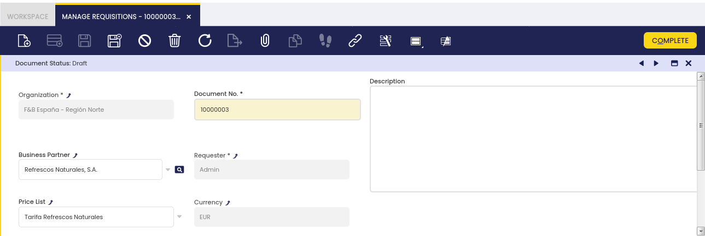
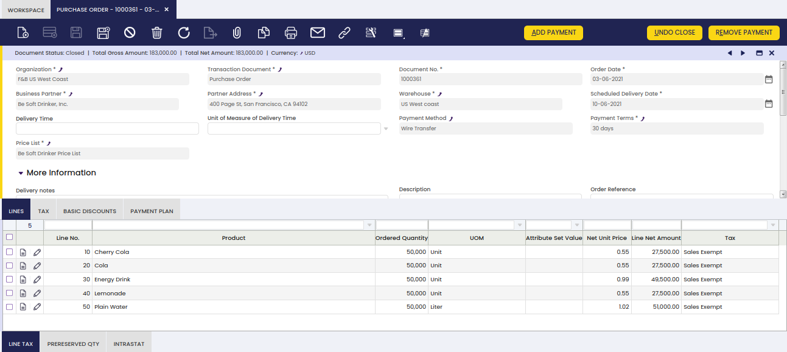
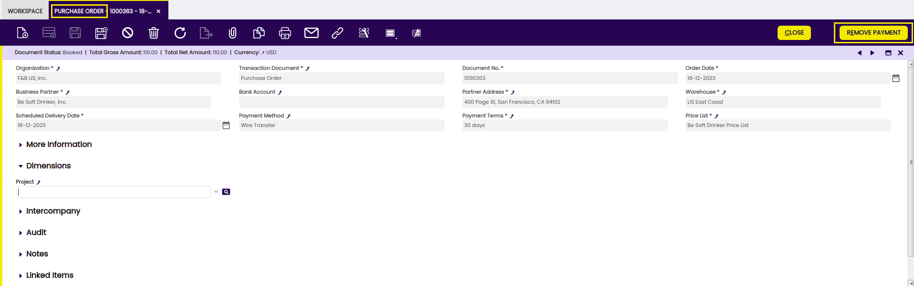
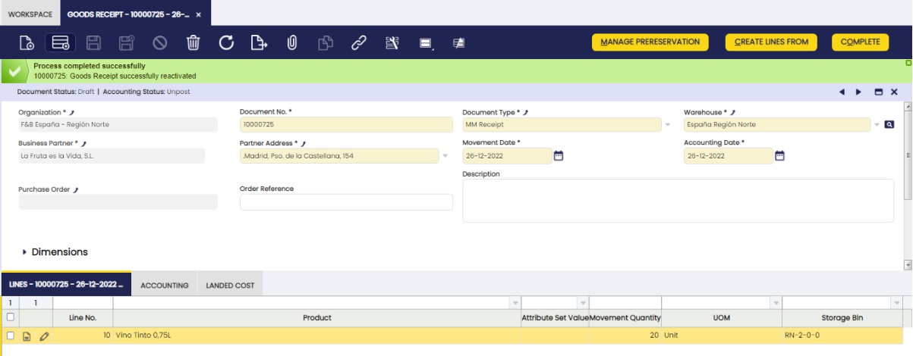

## Overview

Procurement management deals with all the activities related to the purchase of goods and services from external suppliers and the corresponding reporting.

The process starts by the creation and management of purchase requisitions and corresponding purchase orders to the moment the merchandise is received in the warehouse.

## Requisition

:material-menu: `Application` > `Procurement Management` > `Transactions` > `Requisition`

A Requisition is a document that specifies a request to order products.

The user can create requisitions and monitor them in this window:

### Header

Requisition header allows entering the following data:

- The business partner or supplier, this is an optional field that could be filled in by the requester in case it is known, therefore:
  - The supplier entered in the header will be the one used for every requisition line unless it is changed at lines level for a particular line.
  - If there is no supplier entered in the requisition header the one setup by default for the product in its master data window, *Purchasing* tab will be used.
  - If there is no business partner or supplier in the header, or in the lines, or setup in the product, the user will have to enter it while creating the purchase order from the requisition.
- The purchase price list. This is also an optional field to be filled-in, in case it is known by the requester and its behaviour is the same as described above as it is linked to the Business Partner.

Besides, the system populates the following data:

- The document No., which is the Requisition number.
- The requester, which is the user entering the requisition.

The requester can then move to the "Lines" tab to enter additional data.

### Lines

Each requisition line shows a product demand for a specific date.

Requisition "Lines" tab collects the following demand data:

- The *need by date*, that is the date when the product is required to arrive.
- The *product*, items/products which need to be purchased.
- The *quantity* requested, or the *operative quantity* requested if the product has an *alternative unit of measure (AUM)* configured.
- The product's *UOM*, or product's *Alternative UOM* depending on product configuration in regards to measure unit.
- The *business partner:* This is an optional field the user can enter if the supplier entered at the requisition header needs to be changed for a particular line.

!!! info
    If there is not a supplier entered at the requisition header, neither at the requisition line, the supplier used will be the one setup by default for the product, therefore this field at line level can also be used to overwrite that defaulted one.

- The *purchase price list*: This is also an optional field that can be entered if the price list entered at the header level or the default product price list information should be overwritten for a particular line.
- The *net list price*: This one is the price of the corresponding price list for a given date. It's an optional field that can be filled in automatically based on the price list entered at the header level or it could be overwritten by the user for a particular product line.
- The *net unit price:* This one can be either equal to the net list price or not, based on the formula: \[net unit price = net list price - discount\]. It is an optional field that can be filled in automatically based on the price list entered at the header level or it could be overwritten by the user for a particular product line.
- The *discount*, if any, is based on a used price list.

It is possible to enter as many requisition lines as products demand.

The last step is to register the *Requisition* as *Complete* by using the header button "Complete", then:

- *Requisition header status bar* informs us that the Requisition is *Completed*.
- *Requisition lines status bar* informs us that the *Matched purchase order quantity* for each line is equal to 0**, as there is no purchase order linked to each requisition line yet, and the requisition line/s status is *Open*.

It is important to remark that *Requisitions* does not have any impact on:

- Items quantity on hand
- Items costing

## Manage Requisitions

:material-menu: `Application` > `Procurement Management` > `Transactions` > `Manage Requisitions`

Manage Requisitions window is intended to be used to provide an overall picture of the items needed.

### Header

This window allows the user to manage requisitions regardless of their current status, therefore they can change or close a requisition and create purchase orders for those demands.

A **requisition** with status "Completed" **can always be changed**, if required. The user needs to reactivate it and then change it and book it.

It is also possible to **close a requisition in case there is no need of the included item/s anymore**, by using the menu button "**Close**" and then select the action "**Close**".

Requisition lines status will then be changed to "Cancelled".

Finally, it is also possible to **create purchase orders** for those **requisitions in status "Complete"**, by using the menu button "**Create Purchase Order**".

In this case, a new window is shown for the user to fill in some data by taking into account that:

- If there are **different suppliers in the requisition lines as well as price list**:
  - the **defaulted ones** entered in the window "Create Purchase Order" **will be the ones used** in the purchase order.
- If there are **different suppliers in the requisition lines as well as price list**, and the user does not enter any defaulted ones in the window "Create Purchase Order":
  - **the ones in the requisition lines will be the ones used** in the purchase orders.
- If **all the requisition lines have the same supplier and price list**:
  - **there will not be any need for selected defaulted ones** in the window "Create Purchase Order", besides only one purchase order will be created.

Etendo provides information about the purchase order/s number/s created after pressing the OK button in the "Create Purchase Order" window.

This action links the requisition and the purchase order, and besides a purchase order line is created for each requisition line:

- A **requisition** linked to a purchase order changes its status from **Completed** to **Closed**.
- A **requisition line** linked to a purchase order line changes its status from **Open** to **Closed**.

Any **purchase order** created from a **Requisition**:

- will be listed in the **"Purchase Order" window**.
- will have a "**Booked**" status
- and will contain **data inherited from the Requisition**, data such as:
  - Order Date
  - Scheduled Delivery Date
  - Business Partner
  - Price List
  - Product/s

### Lines

The user can perform a set of actions regarding requisition lines. It is possible for them to either create lines or product demands or to cancel them.

- **New product demands can be manually created** within a requisition by just **adding new requisition lines** before creating a purchase order.
- **Existing product demands or requisition lines can be cancelled**, if they are not required anymore, by using the header button "**Change Status**".

#### Matched PO (Purchase order) Lines

This tab allows the user to either review the purchase order line automatically linked to a requisition line or to manually link an existing purchase order line to the corresponding requisition line.

## Requisition to Order

:material-menu: `Application` > `Procurement Management` > `Transactions` > `Requisition to Order`

Requisition to Order window shows all the "Completed" requisitions which match the criteria used in the "filter" section and it also shows the requisition lines selected as locked, therefore the same product demand can not be included more than once in a purchase order.

In other words, the upper section of this window shows the requisition lines found that are not linked to an order yet.  
Those are the lines which can be added by the user to the "Lock" area in the bottom section of the window.

A requisition line locked can not be changed by any other user, until the one who locked it gets it unlocked.  
That way, during the time that the requisition lines are locked:

- The same product demand will not be included in a purchase order, by mistake.
- The purchase team will have the opportunity to review the stock and contact different vendors if required to negotiate a price for the products.
- If there is no activity during 3 days, the system removes the lock from the lines.

A requisition can be unlocked manually by the purchase manager or the one who locked it by moving it back to the upper part of the "Requisition to Order" screen by using the "Remove" button.

Once the product demands are clear and locked, the last step to take in this window is to create a purchase order for those needs using the process button "Create".

## Purchase Order

:material-menu: `Application` > `Procurement Management` > `Transactions` > `Purchase Order`

Purchase Order window allows the user to manage orders which once booked will be sent to the external suppliers. In other words, it is a document to register products and/or services to be purchased and documented.

Once the document is booked, it can be sent to the external supplier and it can be prepaid if required.

Purchase orders can be created and booked in the header section of the purchase order window.

### Header

The **Purchase order header** allows you to enter the following information:

- **Organization:** Organizational entity within client.
- **Transaction Document**, which in this case is defaulted as "**Purchase Order**".
- **Document No**, or the Company purchase order number.
- **Order date:** This date is also defaulted by Etendo based on the system date, but it can always be changed.
- **Business Partner**: End-user needs to select the supplier to which the purchase order is being issued.
- **Partner Address**: Automatically populated once the business partner is selected based on the address or location set us "Ship to Address".
- **Warehouse**: Regardless it is defaulted by Etendo based on the "Profile" selected options, it must be verified by the end-user.
- **Scheduled Delivery Date**: This is the date when the organization or legal entity requires the items to be delivered.
- **Payment Method**, **Payment Terms** and **Price List**: These ones are defaulted by Etendo once a business partner is selected.
- **Order Reference**, free text which can be found under "More Information" section, you can use it to save the supplier order number, if any.

In the **Status Bar** of the header, the user can find the following information:

- **Document Status**: Document status of the order. The order can be in booked, draft, closed status, among others.
- **Total Gross Amount**: Total Gross amount of the order.
- **Total Net Amount**: Total Net amount of the order.
- **Currency**: Currency of the order.
- **Delivery Status**: It indicates in % how much quantity of the order has been received.  
- **Invoice Status**: It indicates in % how much quantity of the order has been invoiced.  

**Once header information is properly filled-in, you can go to the "Lines" tab in order to enter purchase order line/s information**.

!!! info
    To learn how to enter purchase order lines, visit the next section [Lines](../../../../user-guide/etendo-classic/basic-features/procurement-management/transactions.md#lines_2).

It is possible to take up to **three possible actions regarding a purchase order**, by using the **header button "Book"**:

- **Process it**, in case you might want to process it but not to book it as final, because it could be you might need to change it later on.
- **Void it**, in case that purchase order is not required anymore and therefore needs to be voided.
- **Book it**, in case it is correct and final.

!!! info
    If there are non-stockable BOM products and they have not been exploded, the Book button explodes them automatically.

### Lines

Once the purchase order header has been properly filled in and saved, each purchase order line can be created in this tab.

Purchase order lines can be created in three different ways:

**1\. By manually creating new record/s in the "Lines" tab**.

The purchase order fields you can fill in are described below:

- **Product**. You can select an item or product from the list or use the product selector icon.
- **Ordered quantity**, or **Operative Quantity** if the product has an *alternative unit of measure (AUM)* configured. This is the quantity needed of the product/item.
- Product's **UOM**, or product's **Alternative UOM** depending on product configuration in regards to unit of measure.
- **Attribute Set Value. An attribute associated with a product as part of an attribute set.**
- **Net Unit Price**. This one is coming from the Price List selected in the header, but it could always be changed.
- **Line Net Amount. The final amount of a specified line, based only on quantities and prices.**
- **Tax**. Purchase tax is normally filled in by the system, depending on Taxes setup.

**2\. By retrieving all the lines from previously created purchase orders.** In this case, you must use the process button "**Copy from Orders**".

This process button enables the **Copy from Orders Pick and Edit** window.

"Copy from Orders Pick and Edit" window allows you to search the orders to copy by using the filter options available.

The lines information of the selected orders will be inserted in the purchase order line/s, then that information can be manually changed.

**3\. By copying lines from other purchase orders.**

In this case, you must use the process button **"Copy Lines".**

This process button enables a new window named "Copy Lines from order" which allows you to create order lines by selecting the products already purchased from the supplier of the order by taking into account the *Consumption days* configured for the supplier.

In the **Status Bar** of each line, you can find information about:

- **Delivered quantity**: number of received products of the line.
- **Invoiced quantity**: number of invoiced product of the line.

#### Explode button

Explode button is shown when selecting a line with a non-stockable BOM product and the product has not already been exploded. When exploding a product, the bill of materials components the selected product consists of are shown in the order.

!!! info
    Once you have exploded it, you cannot comprime it. You should delete all the lines (first bill of materials components and then the BOM product), and insert again the non-stockable BOM product.

#### Line Tax

For each purchase order line, Etendo automatically populates the line tax related information in this tab.

Line tax tab informs about each purchase order line:

- **applied tax rate**
- **calculated tax amount**
- **taxable amount**

!!! info
    It is not possible to either manually create a new line or modify existing ones.

#### Basic Discounts

Lists information about discounts automatically applied based on the supplier configuration and / or manually entered for the purchase order.

#### Payment Plan

This shows the total amount expected to be paid upon order booking as well as the amount/s pre-paid or paid against the invoice/s for the order.

Payment Plan information is required at order level because suppliers could ask for a **pre-payment** of all or part of a debt prior to its due date.

Purchase order payment plans **do not show nor manage valid due dates**, but the payment plan of the corresponding purchase invoice/s.

This tab also shows information about the regular payments received against the invoice/s for this order, as amounts paid.

Finally, a payment plan of a purchase order will be **removed**:

- if the purchase order is **reactivated**
- or if the purchase order is **voided**

#### Payment Details

Displays the details of the payments (pre-payments or regular payments) made for the order or for the invoice/s of the order.

### How to Reactivate a Closed Purchase Order

!!! info
    To be able to include this functionality, the Financial Extensions Bundle must be installed. To do that, follow the instructions from the [marketplace](https://marketplace.etendo.cloud/#/product-details?module=9876ABEF90CC4ABABFC399544AC14558){target="\_blank"}. For more information about the available versions, core compatibility and new features, visit [Financial Extensions - Release notes](../../../../whats-new/release-notes/etendo-classic/bundles/financial-extensions/release-notes.md).

!!! warning "Dependency Notice"
    This module depends on the [**Bulk Completion**](../../optional-features/bundles/essentials-extensions/bulk-completion.md) module, as **order** processing actions must be performed using modern processes that allow the triggering of Hooks, instead of legacy processing. Due to this requirement, the legacy **close/reactivate** actions for orders will be hidden and these actions will only be available through the **Bulk Completion** button.

Etendo allows the user to reactivate closed purchase orders by selecting the needed one/s and clicking the Undo Close button.

Once the process is finished, the purchase order status turns to booked.

!!! info
    Check the Technical documentation about Advanced Financial Docs Processing to extend the process.

### Payment Removal

The aim of this functionality is to delete and reactivate payments in an agile and easy way. Also, it allows eliminating and reactivating bank transactions and reconciliations.

!!! info
    To be able to include this functionality, the Financial Extensions Bundle must be installed. To do that, follow the instructions from the marketplace: [Financial Extensions Bundle](https://marketplace.etendo.cloud/#/product-details?module=9876ABEF90CC4ABABFC399544AC14558){target="\_blank"}. For more information about the available versions, core compatibility and new features, visit [Financial Extensions - Release notes](../../../../whats-new/release-notes/etendo-classic/bundles/financial-extensions/release-notes.md).

From this window, it is possible to remove payments associated with a purchase order by selecting the corresponding document and then clicking on the Remove Payment button. If there is an invoice associated with the order, the relationship of this invoice to the payment in question will also be removed (Purchase Invoice window > Payment Plan tab).

If the payment is included in the financial account, i.e., if it is in Deposited/Withdrawn not cleared status, the transaction in it will also be deleted (Financial account window > Transaction tab).

If the payment is reconciled through an automatic method, then in addition to the transaction in the financial account, the line of the bank statement to which it was linked (Financial Account window > Imported Bank Statements) and the corresponding line of the bank reconciliation (Financial Account > Reconciliations) will be deleted.

!!! info
    If the payment is posted, the accounting entry is deleted too.

### Intercompany

In case the user has to create orders or invoices among two or more organizations that are different but belong to the same client, this functionality allows automatically generating the corresponding inverse document.

!!! info
    For more information, visit [the Intercompany module user guide](../../../../user-guide/etendo-classic/optional-features/bundles/financial-extensions/intercompany.md).

!!! info
    To be able to include this functionality, the Financial Extensions Bundle must be installed. To do that, follow the instructions from the marketplace: [Financial Extensions Bundle](https://marketplace.etendo.cloud/#/product-details?module=9876ABEF90CC4ABABFC399544AC14558){target="\_blank"}. For more information about the available versions, core compatibility and new features, visit [Financial Extensions - Release notes](../../../../whats-new/release-notes/etendo-classic/bundles/financial-extensions/release-notes.md).

### Bulk Completion

!!! info
    To be able to include this functionality, the Essentials Extensions Bundle must be installed. To do that, follow the instructions from the marketplace: [Essentials Extensions Bundle](https://marketplace.etendo.cloud/#/product-details?module=39AC2D9F72124AC7A1D0A3D005293C9E){target="_blank"}. For more information about the available versions, core compatibility and new features, visit [Essential Extensions - Release notes](../../../../whats-new/release-notes/etendo-classic/bundles/essentials-extensions/release-notes.md).

The Bulk Completion functionality allows the user to complete, reactivate or close multiple records by selecting them and clicking the **Bulk Completion** button. This makes records management easier and more efficient, reducing the time spent processing individual records.

!!! info
    For more information, visit [the Bulk Completion module user guide](../../optional-features/bundles/essentials-extensions/bulk-completion.md).

### Advanced Bank Account Management

!!! info
    To be able to include this functionality, the Advanced Bank Account Management module of the Financial Extensions Bundle must be installed. To do that, follow the instructions from the marketplace: [Financial Extensions Bundle](https://marketplace.etendo.cloud/#/product-details?module=9876ABEF90CC4ABABFC399544AC14558){target="\_blank"}. For more information about the available versions, core compatibility and new features, visit [Financial Extensions - Release notes](../../../../whats-new/release-notes/etendo-classic/bundles/financial-extensions/release-notes.md).

This module adds a new field to the header of the Purchase Order window: **Bank Account**. This field is automatically filled with the bank account related to the adress or business partner of the order.

!!! info
    For more information, visit the [Advanced Bank Account Management user guide](../../optional-features/bundles/financial-extensions/advanced-bank-account-management.md).

## Goods Receipts

:material-menu: `Application` > `Procurement Management` > `Transactions` > `Goods Receipt`

A Goods Receipt is a document issued to acknowledge the receipt of the items listed in it. In other words, it is a document used to register in Etendo the specifics of items physically received in the warehouse.

### Header

Goods Receipts can be issued and booked in the header section of the goods receipt window.

The fields to fill in the **Goods Receipt header** are:

- **Document Type**, which is filled in by default as "MM Receipt".
- **Warehouse**, where goods are going to be located.
- **Business Partner**, third party which delivers the goods.
- **Movement Date**, delivery date of the goods.
- **Accounting Date**, accounting date in case of posting the Goods Receipt.
- **Purchase Order**, purchase order number linked automatically by Etendo, in case the Goods Receipt is automatically created from a Purchase Order.
- **Order Reference**, Warehouse team can fill in here the Supplier's Delivery Note number, this way the internal Goods Receipt number and the Supplier's Delivery Note number are linked.

In the **Status Bar** of the header, the user can find the following information:
 
- **Document Status**: Document status of the receipt.
- **Invoice Status**: It indicates in % how much quantity of the receipt has been invoiced. 

**Once header information is properly filled-in, you can then go to the "Lines" tab in order to enter "Goods Receipt Line/s"**.

!!! info
    To learn how to enter goods receipt lines, visit the next section [Lines](../../../../user-guide/etendo-classic/basic-features/procurement-management/transactions.md#lines_3)

If a **Goods Receipt** is completed and therefore **booked**:

- The **quantity on hand of the item/s received is increased** by the quantity received.

If a **"Completed" Goods Receipt is voided** because the goods have been returned to the supplier:

- **The quantity on hand of the items/s returned is decreased** by the quantity of the goods returned. Etendo automatically creates a new "Goods Receipt" for exactly the same items but with "negative" quantities.

!!! info
    To learn more about Goods Returns, visit *Return to Vendor* and *Return to Vendor Shipment*.

Supplier can send a "Purchase Invoice" together with the "Delivery Note" of the goods delivered, therefore:

- From the Goods Receipt window, it is possible to generate the corresponding supplier's invoice, by using the header process button "**Generate Invoice from Receipt**".

This action implies a **link between the goods receipt and the purchase invoice**, the user can be aware of when inquiring about the corresponding purchase invoice.

!!! info
    To learn more, visit [Purchase Invoice](../../../../user-guide/etendo-classic/basic-features/procurement-management/transactions.md#purchase-invoice).

### Lines

Once the goods receipt header has been properly filled in and saved, each item received can be listed as a separate goods receipt line.

There are several ways of creating goods receipt lines.

1.**The user can always manually create goods receipt lines.**  
That is the way the user could turn to in case there is not a booked purchase order nor a completed purchase invoice for the goods received they can retrieve data from.

As a consequence, the information to manually fill in is:

- the goods or items received
- the quantity received
- the storage bin where the items are going to be stored

**Explode** button is shown when selecting a line with a non-stockable BOM product and the product has not already been exploded. When exploding a product, the bill of materials components the selected product consists of are shown in the shipment. Once you have exploded it, you cannot comprime it. You should delete all the lines (first bill of materials components and then the BOM product), and insert again the non-stockable BOM product.

2.On the other hand, it is also possible to **"automatically" create goods receipt lines**, by using the header process button **"Create Lines From"**.

This allows the user to select the orders or invoices pending to be received.

For instance, once a purchase order is selected, the purchase order lines pending to be received are shown.

Then, the user is able to select the purchase lines received, change the quantity if required, and get them located in the warehouse.

Finally:

- If a purchase order/line is selected, this action **links each good receipt line to the corresponding purchase order line**, same applies to purchase invoice.

In the **Status Bar** of each line, you can find information about the **Invoiced quantity**, the number of invoiced products of the line.

#### Accounting

Accounting information related to the material receipt.

A **"Goods Receipts" can be posted** if the "**MaterialMgmtShipmentInOut**" table is set to Active for accounting in the \[*Active Tables*\] tab of the organization's general ledger configuration.

A "Goods Receipt" posting looks like:

Posting a "Goods Receipt" requires the calculation of the cost of the contained product/s.

In the case of a goods receipt, that is:

- the purchase price of the product/s
- or the default *standard cost* of the product/s in case of calculating cost by using an Standard *costing algorithm*.

If there is not a related purchase order, the Costing Server process uses the newer of the following three values:

- the last purchase order price of the receipt's vendor for the product.
- the purchase price list of the product.
- or the *default cost* of the product.

Moreover:

- The "Legal Entity" organization needs to have a validated *Costing Rule* configured.
- And the *Costing Background Process* needs to be scheduled for the *Client*, therefore it can search and allow that the *Costing Server* process calculates the cost of the transactions.

Once the costs have been calculated, the **Goods Receipt can be posted** to the ledger.

In the case of a receipt containing "Expense" product/s without the "Sales" checkbox selected, it is possible to use the product's purchase price instead of the product's cost to post the goods receipt.

This works if the checkbox *Book Using Purchase Order Price* is selected for the product/s.

In this case, it is required that a "Purchase Order" is related to the posted "Goods Receipt".

#### Voiding

It is possible to totally void a goods receipt by using the header button **"Close"** and then selecting the action "**Void**".

This action creates a **new document** that **reverses the goods receipt.**

Void action allows to specify a "**Void Date**" and a "**Void Accounting Date**" of the new document:

- **Void Date**: that is the movement date of the new document that reverse the goods receipt.
- **Void Accounting Date**: that is the accounting date of the new document that reverse the goods receipt.

Both fields above take original document dates as default date and validate that the dates entered are not prior to the "Movement Date" and the "Accounting Date" of the Goods Receipt, respectively.

Void action implies that:

- Etendo automatically generates a **new document** in the "Goods Receipt" window, and **informs about the document number** created. The document number is also displayed in the description field of the Goods Receipt. This new document is created as described below:
  - The "**transaction document**" used by Etendo is "**MM Receipt**".
  - This document is **exactly the same as the original** one being reversed **but the movement quantity is negative.**
  - Once the **new document** has been created, you can **change** both the "**Movement Date**" and the "**Accounting Date**" of the new document prior to getting it posted.

#### Landed Cost

Landed Cost tab allows to allocate additional costs to the goods receipt.

It is possible to enter as many landed cost types/lines as required.

Some relevant fields to note are:

- **Landed Cost Type**: that is the landed cost type that is going to be allocated to the goods receipt.
- **Invoice line**: that is to select the corresponding landed cost invoice line if any, that matches the landed cost type being entered.  
  If an invoice line is selected, the invoice line amount gets populated in the next field "Amount".
- **Amount**: that is the landed cost amount. This amount can be an "estimation" or a "real" amount in case of selecting an invoice line.
- **Landed Cost Distribution Algorithm**: that is the one distributed by Etendo "Distribution by Amount", which means that the landed cost amount is going to be distributed among the goods receipt lines proportionally by receipt line amount.

Once all items above are filled in, including corresponding landed cost purchase invoice line, both "Goods Receipt" and Landed Cost *process matching* are executed by clicking on the "**Complete**" process button.

### How to Reactivate Goods Receipts

!!! info
    To be able to include this functionality, the Warehouse Extensions Bundle must be installed. To do that, follow the instructions from the marketplace: [Warehouse Extensions Bundle](https://marketplace.etendo.cloud/#/product-details?module=EFDA39668E2E4DF2824FFF0A905E6A95){target="\_blank"}. For more information about the available versions, core compatibility and new features, visit [Warehouse Extensions - Release notes](../../../../whats-new/release-notes/etendo-classic/bundles/warehouse-extensions/release-notes.md).

From the Goods Receipt window, it is possible to reactivate a previously generated movement just by selecting the corresponding document and clicking the Reactivate button.

Once the receipt is successfully reactivated, the state of the document changes to Draft as it can be observed in the status bar.

!!! warning
    Note: It is not possible to reactivate documents that include transactions with quantities exceeding the existing stock quantity for a certain product in a certain storage bin. The only exception is when the configuration of the storage bin allows Over Issue. For more information, visit [Storage Bin](../../../../user-guide/etendo-classic/basic-features/warehouse-management/setup.md#storage-bin).

### Bulk Posting

!!! info
    To be able to include this functionality, the Financial Extensions Bundle must be installed. To do that, follow the instructions from the marketplace: [Financial Extensions Bundle](https://marketplace.etendo.cloud/#/product-details?module=9876ABEF90CC4ABABFC399544AC14558){target="\_blank"}. For more information about the available versions, core compatibility and new features, visit [Financial Extensions - Release notes](../../../../whats-new/release-notes/etendo-classic/bundles/financial-extensions/release-notes.md).

The Bulk Posting functionality allows the user to post or unpost multiple records by selecting the corresponding records and clicking the **Bulk posting** button.

Also, the Accounting Status of the record/s is shown in the status bar, in form view, or in a column, in grid view.

!!! info
    For more information, visit [the Bulk Posting module user guide](../../../../user-guide/etendo-classic/optional-features/bundles/financial-extensions/bulk-posting.md).

### Bulk Completion

!!! info
    To be able to include this functionality, the Essentials Extensions Bundle must be installed. To do that, follow the instructions from the marketplace: [Essentials Extensions Bundle](https://marketplace.etendo.cloud/#/product-details?module=39AC2D9F72124AC7A1D0A3D005293C9E){target="_blank"}. For more information about the available versions, core compatibility and new features, visit [Essential Extensions - Release notes](../../../../whats-new/release-notes/etendo-classic/bundles/essentials-extensions/release-notes.md).

The Bulk Completion functionality allows the user to complete, reactivate or void multiple records by selecting them and clicking the **Bulk Completion** button. This makes records management easier and more efficient, reducing the time spent processing individual records.

!!! info
    For more information, visit [the Bulk Completion module user guide](../../optional-features/bundles/essentials-extensions/bulk-completion.md).

## Pending Goods Receipts

:material-menu: `Application` > `Procurement Management` > `Transactions` > `Pending Goods Receipts`

This window allows the user to:

- **Use the Filter options** to narrow down the search of pending purchase orders to be delivered. It is possible to search by:
    - Business Partner
    - From Purchase Order Date -> To Purchase Order Date
    - Purchase Order number
- Enter a **"Reception date".**
- **Select** the "**Order line/s of a purchase order/s" delivered** which are shown grouped by Business Partner and Purchase Order.
- **Change** the "**Quantity**" of the goods being receipt if needed.
- **Enter** the "**Goods receipt location**" or storage bin within a warehouse.
- **Process it** in order to create the corresponding goods receipts.

## Purchase Invoice

:material-menu: `Application` > `Procurement Management` > `Transactions` > `Purchase Invoice`

### Overview

The Purchase Invoice window is used to **create, register, and manage supplier invoices for purchased goods and services**.

Purchase invoices are typically generated after the Goods Receipt is completed, ensuring that received quantities match the supplier’s billing information.

Invoices can be created in two ways:

1. Automatically, from a related Goods Receipt

2. Manually, by entering the invoice directly in this window

Each invoice defines the products or services, quantities, prices, taxes, and amounts to be paid to the supplier.

When the invoice is accounted, the corresponding purchase expenses are recognized in accounting. If a deferred expense plan is configured, expense recognition can be distributed over time according to the defined schedule.

### Header

The **Header** contains the basic information for a purchase invoice. In most cases you only need to select the Business Partner; the system will fill the rest from defaults and the selected partner.

Fields to note:

- **Transaction document**: defaults to AP Invoice or purchase invoice [document type](../financial-management/accounting/setup/document-type.md). You can change it to AP Credit Memo (positive-credit type, not linked to orders/shipments) or Reversed Purchase Invoice (negative amounts, for returns).
- **Document No.**: supplier invoice number if allowed by sequence, otherwise an internal number is used.
- **Invoice Date**: date of the invoice (used to calculate due date).
- **Accounting Date**: posting date for the ledger (defaults to Invoice Date).
- **Payment Terms**: how the invoice will be paid.
- **Payment Method**: when the invoice will be paid.
- **Supplier Reference**: optional supplier reference number.

How to add lines:

1. Use **Create Lines From Order** or **Create Lines From Receipt** to pull pending items.
2. Use **Copy Lines** to copy lines from an existing invoice.
3. Add lines manually in the **Lines** tab when there is no related order or receipt.

Complete and next steps:

- Click **Complete** to finish the invoice; this creates the Payment Plan and updates the Payment Monitor. Non-stockable BOMs will be exploded automatically if needed.

After completion you can:

- **Post** the invoice to the ledger with the [Post](#post) button.
- **Void/Reactivate** using [Reactivate](#reactivate).
- **Add Payment** with [Add Payment](#add-payment).

### Lines

Once the Purchase Invoice header is saved, add one or more invoice lines for the products or expenses being billed.

Fields to note:
- **Financial Invoice Line**: Select this for lines that are not products (for example, a G/L item or an asset). The Product field is replaced by an Account field.
- **Attribute Set Value**: Shown if the product uses attributes (color, size, serial number, etc.).
- **Purchase Order Line / Goods Receipt Line**: Links the invoice line to the related PO or Goods Receipt line, if any.

Deferring expenses (optional):
- **Deferred Expense**: Check this to spread the expense over time and reveal the expense-plan fields.
- **Expense Plan Type**: Frequency of recognition (currently: monthly).
- **Period Number**: Number of periods to distribute the expense (e.g., enter 12 to spread over 12 months). For instance, if a company purchases business insurance for the duration of the year, the period number to enter would be 12 as the company would like to distribute that expense over 12 months.

- **Starting Period**: First open period when recognition begins.

These expense-plan values can be defaulted from the product. If an expense plan is used, the invoice accounting will follow that plan.

**Explode Button**

The **Explode** button appears when the selected line contains a non-stockable BOM product that hasn't been exploded yet. Exploding replaces the BOM line with its components in the invoice. This action cannot be undone — to revert it, delete the component lines first and then re-add the non-stockable BOM product.

**Match LC Cost**

The **Match LC Cost** button allows you to match the **estimated landed cost** defined in the **Landed Cost window** with the **invoiced landed cost** entered in an invoice line.

This option is available when the purchase order or invoice line contains a **product** or **account** configured as a **landed cost type**.

Both costs must belong to the **same landed cost type** to be matched.

Matching helps to:

- Reconcile estimated and invoiced landed costs  
- Keep product costs accurate  
- Generate the correct accounting entries  

After clicking **Match LC Cost**, the **Match LC Cost** pick-and-edit window opens.

Only **processed Landed Cost documents** are displayed.

From this window, you can:

- Select the corresponding landed cost document  
- Enter the amount in **Matched Amt**  
- Enable **Process Matching** to complete the process immediately 

The **Is Matching Adjusted** checkbox controls how differences between estimated and invoiced costs are handled:

- **Checked** → Creates an additional landed cost adjustment to update the product cost  
- **Unchecked** → No cost adjustment is created  

**Scenarios**

1. Estimated = Invoiced

- Only matching is posted to the ledger  
- No adjustments are created  

2. Estimated ≠ Invoiced + Adjustment enabled

- A landed cost adjustment is created  
- Product cost is updated to the invoiced amount  
- Matching and adjustment are posted  

3. Estimated ≠ Invoiced + Adjustment disabled

- Only matching is posted  
- Product cost is not modified  

#### Line Tax

Line tax information is automatically populated for each purchase invoice line upon completion of the invoice.

**Line Tax** read-only tab details tax information for each line of a purchase invoice based on its Tax field which is automatically pre-filled according to the Taxes Setup.

### Tax

This section summarizes tax related information for the whole purchase invoice. It contains as many records as tax rates used in the invoice. 

The Tax Amount field reflects the tax value calculated automatically based on the tax rate and tax base settings.

!!! info 

    It is possible to add a feature that allows controlled adjustments to invoice tax amounts to reconcile small **rounding differences** with external systems or when invoices are submitted to **governmental entities**. It supports both **sales** and **purchase** invoices, offers **manual and automated adjustments** for minimal corrections at cents level, and records all changes for **auditability**, ensuring the final invoice total matches external, governmental, or regulatory requirements.
    
    To be able to include this functionality, the Financial Extensions Bundle must be installed. To do that, follow the instructions from the marketplace: [Financial Extensions Bundle](https://marketplace.etendo.cloud/#/product-details?module=9876ABEF90CC4ABABFC399544AC14558){target="_blank"}. 
    
    For more information, visit: [Adjust Invoice Tax user guide](../../optional-features/bundles/financial-extensions/adjust-invoice-tax.md)
    
    This functionality is compatible from Etendo 23.

### Buttons

#### Post/Unpost

A purchase invoice can be posted to the ledger when required at a given Accounting Date by using this process button. Once posted, it can be unposted with the same button.

#### Reactivate

Using this button, the user has two options: reactivating or voiding the Completed invoice.

In the case of the **Reactivate** option, it turns the record from Completed into Draft status. 

With the **Void** option, it is possible to totally void a purchase invoice. This action creates a new document that reverses the invoice.

Voiding allows specifying a **Void Date** and a **Void Accounting Date** for the new document that reverses the invoice.

Both date fields above take the current date as default date and validate that the dates entered are not prior to the invoice date and the invoice accounting date, respectively.

Also, this process window includes a **Supplier Reference** field to enter the supplier reference number to refer to the reversed document resulting from the invoice voiding. Here, you can enter the corresponding number or leave the field blank to complete it later.

This action implies that:

- Etendo automatically generates a new document in the *Purchase Invoice* window that reverses the original invoice.
- Etendo also informs about the new document number. This new document is created as described below:
    
    The transaction document used by Etendo is the *Reversed Purchase Invoice*. This document is exactly the same as the original one being reversed but the invoiced quantity is negative.

- Once the new document has been created, you can change both the *Invoice Date* and the *Accounting Date* of the new document prior to get it posted. You can also enter the Supplier Reference if not entered before or modify the existing one.

- The *Reversed Invoices* tab lists the original invoice being reversed as now both of them are linked.

    And it is also possible to partially void a supplier invoice by:

    - Manually creating any of the available reversed purchase documents, in the [Purchase Invoice](#purchase-invoice) window:
        
        - **AP Credit Memo** or
        - **Reversed Purchase Invoice**

    - which besides must be manually linked to the invoice/s being reversed in the **Reversed Invoices** tab.
    
    To learn more visit [Reversed Invoices](../sales-management/transactions.md#reversed-invoices).

    The **AP Credit Memo** posting looks the same as the **Reversed Purchase Invoice** posting. The main difference between those two purchase reversed document types is:

    - **AP Credit Memo** invoiced quantity is a positive quantity.
    - and **Reversed Purchase Invoice** quantity is a negative quantity

    !!!note
        We strongly recommend you to use the **Reversed Purchase Invoice** document type while partially voiding supplier's invoices.

#### Add Payment 

Payment/s can be made against a purchase invoice by using the Add Payment button which opens the Add Payment pop-up window.

#### Bulk Posting

!!! info
    To be able to include this functionality, the Financial Extensions Bundle must be installed. To do that, follow the instructions from the marketplace: [Financial Extensions Bundle](https://marketplace.etendo.cloud/#/product-details?module=9876ABEF90CC4ABABFC399544AC14558){target="\_blank"}. For more information about the available versions, core compatibility and new features, visit [Financial Extensions - Release notes](../../../../whats-new/release-notes/etendo-classic/bundles/financial-extensions/release-notes.md).

The Bulk Posting functionality allows the user to post or unpost multiple records by selecting the corresponding records and clicking the **Bulk posting** button.

Also, the Accounting Status of the record/s is shown in the status bar, in form view, or in a column, in grid view.

!!! info
    For more information, visit [the Bulk Posting module user guide](../../../../user-guide/etendo-classic/optional-features/bundles/financial-extensions/bulk-posting.md).

#### Bulk Completion

!!! info
    To be able to include this functionality, the Essentials Extensions Bundle must be installed. To do that, follow the instructions from the marketplace: [Essentials Extensions Bundle](https://marketplace.etendo.cloud/#/product-details?module=39AC2D9F72124AC7A1D0A3D005293C9E){target="_blank"}. For more information about the available versions, core compatibility and new features, visit [Essential Extensions - Release notes](../../../../whats-new/release-notes/etendo-classic/bundles/essentials-extensions/release-notes.md).

The Bulk Completion functionality allows the user to complete, reactivate or void multiple records by selecting them and clicking the **Bulk Completion** button. This makes records management easier and more efficient, reducing the time spent processing individual records.

!!! info
    For more information, visit [the Bulk Completion module user guide](../../optional-features/bundles/essentials-extensions/bulk-completion.md).

!!!warning
    The bulk voiding option fails when the [Purchase Invoice Validation](../../optional-features/bundles/procurement-extensions/purchase-invoice-validation.md) module is installed. This is because the module includes a default preference that prevents the duplication of invoices with the same business partner, accounting year, and supplier reference. Since massive voiding attempts to reverse invoices, it leads to duplication, as the supplier reference for each reversed invoice cannot be modified. As a result, the module prevents the bulk voiding process from functioning.
    

#### Remove Payment

The aim of the Payment Removal functionality is to delete and reactivate payments in an agile and easy way. Also, it allows eliminating and reactivating bank transactions and reconciliations.

!!! info
    To be able to include this functionality, the Financial Extensions Bundle must be installed. To do that, follow the instructions from the marketplace: [Financial Extensions Bundle](https://marketplace.etendo.cloud/#/product-details?module=9876ABEF90CC4ABABFC399544AC14558){target="\_blank"}. For more information about the available versions, core compatibility and new features, visit [Financial Extensions - Release notes](../../../../whats-new/release-notes/etendo-classic/bundles/financial-extensions/release-notes.md).

From this window, it is possible to delete payments associated with a purchase invoice by selecting the corresponding document and then clicking on the Remove Payment button. If there is an order associated with the invoice, the relationship of this order to the payment in question will also be deleted (Purchase Order window > Payment Plan tab).

If the payment is included in the financial account, i.e., if it is in Deposited/Withdrawn not cleared status, the transaction in it will also be deleted (Financial account window > Transaction tab).

If the payment is reconciled through an automatic method, then in addition to the transaction in the financial account, the line of the bank statement to which it was linked (Financial Account window > Imported Bank Statements) and the corresponding line of the bank reconciliation (Financial Account > Reconciliations) will be deleted.

!!! info
    If the payment is posted, the accounting entry is deleted too.

#### Unvoid

!!! info
    To be able to include this functionality, the Financial Extensions Bundle must be installed. To do that, follow the instructions from the [marketplace](https://marketplace.etendo.cloud/#/product-details?module=9876ABEF90CC4ABABFC399544AC14558){target="\_blank"}. For more information about the available versions, core compatibility and new features, visit [Financial Extensions - Release notes](../../../../whats-new/release-notes/etendo-classic/bundles/financial-extensions/release-notes.md).

Etendo allows the user to reactivate voided purchase invoices by selecting the needed one/s and clicking the Unvoid button.

Once the process is finished, the sales invoice status turns to Complete.

???+ note 
    In the case of the standard version of the module, it is necessary for the user to also unvoid the corresponding reversed invoice.
!!! warning
    Remember that this reactivation process affects the accounting, since, if the original information is not manually removed from the reactivated document, the accounting information will be doubled.

!!! info
    Check the Technical documentation about [Advanced Financial Docs Processing](../../../../developer-guide/etendo-classic/bundles/financial-extensions-bundle/overview.md#advanced-financial-docs-processing) to extend the process.

#### Modify Payment Plan

!!! info
    To be able to include this functionality, the Advanced Bank Account Management module of the Financial Extensions Bundle must be installed. To do that, follow the instructions from the marketplace: [Financial Extensions Bundle](https://marketplace.etendo.cloud/#/product-details?module=9876ABEF90CC4ABABFC399544AC14558){target="\_blank"}. For more information about the available versions, core compatibility and new features, visit [Financial Extensions - Release notes](../../../../whats-new/release-notes/etendo-classic/bundles/financial-extensions/release-notes.md).

The Advance Bank Account Management module adds a new field to the header of the Purchase Invoice window: **Bank Account**. This field is automatically filled with the bank account related to the adress or business partner of the invoice. Also, the Modify Payment Plan button is added for better payment management.

!!! info
    For more information, visit the [Advanced Bank Account Management user guide](../../optional-features/bundles/financial-extensions/advanced-bank-account-management.md).

### Intercompany

In case the user has to create orders or invoices among two or more organizations that are different but belong to the same client, this functionality allows automatically generating the corresponding inverse document.

!!! info
    For more information, visit [the Intercompany module user guide](../../../../user-guide/etendo-classic/optional-features/bundles/financial-extensions/intercompany.md).

!!! info
    To be able to include this functionality, the Financial Extensions Bundle must be installed. To do that, follow the instructions from the marketplace: [Financial Extensions Bundle](https://marketplace.etendo.cloud/#/product-details?module=9876ABEF90CC4ABABFC399544AC14558){target="\_blank"}. For more information about the available versions, core compatibility and new features, visit [Financial Extensions - Release notes](../../../../whats-new/release-notes/etendo-classic/bundles/financial-extensions/release-notes.md).

## Matched Purchase Invoices

:material-menu: `Application` > `Procurement Management` > `Transactions` > `Matched Purchase Invoices`

This window helps the user to post the discrepancies between inventory and financial accounting of those items for which the corresponding goods receipts were posted.

Above mentioned discrepancies are mainly caused by differences between:

- the **item's net unit price registered when booking the purchase order** and later on **posting the corresponding Goods Receipt.**
- and the **"final" item's net unit price registered when posting the purchase invoice.**

In the window, there is a listing of all invoices that are matched to goods receipts. The matching of the documents is done when documents are created by using the information of the other document: for example by clicking the Generate Invoice from receipt on the goods receipt or by clicking the Create Lines from button when creating a goods receipt to select the invoice.

#### Matched Purchase Invoice

Matched Purchase Invoice tab lists each invoice line posted linked to the corresponding goods receipt lines, which could also be posted or not.

There is a "**Post**" header button which is the one that posts the discrepancies between inventory and financial accounting if any, once the proper line has been selected.

The general process to post the discrepancies in accounting is detailed below:

A *Matching Invoice* document can be posted if the cost of the products included in a *Goods Receipt* has been calculated. To obtain that:

- A validated *Costing Rule* is required in the Matched Invoice's legal entity,
- and the background process *Costing Background Process* must be run.

In the case of "Expense" product/s do not having the "Sales" checkbox selected, it is possible to use the product's purchase price instead of the product's cost whenever the checkbox *Book Using Purchase Order* Price is selected. In this case, it is required that a "Purchase Order" is related to the "Goods Receipt".

#### Accounting

Accounting information related to the matched purchase invoices.

### Bulk Posting

!!! info
    To be able to include this functionality, the Financial Extensions Bundle must be installed. To do that, follow the instructions from the marketplace: [Financial Extensions Bundle](https://marketplace.etendo.cloud/#/product-details?module=9876ABEF90CC4ABABFC399544AC14558){target="\_blank"}. For more information about the available versions, core compatibility and new features, visit [Financial Extensions - Release notes](../../../../whats-new/release-notes/etendo-classic/bundles/financial-extensions/release-notes.md).

The Bulk Posting functionality allows the user to post or unpost multiple records by selecting the corresponding records and clicking the **Bulk posting** button.

Also, the Accounting Status of the record/s is shown in the status bar, in form view, or in a column, in grid view.

!!! info
    For more information, visit [the Bulk Posting module user guide](../../../../user-guide/etendo-classic/optional-features/bundles/financial-extensions/bulk-posting.md).

## Return to Vendor (RTV)

:material-menu: `Application` > `Procurement Management` > `Transactions` > `Return to Vendor`

This window allows the user to create a Return Material document in case a given product needs to be sent back either to be returned for a refund or replacement, or to be repaired.

### Header

The user can create a purchase order and process it.

Once the Return Material document is accepted by the Vendor, the user can process it by clicking the button **Book**. The document changes from *Draft* to *Booked*.

Only *Booked* documents can be shipped to the vendor.

!!! warning
    Notice the button **Pick/Edit lines** disappears when the Return to vendor document is in status *Booked*.

### Lines

Add products to be included in your purchase order. Each product is added by creating a line.

The Lines tab is not editable, since the returned lines always come from receipt lines, to avoid:

- Seeing positive values while negative in the DB.
- Entering lines that are not linked to the original receipt lines.
- Editing attributes, products and so having either the products or attributes different from the shipment line.

To enter new lines you need to click the process button PICK/EDIT Lines.

**Things to consider:**

- The only editable fields are:
  - **Returned**: Quantity you wish to return. When selecting the row, the quantity is not set by default since the system cannot know how many items return.
  - **Net Unit Price**: Price of the original purchase order.
  - **Return reason**: The reason why you return the item.
  - and **Returned UOM**, only in case \*alternative unit of measure (AUM)\*preference is enabled.  
    In that case, product's "primary" AUM for the purchase flow is shown if any, otherwise product's UOM is shown. The user can always change it to product's UOM.

You can define the Return Reason at header level. In this case when picking a line it inherits what selected in the header but you can modify it as you wish.

- Only Material receipt documents that have not been still returned can be picked it, in case a Receipt line has been fully returned it will not be shown.
- When a Receipt line has been partially returned you can still return the rest. What you have already returned for that line is shown in the field **Return Qty other R.**

**Validations:**

- You are not allowed to return more quantity than the **Ship/Receipt Qty**. In case you do it a message is shown.
- Notice that this validation takes into account the **Return Qty other RM** field

!!! info
    To edit a line you need to click again the **Pick/Edit Lines** button and the line appears selected and then you can modify any of the editable fields.

!!! info
    To delete a line you need to unmark the line and then click Done.

### Bulk Completion

!!! info
    To be able to include this functionality, the Essentials Extensions Bundle must be installed. To do that, follow the instructions from the marketplace: [Essentials Extensions Bundle](https://marketplace.etendo.cloud/#/product-details?module=39AC2D9F72124AC7A1D0A3D005293C9E){target="_blank"}. For more information about the available versions, core compatibility and new features, visit [Essential Extensions - Release notes](../../../../whats-new/release-notes/etendo-classic/bundles/essentials-extensions/release-notes.md).

The Bulk Completion functionality allows the user to complete, reactivate or close multiple records by selecting them and clicking the **Bulk Completion** button. This makes records management easier and more efficient, reducing the time spent processing individual records.

!!! info
    For more information, visit [the Bulk Completion module user guide](../../optional-features/bundles/essentials-extensions/bulk-completion.md).

## Return to Vendor Shipment

:material-menu: `Application` > `Procurement Management` > `Transactions` > `Return to Vendor Shipment`

From this window, the user can deliver the returned goods to the vendor.

### Header

The user can create and edit a goods receipt.

The **RMA vendor ref.** field is populated automatically or not based on:

- If it is filled before selecting a line, then it will not be populated automatically to avoid override it.
- If you select a line/s where all of them belong to the same Return to Vendor document, it will be populated automatically.
- If you select a line/lines but one of them belongs to a different Return to Vendor document, then it will not be populated automatically.

Once the document is ready, you can process it by clicking the button **Complete**. The document changes from *Draft* to *Completed*.

!!! warning
    Notice the button **Pick/Edit lines** disappears when the Return to vendor document is in status *Completed*.

To invoice these documents you must use the **Purchase invoice** window. All scenarios are covered:

- If the vendor sends an invoice just for that specific document you need to select a *Reverse purchase invoice* document type and then select the lines through the *Create lines* from button.
- If the vendor sends an invoice with the original purchase order plus the return materials order you need to select a *Purchase invoice* document type and then select the lines through the *Create lines* from button.
- If the vendor does not send an invoice for the return materials order but wants to keep it as credit where you can use it later, you have to:
  - Create a *Reverse purchase invoice* for these returned materials.
  - Leave it as credit to be used later through the **Payment out** window.
  - When you create the Purchase invoice for the original Purchase order you can consume that credit.

### Lines

Add products which are included in your goods receipt. Each product is shown on its own line.

The Lines tab is not editable, since the lines always come from return to vendor lines, to avoid:

- Seeing positive values while negative in the DB.
- Entering lines that are not linked to return lines.
- Editing attributes, products and so having either the products or attributes different from the return line.

!!! info
    To enter new lines, the user needs to click the button PICK/EDIT Lines.

**Things to consider:**

- Editable fields are:
  - **Ship Qty**, that value is set automatically when you select the line,
  - and **Returned UOM**, only in case an alternative unit of measure (AUM) preference is enabled, regardless product's UOM is always shown there by default.  
    The user can change it if required, to the product's primary AUM configured for the procurement flow.
- The user can only select Return to Vendor lines that are pending to be shipped to that specific vendor.
- The system proposes the different storage bins from where the item can be picked. Depending how the product is configured we could have three scenarios:
  - Product with an instance attribute (i.e: Serial number): The system will propose only one storage bin as it is shown above.
  - Product with a non-instance attribute (i.e: Colour): The system could propose several storage bins. See below image
  - Product without attributes. Similar to second scenario.

**Validations:**

- You are not allowed to ship more than the **Available Qty.**
- You are not allowed to ship more than the **Pending** quantity.
- The system also validates you cannot ship more than the **Pending** quantity when selecting both lines.

!!! info
    To edit a line, you need to click the **Pick/Edit Lines** button again, the line appears selected and then you can modify any of the editable fields.

!!! info
    To delete a line, you need to unmark the line and then click Done.

If there is not enough available stock for a product in a selected line, then it will be possible to define a Ship Quantity and select it. if there is at least one storage bin with overissue inventory status for the Return To Vendor Shipment's warehouse, in this case the new line will use it as storage bin and it will create a negative stock when the document is processed.

#### Accounting

The RTV shipment can be posted **if the table "MaterialMgmtShipmentInOut" is** active for accounting **in the corresponding general ledger configuration.**

### Bulk Posting

!!! info
    To be able to include this functionality, the Financial Extensions Bundle must be installed. To do that, follow the instructions from the marketplace: [Financial Extensions Bundle](https://marketplace.etendo.cloud/#/product-details?module=9876ABEF90CC4ABABFC399544AC14558){target="\_blank"}. For more information about the available versions, core compatibility and new features, visit [Financial Extensions - Release notes](../../../../whats-new/release-notes/etendo-classic/bundles/financial-extensions/release-notes.md).

The Bulk Posting functionality allows the user to post or unpost multiple records by selecting the corresponding records and clicking the **Bulk posting** button.

Also, the Accounting Status of the record/s is shown in the status bar, in form view, or in a column, in grid view.

!!! info
    For more information, visit [the Bulk Posting module user guide](../../../../user-guide/etendo-classic/optional-features/bundles/financial-extensions/bulk-posting.md).

## Landed Cost

:material-menu: `Application` > `Procurement Management` > `Transactions` > `Landed Cost`

Landed Cost window allows the user to allocate additional costs such as freight, insurance or duties to goods receipt(s), therefore the cost of the products included in the receipt(s) is adjusted as applicable.

All those costs are needed to place the product in the organization's warehouse.

Every time that a landed cost is booked for a product receipt valued at "Average" cost, a landed cost adjustment is created.

Landed costs distributed and allocated to products valued at "Average" cost imply a change in the inventory value of the product. In other words, the calculated cost ("Total Cost") of the product receipt will need to be adjusted the same as the "Average" cost of the product.

!!! info
    Note that the "Unit Cost" of the receipt transaction will not change as this type of adjustment is not a unit cost adjustment type but an "extra" cost.

All of the above will have an accounting impact, therefore product inventory value can be the same as product accounting value.

On the other hand, if a landed cost is booked for a product receipt valued at "Standard" cost, no cost adjustment will be created but a "Variance" between the "standard" cost defined for the product and its "actual" cost. This variance will need to be posted to a "Landed Cost Variance" account, so it can be later on analysed.

Landed cost window allows both:

- either to book "**estimated**" landed cost that can be later on matched against "actual" landed cost by landed cost type,
- or directly book "**actual**" landed cost by landed cost type.

Landed cost window also allows to post landed costs once processed.

"**Estimated**" Landed Cost scenario:

- A purchase order is booked and after that the corresponding goods receipt and purchase invoice.  
  The "average" cost of the products included in the receipt is calculated at this point.
- After that "estimated" landed costs (i.e freight costs) are allocated to the goods receipt and booked in the landed cost window.  
  The cost of the products included in the receipt is then adjusted the same as products asset accounting.
- After that, a purchase invoice including the actual amount of freight cost is booked and posted to the ledger.
- Then, it is possible to match "estimated" landed cost against "invoiced" landed cost.  
  The cost of the products included in the receipt is adjusted once more if there are differences between estimated and actual landed cost amounts.

"**Actual**" Landed Cost scenario:

- A purchase order is booked and after that, the corresponding goods receipt and purchase invoice.  
  The "average" cost of the products included in the receipt is calculated at this point.
- After that, a landed cost document is created to record actual landed cost to the goods receipt.  
  The cost of the products included in the receipt is then adjusted the same as products asset accounting.

In Summary, landed cost feature follows below detailed steps:

- **Landed Cost Process**:
  - A landed cost document is created including as many different landed cost types and amounts as required.
  - This landed cost document can be related to a single goods receipt, to several goods receipts or to specific goods receipts lines.
  - This landed cost document can record "actual" landed cost in case of selecting the corresponding invoice, therefore the landed cost process and matching is done in one step.
  - Landed cost is processed.
    - This action creates a *landed cost adjustmen* linked to the landed cost document.  
      This cost adjustment has as many adjustment lines as products included in the goods receipt(s) selected, therefore the cost of those products is adjusted as applicable.
- **Landed Cost Post**:
  - Once a landed cost document is processed it can be posted to the ledger, therefore product(s) asset accounting is adjusted as well.
- **Landed Cost Matching**:
  - Landed cost invoice is booked and posted to the ledger later on.
  - After that the "estimated" landed cost booked in the landed cost document can be matched against actual landed costs by landed cost type in the landed cost invoice.
  - Landed cost matching can generate an additional cost adjustment for the product(s) if estimated landed cost amounts were not the same as actual landed cost amounts.
- **Landed Cost Matching Post**:
  - Once landed cost(s) are matched can be posted therefore:
    - product(s) asset accounting is adjusted once more if applicable,
    - and landed cost posting gets landed cost invoice *accounting dimensions*.

### Header

A Landed Cost document can be created, processed and posted in this window.

Some fields to note are:

- **Organization**: that is the organization or legal entity for which landed cost needs to be booked.
- **Reference date**: that is the date when the landed cost document is being created.

**Cost**

A Landed Cost Document can have as many cost (lines) as landed cost types to allocate to the Goods Receipt(s) selected.

Some fields to note are:

- Landed Cost Type: that is the landed cost type that is going to be allocated to the receipt(s) or receipt line(s) selected in Receipt tab.
- **Invoice line**: that is to select the corresponding landed cost invoice line if already booked that matches the landed cost type being entered.  
  If an invoice line is selected,the invoice line amount gets populated in the next field "Amount".
- **Amount**: that is the landed cost type amount. This amount can be "estimated" or "actual" in case of selecting an invoice line.
- **Currency**: that is the currency of the landed cost type.
  - It is important to remark that a landed cost document can include as many landed cost types as required in the currency required.  
    For instance, a landed cost document can include two landed cost type lines one in USD and the other one in EUR.  
    In this scenario, a landed cost adjustment will be created including two lines. Cost adjustment amounts will be calculated in the currency configured for the legal entity product transaction belongs to.
- **Landed Cost Distribution Algorithm**: there is one algorithm available distributed by Etendo that is "Distribution by Amount".  
  This algorithm distributes landed cost type amount proportionally by receipt line(s) amount among the receipt(s) selected.

Once a receipt(s) has been selected in Receipt tab, landed cost document (header) can be processed by using the process button "**Process**".

This action creates a landed cost adjustment linked to the landed cost document.

This cost adjustment has as many adjustment lines as products included in the goods receipt(s) selected, therefore the cost of those products is adjusted as applicable.

Once processed, a landed cost document can be:

- **"Reactivated"**, this action voids the landed cost adjustment linked to the landed cost document.
- or **"Post"**, therefore product asset accounting is also adjusted accordingly.

**Landed Cost** posting creates the following accounting entries in case of a "Product" landed cost type:

|                 |                                                                                                                                                           |                                |
| --------------- | --------------------------------------------------------------------------------------------------------------------------------------------------------- | ------------------------------ |
| Account         | Debit                                                                                                                                                     | Credit                         |
| Product Asset   | "Estimated" Landed Cost Amount.  (\*)This ledger entry gets goods receipt "accounting dimensions" such as "Vendor" or "Product". See "Detail" link. |                                |
| Product Expense |                                                                                                                                                           | "Estimated" Landed Cost Amount |

**Landed Cost** posting creates the following accounting entries in case of an "Account" landed cost type:

|                   |                                                                                                                                                           |                                |
| ----------------- | --------------------------------------------------------------------------------------------------------------------------------------------------------- | ------------------------------ |
| Account           | Debit                                                                                                                                                     | Credit                         |
| [*Product Asset*] | "Estimated" Landed Cost Amount.  (\*)This ledger entry gets goods receipt "accounting dimensions" such as "Vendor" or "Product". See "Detail" link. |                                |
| [*G/L Item*]      |                                                                                                                                                           | "Estimated" Landed Cost Amount |

##### Process Matching

Matching between an "estimated" landed cost and an "invoiced" landed cost can be processed in:

**1.** The **GOODS RECEIPT** window before processing and by using the process button "**Complete**"

This scenario takes place whenever all landed cost related information below is available and entered in the Landed Cost tab of the **Goods Receipt** :

- landed cost types
- landed cost amounts
- related landed cost invoice lines

This scenario automatically creates:

- a landed cost document in the **landed cost** window related to the goods receipt that contains all the information entered in the "Landed Cost" tab of the Goods Receipt.  
  This landed cost document is already processed and matched, therefore only actions missing are to post the landed cost document (header) and to post the landed cost matching.
- a landed cost adjustment that adjusts the cost of each product included in the Goods Receipt.

**2**. The **Landed Cost PURCHASE INVOICE** window, by using the process button Match LC Cost which can be found in each landed cost purchase invoice line. After that **"Process Matching" check-box** is selected.

This scenario takes place whenever:

- all landed cost related data but landed cost invoice line information was entered in the Landed Cost tab of **Goods Receipt** window.
- all landed cost related data but landed cost invoice line information was entered in the Cost tab of **Landed Cost** window.

This scenario automatically creates:

- a new landed cost adjustment that adjust once more the cost of each product included in the Goods Receipt if:
  - the landed cost type amount booked is not the same as the one invoiced
  - and the check-box "Is matching adjusted" is selected.
- only action missing is to post the landed cost matching.

**3.** The **LANDED COST** window, by using the process button "**Process Matching**"

This scenario takes place whenever the matching has been executed in the landed cost purchase invoice, see scenario 2 above, but the check-box "Process Matching" was not selected there.

This scenario automatically creates:

- a new landed cost adjustment that adjusts once more the cost of each product included in the Goods Receipt if the landed cost type amount booked is not the same as the one invoiced and the check-box "Is matching adjusted" is selected.
- only action missing is to post the landed cost matching.

**4.** The **LANDED COST** window, by using the process button "**Process**".

This scenario takes place whenever all landed cost related information is entered in the **landed cost** window.:

- landed cost types
- landed cost amounts
- related landed cost invoice lines
- and goods receipt(s)

This scenario automatically creates:

- a landed cost adjustment that adjust the cost of each product included in the Goods Receipt(s).
- only actions missing are to post the landed cost document (header) and to post the landed cost matching.

##### Post Matching

A landed cost matching can be posted, after being processed. This posting will have different ledger entries depending on the scenarios listed below:

1\. "**Estimated**" landed cost **equal** to "**invoiced**" landed cost

- In the case of a "product" landed cost type

|                     |                                           |                                                                                                                                                                        |
| ------------------- | ----------------------------------------- | ---------------------------------------------------------------------------------------------------------------------------------------------------------------------- |
| Account             | Debit                                     | Credit                                                                                                                                                                 |
| [*Product Expense*] | "Estimated"="Invoiced" Landed Cost Amount |                                                                                                                                                                        |
| [*Product Expense*] |                                           | "Estimated"="Invoiced" Landed Cost Amount  (\*)This ledger entry gets landed cost invoice "accounting dimensions" such as "Business Partner". See "Detail" link. |

- In the case of an "account" landed cost type

|              |                                           |                                                                                                                                                                        |
| ------------ | ----------------------------------------- | ---------------------------------------------------------------------------------------------------------------------------------------------------------------------- |
| Account      | Debit                                     | Credit                                                                                                                                                                 |
| [*G/L Item*] | "Estimated"="Invoiced" Landed Cost Amount |                                                                                                                                                                        |
| [*G/L Item*] |                                           | "Estimated"="Invoiced" Landed Cost Amount  (\*)This ledger entry gets landed cost invoice "accounting dimensions" such as "Business Partner". See "Detail" link. |

The purpose of above ledger entries is to get that landed cost expense accounting gets invoice landed cost "accounting dimensions".

2\. "**Estimated" landed cost not equal to "invoiced" landed cost** & **"Is matching adjusted" = No**.

This last setup ("Is matching adjusted" = No) leads to NOT creating a landed cost adjustment which takes the difference to the product cost (product accounting), therefore that difference remains either in the credit side (estimated>invoiced) or in the debit side (estimated<invoiced) of the product expense account.

- In the case of a "product" landed cost type

|                     |                               |                                                                                                                                                            |
| ------------------- | ----------------------------- | ---------------------------------------------------------------------------------------------------------------------------------------------------------- |
| Account             | Debit                         | Credit                                                                                                                                                     |
| [*Product Expense*] | "Invoiced" Landed Cost Amount |                                                                                                                                                            |
| [*Product Expense*] |                               | "Invoiced" Landed Cost Amount  (\*)This ledger entry gets landed cost invoice "accounting dimensions" such as "Business Partner". See "Detail" link. |

- In the case of an "account" landed cost type

|              |                               |                                                                                                                                                            |
| ------------ | ----------------------------- | ---------------------------------------------------------------------------------------------------------------------------------------------------------- |
| Account      | Debit                         | Credit                                                                                                                                                     |
| [*G/L Item*] | "Invoiced" Landed Cost Amount |                                                                                                                                                            |
| [*G/L Item*] |                               | "Invoiced" Landed Cost Amount  (\*)This ledger entry gets landed cost invoice "accounting dimensions" such as "Business Partner". See "Detail" link. |

3\. "**Estimated**" landed cost **higher** than "**invoiced**" landed cost. **"Is matching adjusted" = Yes**

This last setup ("Is matching adjusted" = Yes) leads to creating a landed cost adjustment which takes the difference to the product cost (credit side of product accounting).

- In the case of a "product" landed cost type

|                     |                                |                                                                                                                                                            |
| ------------------- | ------------------------------ | ---------------------------------------------------------------------------------------------------------------------------------------------------------- |
| Account             | Debit                          | Credit                                                                                                                                                     |
| [*Product Expense*] | "Estimated" Landed Cost Amount |                                                                                                                                                            |
| [*Product Expense*] |                                | "Invoiced" Landed Cost Amount  (\*)This ledger entry gets landed cost invoice "accounting dimensions" such as "Business Partner". See "Detail" link. |
| [*Product Asset*]   |                                | Difference (estimated>invoiced) Landed Cost Amount                                                                                                         |

- In the case of an "account" landed cost type

|                   |                                |                                                                                                                                                            |
| ----------------- | ------------------------------ | ---------------------------------------------------------------------------------------------------------------------------------------------------------- |
| Account           | Debit                          | Credit                                                                                                                                                     |
| [*G/L Item*]      | "Estimated" Landed Cost Amount |                                                                                                                                                            |
| [*G/L Item*]      |                                | "Invoiced" Landed Cost Amount  (\*)This ledger entry gets landed cost invoice "accounting dimensions" such as "Business Partner". See "Detail" link. |
| [*Product Asset*] |                                | Difference (estimated>invoiced) Landed Cost Amount                                                                                                         |

4\. "**Estimated**" landed cost **smaller** than "**invoiced**" landed cost. **"Is matching adjusted" = Yes**

This last setup ("Is matching adjusted" = Yes) leads to creating a landed cost adjustment which takes the difference to the product cost (debit side of product accounting).

- In the case of a "product" landed cost type

|                     |                                                    |                                                                                                                                                            |
| ------------------- | -------------------------------------------------- | ---------------------------------------------------------------------------------------------------------------------------------------------------------- |
| Account             | Debit                                              | Credit                                                                                                                                                     |
| [*Product Asset*]   | Difference (estimated<invoiced) Landed Cost Amount |                                                                                                                                                            |
| [*Product Expense*] | Difference (estimated<invoiced) Landed Cost Amount |                                                                                                                                                            |
| [*Product Expense*] |                                                    | "Invoiced" Landed Cost Amount  (\*)This ledger entry gets landed cost invoice "accounting dimensions" such as "Business Partner". See "Detail" link. |

- In the case of an "account" landed cost type.

|                   |                                                    |                                                                                                                                                            |
| ----------------- | -------------------------------------------------- | ---------------------------------------------------------------------------------------------------------------------------------------------------------- |
| Account           | Debit                                              | Credit                                                                                                                                                     |
| [*Product Asset*] | Difference (estimated<invoiced) Landed Cost Amount |                                                                                                                                                            |
| [*G/L Item*]      | Difference (estimated<invoiced) Landed Cost Amount |                                                                                                                                                            |
| [*G/L Item*]      |                                                    | "Invoiced" Landed Cost Amount  (\*)This ledger entry gets landed cost invoice "accounting dimensions" such as "Business Partner". See "Detail" link. |

##### Cancel Matching

A landed cost matched can be canceled by using header process button "**Cancel Matching**". Before that landed cost matching needs to be "Unpost".

Cancel matching action implies that:

- Current matched amounts are not removed from Matched Amount tab.
- A new matching needs to be executed in the corresponding landed cost purchase invoice(s).
- Correct matching amounts will then be updated in Matched Amount tab.

#### Matched Amount

Matched Amount tab is a read only tab that allows to review the purchase invoice lines matched against landed cost lines.

#### Accounting Cost

This tab provides Landed Cost document accounting information.

As any other accounting tabs, this tab shows the ledger journal entries of landed cost posting.

#### Receipt

Receipt tab allows the user to select either the receipt(s) or receipt line(s) to which landed cost types booked are going to be allocated.

Once **Landed Cost** header has been properly filled in and saved, a receipt(s) line can be registered in this tab.

Landed cost amounts entered in the "Cost" tab can then be allocated/distributed among the receipt(s) entered here.

Some relevant fields to note are:

- **Good Receipt**: that is to select a goods receipt, therefore landed cost amounts will be distributed among all the lines of the goods receipt.
- **Good Receipt Line**: that is to select a specific good receipt line.

Note that either a good receipt or a good receipt line needs to be selected in a record.

#### Receipt Line Amount

Receipt Line Amount is a read only tab that shows detailed information about the landed cost type line allocated to each receipt line, as well as the landed cost amount distributed to each receipt line.

It is important to remark that the "Amount" distributed is calculated by taking into account "Costing" precision defined for the Currency.

#### Accounting

This tab provides Landed Cost Matching accounting information.

### Bulk Posting

!!! info
    To be able to include this functionality, the Financial Extensions Bundle must be installed. To do that, follow the instructions from the marketplace: [Financial Extensions Bundle](https://marketplace.etendo.cloud/#/product-details?module=9876ABEF90CC4ABABFC399544AC14558){target="\_blank"}. For more information about the available versions, core compatibility and new features, visit [Financial Extensions - Release notes](../../../../whats-new/release-notes/etendo-classic/bundles/financial-extensions/release-notes.md).

The Bulk Posting functionality allows the user to post or unpost multiple records by selecting the corresponding records and clicking the **Bulk posting** button. In this case, this functionality can be used in the **Landed Cost** window and in the **Cost** tab.

Also, the Accounting Status of the record/s is shown in the status bar, in form view, or in a column, in grid view.

!!! info
    For more information, visit [the Bulk Posting module user guide](../../../../user-guide/etendo-classic/optional-features/bundles/financial-extensions/bulk-posting.md).

---

This work is a derivative of [Procurement Management](http://wiki.openbravo.com/wiki/Procurement_Management){target="\_blank"} by [Openbravo Wiki](http://wiki.openbravo.com/wiki/Welcome_to_Openbravo){target="\_blank"}, used under [CC BY-SA 2.5 ES](https://creativecommons.org/licenses/by-sa/2.5/es/){target="\_blank"}. This work is licensed under [CC BY-SA 2.5](https://creativecommons.org/licenses/by-sa/2.5/){target="\_blank"} by [Etendo](https://etendo.software){target="\_blank"}.

---
This work is licensed under :material-creative-commons: :fontawesome-brands-creative-commons-by: :fontawesome-brands-creative-commons-sa: [ CC BY-SA 2.5 ES](https://creativecommons.org/licenses/by-sa/2.5/es/){target="_blank"} by [Futit Services S.L.](https://etendo.software){target="_blank"}.
