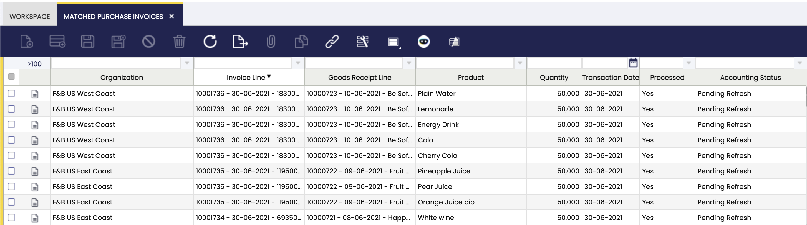

# Matched Purchase Invoices

:material-menu: `Application` > `Procurement Management` > `Transactions` > `Matched Purchase Invoices`

This window helps the user to post the discrepancies between inventory and financial accounting of those items for which the corresponding goods receipts were posted.

Above mentioned discrepancies are mainly caused by differences between:

- the **item's net unit price registered when booking the purchase order** and later on **posting the corresponding Goods Receipt.**
- and the **"final" item's net unit price registered when posting the purchase invoice.**

In the window, there is a listing of all invoices that are matched to goods receipts. The matching of the documents is done when documents are created by using the information of the other document: for example by clicking the Generate Invoice from receipt on the goods receipt or by clicking the Create Lines from button when creating a goods receipt to select the invoice.

### Matched Purchase Invoice

Matched Purchase Invoice tab lists each invoice line posted linked to the corresponding goods receipt lines, which could also be posted or not.

There is a "**Post**" header button which is the one that posts the discrepancies between inventory and financial accounting if any, once the proper line has been selected.

The general process to post the discrepancies in accounting is detailed below:

A *Matching Invoice* document can be posted if the cost of the products included in a *Goods Receipt* has been calculated. To obtain that:

- A validated *Costing Rule* is required in the Matched Invoice's legal entity,
- and the background process *Costing Background Process* must be run.

In the case of "Expense" product/s do not having the "Sales" checkbox selected, it is possible to use the product's purchase price instead of the product's cost whenever the checkbox *Book Using Purchase Order* Price is selected. In this case, it is required that a "Purchase Order" is related to the "Goods Receipt".

### Accounting

Accounting information related to the matched purchase invoices.

## Bulk Posting

!!! info
    To be able to include this functionality, the Financial Extensions Bundle must be installed. To do that, follow the instructions from the marketplace: [Financial Extensions Bundle](https://marketplace.etendo.cloud/#/product-details?module=9876ABEF90CC4ABABFC399544AC14558){target="\_blank"}. For more information about the available versions, core compatibility and new features, visit [Financial Extensions - Release notes](../../../../../whats-new/release-notes/etendo-classic/bundles/financial-extensions/release-notes.md).

The Bulk Posting functionality allows the user to post or unpost multiple records by selecting the corresponding records and clicking the **Bulk posting** button.

Also, the Accounting Status of the record/s is shown in the status bar, in form view, or in a column, in grid view.

!!! info
    For more information, visit [the Bulk Posting module user guide](../../../../../user-guide/etendo-classic/optional-features/bundles/financial-extensions/bulk-posting.md).

---

This work is a derivative of [Procurement Management](http://wiki.openbravo.com/wiki/Procurement_Management){target="\_blank"} by [Openbravo Wiki](http://wiki.openbravo.com/wiki/Welcome_to_Openbravo){target="\_blank"}, used under [CC BY-SA 2.5 ES](https://creativecommons.org/licenses/by-sa/2.5/es/){target="\_blank"}. This work is licensed under [CC BY-SA 2.5](https://creativecommons.org/licenses/by-sa/2.5/){target="\_blank"} by [Etendo](https://etendo.software){target="\_blank"}.

---
This work is licensed under :material-creative-commons: :fontawesome-brands-creative-commons-by: :fontawesome-brands-creative-commons-sa: [ CC BY-SA 2.5 ES](https://creativecommons.org/licenses/by-sa/2.5/es/){target="_blank"} by [Futit Services S.L.](https://etendo.software){target="_blank"}.
