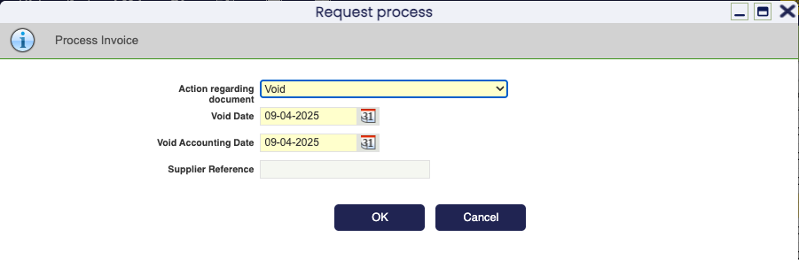
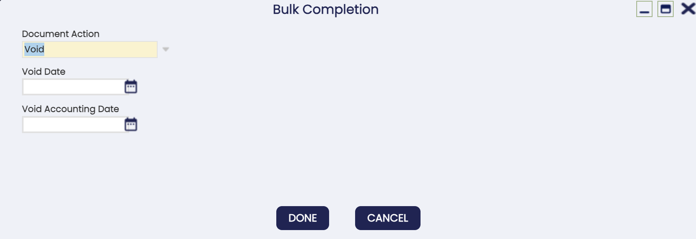
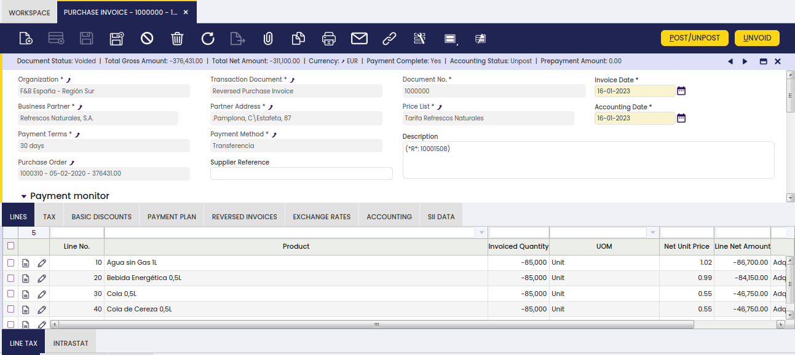

# Purchase Invoice

:material-menu: `Application` > `Procurement Management` > `Transactions` > `Purchase Invoice`

## Overview

The **Purchase Invoice** window is used to create, register, and manage supplier invoices for purchased goods and services.

Purchase invoices are typically generated after a Goods Receipt is completed, ensuring that received quantities match the supplier's billing information.

Invoices are created in two ways:

1. Automatically, from a related Goods Receipt using the **Generate Invoice from Receipt** button in the Goods Receipt window.
2. Manually, by entering the invoice directly in this window.

Each invoice defines the products or services, quantities, prices, taxes, and amounts to be paid to the supplier.

When the invoice is posted, the corresponding purchase expenses are recognized in accounting. If a deferred expense plan is configured, expense recognition is distributed over time according to the defined schedule.

!!! example "Typical Purchase Invoice Workflow"
    1. A Goods Receipt is completed for an existing Purchase Order.
    2. Open the **Purchase Invoice** window and create a new invoice record.
    3. Select the **Business Partner** (supplier). The system fills in the payment terms, payment method, and price list automatically.
    4. Go to the **Lines** tab and click **Create Lines From Receipt** to pull in the received items.
    5. Review the lines, verify quantities and prices, then click **Complete**.
    6. Post the invoice to the ledger using the **Post** button.
    7. Register the payment using the **Add Payment** button.

## Header

The **Header** contains the basic information for a purchase invoice. In most cases, select the **Business Partner**; the system fills the remaining fields from defaults and the selected partner's configuration.

Fields to note:

- **Transaction Document**: defaults to *AP Invoice* (purchase invoice [document type](../../financial-management/accounting/setup/document-type.md)). Change it to *AP Credit Memo* (positive-credit type, not linked to orders or shipments) or *Reversed Purchase Invoice* (negative amounts, for returns).
- **Document No.**: supplier invoice number if allowed by sequence, otherwise an internal number is assigned.
- **Invoice Date**: date of the invoice, used to calculate the due date.
- **Accounting Date**: posting date for the ledger (defaults to Invoice Date).
- **Payment Terms**: defines when payment is due (for example, net 30 days). Automatically populated from the Business Partner configuration.
- **Payment Method**: defines the payment mechanism (for example, bank transfer or check). Automatically populated from the Business Partner configuration.
- **Supplier Reference**: optional reference number provided by the supplier.

### Adding Lines

Add invoice lines using one of the following methods:

1. Click **Create Lines From Order** or **Create Lines From Receipt** to pull in pending items from a related document.
2. Click **Copy Lines** to copy lines from an existing invoice.
3. Add lines manually in the **Lines** tab when there is no related order or receipt.

### Completing the Invoice

Click **Complete** to finish the invoice. This creates the Payment Plan and updates the Payment Monitor. Non-stockable BOM products are exploded automatically if needed.

After completing the invoice, the following actions are available:

- **Post** the invoice to the ledger using the [Post/Unpost](#postunpost) button.
- **Void or Reactivate** the invoice using the [Reactivate](#reactivate) button.
- **Register a payment** using the [Add Payment](#add-payment) button.

## Lines

Once the Purchase Invoice header is saved, add one or more invoice lines for the products or expenses being billed.

Fields to note:

- **Financial Invoice Line**: Select this for lines that are not products (for example, a G/L item or an asset). The Product field is replaced by an Account field.
- **Attribute Set Value**: Shown if the product uses attributes (color, size, serial number, etc.).
- **Purchase Order Line / Goods Receipt Line**: Links the invoice line to the related Purchase Order or Goods Receipt line, if any.

### Deferring Expenses

Use deferred expenses to spread a cost over multiple accounting periods instead of recognizing it all at once.

- **Deferred Expense**: Select this to spread the expense over time and reveal the expense-plan fields.
- **Expense Plan Type**: Frequency of recognition (currently: monthly).
- **Period Number**: Number of periods over which to distribute the expense.
- **Starting Period**: First open accounting period when recognition begins.

These expense-plan values can be defaulted from the product configuration. If an expense plan is used, the invoice accounting follows that plan.

!!! example "Deferred Expense: Annual Insurance"
    A company purchases business insurance for a full year at a cost of 1,200 USD.

    - **Deferred Expense**: selected
    - **Expense Plan Type**: Monthly
    - **Period Number**: 12
    - **Starting Period**: January

    The system recognizes 100 USD per month over 12 months instead of expensing the full 1,200 USD in a single period.

### Explode

The **Explode** button appears when the selected line contains a non-stockable BOM product that has not been exploded yet. Exploding replaces the BOM line with its individual components in the invoice.

!!! warning
    This action cannot be undone. To revert it, delete the component lines first and then re-add the non-stockable BOM product.

### Match LC Cost

The **Match LC Cost** button matches the **estimated landed cost** defined in the Landed Cost window with the **invoiced landed cost** entered in an invoice line.

This option is available when the purchase order or invoice line contains a **product** or **account** configured as a landed cost type. Both costs must belong to the **same landed cost type** to be matched.

Matching helps to:

- Reconcile estimated and invoiced landed costs.
- Keep product costs accurate.
- Generate the correct accounting entries.

After clicking **Match LC Cost**, the pick-and-edit window opens. Only **processed Landed Cost documents** are displayed.

From this window:

- Select the corresponding landed cost document.
- Enter the amount in **Matched Amt**.
- Enable **Process Matching** to complete the process immediately.

The **Is Matching Adjusted** checkbox controls how differences between estimated and invoiced costs are handled:

- **Checked**: creates an additional landed cost adjustment to update the product cost.
- **Unchecked**: no cost adjustment is created.

#### Matching Scenarios

| Scenario | Is Matching Adjusted | Result |
|---|---|---|
| Estimated = Invoiced | Any | Only matching is posted to the ledger. No adjustments are created. |
| Estimated ≠ Invoiced | Checked | A landed cost adjustment is created. Product cost is updated to the invoiced amount. Matching and adjustment are posted. |
| Estimated ≠ Invoiced | Unchecked | Only matching is posted. Product cost is not modified. |

### Line Tax

The **Line Tax** tab is read-only and is automatically populated for each invoice line when the invoice is completed. It details the tax information for each line based on the Tax field, which is pre-filled according to the Taxes Setup.

## Tax

The **Tax** tab summarizes tax-related information for the whole purchase invoice. It contains one record per tax rate used in the invoice.

The **Tax Amount** field reflects the tax value calculated automatically based on the tax rate and tax base settings.

!!! info
    It is possible to add a feature that allows controlled adjustments to invoice tax amounts to reconcile small **rounding differences** with external systems or when invoices are submitted to **governmental entities**. It supports both **sales** and **purchase** invoices, offers **manual and automated adjustments** for minimal corrections at cents level, and records all changes for **auditability**, ensuring the final invoice total matches external, governmental, or regulatory requirements.

    To be able to include this functionality, the Financial Extensions Bundle must be installed. To do that, follow the instructions from the marketplace: [Financial Extensions Bundle](https://marketplace.etendo.cloud/#/product-details?module=9876ABEF90CC4ABABFC399544AC14558){target="_blank"}.

    For more information, visit: [Adjust Invoice Tax user guide](../../../optional-features/bundles/financial-extensions/adjust-invoice-tax.md)

    This functionality is compatible from Etendo 23.

## Basic Discounts (TO CHECK)

This tab lists information about the discounts automatically applied based on the supplier configuration and / or manually entered for the purchase invoice.

Learn [more](../../master-data-management/master-data.md#basic-discount).

## Payment Plan (TO CHECK)

The payment plan tab lists the scheduled payments expected against the invoice.

The payment plan of a non paid invoice can be changed:

- the payment "expected date" can be directly changed if required in this tab
- the payment "expected date", the "payment method" and the "outstanding amount to be paid" among other can be changed if required by using the Editable Payment Plan advanced feature.

## Reversed Invoices (TO CHECK)

This tab allows the user to select the invoices (if any) being reversed by the invoice being created. When the user voids an existing invoice the reverse invoice is automatically created by Etendo and linked to the original invoice being reversed. In case of creating a Reverse Purchase Invoice which partially voids an existing invoice/s, the user must manually select the invoice/s being reversed in this tab.

As already described purchase invoices can be reversed without any problem, if required.

If a purchase invoice is totally voided:

Etendo informs about the Reversed Invoice number automatically created

VA

the original invoice voided is listed in the "Reversed Invoices" tab of the "Reversed Purchase Invoice"

VA

If a purchase invoice/s require to be partially voided:

you should manually add it/them in the "Reversed Invoices" tab of the "Reversed Purchase Invoice" documents used to void an invoice/s.

## Exchange Rates (TO CHECK)

The exchange rate tab allows to enter an exchange rate between the organization's general ledger currency and the currency of the supplier's invoice to be used while posting the invoice to the ledger.

Openbravo allows to manage different currencies within an organization or business unit.

Nowadays, it is very common for the organizations located in a country to make business with third parties located abroad, and even more, it could also happen that an organization needs to post the transactions to general ledgers configured in different currencies.
To learn more visit General Ledger Configuration.

Above described business scenario, implies the need of managing exchange rates between the organization's general ledger currency and the supplier's invoice currency to be used while posting the supplier's invoice to the ledger/s.

This tab allows you to enter:

either an exchange rate between the organization's general ledger/s currency and the supplier's invoice currency
or the total foreign invoice amount/s, therefore Openbravo can calculate the corresponding exchange rate/s
Additionally, Openbravo has a "central" repository of exchange rates which are used in case there is no an exchange rate defined at document level.

## Accounting (TO CHECK)

Accounting information related to the purchase invoice

For more details please review the accounting article.

A purchase invoice can be posted to the ledger when required at a given "Accounting Date" by using the process button "Post".

Purchase invoice posting creates the following accounting entries:

Account	Debit	Credit	Comments
Product Expense	Line Net Amount		One per invoice line
Tax Credit	Tax Amount		One per tax line.
Discount Product Expense		Discount amount	One per invoice line (if discount exists)
Vendor Liability		Total Gross Amount	One per invoice

Same way, a Purchase Invoice including a purchase invoice line with an expense plan configured creates the following accounting entries.
For instance a company purchasing a business insurance for the duration of a year would want to distribute that expense over 12 months.

Posting record date: Accounting Date:

Account	Debit	Credit
Product Deferred Expense	Line Net Amount	
Tax Credit	Tax Amount	
Vendor Liability		Total Gross Amount
Posting record date: Accounting Date + 1 month:

Account	Debit	Credit
Product Expense	Line Net Amount/12	
Product Deferred Expense		Line Net Amount/12
Posting record date: Accounting Date + 2 months:

Account	Debit	Credit
Product Expense	Line Net Amount/12	
Product Deferred Expense		Line Net Amount/12
.....

Posting record date: Accounting Date + 12 months:

Account	Debit	Credit
Product Expense	Line Net Amount/12	
Product Deferred Expense		Line Net Amount/12
Voiding
It is possible to totally void a purchase invoice, by using the header button "Reactivate" and then selecting the action "Void".
This action creates a new document that reverse the invoice.

Void action allows to specify a "Void Date" and a "Void Accounting Date" for the new document that reverse the invoice.

Both "date" fields above take the current date as default date and validate that the dates entered are not prior to the invoice date and the invoice accounting date, respectively.

Overall "Void" action implies that:

Openbravo automatically generates a new document in the "Purchase Invoice" window that reverse the "original" invoice.
Openbravo also informs about the new document number. This new document is created as described below:
The "transaction document" used by Openbravo is "Reversed Purchase Invoice". To learn more visit Document Type.
This document is exactly the same as the original one being reversed but the invoiced quantity is negative.
Once the new document has been created, you can change both the "Invoice Date" and the "Accounting Date" of the new document prior to get it posted.
The "Reversed Invoices" tab list the original invoice being reversed as now both of them are linked.
To learn more visit Reversed Invoices.
The reversed document posting creates the following accounting entries:

Account	Debit	Credit	Comments
Product Expense		Line Net Amount	One per invoice line
Tax Credit		Tax Amount	One per tax line.
Vendor Liability	Total Gross Amount		One per invoice
And it is also possible to partially void a supplier invoice by:

manually creating any of the available reversed purchase documents, in the "Purchase Invoice" window:
"AP Credit Memo" or
"Reversed Purchase Invoice"
which besides must be manually linked to the invoice/s being reversed in the "Reversed Invoices tab".
To learn more visit Reversed Invoices.
The "AP Credit Memo" posting looks the same as the "Reversed Purchase Invoice" posting.

The main different between those two purchase reversed document types is:

AP Credit Memo invoiced quantity is a positive quantity
and Reversed Purchase Invoice quantity is a negative quantity
We strongly recommend you to use the "Reversed Purchase Invoice" document type while partially voiding supplier's invoices.

## Buttons

### Post/Unpost

Post a purchase invoice to the ledger at a given Accounting Date using this button. Once posted, unpost it using the same button.

### Reactivate

This button provides two options for a Completed invoice:

- **Reactivate**: returns the record from *Completed* to *Draft* status, allowing edits without creating a new document. Use this option when the invoice contains errors that need correction before reposting.
- **Void**: creates a new document that fully reverses the invoice. Use this option when the invoice is no longer valid and needs to be cancelled.

!!! example "When to Use Each Option"
    - Use **Reactivate** when a price or quantity was entered incorrectly and the invoice has not been paid yet.
    - Use **Void** when goods are returned to the supplier and the entire invoice needs to be cancelled.

**Voiding an invoice**

When voiding, specify the following fields for the reversal document:

- **Void Date**: movement date of the reversal document. Defaults to the current date and cannot be prior to the original Invoice Date.
- **Void Accounting Date**: accounting date of the reversal document. Defaults to the current date and cannot be prior to the original Accounting Date.
- **Supplier Reference**: optional reference number for the reversed document. Enter it here or leave the field blank to complete it later.

Etendo automatically generates a new document in the *Purchase Invoice* window that reverses the original invoice and informs about the new document number.

The reversal document uses the *Reversed Purchase Invoice* transaction document type, which is identical to the original but with negative invoiced quantities.

Once the reversal document is created, change the *Invoice Date* and *Accounting Date* if needed before posting.

The *Reversed Invoices* tab links both the original and the reversal documents.

**Partially voiding an invoice**

It is also possible to partially void a supplier invoice by manually creating one of the following reversed purchase documents in the [Purchase Invoice](purchase-invoice.md) window:

- **AP Credit Memo**: invoiced quantity is positive.
- **Reversed Purchase Invoice**: invoiced quantity is negative.

The created document must be manually linked to the invoice being reversed in the **Reversed Invoices** tab.

To learn more, visit [Reversed Invoices](../../sales-management/transactions.md#reversed-invoices).

The **AP Credit Memo** posting looks the same as the **Reversed Purchase Invoice** posting. The main difference between the two document types is:

- **AP Credit Memo**: invoiced quantity is a positive quantity.
- **Reversed Purchase Invoice**: invoiced quantity is a negative quantity.

!!! note
    Use the **Reversed Purchase Invoice** document type when partially voiding supplier invoices.

### Add Payment

Register one or more payments against a purchase invoice using the **Add Payment** button, which opens the Add Payment pop-up window.

### Bulk Posting

!!! info
    To be able to include this functionality, the Financial Extensions Bundle must be installed. To do that, follow the instructions from the marketplace: [Financial Extensions Bundle](https://marketplace.etendo.cloud/#/product-details?module=9876ABEF90CC4ABABFC399544AC14558){target="\_blank"}. For more information about the available versions, core compatibility and new features, visit [Financial Extensions - Release notes](../../../../../whats-new/release-notes/etendo-classic/bundles/financial-extensions/release-notes.md).

The Bulk Posting functionality allows the user to post or unpost multiple records by selecting the corresponding records and clicking the **Bulk Posting** button.

The Accounting Status of each record is shown in the status bar in form view, or in a column in grid view.

!!! info
    For more information, visit [the Bulk Posting module user guide](../../../../../user-guide/etendo-classic/optional-features/bundles/financial-extensions/bulk-posting.md).

### Bulk Completion

!!! info
    To be able to include this functionality, the Essentials Extensions Bundle must be installed. To do that, follow the instructions from the marketplace: [Essentials Extensions Bundle](https://marketplace.etendo.cloud/#/product-details?module=39AC2D9F72124AC7A1D0A3D005293C9E){target="_blank"}. For more information about the available versions, core compatibility and new features, visit [Essential Extensions - Release notes](../../../../../whats-new/release-notes/etendo-classic/bundles/essentials-extensions/release-notes.md).

The Bulk Completion functionality allows the user to complete, reactivate, or void multiple records by selecting them and clicking the **Bulk Completion** button. This makes records management easier and more efficient.

!!! info
    For more information, visit [the Bulk Completion module user guide](../../../optional-features/bundles/essentials-extensions/bulk-completion.md).

!!! warning
    The bulk voiding option fails when the [Purchase Invoice Validation](../../../optional-features/bundles/procurement-extensions/purchase-invoice-validation.md) module is installed. This is because the module includes a default preference that prevents the duplication of invoices with the same business partner, accounting year, and supplier reference. Since bulk voiding attempts to reverse invoices, it leads to duplication, as the supplier reference for each reversed invoice cannot be modified. As a result, the module prevents the bulk voiding process from functioning.
    

### Remove Payment

The Payment Removal functionality deletes and reactivates payments. It also allows eliminating and reactivating bank transactions and reconciliations.

!!! info
    To be able to include this functionality, the Financial Extensions Bundle must be installed. To do that, follow the instructions from the marketplace: [Financial Extensions Bundle](https://marketplace.etendo.cloud/#/product-details?module=9876ABEF90CC4ABABFC399544AC14558){target="\_blank"}. For more information about the available versions, core compatibility and new features, visit [Financial Extensions - Release notes](../../../../../whats-new/release-notes/etendo-classic/bundles/financial-extensions/release-notes.md).

To remove a payment, select the corresponding document and click the **Remove Payment** button. The following related records are also removed:

- If an order is associated with the invoice, the link between the order and the payment is removed (**Purchase Order** window > **Payment Plan** tab).
- If the payment is in *Deposited/Withdrawn not cleared* status in the financial account, the transaction is also deleted (**Financial Account** window > **Transaction** tab).
- If the payment is reconciled through an automatic method, the bank statement line and the bank reconciliation line are also deleted (**Financial Account** window > **Imported Bank Statements** and **Reconciliations**).

!!! info
    If the payment is posted, the accounting entry is deleted too.

### Unvoid

!!! info
    To be able to include this functionality, the Financial Extensions Bundle must be installed. To do that, follow the instructions from the [marketplace](https://marketplace.etendo.cloud/#/product-details?module=9876ABEF90CC4ABABFC399544AC14558){target="\_blank"}. For more information about the available versions, core compatibility and new features, visit [Financial Extensions - Release notes](../../../../../whats-new/release-notes/etendo-classic/bundles/financial-extensions/release-notes.md).

The **Unvoid** button reactivates voided purchase invoices. Select the invoice and click **Unvoid** to restore it.

Once the process is finished, the purchase invoice status turns to *Complete*.

!!! note
    In the case of the standard version of the module, also unvoid the corresponding reversed invoice.

!!! warning
    This reactivation process affects the accounting. If the original information is not manually removed from the reactivated document, accounting entries are doubled.

!!! info
    Check the Technical documentation about [Advanced Financial Docs Processing](../../../../../developer-guide/etendo-classic/bundles/financial-extensions-bundle/overview.md#advanced-financial-docs-processing) to extend the process.

### Modify Payment Plan

!!! info
    To be able to include this functionality, the Advanced Bank Account Management module of the Financial Extensions Bundle must be installed. To do that, follow the instructions from the marketplace: [Financial Extensions Bundle](https://marketplace.etendo.cloud/#/product-details?module=9876ABEF90CC4ABABFC399544AC14558){target="\_blank"}. For more information about the available versions, core compatibility and new features, visit [Financial Extensions - Release notes](../../../../../whats-new/release-notes/etendo-classic/bundles/financial-extensions/release-notes.md).

The Advanced Bank Account Management module adds a **Bank Account** field to the Purchase Invoice header. This field is automatically filled with the bank account related to the address or business partner of the invoice. The **Modify Payment Plan** button is also added for flexible payment management.

!!! info
    For more information, visit the [Advanced Bank Account Management user guide](../../../optional-features/bundles/financial-extensions/advanced-bank-account-management.md).

## Intercompany

When orders or invoices involve two or more organizations that belong to the same client, this functionality automatically generates the corresponding inverse document.

!!! info
    For more information, visit [the Intercompany module user guide](../../../../../user-guide/etendo-classic/optional-features/bundles/financial-extensions/intercompany.md).

!!! info
    To be able to include this functionality, the Financial Extensions Bundle must be installed. To do that, follow the instructions from the marketplace: [Financial Extensions Bundle](https://marketplace.etendo.cloud/#/product-details?module=9876ABEF90CC4ABABFC399544AC14558){target="\_blank"}. For more information about the available versions, core compatibility and new features, visit [Financial Extensions - Release notes](../../../../../whats-new/release-notes/etendo-classic/bundles/financial-extensions/release-notes.md).

---

This work is a derivative of [Procurement Management](http://wiki.openbravo.com/wiki/Procurement_Management){target="\_blank"} by [Openbravo Wiki](http://wiki.openbravo.com/wiki/Welcome_to_Openbravo){target="\_blank"}, used under [CC BY-SA 2.5 ES](https://creativecommons.org/licenses/by-sa/2.5/es/){target="\_blank"}. This work is licensed under [CC BY-SA 2.5](https://creativecommons.org/licenses/by-sa/2.5/){target="\_blank"} by [Etendo](https://etendo.software){target="\_blank"}.

---
This work is licensed under :material-creative-commons: :fontawesome-brands-creative-commons-by: :fontawesome-brands-creative-commons-sa: [ CC BY-SA 2.5 ES](https://creativecommons.org/licenses/by-sa/2.5/es/){target="_blank"} by [Futit Services S.L.](https://etendo.software){target="_blank"}.
