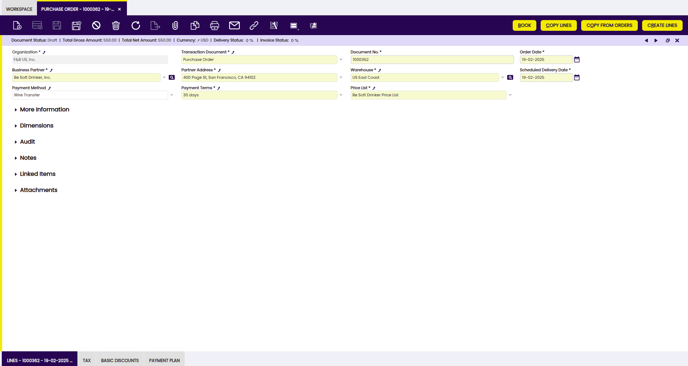
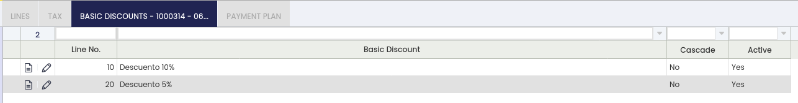
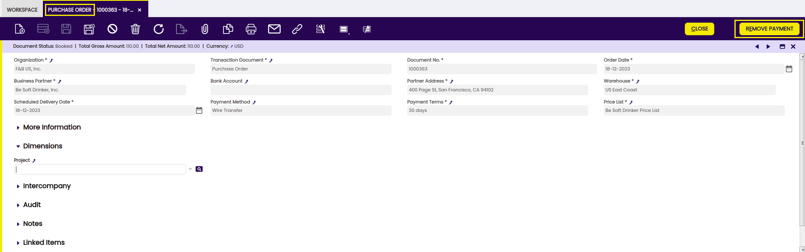

# Purchase Order

:material-menu: `Application` > `Procurement Management` > `Transactions` > `Purchase Order`

Purchase Order window allows the user to manage orders which once booked will be sent to the external suppliers. In other words, it is a document to register products and/or services to be purchased and documented.

Once the document is booked, it can be sent to the external supplier and it can be prepaid if required.

Purchase orders can be created and booked in the header section of the purchase order window.

## Header

The **Purchase order header** allows you to enter the following information:

- **Organization:** Organizational entity within client.
- **Transaction Document**, which in this case is defaulted as "**Purchase Order**".
- **Document No**, or the Company purchase order number.
- **Order date:** This date is also defaulted by Etendo based on the system date, but it can always be changed.
- **Business Partner**: End-user needs to select the supplier to which the purchase order is being issued.
- **Partner Address**: Automatically populated once the business partner is selected based on the address or location set us "Ship to Address".
- **Warehouse**: Regardless it is defaulted by Etendo based on the "Profile" selected options, it must be verified by the end-user.
- **Scheduled Delivery Date**: This is the date when the organization or legal entity requires the items to be delivered.
- **Payment Method**, **Payment Terms** and **Price List**: These ones are defaulted by Etendo once a business partner is selected.
- **Order Reference**, free text which can be found under "More Information" section, you can use it to save the supplier order number, if any.

In the **Status Bar** of the header, the user can find the following information:

- **Document Status**: Document status of the order. The order can be in booked, draft, closed status, among others.
- **Total Gross Amount**: Total Gross amount of the order.
- **Total Net Amount**: Total Net amount of the order.
- **Currency**: Currency of the order.
- **Delivery Status**: It indicates in % how much quantity of the order has been received.
- **Invoice Status**: It indicates in % how much quantity of the order has been invoiced.

**Once header information is properly filled-in, you can go to the "Lines" tab in order to enter purchase order line/s information**.

!!! info
    To learn how to enter purchase order lines, visit the next section [Lines](purchase-order.md#lines).

It is possible to take up to **three possible actions regarding a purchase order**, by using the **header button "Book"**:

- **Process it**, in case you might want to process it but not to book it as final, because it could be you might need to change it later on.
- **Void it**, in case that purchase order is not required anymore and therefore needs to be voided.
- **Book it**, in case it is correct and final.

!!! info
    If there are non-stockable BOM products and they have not been exploded, the Book button explodes them automatically.

## Lines

Once the purchase order header has been properly filled in and saved, each purchase order line can be created in this tab.

Purchase order lines can be created in three different ways:

**1\. By manually creating new record/s in the "Lines" tab**.

The purchase order fields you can fill in are described below:

- **Product**. You can select an item or product from the list or use the product selector icon.
- **Ordered quantity**, or **Operative Quantity** if the product has an *alternative unit of measure (AUM)* configured. This is the quantity needed of the product/item.
- Product's **UOM**, or product's **Alternative UOM** depending on product configuration in regards to unit of measure.
- **Attribute Set Value. An attribute associated with a product as part of an attribute set.**
- **Net Unit Price**. This one is coming from the Price List selected in the header, but it could always be changed.
- **Line Net Amount. The final amount of a specified line, based only on quantities and prices.**
- **Tax**. Purchase tax is normally filled in by the system, depending on Taxes setup.

**2\. By retrieving all the lines from previously created purchase orders.** In this case, you must use the process button "**Copy from Orders**".

This process button enables the **Copy from Orders Pick and Edit** window.

"Copy from Orders Pick and Edit" window allows you to search the orders to copy by using the filter options available.

The lines information of the selected orders will be inserted in the purchase order line/s, then that information can be manually changed.

**3\. By copying lines from other purchase orders.**

In this case, you must use the process button **"Copy Lines".**

This process button enables a new window named "Copy Lines from order" which allows you to create order lines by selecting the products already purchased from the supplier of the order by taking into account the *Consumption days* configured for the supplier.

In the **Status Bar** of each line, you can find information about:

- **Delivered quantity**: number of received products of the line.
- **Invoiced quantity**: number of invoiced product of the line.

### Explode button

Explode button is shown when selecting a line with a non-stockable BOM product and the product has not already been exploded. When exploding a product, the bill of materials components the selected product consists of are shown in the order.

!!! info
    Once you have exploded it, you cannot comprime it. You should delete all the lines (first bill of materials components and then the BOM product), and insert again the non-stockable BOM product.

### Line Tax

For each purchase order line, Etendo automatically populates the line tax related information in this tab.

Line tax tab informs about each purchase order line:

- **applied tax rate**
- **calculated tax amount**
- **taxable amount**

!!! info
    It is not possible to either manually create a new line or modify existing ones.

### Basic Discounts

Lists information about discounts automatically applied based on the supplier configuration and / or manually entered for the purchase order.

### Payment Plan

This shows the total amount expected to be paid upon order booking as well as the amount/s pre-paid or paid against the invoice/s for the order.

Payment Plan information is required at order level because suppliers could ask for a **pre-payment** of all or part of a debt prior to its due date.

Purchase order payment plans **do not show nor manage valid due dates**, but the payment plan of the corresponding purchase invoice/s.

This tab also shows information about the regular payments received against the invoice/s for this order, as amounts paid.

Finally, a payment plan of a purchase order will be **removed**:

- if the purchase order is **reactivated**
- or if the purchase order is **voided**

### Payment Details

Displays the details of the payments (pre-payments or regular payments) made for the order or for the invoice/s of the order.

## How to Reactivate a Closed Purchase Order

!!! info
    To be able to include this functionality, the Financial Extensions Bundle must be installed. To do that, follow the instructions from the [marketplace](https://marketplace.etendo.cloud/#/product-details?module=9876ABEF90CC4ABABFC399544AC14558){target="\_blank"}. For more information about the available versions, core compatibility and new features, visit [Financial Extensions - Release notes](../../../../../whats-new/release-notes/etendo-classic/bundles/financial-extensions/release-notes.md).

!!! warning "Dependency Notice"
    This module depends on the [**Bulk Completion**](../../../optional-features/bundles/essentials-extensions/bulk-completion.md) module, as **order** processing actions must be performed using modern processes that allow the triggering of Hooks, instead of legacy processing. Due to this requirement, the legacy **close/reactivate** actions for orders will be hidden and these actions will only be available through the **Bulk Completion** button.

Etendo allows the user to reactivate closed purchase orders by selecting the needed one/s and clicking the Undo Close button.

Once the process is finished, the purchase order status turns to booked.

!!! info
    Check the Technical documentation about Advanced Financial Docs Processing to extend the process.

## Payment Removal

The aim of this functionality is to delete and reactivate payments in an agile and easy way. Also, it allows eliminating and reactivating bank transactions and reconciliations.

!!! info
    To be able to include this functionality, the Financial Extensions Bundle must be installed. To do that, follow the instructions from the marketplace: [Financial Extensions Bundle](https://marketplace.etendo.cloud/#/product-details?module=9876ABEF90CC4ABABFC399544AC14558){target="\_blank"}. For more information about the available versions, core compatibility and new features, visit [Financial Extensions - Release notes](../../../../../whats-new/release-notes/etendo-classic/bundles/financial-extensions/release-notes.md).

From this window, it is possible to remove payments associated with a purchase order by selecting the corresponding document and then clicking on the Remove Payment button. If there is an invoice associated with the order, the relationship of this invoice to the payment in question will also be removed (Purchase Invoice window > Payment Plan tab).

If the payment is included in the financial account, i.e., if it is in Deposited/Withdrawn not cleared status, the transaction in it will also be deleted (Financial account window > Transaction tab).

If the payment is reconciled through an automatic method, then in addition to the transaction in the financial account, the line of the bank statement to which it was linked (Financial Account window > Imported Bank Statements) and the corresponding line of the bank reconciliation (Financial Account > Reconciliations) will be deleted.

!!! info
    If the payment is posted, the accounting entry is deleted too.

## Intercompany

In case the user has to create orders or invoices among two or more organizations that are different but belong to the same client, this functionality allows automatically generating the corresponding inverse document.

!!! info
    For more information, visit [the Intercompany module user guide](../../../../../user-guide/etendo-classic/optional-features/bundles/financial-extensions/intercompany.md).

!!! info
    To be able to include this functionality, the Financial Extensions Bundle must be installed. To do that, follow the instructions from the marketplace: [Financial Extensions Bundle](https://marketplace.etendo.cloud/#/product-details?module=9876ABEF90CC4ABABFC399544AC14558){target="\_blank"}. For more information about the available versions, core compatibility and new features, visit [Financial Extensions - Release notes](../../../../../whats-new/release-notes/etendo-classic/bundles/financial-extensions/release-notes.md).

## Bulk Completion

!!! info
    To be able to include this functionality, the Essentials Extensions Bundle must be installed. To do that, follow the instructions from the marketplace: [Essentials Extensions Bundle](https://marketplace.etendo.cloud/#/product-details?module=39AC2D9F72124AC7A1D0A3D005293C9E){target="_blank"}. For more information about the available versions, core compatibility and new features, visit [Essential Extensions - Release notes](../../../../../whats-new/release-notes/etendo-classic/bundles/essentials-extensions/release-notes.md).

The Bulk Completion functionality allows the user to complete, reactivate or close multiple records by selecting them and clicking the **Bulk Completion** button. This makes records management easier and more efficient, reducing the time spent processing individual records.

!!! info
    For more information, visit [the Bulk Completion module user guide](../../../optional-features/bundles/essentials-extensions/bulk-completion.md).

## Advanced Bank Account Management

!!! info
    To be able to include this functionality, the Advanced Bank Account Management module of the Financial Extensions Bundle must be installed. To do that, follow the instructions from the marketplace: [Financial Extensions Bundle](https://marketplace.etendo.cloud/#/product-details?module=9876ABEF90CC4ABABFC399544AC14558){target="\_blank"}. For more information about the available versions, core compatibility and new features, visit [Financial Extensions - Release notes](../../../../../whats-new/release-notes/etendo-classic/bundles/financial-extensions/release-notes.md).

This module adds a new field to the header of the Purchase Order window: **Bank Account**. This field is automatically filled with the bank account related to the adress or business partner of the order.

!!! info
    For more information, visit the [Advanced Bank Account Management user guide](../../../optional-features/bundles/financial-extensions/advanced-bank-account-management.md).

---

This work is a derivative of [Procurement Management](http://wiki.openbravo.com/wiki/Procurement_Management){target="\_blank"} by [Openbravo Wiki](http://wiki.openbravo.com/wiki/Welcome_to_Openbravo){target="\_blank"}, used under [CC BY-SA 2.5 ES](https://creativecommons.org/licenses/by-sa/2.5/es/){target="\_blank"}. This work is licensed under [CC BY-SA 2.5](https://creativecommons.org/licenses/by-sa/2.5/){target="\_blank"} by [Etendo](https://etendo.software){target="\_blank"}.

---
This work is licensed under :material-creative-commons: :fontawesome-brands-creative-commons-by: :fontawesome-brands-creative-commons-sa: [ CC BY-SA 2.5 ES](https://creativecommons.org/licenses/by-sa/2.5/es/){target="_blank"} by [Futit Services S.L.](https://etendo.software){target="_blank"}.
