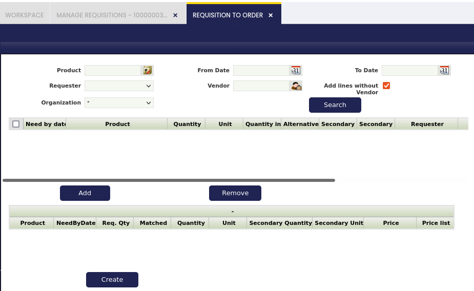

# Requisition to Order

:material-menu: `Application` > `Procurement Management` > `Transactions` > `Requisition to Order`

Requisition to Order window shows all the "Completed" requisitions which match the criteria used in the "filter" section and it also shows the requisition lines selected as locked, therefore the same product demand can not be included more than once in a purchase order.

In other words, the upper section of this window shows the requisition lines found that are not linked to an order yet.
Those are the lines which can be added by the user to the "Lock" area in the bottom section of the window.

A requisition line locked can not be changed by any other user, until the one who locked it gets it unlocked.
That way, during the time that the requisition lines are locked:

- The same product demand will not be included in a purchase order, by mistake.
- The purchase team will have the opportunity to review the stock and contact different vendors if required to negotiate a price for the products.
- If there is no activity during 3 days, the system removes the lock from the lines.

A requisition can be unlocked manually by the purchase manager or the one who locked it by moving it back to the upper part of the "Requisition to Order" screen by using the "Remove" button.

Once the product demands are clear and locked, the last step to take in this window is to create a purchase order for those needs using the process button "Create".

---

This work is a derivative of [Procurement Management](http://wiki.openbravo.com/wiki/Procurement_Management){target="\_blank"} by [Openbravo Wiki](http://wiki.openbravo.com/wiki/Welcome_to_Openbravo){target="\_blank"}, used under [CC BY-SA 2.5 ES](https://creativecommons.org/licenses/by-sa/2.5/es/){target="\_blank"}. This work is licensed under [CC BY-SA 2.5](https://creativecommons.org/licenses/by-sa/2.5/){target="\_blank"} by [Etendo](https://etendo.software){target="\_blank"}.

---
This work is licensed under :material-creative-commons: :fontawesome-brands-creative-commons-by: :fontawesome-brands-creative-commons-sa: [ CC BY-SA 2.5 ES](https://creativecommons.org/licenses/by-sa/2.5/es/){target="_blank"} by [Futit Services S.L.](https://etendo.software){target="_blank"}.
