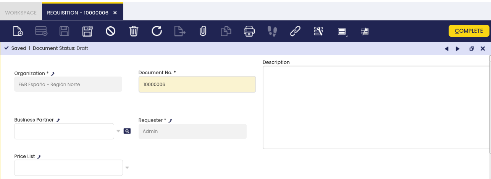

# Requisition

:material-menu: `Application` > `Procurement Management` > `Transactions` > `Requisition`

A Requisition is a document that specifies a request to order products.

The user can create requisitions and monitor them in this window:

## Header

Requisition header allows entering the following data:

- The business partner or supplier, this is an optional field that could be filled in by the requester in case it is known, therefore:
  - The supplier entered in the header will be the one used for every requisition line unless it is changed at lines level for a particular line.
  - If there is no supplier entered in the requisition header the one setup by default for the product in its master data window, *Purchasing* tab will be used.
  - If there is no business partner or supplier in the header, or in the lines, or setup in the product, the user will have to enter it while creating the purchase order from the requisition.
- The purchase price list. This is also an optional field to be filled-in, in case it is known by the requester and its behaviour is the same as described above as it is linked to the Business Partner.

Besides, the system populates the following data:

- The document No., which is the Requisition number.
- The requester, which is the user entering the requisition.

The requester can then move to the "Lines" tab to enter additional data.

## Lines

Each requisition line shows a product demand for a specific date.

Requisition "Lines" tab collects the following demand data:

- The *need by date*, that is the date when the product is required to arrive.
- The *product*, items/products which need to be purchased.
- The *quantity* requested, or the *operative quantity* requested if the product has an *alternative unit of measure (AUM)* configured.
- The product's *UOM*, or product's *Alternative UOM* depending on product configuration in regards to measure unit.
- The *business partner:* This is an optional field the user can enter if the supplier entered at the requisition header needs to be changed for a particular line.

!!! info
    If there is not a supplier entered at the requisition header, neither at the requisition line, the supplier used will be the one setup by default for the product, therefore this field at line level can also be used to overwrite that defaulted one.

- The *purchase price list*: This is also an optional field that can be entered if the price list entered at the header level or the default product price list information should be overwritten for a particular line.
- The *net list price*: This one is the price of the corresponding price list for a given date. It's an optional field that can be filled in automatically based on the price list entered at the header level or it could be overwritten by the user for a particular product line.
- The *net unit price:* This one can be either equal to the net list price or not, based on the formula: \[net unit price = net list price - discount\]. It is an optional field that can be filled in automatically based on the price list entered at the header level or it could be overwritten by the user for a particular product line.
- The *discount*, if any, is based on a used price list.

It is possible to enter as many requisition lines as products demand.

The last step is to register the *Requisition* as *Complete* by using the header button "Complete", then:

- *Requisition header status bar* informs us that the Requisition is *Completed*.
- *Requisition lines status bar* informs us that the *Matched purchase order quantity* for each line is equal to 0**, as there is no purchase order linked to each requisition line yet, and the requisition line/s status is *Open*.

It is important to remark that *Requisitions* does not have any impact on:

- Items quantity on hand
- Items costing

---

This work is a derivative of [Procurement Management](http://wiki.openbravo.com/wiki/Procurement_Management){target="\_blank"} by [Openbravo Wiki](http://wiki.openbravo.com/wiki/Welcome_to_Openbravo){target="\_blank"}, used under [CC BY-SA 2.5 ES](https://creativecommons.org/licenses/by-sa/2.5/es/){target="\_blank"}. This work is licensed under [CC BY-SA 2.5](https://creativecommons.org/licenses/by-sa/2.5/){target="\_blank"} by [Etendo](https://etendo.software){target="\_blank"}.

---
This work is licensed under :material-creative-commons: :fontawesome-brands-creative-commons-by: :fontawesome-brands-creative-commons-sa: [ CC BY-SA 2.5 ES](https://creativecommons.org/licenses/by-sa/2.5/es/){target="_blank"} by [Futit Services S.L.](https://etendo.software){target="_blank"}.
