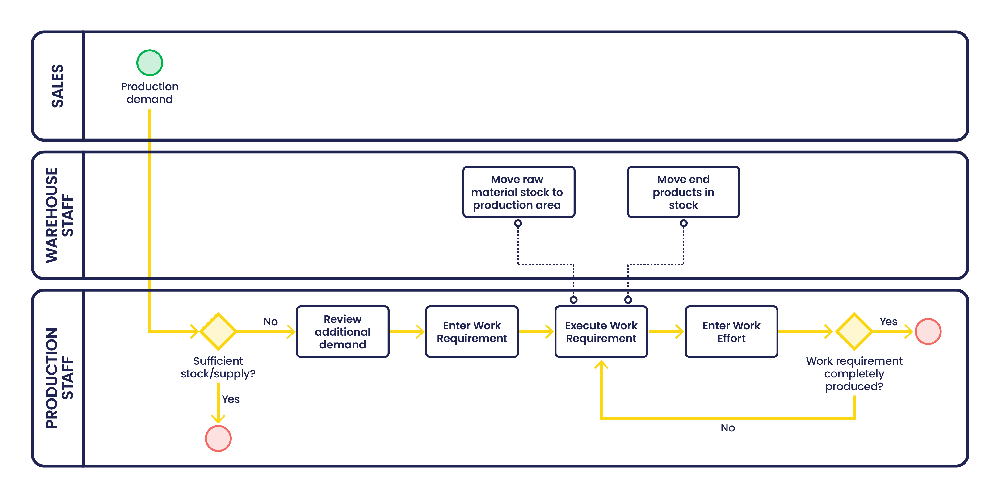

# Production Management - Getting Started

## Overview

<iframe width="560" height="315" src="https://www.youtube.com/embed/LujFoXYv-XA?si=i8cKV41eHUdipMHh" title="YouTube video player" frameborder="0" allow="accelerometer; autoplay; clipboard-write; encrypted-media; gyroscope; picture-in-picture; web-share" allowfullscreen></iframe>

The Production Management module allows managing the standard productive process: production plan, work requirement, end products report and its direct and indirect costs. It is also possible to manage quality control and machine maintenance in production.

The main documents to manage the production process are:

- [Process Plan](./setup.md#process-plan)
- [Work Requirement](./transactions.md#work-requirement)
- [Work Effort](./transactions.md#work-effort)

!!! tip
    It is important to be clear about these concepts and windows before reading on. 

## Initial Configuration

Apart from the [setup windows](./setup.md) in the Production module, additional setups are required.

1. For Production, there are different products that are set up:

    - Raw material used in production:
        - The **production** checkbox is selected to indicate that the product is used for production.
        - The process plan is selected.
        - The default storage bin used to store the raw materials used (P-),  is defined in the [manufacturing](../master-data-management/master-data.md#manufacturing) tab.

    - Any **semi finished products** are created directly in the process plan by copying the information of a raw material product used in the operation using the [Create Product Copy](./setup.md#io-products) button. Once created, the default storage bin is defined in the [manufacturing](../master-data-management/master-data.md#manufacturing) tab.

    - Finished products manufactured in production:
        - The **production** checkbox is selected to indicate the product is manufactured in production.
        - The process plan is selected.
        - The default storage bin that is used for the finished products (P+),  is defined in the [manufacturing](../master-data-management/master-data.md#manufacturing) tab.
        - Based on [cost calculations](transactions.md#calculate-standard-costs), a **theoretical** standard cost can be determined for the finished product.
        - A safety stock level is determined and entered for the product.

    !!! info
        For more information about the configuration of products, please refer to the [Product](../master-data-management/master-data.md#product) section.

2. Also, Business Partners are configured for production:

    - In the Employee tab, any employees that are involved in the production process have the **operator** checkbox selected.
    - The [Salary category](../master-data-management/master-data.md#salary-category) configured for employees is very important since they are included in the final cost calculations.

    !!! info
        For more information about the configuration of business partners, please refer to the [Business Partner](../master-data-management/master-data.md#business-partner) section.

3. Work Efforts can be posted to the [General Ledger Journal](../financial-management/accounting/transactions.md#gl-journal). In order to facilitate the posting, the **MaterialMgmtProductionTransaction** table is activated in the [Active Tables](../financial-management/accounting/setup.md#general-ledger-configuration) tab of the General Ledger configuration.

## Execution

1. Sales staff enters **Sales Order** for the product with the quantity required and the date by when it needs to be delivered. If the product is not in stock, it needs to be produced. Also, if the stock level is below the safety stock level, products have to be produced.

    The information about the demand from sales orders and safety stock is handled in 2 ways:

    - Automatically in [Material Requirement Planning (MRP)](../material-requirement-planning/getting-started.md).
    - Manually by a production manager.

2. Ideally, the information is handled by MRP. If not, a production manager reviews if production of the product is required by reviewing the total demand:

    - The outstanding sales orders
    - The safety stock level

    and compare it with the total supply:

    - The stock level.
    - Scheduled Work Requirements.

3. If the demand is higher than the supply, or the dates of scheduled Work Requirements are not matching the dates of the outstanding sales orders, the product needs to be produced and a production manager executes:

    - Review of the stock of the raw material. If needed, the raw material will be requested and used in the [Procurement Management](../procurement-management/getting-started.md) process.
    - Entry of the **Work Requirement** for the required quantity with the required quantity and the planned date.
    - Generate **Work Efforts** from the Work Requirement.

4. The staff responsible for executing the production can see on the **Production Run Status Report** what production has to be executed.

5. At the end of each shift, the production managers enter the information of what is produced in the [Production Run](transactions.md#production-run-1) windows.

## Relationship with other areas

Production Management interacts with the following modules:

- [Procurement Management](../procurement-management/getting-started.md): raw material required for use in production is bought using the Procure to Pay process.
- [Sales Management](../sales-management/getting-started.md): demand for the products that are produced are generated through the Order to Cash process.
- [Warehouse Management](../warehouse-management/getting-started.md):
    - Raw material is taken from the warehouse to be used in production
    - End products that come out of production are put into stock
- [Material Requirement Planning](../material-requirement-planning/getting-started.md): Work Requirements can be a result of MRP
- [Financial Management](../financial-management/getting-started.md): Cost related to Production is calculated for finance.

---

- This work is a derivative of [Production Management](http://wiki.openbravo.com/wiki/Production_Management){target="_blank"} by [Openbravo S.L.U](http://wiki.openbravo.com/wiki/Welcome_to_Openbravo){target="_blank"}, licensed under [CC BY-SA 2.5 ES](https://creativecommons.org/licenses/by-sa/2.5/es/){target="_blank"}.

- This work is licensed under :material-creative-commons: :fontawesome-brands-creative-commons-by: :fontawesome-brands-creative-commons-sa: [ CC BY-SA 2.5 ES](https://creativecommons.org/licenses/by-sa/2.5/es/){target="_blank"} by [Futit Services S.L](https://etendo.software){target="_blank"}.
