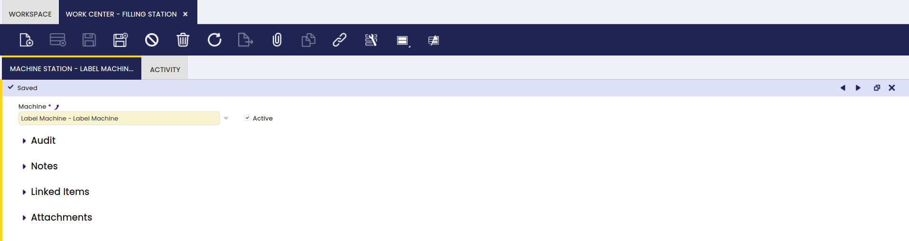
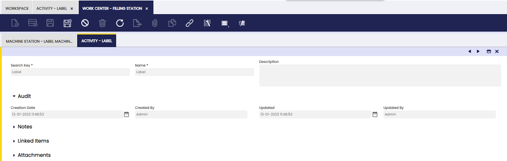
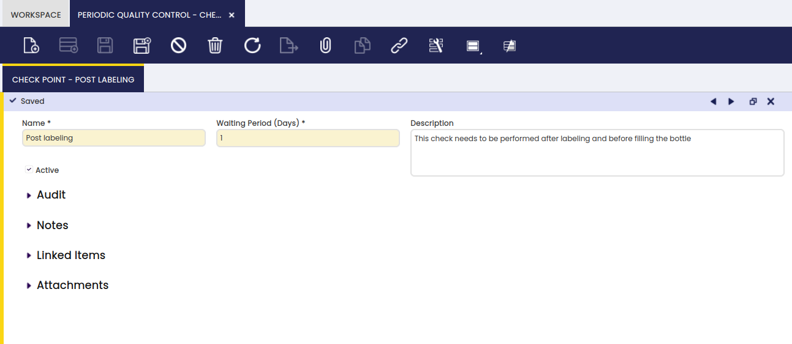
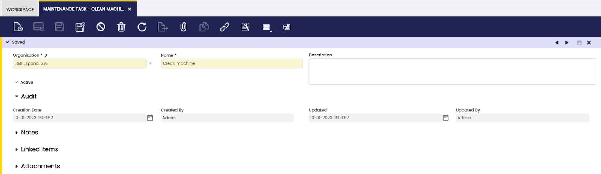

## Overview

This section describes the screens that are necessary to set up the components used in the production process in Etendo. The corresponding windows are:

[:material-file-document-outline: Section](#section){ .md-button .md-button--primary }  

[:material-file-document-outline: Work Center](#work-center){ .md-button .md-button--primary }  

[:material-file-document-outline: Process Plan](#process-plan){ .md-button .md-button--primary }  

[:material-file-document-outline: Activity](#activity_1){ .md-button .md-button--primary }  

[:material-file-document-outline: Toolset](#toolset_2){ .md-button .md-button--primary }  

[:material-file-document-outline: Machine Category](#machine-category){ .md-button .md-button--primary }  

[:material-file-document-outline: Machine](#machine_1){ .md-button .md-button--primary }  

[:material-file-document-outline: Manufacturing Cost Center](#manufacturing-cost-center){ .md-button .md-button--primary }  

[:material-file-document-outline: Indirect Cost](#indirect-cost_2){ .md-button .md-button--primary }  

[:material-file-document-outline: Periodic Quality Control](#periodic-quality-control){ .md-button .md-button--primary }  

[:material-file-document-outline: Quality Control Point](#quality-control-point){ .md-button .md-button--primary }  

[:material-file-document-outline: Work Incidence](#work-incidence){ .md-button .md-button--primary }  

[:material-file-document-outline: Maintenance Task](#maintenance-task){ .md-button .md-button--primary }  

## Section

:material-menu: `Application` > `Warehouse Management` > `Setup` > `Section`

### Overview

In this window, the user can edit the production area by dividing them into multiple sections.

A manufacturing area can be split up in different sections in order to identify where the physical location is where a certain activity will take place. For instance, the Main Floor.

### Section

Here, the user can create a production plant section to assign work centers to it.

## Work Center

:material-menu: `Application` > `Warehouse Management` > `Setup` > `Work Center`

### Overview

In this window, the user can create and add machines to be used in a work center.

The work center is a logical grouping of machines, processes or tool sets in a certain section of the production area.

### Work Center

Here, the user can create work centers.

-   **Section**: to indicate where the work center is situated.

#### **Machine Station**

In this tab, the user can add machines to be used in a selected work center.

Here, all machines that are related to the work center are entered.

#### **Activity**

In this tab, the user can view the activity related to a selected work center.

Here, all activities that are referencing the work center are populated automatically.

#### **Toolset**

Here, the user can view the toolsets of a selected process.

With the population of the activity information in the activity tab, all toolsets related to these activities are populated in this tab.

## Process Plan

:material-menu: `Application` > `Warehouse Management` > `Setup` > `Process Plan`

### Overview

Define the steps and processes to be completed for an intermediate or finished good, taking into account available resources.

### Process Plan

In this window, the user can create production process models.

A key document in production management is the Process Plan. Each product that is produced has a process plan to define the exact operations and the input and output for each operation. Based on the effective use of raw material and machines a batch size (conversion rate) is used for the production of each product.

-   **Organization**: organization of the process plan
-   **Search Key**: abbreviation or full name used to easily filter the record
-   **Name**: name of the process plan
-   **Description**: note field
-   **Process Unit**: the outcome of the production process
-   **Conversion rate**: batch size of the produced product
-   **Include Phases when inserting** checkbox: when the checkbox is selected: in the Work Requirement, when the information from the process plan is copied, the operations and the products are included
-   **Copy version** button: to copy the content of another version of the same process plan

#### **Version**

In this tab, the user can create process plans valid for a specified time period.

Changes may be needed for a process plan. To make sure the history of all changes is kept, different versions of the process plan are created. The copy version button is used to duplicate existing versions of the same process plan for re-use. The copied version is updated with the required changes.

Each version has a starting date and an ending date.

The estimated time field is populated with the value of the accumulation of the estimated time of all the operations in the process plan. The information is updated by the application each time an estimated time is entered and saved on an operation.

#### **Operation**

In this tab, the user can add processes to be performed for a specified process plan.

Each stage of the production process is defined as an operation.

**Name**: name of the operation

**Activity**: activity that is executed during the operation

**Estimated Time**: information entered by the user to indicate what the estimated time in hours is to execute the operation.

**Cost Center Use Time**: estimation of how long the cost center will be used during the operation

**Preparation Time**: time indication of any preparations needed for the operations

**Description**: note field

**Multiplier**: indication of how many times the operation has to be executed in one production run

**Empty cells are zero checkbox**: selection has the result that when the Work Requirement inserts the process plan information, the quantities on the products are left zero, so they can be entered manually.

**Global use checkbox**: when selected, the application populates the product in the global use tab of the Work Effort when the create standards process is executed. When the work effort is validated, the application divides the entries in the global use tab between all production runs that use this product. It is inserted as an additional P- in order to be included in costs calculations.

**Outsourced checkbox**: indication of the operation being executed by a third party

**Create Standards checkbox**: the process plan is used to automatically generate information about operations and products in a work requirement. From the work requirement, work efforts can be created to document the work executed in production. In order to know what products were involved in the work effort, the create standards process is executed on the work effort. When the Create Standards checkbox is selected, at the moment that work efforts are created from the work requirement, also the create standard process is executed. By default, the checkbox is not selected.

!!! info
    The Create Standards process is only completed successfully if there is sufficient stock for the used products (P-) of the operation. The stock has to be in a warehouse that is related to the organization of the Work Requirement.

#### **I/O Products**

In this tab, the user can define input and output products taking part in a specified process.

For each operation, the products that are used (P-) and the products that are produced (P+) are defined.

The fields that are displayed depend on the selected Product Type.

**Product**: product used in the operation. Only products that have the production checkbox selected in the product screen, appear in the list of products

**Product Type**: indication of whether the product is used (P-) or produced (P+) during the operation

**Quantity**: quantity of the product

**UOM**: unit of measure of the product

**Unique attribute set consumption checkbox**: field that only appears for product used (P-). When selected, the application will select stock with the same attribute only. For example, if the product has different lot numbers, all stock that is used during the operations will be taken from the same lot

**Component Cost**: field that only appears on produced (P+) components. The input is a factor used to distribute the cost when an Operation has more than one P+ product. Example:

An operation consumes 10 (P-) A and produces 5 (P+) B and 10 (P+) C.

The cost process calculates a total cost of 15USD for the operation (including cost center related costs). That cost has to be distributed between P+ B and P+ C. If both B and C have a Component Cost of 1 the cost will be equally distributed between B and C. Resulting in a cost of 7.5USD/5 = 1.5USD/unit of B and 7.5USD/10 = 0.75$/unit of C.

If B has a Component Cost of 1 and C of 2, the cost assigned to C has to be twice the cost of B. 5USD are assigned to B and 10USD to C resulting in a cost of 5USD/5 = 1USD/unit of B and 10USD/10 = 1USD/unit of C.

The way to calculate the particular factor of any P+ is to divide the component cost of the particular P+ by the sum of the Component Costs (CC) of all the P+ products.

**Decrease**: information only field

**Rejected**: information only field

**Division group quantity**: field that only appears on produced (P+) components. The value entered is the quantity that is produced with the same attribute value. For example if the attribute is lot number or serial number, the number entered in this field indicates how many products will get the same lot number or serial number during production. During production, the following attributes are automatically assigned to products in production:

-   expiration date
-   serial number
-   lot number

**Create Product copy button**: as indicated in the product configuration, semi finished products can be created by copying the product that is used to produce this particular semi finished product. This functionality can also be used to create other raw material products, in which case the selected Production Type is product used (P-). When copying the information, the search key and name are suggested in the format \[original product\]\[operation name\]\[operation line number\], but can be overwritten with a different value. Any attributes related to the original product can be copied also.

!!! info
    Any changes to the automatically created product, such as unit of measure or cost type, can be updated in the Product screen.

#### **Copy From Attribute**

In this tab, the user can define the relation between attributes to be copied.

The Copy From Attribute tab is used for products of the production type P+. The tab is used to enter the different attributes to be inherited from different P-'s, that are used to produce the P+. This means that only P-'s used in this operation can be selected to be copied from. In the case that the P+ is created by copying a product, if the attributes were copied during the creation, the system populates the information in this tab:

-   **Is special attribute checkbox**: used for special attributes, which are **lot, serial number and expiration date**. When not selected, a regular attribute is selected to be copied.

!!! info
    When attributes are copied over to a different product, the product that the attribute is copied to has to be configured with that attribute also.

#### **Employee**

In this tab, the user can define the employees that can perform a specified process.

The process to generate standard cost (theoretical) populates the cost information in the Employee, Machine and Indirect Cost tabs. For details, please refer to the [Calculate Standard Costs](../../../../user-guide/etendo-classic/basic-features/production-management/transactions.md#calculate-standard-costs) section. The information is needed for the theoretical cost calculation of the P+.

#### **Machine**

In this tab, the user can define machines that are used for a specific process. In the example, there is no machine defined.

The process to generate standard cost (theoretical) populates the cost information in the Employee, Machine and Indirect Cost tabs. For details, please refer to the [Calculate Standard Costs](../../../../user-guide/etendo-classic/basic-features/production-management/transactions.md#calculate-standard-costs) section. The information is needed for the theoretical cost calculation of the P+.

#### **Indirect Cost**

In this tab, the user can define indirect costs related to a specified process.

The process to generate standard cost (theoretical) populates the cost information in the Employee, Machine and Indirect Cost tabs. For details, please refer to the [Calculate Standard Costs](../../../../user-guide/etendo-classic/basic-features/production-management/transactions.md#calculate-standard-costs) section. The information is needed for the theoretical cost calculation of the P+.

## Activity

:material-menu: `Application` > `Warehouse Management` > `Setup` > `Activity`

### Overview

In this window, the user can define activities (processes) to be performed as part of a process plan and their characteristics.

An activity is a certain work that is executed during the production process. For example in the clothing industry, examples of activities for the production of shirts could be cutting of fabrics, dying of fabrics, sewing of the shirts.

### Activity

The user can create activities to be used in the production process.

Each operation in the production process has one or more activities associated with it. Each activity can be associated with a **Cost Center** and a **Work Center**.

#### **Toolset**

In this tab, the user can add toolsets to be used for completion of a specified process.

-   **Utilization Coefficient**: the number of times the tool is used during the activity.

## Toolset

:material-menu: `Application` > `Warehouse Management` > `Setup` > `Toolset`

### Overview

In this tab, the user can define tools and groups of tools to be used in the production process.

Apart from machines that are used for production, there are also tools that are used and need to be set up. All tools that are used in production are included in the activity setup.

### Toolset Type

Here, the user can create toolset types to group toolsets with similar characteristics.

-   **Lifespan**: number of years that the tool can be used

#### Toolset

Here, the user can define structural trees to be used in the application.

-   **Storage bin**: warehouse location where the tool is stored
-   **Discarded checkbox**: indication that the tool is no longer used. The field is entered manually and does not generate any transaction in the application.
-   **Utilization**: when activities are entered, the associated toolsets are entered. This results in an automatic count of how many times the tools are used in production, based on validated work efforts.

## Machine Category

:material-menu: `Application` > `Warehouse Management` > `Setup` > `Machine Category`

### Overview

In this window, the user can create machine categories based on desired characteristics.

A logical grouping of machines that can be used to categorize the different machines that are used during a production process.

### Machine Category

Here, the user can define machine categories to group machines with similar characteristics.

#### Maintenance

Here, the user can define maintenance categories needed for a specified machine category.

Once the maintenance task(s) is set up, it can be added to the machine category. By selecting the Insert in Machines checkbox, the maintenance plans are populated for all the machines that are related to the machine category when the Insert Maintenances process is executed. When the checkbox is not selected, a single maintenance plan for the machine category is created.

!!! info
    By selecting the checkbox, the maintenance plans for the machines are created, but the maintenance information is not added to the maintenance tab of each machine. That tab is used to document any maintenance that is not related to the machine category, but only to that particular machine.

-   **Maintenance Type**: to indicate the nature of the maintenance:
    -   preventive
    -   corrective
    -   corrective(urgent)
-   **planned time**: to indicate how long it takes to execute the maintenance task.

#### **Periodicity**

The user can add interval timings to schedule and complete a specified maintenance.

This tab is to define with which frequency and during which shift the maintenance is scheduled to take place:

**Periodicity Type**:

-   **Daily**
-   **Bi-monthly**: the Starting Day field appears to define when the first maintenance is scheduled
-   **Half-yearly**: the Starting Day field appears to define when the first maintenance is scheduled
-   **Monthly**: the Day of the Month field appears to define which day of the month the maintenance is scheduled
-   **Quarterly**: the Starting Day field appears to define when the first maintenance is scheduled
-   **Weekly**: the Weekday field appears to define which day of the week the maintenance is schedule

## Machine

:material-menu: `Application` > `Warehouse Management` > `Setup` > `Machine`

### Overview

In this window, the user can create machines to be used in production.

In this screen, all the different machines used in production are set up.

### Machine

Here, the user can add machines to be used in production processes.

-   **Machine Category**: which grouping of machines this particular machine belongs to
-   **Purchase Year**: the date of purchase of the machine
-   **Lifespan**: the estimated time that the machine can be used for the production process

#### **Cost**

In this tab, the user can set the full cost of a related machine.

In the Cost tab, all cost and amortization information is entered:

-   **Valid from Date**: start date for the amortization
-   **Purchase Amount**: the amount that is paid for the machine
-   **Cost**: cost per UOM automatically populated after the above information about the machine is filled out, based on the calculation: Value/Year / UOM Annual Cost.
-   **Cost UOM**: indication of how the cost should be calculated, per hour, per produced units, etc.
-   **Toolset Amount**: extra amount for the machine, for example for components
-   **Amortization**: number of years in which the amortization for the machine will take place
-   **Value/Year**: amortization amount per year, based on the calculation: (Purchase Amount + Toolset Amount) / Amortization. The value is populated when the amount of year of amortization is entered.
-   **Work Days/Year**: amount of days per year that the machine is used
-   **Work Hours/Day**: number of hours per day that the machine is used
-   **Idle Time/Year**: number of hours that the machine is not working in a year, for example because it is in maintenance.
-   **UOM Annual Cost**: Populated field based on the calculation: (Work Days/Year x Work Hours/Day) - Idle Time/Year.

#### **Maintenance**

In this tab, the user can define maintenance types needed for a specific machine.

Any maintenance information required for the machine is entered in this tab.

-   **Maintenance Type**: to indicate the nature of the maintenance:
    -   preventive
    -   corrective
    -   corrective (urgent)
-   **Planned time**: to indicate how long it takes to execute the maintenance task.

#### **Periodicity**

In this tab, the user can add timing intervals to schedule and complete a specified maintenance.

This tab is to define with which frequency and during which shift the maintenance is scheduled to take place:

-   **Periodicity Type**:  
      
    -   **Daily**
    -   **Bi-monthly**: the Starting Day field appears to define when the first maintenance is scheduled
    -   **Half-yearly**: the Starting Day field appears to define when the first maintenance is scheduled
    -   **Monthly**: the Day of the Month field appears to define which day of the month the maintenance is scheduled
    -   **Quarterly**: the Starting Day field appears to define when the first maintenance is scheduled
    -   **Weekly**: the Weekday field appears to define which day of the week the maintenance is scheduled

## Manufacturing Cost Center

:material-menu: `Application` > `Warehouse Management` > `Setup` > `Manufacturing Cost Center`

### **Overview**

The user can create and edit cost centers related to production to sum up charges associated with a specific transaction.

All operations in the production process consists of activities. These activities have a cost center defined and how much time of that cost center is used. Each cost center has the employees that are part of the cost center defined, as well as the machines used in the cost center and the indirect costs such as electricity, etc. Based on these components, a cost per hour related to the cost center can be defined. Based on the use of the cost center during production, a cost per produced unit is added to the total cost of the unit.

In order to set up the cost center, the following information has to be set up first:

-   Salary categories and related cost for the employees that are related to the cost center
-   All machines that are related to the cost center
-   All indirect cost components are defined

### **Manufacturing Cost Center**

The user can create cost centers to be used in production processes.

In the main tab of the form, the name of the cost center is defined:

-   **Calculated checkbox**: when selected, a different value from 0 will be populated in the Production Run tab of the Work Effort window, regarding the 'By Default' checkbox value. When not selected, use time of the cost center in the Production Run tab of the Work Effort window will be 0.
-   **By Default checkbox**: when selected, upon calculating the production cost, the cost center use time defined in Work Requirement will be populated in the Production Run tab of the Work Effort window. When not selected, upon calculating the production cost, the start and end time of the work effort is taken into account to determine the use time of the cost center.

#### **Version**

In this tab, the user can create cost center versions to be used with specified time periods.

For the cost center, there is version control, so historic data can be reviewed.

-   **Cost**: based on the cost of employees, machines and indirect cost, a cost for the cost center is entered.
-   **Cost UOM**: unit of measure of the entered cost: per produced units, per Hour of production, per kg (of produced products), percentage (of the produced units)

#### **Employee**

In the Employee tab, the user can add employees to a specific cost center version.

In this tab, the information about how many employees per hours of a certain salary category are assigned to the cost center is entered:

The information in this tab populates the default information in the Salary Category/Employee tab of the Work Effort.

!!! info
    The split checkbox is used when there are multiple lines for employees. For example, if there are 5 lines for production workers with a quantity of 1, if the split checkbox is not selected the Work Effort will display one line for production worker with a quantity of 5. When the split checkbox is selected, five separate lines for production worker with quantity 1 per line is displayed in the Work Effort.

#### **Machine**

In the Machine tab, the user can add resources to a specific cost center version.

In this tab, all machines related to the cost center are entered with an indication of how many times the machines are used (Usage Coefficient) during the production process:

#### **Indirect Cost**

Here, it is possible to add indirect costs to a specific cost center version.

Any indirect cost for the cost center is entered in this tab:

## Indirect Cost

:material-menu: `Application` > `Warehouse Management` > `Setup` > `Indirect Cost`

### Overview

In this window, it is possible to create and edit indirect costs to be used in production.

Indirect cost are cost related to produced products that are not directly related to a specific production run, but are included in the cost calculation of these produced products. Examples are electricity cost, cost of packaging material, marketing cost, etc.

### Indirect Cost

Here, the user can create a new indirect cost.

In the main screen, the name of the indirect cost is entered:

#### Value

Here, the user can create and edit values for this indirect cost.

In this tab, the indirect cost for a certain time frame is entered in the Total field. Since the cost UOM is per produced units, the cost is calculated when clicking the Calculate Indirect Cost button by dividing the total cost by the number of units on all work efforts in the defined time frame.

## Periodic Quality Control

:material-menu: `Application` > `Warehouse Management` > `Setup` > `Periodic Quality Control`

### Overview

In this window, it is possible to define checkpoints to be used for quality control of a produced product.

The periodic Quality Control is set up to ensure the quality of the end product of the production process. For example, a check to see if the size is correct, the color is correct or if all specifications of the product are correct.

### Periodic Quality Control

Here, the user can create checkpoints to be used for quality control of produced products.

Another example is to see if for a product the label is in the correct language:

#### **Check Point**

Here, the user can add quality tests to be taken for a specified checkpoint.

-   **Waiting Period**: time (in days) that the execution of the quality control will take.

## Quality Control Point

:material-menu: `Application` > `Warehouse Management` > `Setup` > `Quality Control Point`

### Overview

In this window, it is possible to define quality control check points to be used for testing the product quality at any point in the production process.

Quality Control Point is a point or stage of manufacturing where it is essential to control (reduce or eliminate) a risk to avoid downtime.

For example, checking the temperature of oil every three hours. It is possible to set the frequency and list required tasks and accountable personnel.

### Check Point Set

Here, it is possible to create check point sets and define tests frequencies.

-   **Frequency**: the number of hours between checks.

#### **Check Point**

Here, it is possible to create check points for a related set.

-   **Name**: the name of the exact control that is defined.
-   **Number of Measurements**: the number of times this concrete control has to be executed. For example the number of times temperature needs to be measured.
-   **Value**: the type of value of the outcome of the check that is executed.
-   **Critical checkbox**: information only field to indicate a check is critical.

#### **Shift**

In this tab, the user can define shifts when the tests for a related group will be performed.

The information in this tab is used for the automatic population of check point set information when the results are reported in the Quality Control Report. In the main section of the report, the shift is selected.

!!! info
    The starting date in this set up is used for the automatic population of the time information of the Quality Control Report.

## Work Incidence

:material-menu: `Application` > `Warehouse Management` > `Setup` > `Work Incidence`

### Overview

In this window, it is possible to define types of work incidences that may occur during production.

Standard work incidences are set up for later reference in the work effort. A possible work incidence is that a machine component breaks and needs to be replaced or some other unplanned machine outage.

!!! warning
    If machine maintenance is managed in an external system, go to the [Internal Consumption](transactions.md#internal-consumption) window to keep the spare parts stock updated in Etendo, even when another software is used.  

 
### Work Incidence

Here, the user can create work incidence types that may occur during production.

-   **Work Incidence Downtime**: the total work incidence downtime. This information is not taken into account for any cost calculation, so it is up to the user to decide the unit of measure of the field (seconds, minutes, hours, etc.)

## Maintenance Task

:material-menu: `Application` > `Warehouse Management` > `Setup` > `Maintenance Task`

### Overview

In this window, it is possible to define a scheduled maintenance task to be completed during the production process.

Maintenance tasks can be created to be executed to the machines in Production.

!!! warning
    If machine maintenance is managed in an external system, go to the [Internal Consumption](transactions.md#internal-consumption) window to keep the spare parts stock updated in Etendo, even when another software is used.  

The maintenance process is as following:

-   The created maintenance tasks are added either to the machine category, with the possibility to apply that tasks to all machines belonging to that machine category, or directly to the machine.
-   Run the insert maintenance process.
-   Review the Maintenance Plan and select the confirmation checkbox for all maintenance tasks that need to be executed.
-   If applicable, all consumptions of products used during the execution of the maintenance task is entered in the Internal Consumption screen.
-   The execution of maintenance tasks is registered in the Maintenance Order screen. Once added in this screen, the maintenance task no longer appears on the Maintenance Plan.

### Maintenance Task

Here, the user can define general maintenance tasks to be used in production.

All maintenance tasks that are scheduled for the machines in production are entered in this screen:

---

This work is a derivative of ["Production Management"](http://wiki.openbravo.com/wiki/Production_Management){target="\_blank"} by [Openbravo Wiki](http://wiki.openbravo.com/wiki/Welcome_to_Openbravo){target="\_blank"}, used under [CC BY-SA 2.5 ES](https://creativecommons.org/licenses/by-sa/2.5/es/){target="\_blank"}. This work is licensed under [CC BY-SA 2.5](https://creativecommons.org/licenses/by-sa/2.5/){target="\_blank"} by [Etendo](https://etendo.software){target="\_blank"}.