## Work Requirement

### **Introduction**

In this window, the user is able to create and manage an order for a [_Process Plan_](setup.md#process-plan) to be executed a certain number of times to satisfy the production requirements.

!!! warning
    Important: Before creating a work requirement, it is necessary to have a Process Plan defined.

A work requirement is a document indicating what has to be produced and by what date. The work requirement is created based on a process plan. The operations with the related details are populated in the work requirement. Once the operations are populated, the information can be overwritten if needed.

A work requirement can be created in two ways:

- manually in the screen
- automatically as an outcome of the manufacturing plan in MRP.

### **Header**

Here, it is possible to create production orders by choosing dates and the previously defined work requirement model.

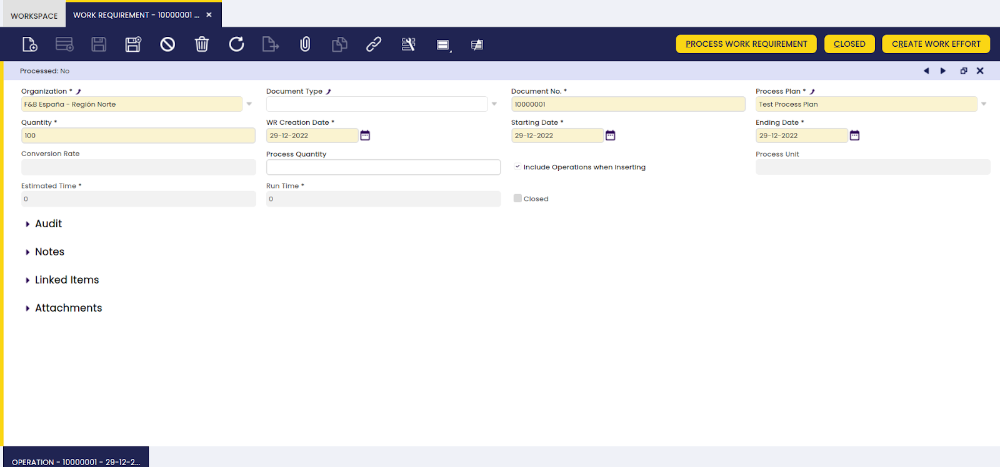

**Organization**: organization in which the production will be executed.

**Document Type**: used for easy filtering, for example separate production department names can be set up as document types.

**Document No.**: number of the work requirement.

**Process Plan**: name of the process plan that is used for this production.

**Quantity**: number of batches to be produced. The field is automatically populated based on the entered process quantity and conversion rate.

**WR Creation Date**: the date the document is created. This date is used as a reference to define the corresponding process plan version.

**Starting Date**: date that the production is planned to start

**Ending Date**: date that the production is planned to end

**Conversion Rate**: batch size for production

**Include Phases when inserting checkbox**: when the checkbox is selected: in the Work Requirement, when the information from the process plan is copied, the operations and the products are included. The setup is also in the process plan, but that set up can be overwritten in this screen if needed.

**Process Quantity**: total quantity to be produced

**Process Unit**: the product to be produced

**Estimated Time**: information of the estimated execution time, that is populated when the work requirement is processed. The calculation is: estimated time taken from the process plan x process quantity on the work requirement.

**Run Time**: populated information of the real execution time, taken from the work effort.

**Process Work Requirement button**: to insert the information from the process plan in the work requirement

**Create Work Effort button**: to create work related to the work requirement once the work requirement is processed. Work efforts related to all operations are created at once, so depending on the amount of operations, one or more work efforts are created. If the create standards checkbox is selected in the operation, the create standards process is executed also, to insert the product information in the work effort. In all cases, the processing of the work effort is executed manually.

!!! note
    The Create Standards process will only complete successfully if there is sufficient stock for the used products (P-) of the operation. If there is no sufficient stock, not only will the Create Standard process fail, but also no Work Effort is created.When there is sufficient stock, the Create Standards process is executed successfully and by default the Completed Quantity in the Production Run tab is set to the full quantity on the operation.

### **Operation**

In this tab, the user can add or edit operations and activities to be performed for the related work requirement.

After processing the Work Requirement, the information in the operation tab is populated from the Process Plan. The main tab of the Work Requirement is showing that the Work Requirement is processed and the Estimated Time is showing the total of estimated times of all operations.

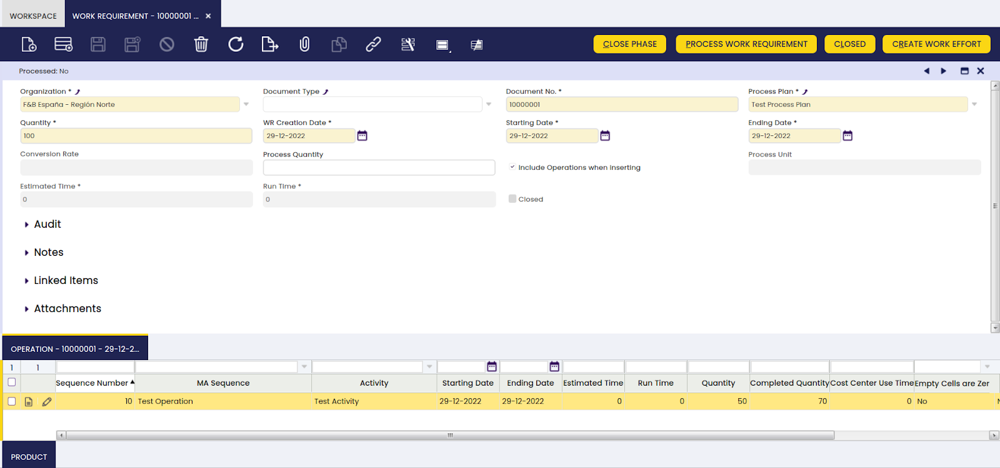

The fields in these two tabs are mostly taken from the Process Plan, but can be overwritten in the Work Requirement. For a description of these fields, please see the [Process Plan](setup.md#process-plan) section.

The **Starting Date** and **Ending Date** of the operations are defaulting from the main tab of the Work Requirement, but can be overwritten.

The **Estimated Time** on the operation is calculated using the formula: estimated time of the operation taken from the process plan x quantity on the operation.

The **Run Time information** is populated based on total actual hours populated from the Work Effort for the operation.

**Close Phase**: With this process, the work requirement phase is closed. If all the phases are closed the work requirement will also be closed.

### **Product**

In this tab, it is possible to add or edit I/O products to be used for the selected operation of the work requirement.

The information in the Product tab is populated from the information in the I/O Products tab of the Process Plan, upon processing of the Work Requirement.

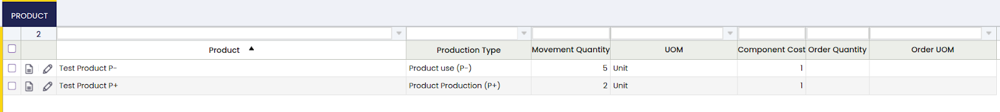

- **Movement Quantity**: value populated from the Quantity field in the I/O Products tab of the Process plan.

!!! info
    For a description of the rest of the fields, please refer to the [Process Plan](setup.md#process-plan).

## Work Effort

### **Introduction**

In this window, the use can edit precisely what has been produced from a selected product order.

The work effort records the work executed by employees during a production shift. The document is used for the following purposes:

- to calculate the real cost related to the production of a product.
- to keep track of the remaining effort on work requirements.

### **Work Effort**

Here, it is possible to create a report for the completed work requirement for a desired date and time.

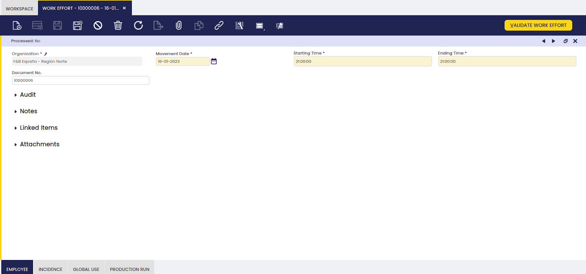

- The Movement Date, Starting Time and Ending Time indicate on which date and during which shift the production took place.
- The Create Standards button (displayed in the "Production Run" tab) is used to execute the process that loads all the P- and P+ information as well as global used products, machines, salary categories, indirect cost, toolsets. When the standards are created, also stock of all P- products is checked and an error appears if any products do not have stock. For the Create Standards process to complete successfully, the Completed Quantity has to be greater than zero.
- Once the standards are created and all the correct information concerning the production is entered, the work effort is validated by clicking the Validate Work Effort button. At this point, the stock information is updated. For P-, the stock decreases and, for P+, it increases.
- Optionally, the Work Effort can be posted to the general ledger journal once the [configuration](../../../../user-guide/etendo-classic/basic-features/production-management/getting-started.md#configuration) is added. If done, information related to the cost of the raw material and produced products is posted.

### **Employee**

Here, it is possible to add employees that took part in the completion of a related work requirement.

Any business partners that are set up as operator in the Employee tab of the Business Partner screen, can be selected as employee that worked on the production of the product.

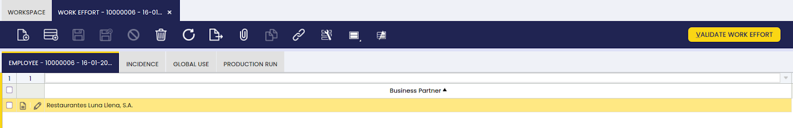

### **Incidence**

Here, it is possible to add work incidences that might have occurred during the completion of a related work requirement.

This tab is used to register any incidence that occurs during the production run, the amount of downtime that it caused, and a description.

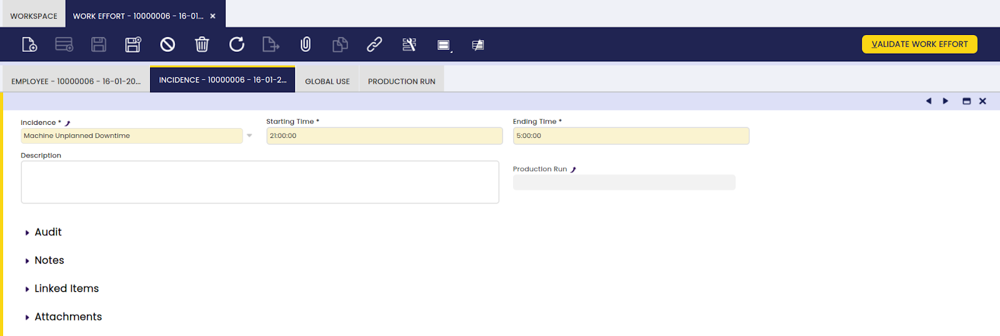

### **Global Use**

Here, it is possible to add global use of products used for completion of a related work requirement.

In this tab, any products that are not specified in the process plan but are used in production are entered. For example, packaging material:

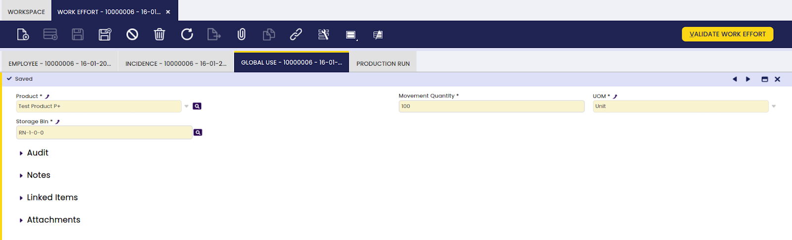

### **Production Run**

Here, it is possible to add progress details of the specified work requirements.

The information related to the executed operation is entered in this tab:

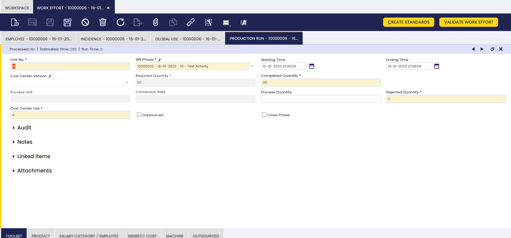

- **Required Quantity**: required quantity of the operation. Populated information when the work requirement phase is selected.
- **Completed Quantity:** the quantity of units produced.
- **Starting Time**: actual start time of the production run
- **Ending Time**: actual end time of the production run
- **Rejected Quantity**: information only field of any rejected quantities during production of the operation.
- **Cost Center Use**: the actual use of the cost center for this operation
- **Outsourced checkbox**: indication of the operation being executed by a third party
- **Close Phase checkbox**: selected if a partial quantity was built, but the operation needs to be closed indicating that the remaining quantity will not be built.

### **Toolset**

Here, it is possible to add or edit toolsets used to complete a specific part of a work requirement.

The information in this tab is populated automatically when the create standards process is executed. The information is taken from toolset information in the activity screen. The toolset uses is populated based on the utilization coefficient in the activity screen multiplied by the completed quantity on the work effort. The information that is populated can be updated with the actual information of the toolsets used during production, before validating the work effort.

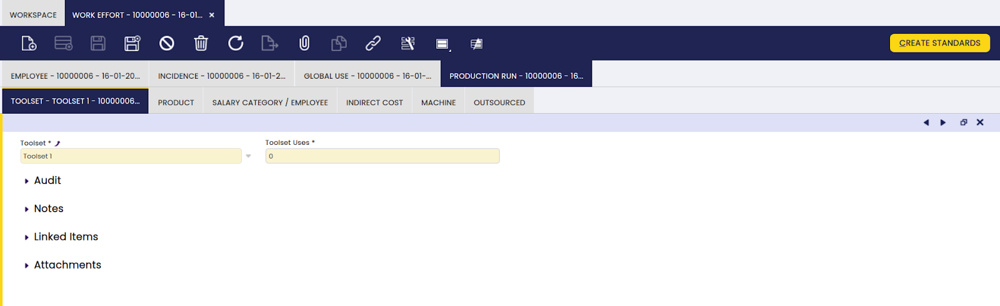

### **Product**

Here, it is possible to add and edit I/O products related to a completed part of a work requirement.

The information is populated automatically when the create standards process is executed, based on the work requirement phase information and the completed quantity on the work effort. The information that is populated can be updated with the actual product information before validating the work effort.

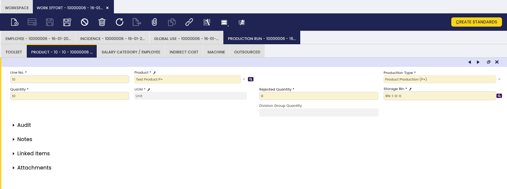

!!! info
    For details about the fields, please refer to the [_Process Plan_](setup.md#process-plan) section.

### **Salary Category / Employee**

Here, the user can add or edit salary category workers that took part in a work requirement.

!!! info
    The information in this tab is populated automatically when the create standards process is executed, taking the employee information on the process plan into account. The information that is populated can be updated with the actual information of the employee effort during production before validating the work effort.

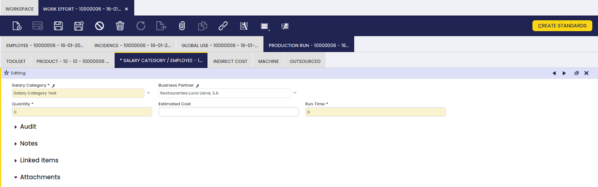

- **Salary Category**: information taken from the cost center setup. The populated information can be updated, for example, to enter another line for additional employees with different salary categories.
- **Business Partner**: the name of the employee that executed the production.
- **Quantity**: the number of employees of this salary category that executed the production. In the cost center set up, the number of employees of a concrete salary category that are related to the cost center is defined. The value can be overwritten here to reflect a different number of employees.
- **Estimated Cost**: the cost calculated when the production costs are calculated, which takes into account the cost center use time.
- **Runtime**:the time dedicated per employee to the production.

### **Indirect Cost**

Here, it is possible to add and edit indirect costs related to a specified completed part of a work requirement.

!!! info
    The information in this tab is populated automatically when the create standards process is executed, based on the indirect cost entered on the process plan. The information that is populated can be updated with the actual information of any indirect cost related to the production, before validating the work effort.

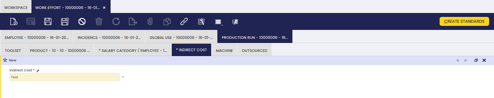

### **Machine**

Here, it is possible to add and edit resources used to complete a specified part of a work requirement.

!!! info
    The information in this tab is populated automatically when the create standards process is executed, based on the machine information entered on the process plan. The information that is populated can be updated with the actual information of machines used during the production, before validating the work effort.

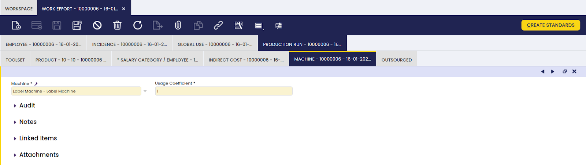

### **Outsourced**

Here, it is possible to add invoices corresponding to the outsourced part of a completed work requirement.

!!! info
    Any outsourced cost for the production is entered manually in this tab based on purchase invoices received from the company that executed the outsourced work.

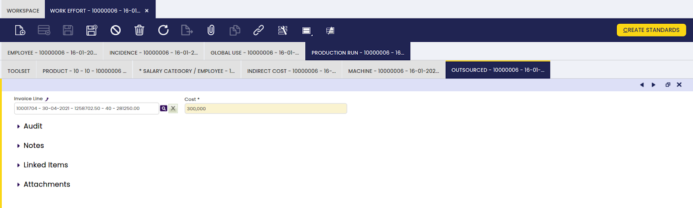

### How to Reactivate Work Efforts

!!! info
    To be able to include this functionality, the Production Extensions Bundle must be installed. To do that, follow the instructions from the marketplace: [Production Extensions Bundle](https://marketplace.etendo.cloud/#/product-details?module=7C68641225CE46A6BF8A39993CC8E1E5){target="_blank"}. For more information about the available versions, core compatibility and new features, visit [Production Extensions - Release notes](../../../../whats-new/release-notes/etendo-classic/bundles/production-extensions/release-notes.md). 

This functionality is useful when the user needs to reactivate a work effort.

From the Work Effort window, the user is able to reactivate a previously generated effort just by selecting the corresponding record and clicking the Reactivate button.

Once the effort is successfully reactivated, the state of the document changes to Not processed as it can be observed in the status bar.

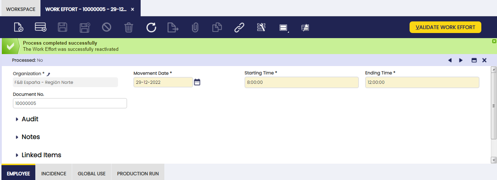

!!! info
    Note: It is not possible to reactivate documents that include transactions with quantities exceeding the existing stock quantity for a certain product in a certain storage bin. The only exception is when the configuration of the storage bin allows Over Issue. For more information, visit [Storage Bin](../../../../user-guide/etendo-classic/basic-features/warehouse-management/setup.md#storage-bin).

### Bulk Posting

!!! info
    To be able to include this functionality, the Financial Extensions Bundle must be installed. To do that, follow the instructions from the marketplace: [Financial Extensions Bundle](https://marketplace.etendo.cloud/#/product-details?module=9876ABEF90CC4ABABFC399544AC14558){target="_blank"}. For more information about the available versions, core compatibility and new features, visit [Financial Extensions - Release notes](../../../../whats-new/release-notes/etendo-classic/bundles/financial-extensions/release-notes.md).

The Bulk Posting functionality allows the user to post or unpost multiple records by selecting the corresponding records and clicking the “Bulk posting” button.

Also, the Accounting Status of the record/s is shown in the status bar, in form view, or in a column, in grid view.

!!! info
    For more information, visit [Bulk Posting](../../../../user-guide/etendo-classic/optional-features/bundles/financial-extensions/overview.md#bulk-posting) in the Financial Extensions Bundle Documentation.

## Production Run

### **Introduction**

Here, the user can edit precisely what has been produced from a selected product order.

The Production Run screen displays the work efforts that are not validated. The listed work efforts are either created from the Work Requirement screen or directly in the Work Effort screen. The screen gives an overview to production workers of the production tasks that are scheduled to be executed.

### **Production Run**

In this window, it is possible to add progress details of the specified work requirements.

The screens are identical to the Work Effort, with the exception that the work effort main tab is not displayed, but directly the information in the Production Run tab. This way, the screen gives an easy-to-read overview of the planned production runs. The Incidence information is a tab on the Production Run. The Production Run number is corresponding to the Work Effort number.

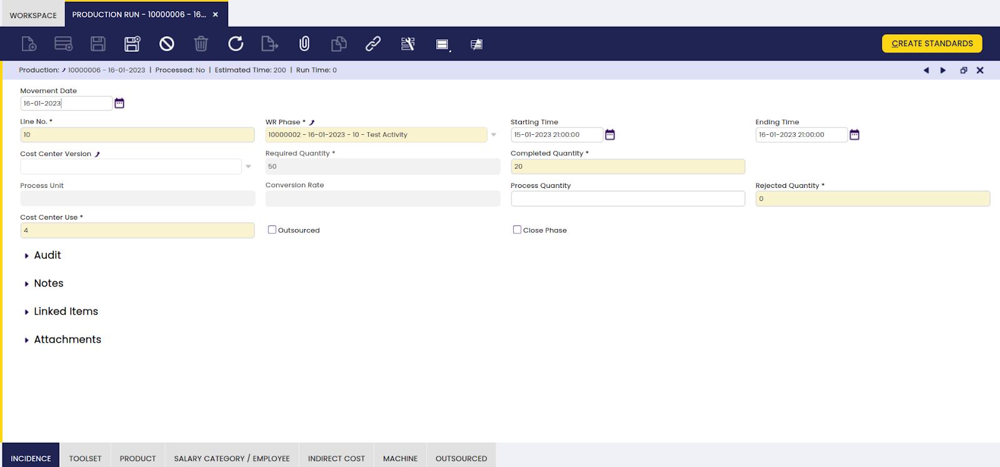

!!! info
    For details on the fields, please refer to the [Work Effort Production Run](#production-run) section.

!!! warning
    Deleting a production run is done in the corresponding Work Effort, not in this screen.

### **Incidence**

In this tab, it is possible to add work incidences that might have occurred during the completion of a related work requirement.

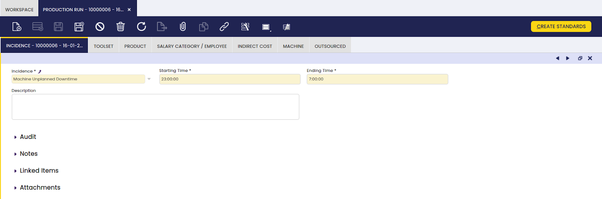

!!! info
    Please, refer to the [Work Effort Incidence](#incidence) section for details.

### **Toolset**

Here, it is possible to add or edit toolsets used to complete a specified part of a work requirement.

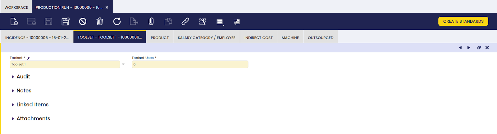

!!! info
    Please, refer to the [Work Effort Toolset](#toolset) section for details.

### **Product**

Here, it is possible to add and edit I/O products related to a completed part of a work requirement.

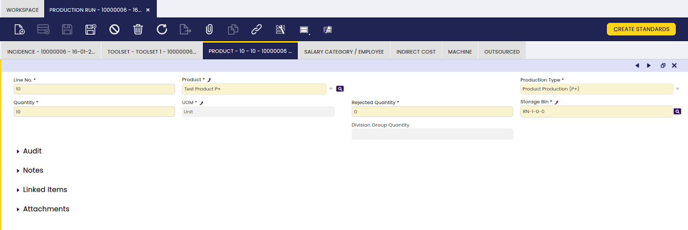

!!! info
    Please, refer to the [Work Effort Product](#product_1) section for details.

### **Salary Category / Employee**

Here, it is possible to add or edit salary category workers that took part in a work requirement.

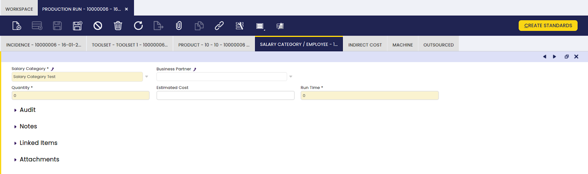

!!! info
    Please, refer to the [Work Effort Salary Category/Employee](#salary-category--employee) section for details.

### **Indirect Cost**

Here, it is possible to add and edit indirect costs related to a specified completed part of a work requirement.

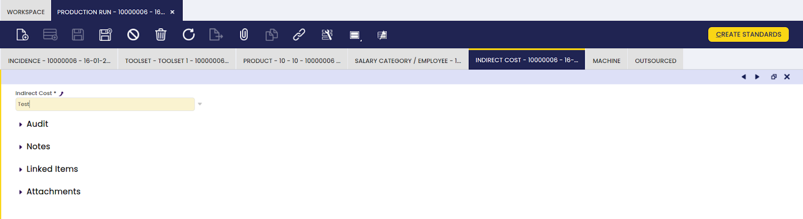

!!! info
    Please, refer to the [Work Effort Indirect Cost](#indirect-cost) section for details.

### **Machine**

Here, it is possible to add and edit resources used to complete a specified part of a work requirement.

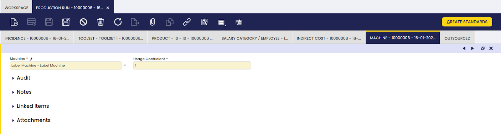

!!! info
    Please, refer to the [Work Effort Machine](#machine) section for details.

### **Outsourced**

Here, it is possible to add invoices corresponding to the outsourced part of a completed work requirement.

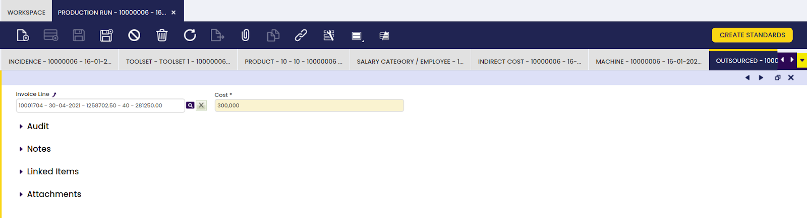

!!! info
    Please, refer to the [Work Effort Outsourced](../../../../user-guide/etendo-classic/basic-features/production-management/transactions.md#outsourced) section for details.

## Quality Control Report

### **Introduction**

In this window, it is possible to create and edit measurements and report findings at predefined checkpoints. The goal is to ensure output quality during production.

For the production cycle, a Quality Control Point can be set up, in order to execute a check related to the production process. For example, checks on machinery or tools that are used in production.

The execution of the checks is documented in the Quality Control Report.

### **Date and Shift**

Here, it is possible to create measurements and insert gathered values or a specific date and shift.

The date and shift during which a particular quality control point is documented, as well as the time when the check took place. Also, a contact name is entered:

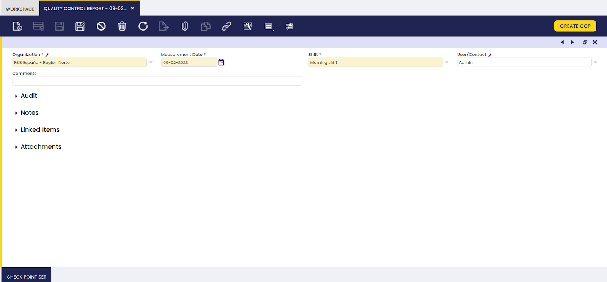

The Create CCP button is used to automatically populate the information in the Check Point Set and Time tabs about the check(s) that are configured to take place during the selected shift.

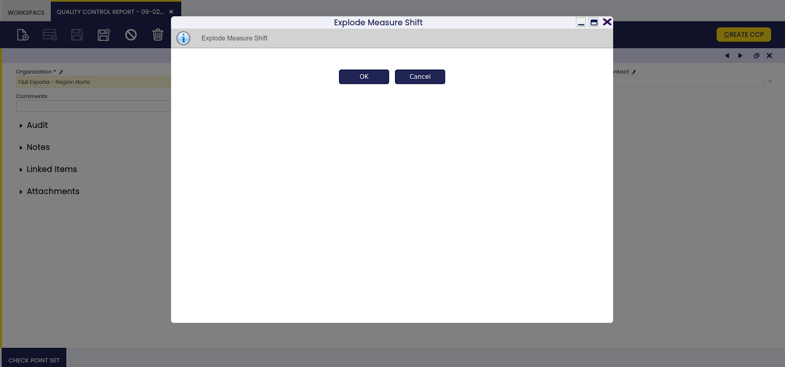

Once the action above has been executed, the Edit CCP Measured Values button appears. When clicked, a popup appears in which the value of the check is entered:

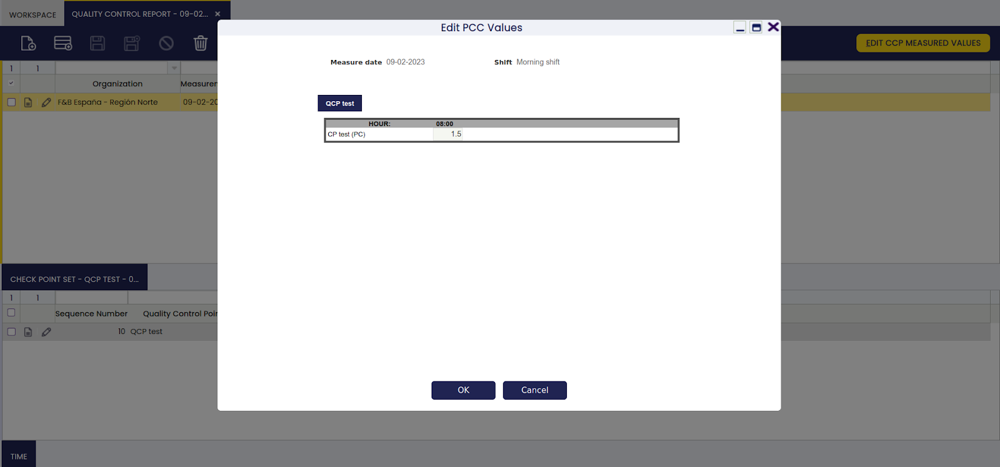

After entering the value and clicking the OK button, the entered value appears in the Values tab.

Once the value has been entered this way, the Input Time Measurement button appear. When clicked, a popup appears to process the information entered in the time tab:

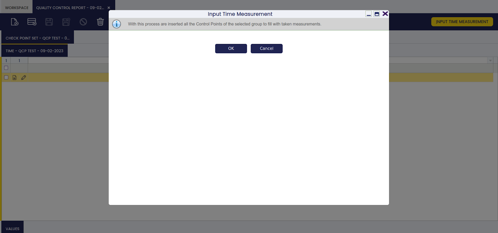

### **Check Point Set**

In this tab, it is possible to create and edit checkpoints for the related measurement.

The information is populated with any checks that take place during the shift.

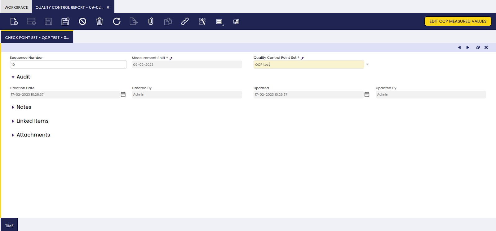

#### **Time**

Here, it is possible to create and edit times for related checkpoints.

The information is automatically populated when the CCP button is clicked: the time that appears is the shift start date that is configured in the [Quality Control Point Shift](../../../../user-guide/etendo-classic/basic-features/production-management/setup.md#shift) information. When populated automatically, the status is processed.

In the case that the information is entered manually, the information is processed by clicking the Input Time Measurement button.

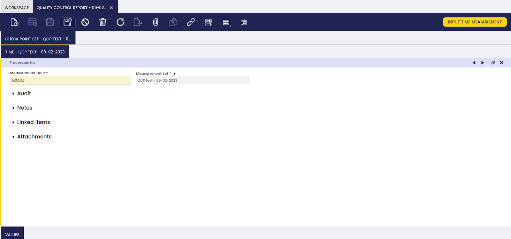

#### **Values**

Here, it is possible to create and edit values for a related measurement.

!!! info
    The information in this tab is automatically populated when the button of the Edit CCP Measured Values is clicked and a value is entered in the pop up screen. Alternatively, a value of what was measured during the check can be entered manually.

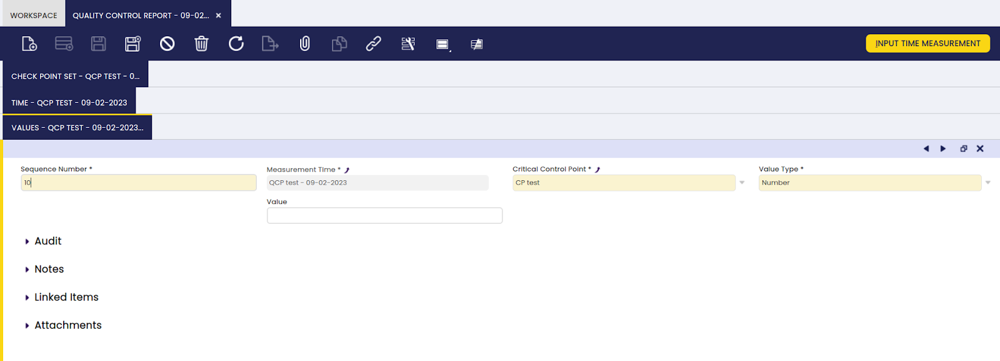

## Periodic Quality Control Data

### **Introduction**

In this window, the user can create and edit data collection and measurements related to quality control. This is done at predefined checkpoints for a manufactured product.

!!! info
    The results of the executed Periodic Quality Control is documented in this screen.

### **Periodic Quality Control Data window**

It is possible to create measurements at a predefined checkpoint for produced products.

All relevant general information about the executed quality control is entered in this screen, such as which check was executed when and for which product:

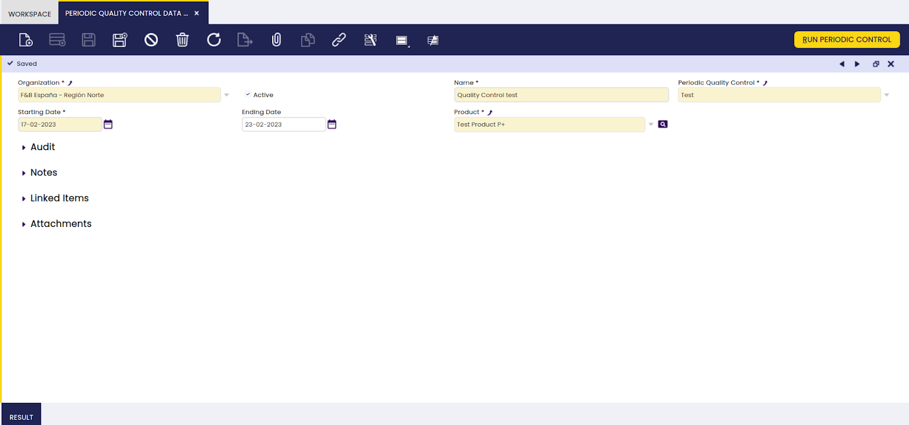

After the main tab information is filled out, the Run Periodic Control button is clicked to populate information in the Result tab.

#### **Result**

In this tab, it is possible to create and edit quality tests for a specified checkpoint, and add test results of the performed tests.

!!! info
    All information is this tab is automatically populated by the Run Periodic Control process, except for the Test Result field, which is entered manually.

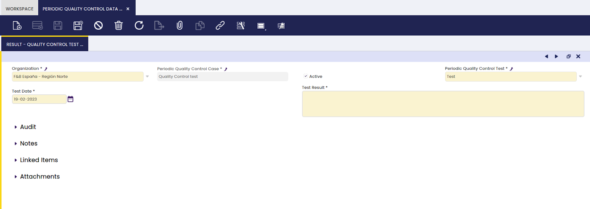

## Internal Consumption

### **Introduction**

In this window, it is possible to define products which are only to be used inside the company.

The Internal Consumption screen is used to administer any products that are used during the execution of maintenance tasks. When processed, the stock is reduced. The products are purchased through the [procurement process](../../../../user-guide/etendo-classic/basic-features/procurement-management/getting-started.md). The products are set up as a regular item, without the Production checkbox being selected, since they are not part of the production process.

### **Header**

Here, it is possible to create products which are to be used inside the organization, and not sold to customers.

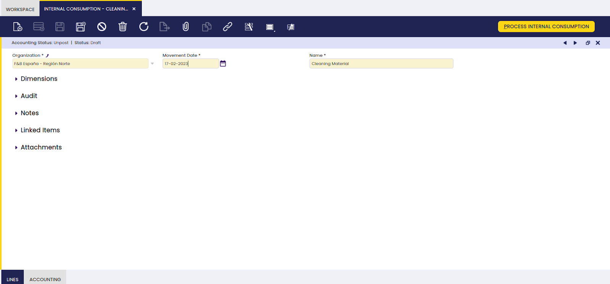

The name is a selectable value in the task tab of the [Maintenance Order](#maintenance-order).

!!! info
    Optionally, the Internal Consumption can be posted to the general ledger journal once the configuration is added. If done, information related to the cost of the product is posted.

### **Lines**

Here, it is possible to add internal consumption lines. Each line corresponds to one product.

The information of the product, its location in the warehouse and the quantity used during the maintenance task is entered. When clicking the Process Internal Consumption, the stock level is decreased with the selected movement quantity.

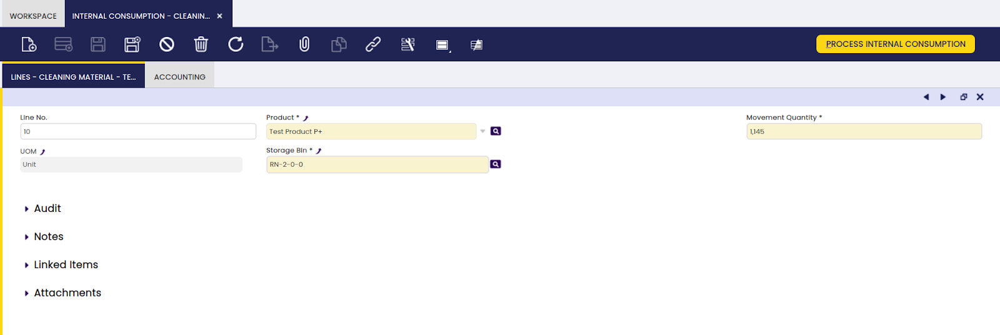

### Bulk Posting

!!! info
    To be able to include this functionality, the Financial Extensions Bundle must be installed. To do that, follow the instructions from the marketplace: [Financial Extensions Bundle](https://marketplace.etendo.cloud/#/product-details?module=9876ABEF90CC4ABABFC399544AC14558){target="_blank"}. For more information about the available versions, core compatibility and new features, visit [Financial Extensions - Release notes](../../../../whats-new/release-notes/etendo-classic/bundles/financial-extensions/release-notes.md).

The Bulk Posting functionality allows the user to post or unpost multiple records by selecting the corresponding records and clicking the “Bulk posting” button.

Also, the Accounting Status of the record/s is shown in the status bar, in form view, or in a column, in grid view.

!!! info
    For more information, visit [Bulk Posting](../../../../user-guide/etendo-classic/optional-features/bundles/financial-extensions/overview.md#bulk-posting) in the Financial Extensions Bundle Documentation.

## Maintenance Order

### **Introduction**

In this window, it is possible to create and edit the results of a scheduled maintenance order.

This document is used to register the execution and results of maintenance tasks. Any tasks that are confirmed in the [maintenance plan](#maintenance-plan) are selectable in this screen.

### **Order**

Here, it is possible to add previously scheduled maintenance for a specific date and report observations.

In the main section of the document, the date and shift during which the tasks were executed is selected.

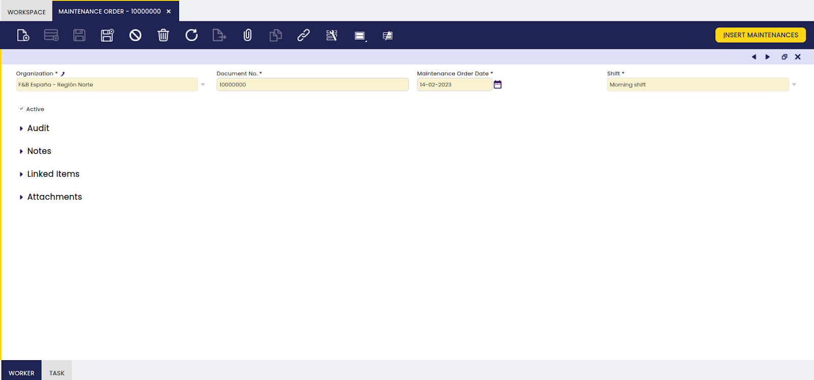

- the Insert Maintenances button is clicked to populate the information in the Task tab. In the following case, no scheduled maintenances are found.

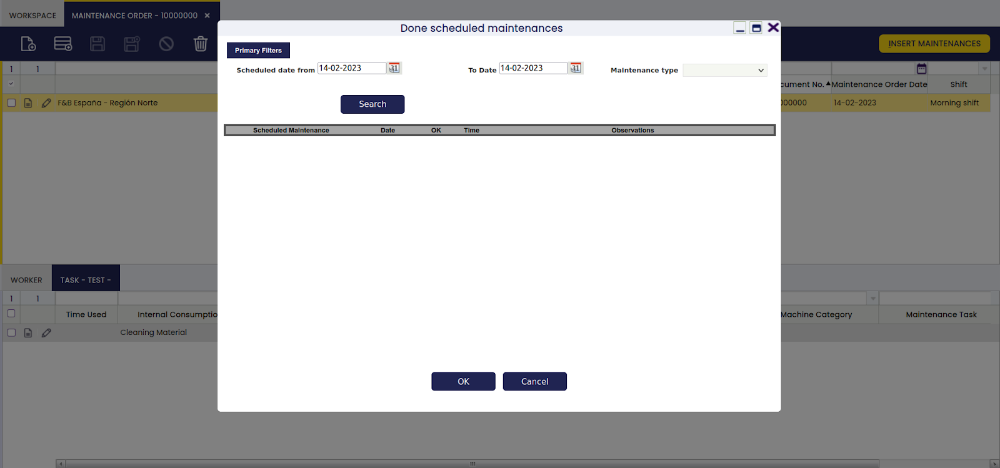

- **OK checkbox**: to indicate that the maintenance ended successfully. In the task tab, this results in the Result checkbox showing as selected.
- **Time**: time in hours to execute the maintenance.
- **Observations**: the results of the maintenance task are entered here.

#### **Worker**

In this tab, it is possible to add or edit workers that took part in a specified maintenance part.

The employee that executed the maintenance task is entered in this tab. As per the information in the set up section, all employees that have the operator checkbox selected appear in the value list of the business partner field in this screen.

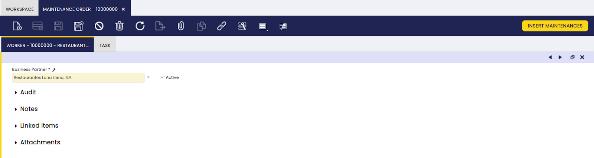

### **Task**

In this tab, it is possible to edit maintenance tasks of a specified order.

!!! info
    Most of the information in this tab is automatically populated by clicking the Insert Maintenances button, apart from the **Internal Consumption** field. Only the **Internal Consumption** field and the **Comments** field are updatable. In this screen, any products that were used for the execution of the maintenance tasks are entered in the Internal Consumption field. For more information, please refer to the [Internal Consumption](#internal-consumption) section.

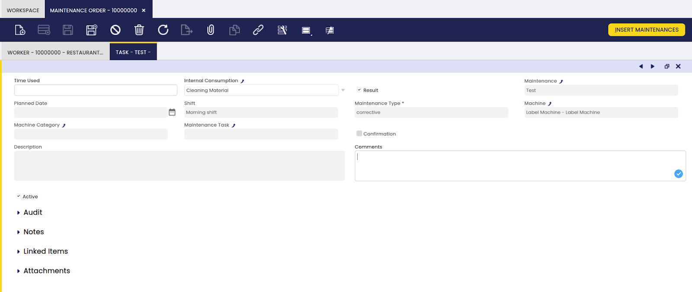

- **Result checkbox**: indication that the maintenance task is executed successfully. If the result is not successful, the task is still considered completed. For any follow up actions, a new maintenance plan is created.

## Insert Maintenances

### **Introduction**

The insert maintenances process executes population of the scheduled maintenance tasks to the [Maintenance Plan](#maintenance-plan) based on the maintenance information in the machine category and/or machine screen.

The creation of the maintenance plan is based on a date range that is entered upon launching the process.

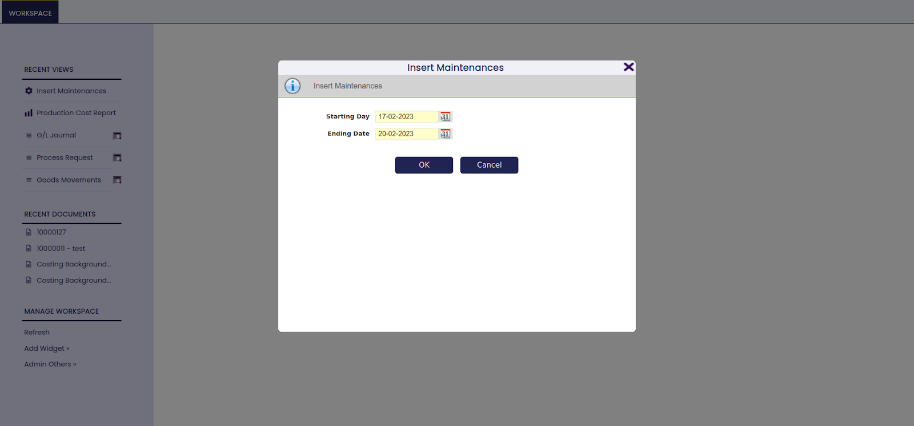

## Maintenance Plan

### **Introduction**

Here, it is possible to add and edit predefined maintenance plans.

The Maintenance Plan information is created in 2 possible ways:

- populated automatically by the insert maintenances process
- manually: for example, to enter data when a machine breaks down and needs corrective maintenance.

Any maintenance tasks that have a [Maintenance Order](#maintenance-order) linked, are hidden by a default filter that is applied to the screen.

### **Maintenance**

Here, it is possible to create and edit maintenance tasks for a specific date.

The Maintenance Plan gives an overview of all the maintenance tasks for a certain time period that are entered by the insert maintenances process or manually. Regardless of how the records were created, the information can be updated to change dates or add comments.

Once the maintenance task is correctly reflected, the confirmation checkbox is selected.

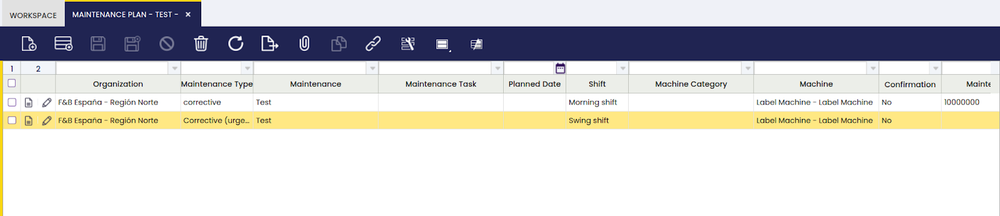

## Calculate Standard Costs

### **Introduction**

The Calculate Standard Costs process is run to generate the standard (= theoretical) cost of manufactured products.

Cost information is set up in several screens:

- in the [Process Plan](setup.md#process-plan), the use of the [Cost center](../../../../user-guide/etendo-classic/basic-features/financial-management/accounting/setup.md#cost-center) is defined
- in the cost center, the following cost is defined:
  - **Employee information**: salary category information as well as the quantity used per hour for the cost center. Based on these, the cost of the employee is calculated. The salary category cost is entered in the [Salary Category](#salary-category--employee) screen.
  - **Machine information**: the machine and usage information is entered in the cost center screen. The machine cost is entered in the [Machine](setup.md#machine_1) screen.
  - **Indirect cost information**: all indirect cost items related to a cost center are list. The indirect cost is entered in the [Indirect Cost](setup.md#indirect-cost_2) screen.
- in the process plan, the quantities and cost of the materials used in the production process are defined.

For raw material, the price list information is used for the cost of the P-. The purchase price list that is used for the raw material cost is marked as default.

The cost information that is calculated for a product P+ is used when that product is a P- for another operation**.**

The formula that is used by the process is the following:

(Cost of Cost Center + Cost Employees + Cost Machines + Indirect Costs) + (Quantity P- x Cost P-) = the cost per unit.

When the costs of the cost center, machines, employees and indirect costs are calculated, they are multiplied by different values depending on their unit of measure:

- If per Hour is used, the cost is multiplied by the Use of the cost center in the Process Plan
- If per Unit is used, the cost is multiplied by the sum of the quantities of the P+'s of the sequence.
- If per Kilogram is used, the cost is multiplied by the sum of the weight of all the P+'s of the sequence.

For Indirect costs, the additional unit of measure percentage is available. This adds the defined percentage to the total cost calculated (cost center, employee, machine, indirect costs and P- products). For example, if defined as 1.15, an additional 15% is added to the cost.

!!! info
        For the Indirect Cost to be included correctly, the following configuration is important in the [Indirect Cost](setup.md#indirect-cost_2) screen: 
            -select Cost Type = Production, 
            -a date range that includes the date of the standard cost calculation in the Value tab. 
        This way, the standard cost for each operation is calculated.

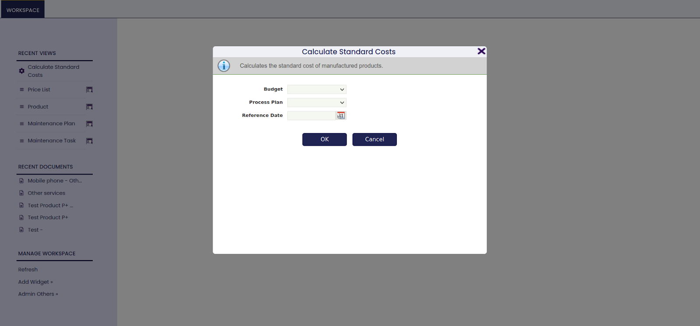

The outcome of the calculation appears in the tabs of the Process Plan:

In the Employee, Machine and Indirect Cost tabs, the result of the costs are automatically populated.
