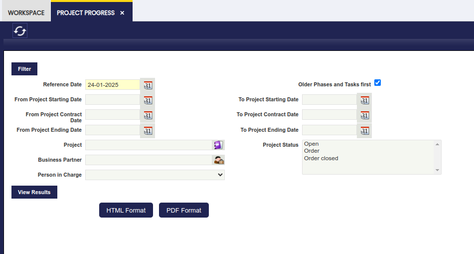
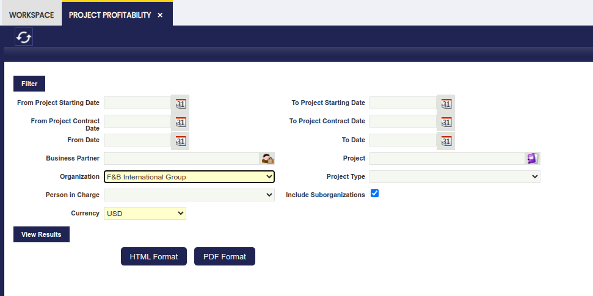
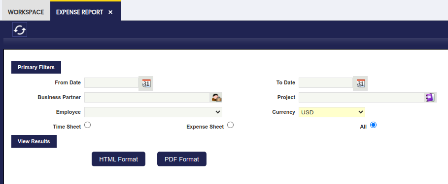
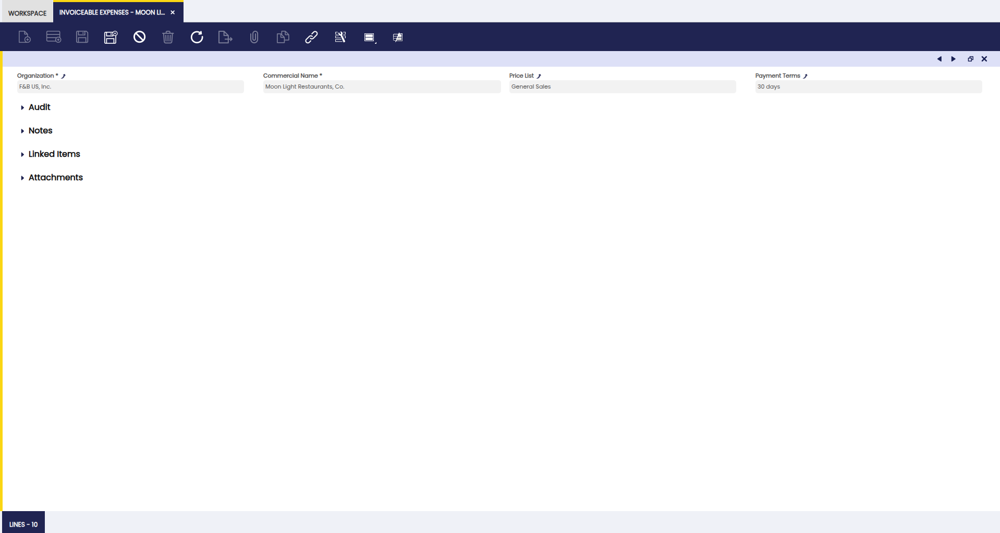
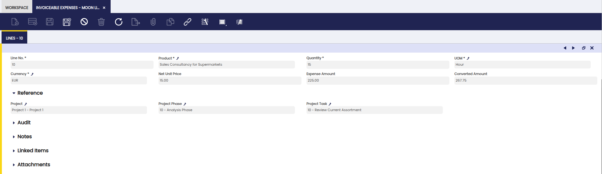
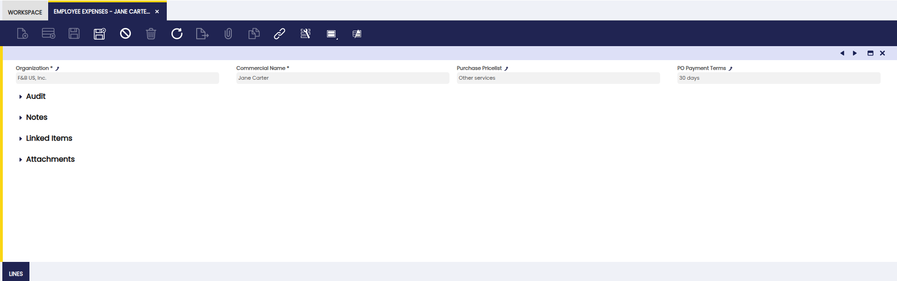
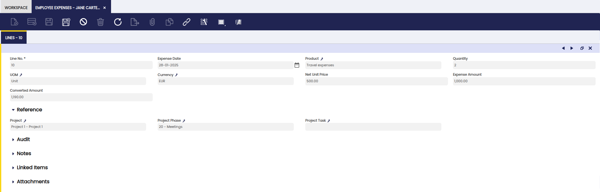

# Project and Service Management Analysis Tools

## Overview

This section describes the windows related to project and service management reports in Etendo. These are:

[:material-file-document-outline: Project Progress](#project-progress){ .md-button .md-button--primary }  

[:material-file-document-outline: Project Profitability](#project-profitability){ .md-button .md-button--primary }  

[:material-file-document-outline: Expense Report](#expense-report){ .md-button .md-button--primary }  

[:material-file-document-outline: Invoiceable Expenses](#invoiceable-expenses){ .md-button .md-button--primary }  

[:material-file-document-outline: Employee Expenses](#employee-expenses){ .md-button .md-button--primary }  

## Project Progress

:material-menu: `Application` > `Project and Service Management` > `Analysis Tools` > `Project Progress`

The Project Progress report allows to track the progress of projects with useful indicators such as the time burned or the completion percentage. It is used to monitor to timelines of projects.

The main information that can be retrieved from the report is:

- days delay for each task and each phase
- cumulative delay for the whole project

## Project Profitability

:material-menu: `Application` > `Project and Service Management` > `Analysis Tools` > `Project Profitability`

The Project Profitability report is used to monitor the planned and real cost related to a project.

The following information is displayed on the report:

**Planned Services and Expenses**:

- Revenue: the amount from the field Service Revenue on the multiphase project.
- Cost: the amount from the field Services Provided Cost on the multiphase project.
- Outsource: the amount from the field Outsourced Cost on the multiphase project.
- Margin%: the margin from the field Planned Service Margin % on the multiphase project. The planned service margin % is calculated using the formula: (Service Revenue - Services Provided Cost - Outsourced Cost) x 100/Service Revenue.
- Reinvoicing: the amount from the field Reinvoiced Expenses on the multiphase project.
- Expenses: the amount from the field Planned Expenses on the multiphase project.
- Margin%: the margin from the field Planned Expenses Margin % on the multiphase project. The planned expenses margin % is calculated using the formula: (Reinvoiced Expenses - Planned Expenses) x 100/Reinvoiced Expenses.
- Gross margin: overall planned margin for the project
    - Gross margin amount: calculated using the formula: (Service Revenue - Services Provided Cost - Outsourced Cost) + (Reinvoiced Expenses - Planned Expenses).
    - Gross margin percentage: calculated using the formula: ((Service Revenue - Services Provided Cost - Outsourced Cost) + (Reinvoiced Expenses - Planned Expenses)) x100/(Service Renevue + Reinvoiced Expenses)

Real Services and Expenses:

- Revenue: cost reflected on sales invoices for the customer for:
    - reinvoicing of outsourced work by a third party.
    - invoicing of the cost for completed project phases.
    - only sales invoice lines with service type products will be taken into account.
- Cost: cost of worked hours based on processed time sheets multiplied by the cost that is linked to the salary category of the employee at the expense date.
- Outsource: cost of worked hours executed by a third party based on purchases invoices.
- Margin%: real margin for services based on the formula: (Revenue - Cost -Outsource) x 100/Revenue
- Reinvoicing: expenses invoiced to the customer on sales invoices for:
    - purchased goods related to the project.
    - invoiceable item expenses.
    - only sales invoice lines with products whose type is not service will be taken into account.
- Expenses: real expenses based on purchase invoices for:
    - purchased goods related to the project from a vendor.
    - reimbursement for item expenses for an employee.
- Margin%: real margin for expenses based on the formula: (Reinvoicing - Expenses) x 100/Reinvoicing
- Gross margin: overall real margin for the project.
    - Gross margin amount: calculated using the formula: (Revenue - Cost - Outsource) + (Reinvoicing - Expenses)
    - Gross margin percentage: calculated using the formula: ((Revenue - Cost - Outsource) + (Reinvoicing - Expenses)) x 100/(Revenue + Reinvoicing)
- Collected: amount that was collected from the customer for the sales invoices related to the project.

## Expense Report

:material-menu: `Application` > `Project and Service Management` > `Analysis Tools` > `Expense Report`

The Expense Report shows a listing of expense sheets with their details. Filters can be applied to show expense reports for certain business partners, projects or employees. Also a filter to select time sheets or expense sheets can be applied.

## Invoiceable Expenses

:material-menu: `Application` > `Project and Service Management` > `Analysis Tools` > `Invoiceable Expenses`

In this window, the user can view expenses before invoicing them to customers. This is a read-only overview of all invoiceable cost related to projects. The costs that appear are marked as reinvoicing in expense sheets that are processed. All items that are displayed are for invoicing to the customers related to the projects.

Customer

In the grid view an overview of all customers for which expenses related to projects have to be invoiced is listed. In the records, the Price List and Payment Terms to be used for the creation of the Sales Order are displayed.

### Lines Tab

In this tab, the user can view each expense line to be included in the sales invoice.

The information displayed in the lines tab is taken from the lines tab from the Expense Sheets. All lines are related to the selected business partner, but different lines can be related to different projects.

## Employee Expenses

:material-menu: `Application` > `Project and Service Management` > `Analysis Tools` > `Employee Expenses`

In this window, the user can view internal employee expenses before processing them. This is a read-only overview of all expenses that need to be reimbursed to an employee.

Employee

In the grid view an overview of all employees that have expenses pending to be reimbursed is listed. Each record has the Purchase Price List and the Purchase Order Payment Terms displayed, to be used for the creation of the Purchase Invoice.

### Lines Tab

In this tab, the user can view each expense line for the employee.

The information displayed in the lines tab is taken from the lines tab in the Expense Sheet. All lines are related to the employee, but different lines can be related to different projects.

---

This work is a derivative of ["Project and Service Management"](https://wiki.openbravo.com/wiki/Project_and_Service_Management){target="\_blank"} by [Openbravo Wiki](http://wiki.openbravo.com/wiki/Welcome_to_Openbravo){target="\_blank"}, used under [CC BY-SA 2.5 ES](https://creativecommons.org/licenses/by-sa/2.5/es/){target="\_blank"}. This work is licensed under [CC BY-SA 2.5](https://creativecommons.org/licenses/by-sa/2.5/){target="\_blank"} by [Etendo](https://etendo.software){target="\_blank"}.