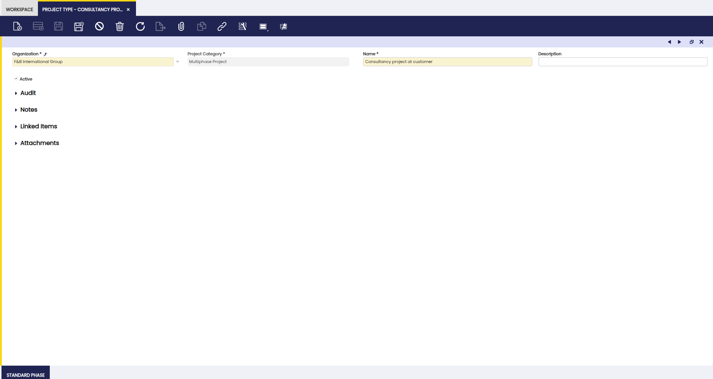
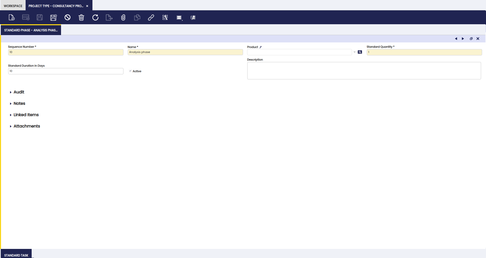
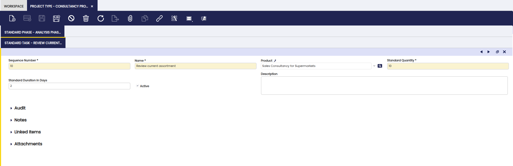

# Project and Service Setup

## Overview

This section describes the window that is used to set up the Project and Service Management process in Etendo: Project Type.

## Project Type

:material-menu: `Application` > `Project and Service Management` > `Setup` > `Project Type`

### Overview

This window is used to define projects types with typical phases and tasks to be used in projects.

A Project Type is a template with the typical phases and tasks that are applicable for a certain type of project. During the entry of a multiphase project, a project type can be selected to automatically add the phases and tasks associated with that project type.  This is essential for companies that use the same standard processes on many occasions.

!!!info 
    The use of this window is not mandatory, but it is recommended since it enables to complete the multiphase project in an easier way. If not used, each multiphase project, its phases and tasks, should be completed manually.

### Header

Here, a project type can be defined and, for this, the main field is the Name of the project type. An intuitive name should be given so that once the multiphase project is entered, the user can easily recognize the project type that could be used to generate the phases and tasks.

### Standard Phase Tab

In this tab, the user can define phases and products required during each phase, to be included in this type. Each phase is added by creating a line.

The fields on this tab are:

- Sequence number: numbering of the entered lines. By default 10,20,30,..etc.
- Name: name of the phase.
- Product: product or service that is sold in the phase.
- Standard Quantity: quantity of the product to be sold in the phase. For example, if the product is Sales Consultancy with a unit of measure set to hours, the quantity 10 entered in this field indicates that 10 hours of Sales Consultancy is sold in this phase.
- Standard Duration in Days: the scheduled duration of the phase. Based on this setup, when the project type is used for a multiphase project, the begin and end dates of each phase is based on this setup.When left blank at the phase level, the begin date will be populated based on the start date of the project and the end date will be left blank.
- Active checkbox: indication of validity of the line.
- Description: note field for the phase.

### Standard Task Subtab

Here, the user can define tasks to be completed during each phase. Each task is added by creating a line.

The fields on the tasks are:

- Sequence number: numbering of the entered lines. By default 10,20,30,..etc.
- Name: name of the task.
- Product: product or service that is sold related to this task.
- Standard Quantity: quantity of the product to be sold for the task. For example if the product is Sales Consultancy with a unit of measure set to hours, the quantity 10 entered in this field indicates that 10 hours of Sales Consultancy is sold related to this task.
- Standard Duration in Days: the scheduled duration of the task.
- Active checkbox: indication of validity of the line.
- Description: note field for the phase.

---

This work is a derivative of [Project and Service Management](https://wiki.openbravo.com/wiki/Project_and_Service_Management){target="\_blank"} by [Openbravo Wiki](http://wiki.openbravo.com/wiki/Welcome_to_Openbravo){target="\_blank"}, used under [CC BY-SA 2.5 ES](https://creativecommons.org/licenses/by-sa/2.5/es/){target="\_blank"}. This work is licensed under [CC BY-SA 2.5](https://creativecommons.org/licenses/by-sa/2.5/){target="\_blank"} by [Etendo](https://etendo.software){target="\_blank"}.