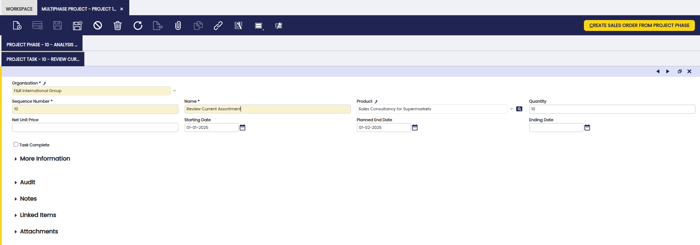
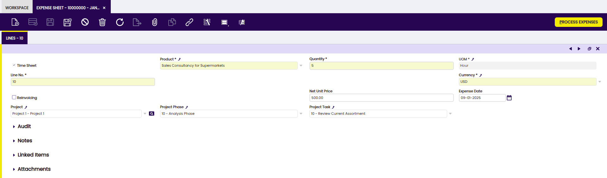

# Project and Service Transactions

## Overview

This section describes the different windows that are used for transactions included in the Project and Service Management process in Etendo. These are:

[:material-file-document-outline: Multiphase Project](#multiphase-project){ .md-button .md-button--primary }  

[:material-file-document-outline: Expense Sheet](#expense-sheet){ .md-button .md-button--primary }  

[:material-file-document-outline: Create Sales Orders from Expenses](#create-sales-orders-from-expenses){ .md-button .md-button--primary }  

[:material-file-document-outline: Create AP Expense Invoices](#create-ap-expense-invoices){ .md-button .md-button--primary }  

## Multiphase Project 

:material-menu: `Application` > `Project and Service Management` > `Transactions` > `Multiphase Project`

### Overview

This window is used to manage a project, its related phases and tasks and to populate the related sales invoices. The following aspects are monitored for projects:

- The cost overview: based on the planned cost overview entered in the multiphase project once documents are created referencing the project, the actual cost can be compared with them.
- The schedule: based on planned start dates and end dates, the progress of the project can be monitored.

!!! important
    From the multiphase project window, sales orders, in draft status, are generated at the end of each completed phase. This is done with the [**Create Sales Order from Project Phase**](../project-and-service-management/transactions.md#process-button) button at Project Phase tab level.

### Header

Here, the fields to note are:

- Organization: organization of the project.
- Search Key: field used to easily filter records.
- Name: name of the project. The name has to be unique between Service Projects and Multiphase projects.
- Current Phase: field to manually keep track of the current phase of the project.
- Starting Date: start date of the project.
- Planned End Date: scheduled end date of the project.
- Real End Date: actual end date of the project.
- Description: note field.
- Sales Representative: sales contact related to this project.
- Person in Charge: project manager.

In the Amounts section:

- Legally Binding Contract: If checked, it indicates if the document is legally binding.
- Price Ceiling: Only shown if Legally Binding Contract is checked. The commitment amount and quantity is the maximum amount and quantity to be charged. Ignored, if the amount or quantity is zero.
- Contract Amount: Only shown if Legally Binding Contract is checked. The commitment amount is independent from the planned amount. You would use the planned amount for your realistic estimation, which might be higher or lower than the commitment amount.
- Contract Quantity: Only shown if  Legally Binding Contract is checked. The commitment amount is independent from the planned amount. You would use the planned amount for your realistic estimation, which might be higher or lower than the commitment amount.
- Service Revenue: expected revenue for services (consulting).
- Planned Expenses: expected expenses.
- Services Provided Cost: expected internal cost of the services (labour x hours x cost).
- Outsourced Cost: expected cost of services executed by third party.
- Total Service Cost: populated information of the Services Provided Cost + Outsourced Cost.
- Reinvoiced Expenses: defaults to the planned expenses, but can be overwritten by the actual amount that will be invoiced to the business partner.
- Planned Service Margin %: populated information with the profit or loss percentage on the services: (Service Revenue - Services Provided Cost - Outsourced Cost) x 100/Service Revenue.
- Planned Expenses Margin %: Populated information with the profit or loss percentage on the expenses: (Reinvoiced Expenses - Planned Expenses) x 100/Reinvoiced Expenses.

In the More Information section:

- Business Partner: the customer that is being charged for the project.
- Partner Address: address of the business partner.
- User/Contact: user working for the business partner.
- Order Reference: reference number of the business partner to appear on the sales order.
- Payment Method: payment method of the business partner to appear on the sales order.
- Payment Terms: payment terms of the business partner to appear on the sales order.
- Price List: price list related to the business partner.
- Currency: currency related to the business partner.
- Warehouse: warehouse used to ship to the business partner.

#### Process Buttons

- Set Project Type: to select a project type in order to copy the phases and tasks from that particular project type to the multiphase project. Based on the durations of the phases and tasks in the project type, the starting date and end date on the multiphase project are overwritten.
- Change Project Status: to change the status of the project. The statuses of the multiphase project are:
    - Open: initial status, comparable with the Draft status on other documents.
    - Order: status to indicate that the sales orders can be generated.
    - Order closed: final status of the project. When changed to this status, the Real End Date field information gets automatically populated with the system date. Once the project status is Order closed, the project can not be opened again.
    !!!info
        In order to use this button, the Business Partner and the Sales Representative fields of the header must be completed.
- Copy Details : the project phase(s) and project task(s) information from another multiphase project is copied.

### Project Phase Tab

In this tab, the individual phases of the project can be defined.

The following fields are displayed in this tab:

- Organization: organization of the phase
- Sequence Number: numbering of the entered lines. By default 10,20,30,..etc.
- Name: name of the phase.
- Product: product or service that is sold in the phase.
- Quantity: quantity of the product to be sold in the phase.

    !!!note
        Above fields are copied from the [Project Type](../project-and-service-management/setup.md#project-type) if the [Set Project Type](#process-buttons) functionality is used.

- Net Unit Price: When filled out, this is the new unit price that will appear for the phase on the sales order, thus overwriting the price list net unit price.
- Starting Date: Planned starting date of the phase.
- Planned End Date: Planned ending date of the phase.

    !!!note 
        Starting Date and Planned End Date of the phase are calculated based on the start date and the Standard Duration in Days defined in the [Project Type](../project-and-service-management/setup.md#project-type) if the [Set Project Type](#process-buttons) functionality is used.

- Ending Date: actual ending date to be filled out manually. This date does not get populated when selecting and saving the Phase Complete checkbox.
- Phase Complete checkbox: to set the phase to complete. In order to set the phase to Phase Complete, it is not mandatory that the task(s) related to this phase are set to complete first. However, once the Phase Complete checkbox is marked, the tasks of this phase are also marked as completed.

In the More Information section:

- Price Ceiling: The commitment amount and quantity is the maximum amount and quantity to be charged. Ignored, if the amount or quantity is zero.
- Contract Amount: The commitment amount is independent from the planned amount. You would use the planned amount for your realistic estimation, which might be higher or lower than the commitment amount.
- Description: A description is limited to 255 characters.
- Standard Phase: Phase of the project with standard performance information with standard work.
- Sales Order: Unique identifier and a reference to a Sales Order originating from the document sequence defined for this document type.

#### Process Button

- Create Sales Order from Project Phase: to create a sales order upon completion of a phase. From the sales order, a sales invoice is created to document that the customer has to pay for the executed work on the project.

    !!!info
        The created sales order includes all the lines from the phase and its related tasks.

### Project Task Subtab

In this subtab, the individual tasks that are necessary to complete the phase of the project are defined.

The following fields are displayed in this subtab:

- Organization: organization of the task
- Sequence Number: numbering of the entered lines. By default 10,20,30,..etc.
- Name: name of the task
- Product: product or service that is sold related to this task.
- Quantity: quantity of the product to be sold for the task.

    !!!note
        Above fields are copied from the Project Type if the Set Project Type functionality is used.

- Net Unit Price: when filled out, this is the new unit price that will appear for the task on the sales order, thus overwriting the price list net unit price.
- Starting Date: planned starting date
- Planned End Date: planned ending date

    !!!note
        Starting Date and Planned End Date of the task are calculated based on the start date and the Standard Duration in Days defined in the Project Type if the Set Project type functionality is used.

- Ending Date: actual ending date to be filled out manually. This date does not get populated when selecting and saving the Task Complete checkbox.
- Task Complete checkbox: to set the task to completed.

In the More Information section:

- Standard Task: Standard Project Task in a Project Phase with standard effort
- Price Ceiling: The commitment amount and quantity is the maximum amount and quantity to be charged. Ignored, if the amount or quantity is zero.
- Contract Amount: The commitment amount is independent from the planned amount. You would use the planned amount for your realistic estimation, which might be higher or lower than the commitment amount.
- Description: A description is limited to 255 characters.

## Expense Sheet

:material-menu: `Application` > `Project and Service Management` > `Transactions` > `Expense Sheet`

### Overview

An Expense Sheet is used to register time sheets and item expenses.

Based on time sheets, the cost related to assigned employees to the project is calculated and can be viewed on the [Project Profitability](../project-and-service-management/analysis-tools.md#project-profitability) report.

For item expenses, the cost employees made related to projects is documented. Based on this, the follow up to reimburse the cost to the employee is done with the creation of a [Purchase Invoice](../procurement-management/transactions.md#purchase-invoice). To link the corresponding invoices to the project, there is a project dimension field in the header of the Purchase Invoice window.

For both time sheets and item expenses, it can be indicated whether the customer related to the project is invoiced for these costs. The follow up of this is that a [Sales Order](../sales-management/transactions.md#sales-order) is created in order to create a [Sales Invoice](../sales-management/transactions.md#sales-invoice).

### Header

In this window, the user can create and process an expense sheet.

The fields on this tab are:

- Organization: organization of the expense.
- Document No.: populated number of the expense sheet.
- Employee: employee that made the expense related to a project or spend time on a project. It is important to remark that employees:
    - need to be created as [Employee](../master-data-management/master-data.md#employee) in Business Partner window,
    - need to be created as Etendo [users](../general-setup/security.md#user) in the User window,
    - and finally, employee and user need to be related to each other.
    That relationship can be set by selecting Employee business partner record in the employee User record, as shown in the image below.
- Report Date: date for which the expense is entered.

 

### Lines Tab

In this tab, the user can add time and regular expense lines to the sheet. Each expense is added to an individual line and may or may not be invoiced to customers.

The fields to note in this tab are:

- Time Sheet checkbox: to indicate if the expense is for time or item expenses.
- Product: product related to the expense line. As seen in the [configuration](../project-and-service-management/getting-started.md#configuration) section, for time sheets, the products set up with Service type appear. For item expenses, products set up with Expense type appear.
- Quantity: quantity for the registered product.
- UOM: unit of measure of the product.
- Line No.: numbering of the line. By default 10,20,30,...etc.
- Expense Amount: not visible on time sheet. Populated field with the amount information.
- Converted Amount: not visible on time sheet. Amount of the expense converted to the currency of the client.
- Currency: currency of the entered expense.
- Reinvoicing checkbox: checkbox to indicate if the customer (the business partner related to the project) will be invoiced for this expense.
- Business Partner: only visible when the Reinvoicing checkbox is selected. The Business Partner that is invoiced for the expense. The value will be populated based on the entered project information.
- Net Unit Price: price related to the product.
- Expense Date: date related to the reported expense.
- Project: project that the expense relates to.
- Project Phase: project phase that the expense relates to.
- Project Task: project task that the expense relates to.

### Process Button

- Process/Unprocess Expenses: Once the corresponding information of the sheet is entered, you can process the expense. If the document is processed, it is possible to select it and unprocess it to edit it if necessary.

## Create Sales Orders from Expenses

:material-menu: `Application` > `Project and Service Management` > `Transactions` > `Create Sales Orders from Expenses`

This is a process which automatically generates sales orders per customer for all outstanding expenses to be invoiced. In order for the process to create the sales order with the correct information, the customer needs to be set up with the [Customer] tab in the Business Partner window filled out.
This process is integrated with the [Sales Management](../sales-management/getting-started.md) Module:

- All the sales orders generated can be checked and modified through that module.
- The invoice process can be run afterwards.
- There is a checkbox Complete and Process Sales Orders automatically to indicate whether the Sales Orders should be created in booked state or not.

A Sales Order type Warehouse order with a corresponding Goods Shipment is created by the process if the checkbox Complete and Process Sales Orders automatically is selected.

## Create AP Expense Invoices

:material-menu: `Application` > `Project and Service Management` > `Transactions` > `Create AP Expense Invoices`

This is a process which automatically generates Purchase Invoices for Accounts Payable based on all expenses to be reimbursed to the employee. Separate Purchase Invoices will be generated for each project. 

In order for the process to complete successfully the employee needs to have the Vendor tab in the Business Partner filled out including the following information:

- A Purchase Price List
- The PO Payment Method
- The PO Payment Terms
- The PO Financial Account

This process is directly integrated with the [Procurement Management](../procurement-management/getting-started.md) module: all the purchase invoices generated can be checked and modified through that module.

---

This work is a derivative of ["Project and Service Management"](https://wiki.openbravo.com/wiki/Project_and_Service_Management){target="\_blank"} by [Openbravo Wiki](http://wiki.openbravo.com/wiki/Welcome_to_Openbravo){target="\_blank"}, used under [CC BY-SA 2.5 ES](https://creativecommons.org/licenses/by-sa/2.5/es/){target="\_blank"}. This work is licensed under [CC BY-SA 2.5](https://creativecommons.org/licenses/by-sa/2.5/){target="\_blank"} by [Etendo](https://etendo.software){target="\_blank"}.