## Overview

This section describes the windows related to sales reports in Etendo. These are:

[:material-file-document-outline: Sales Dimensional Report](/user-guide/etendo-classic/basic-features/sales-management/analysis-tools#sales-dimensional-report){ .md-button .md-button--primary }  

[:material-file-document-outline: Shipments Dimensional Report](/user-guide/etendo-classic/basic-features/sales-management/analysis-tools#shipments-dimensional-report){ .md-button .md-button--primary }  

[:material-file-document-outline: Discount Invoice Report](/user-guide/etendo-classic/basic-features/sales-management/analysis-tools#discount-invoice-report){ .md-button .md-button--primary }  

[:material-file-document-outline: Stock for Open Orders](/user-guide/etendo-classic/basic-features/sales-management/analysis-tools#stock-for-open-orders){ .md-button .md-button--primary }  

[:material-file-document-outline: Orders Awaiting Invoice Report](/user-guide/etendo-classic/basic-features/sales-management/analysis-tools#orders-awaiting-invoice-report){ .md-button .md-button--primary }  

[:material-file-document-outline: Orders Awaiting Delivery Report](/user-guide/etendo-classic/basic-features/sales-management/analysis-tools#orders-awaiting-delivery-report){ .md-button .md-button--primary }  

[:material-file-document-outline: Sales Invoice Dimensional Report](/user-guide/etendo-classic/basic-features/sales-management/analysis-tools#sales-invoice-dimensional-report){ .md-button .md-button--primary }  

## Sales Dimensional Report

### Introduction

This is a dimensional type of report that shows information mainly about the "Total Net Amount" of registered sales orders (Sales Orders in a status *Booked* or *Closed*) during a selected period of time.

This report can display best-selling products and top customers and answer many other questions related to the company's sales booking activity.

### Parameters Window

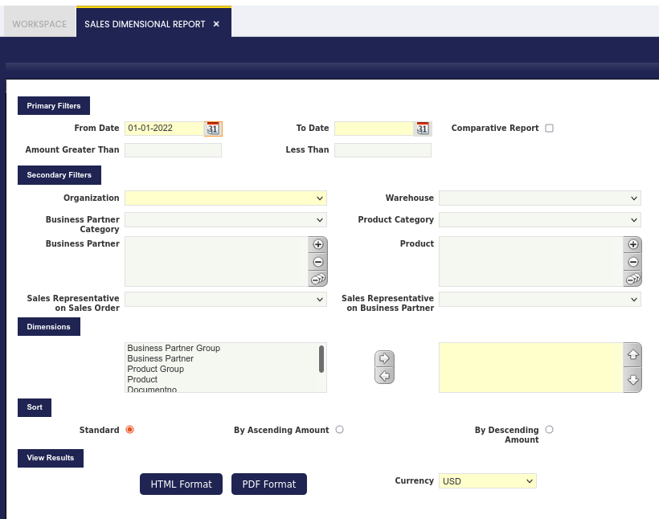

Fields to note:

-   **Warehouse:** It narrows down results for a particular warehouse from where an order is shipped (**Warehouse** filed in the Sales Order).
-   **Commercial Document:** allows the user to filter results by **Sales Representative** field from the **Sales Order** window, which normally reflects the person who booked the order.
-   **Commercial File:** allows the user to filter results by **Sales Representative** field from the **Customer** tab of the **Business Partner** window, which normally contains the person responsible for this customer (for example, account manager).
!!! info
    In the majority of cases, filtering by the fields mentioned above gives the same results. They could differ if a customer has one main responsible person, but different sales team members can book orders. Or if a customer is moved from one sales representative to another. The new sales representatives might want to use the second filter to see the activities of all their customers (regardless of who closed the deal) while the old sales representatives might want to use the first filter to see the orders they closed, regardless of who manages the customer at present.

### Sample Report Output

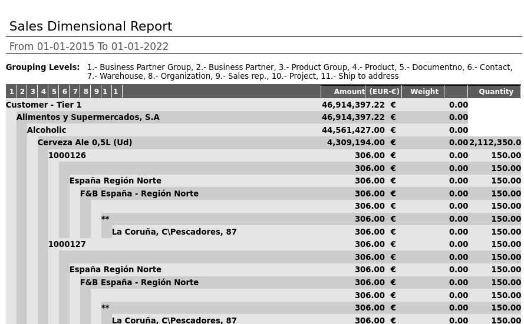

Information to note:

-   **Amount:** is the **net** amount from the Sales Order converted to the report **Currency**.
-   **Weight:** of the sold product if specified in the **Product** window.

## Shipments Dimensional Report

### Introduction

This report shows information about goods shipped to the customers (Goods Shipments in a status Completed or Voided) during a selected period of time. It is a dimensional type of report.

### Parameters Window

There is no specific field to note, but just the dimensional primary and secondary filters which can be used to narrow down the information to be displayed.

The outcome of this report can be viewed in HTML format, XLS format, and PDF format.

### Sample Report Output

Some information to note:

-   **Amount:** is the **net** amount (cost of the goods for customers) shipped to them converted to the report **Currency**. This amount is retrieved from the Sales Order that corresponds to the Goods Shipment. If a Goods Shipment is not linked to any Sales Order, this field will be empty.
-   **Weight:** of the shipped product, if specified in the Product window.

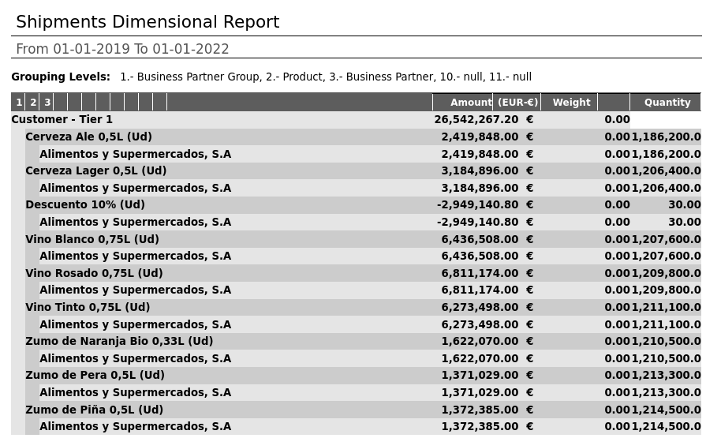

## Discount Invoice Report

### Introduction

This report shows information about registered sales invoices (Sales Invoices in a status Completed or Voided) during a selected period of time, grouping the information by Business Partner and Product.

The report displays information about the average price by product, the net price and the discount applied in each product.

### Parameters Window

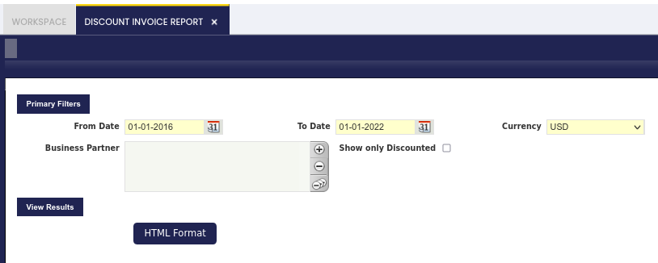

Fields to note:

-   **From Date:** allows filtering results by **Invoice Date** field from the Sales Invoice window. It is mandatory and the result report will show information about sales invoices with a date invoice bigger than the parameter.
-   **To Date:** allows filtering results by **Invoice Date** field from the sales invoices window. It is also mandatory, and the result report will show information about sales invoices with a date invoice less than the parameter.
-   **Currency:** the amounts will be shown in the selected currency. For invoices in other currency, the amount will be converted to the selected currency, taking into account the conversion rate for the invoice date.
-   **Business Partner:** allows filtering results by **Business Partner**. The result report will only show information about sales invoices of the selected Business Partners. It is not a mandatory parameter, so if no Business Partner is selected, the sales invoices will not be filtered by that field.
-   **Show only Discounted:** if checked, only articles with discount will be shown.

### Sample Report Output

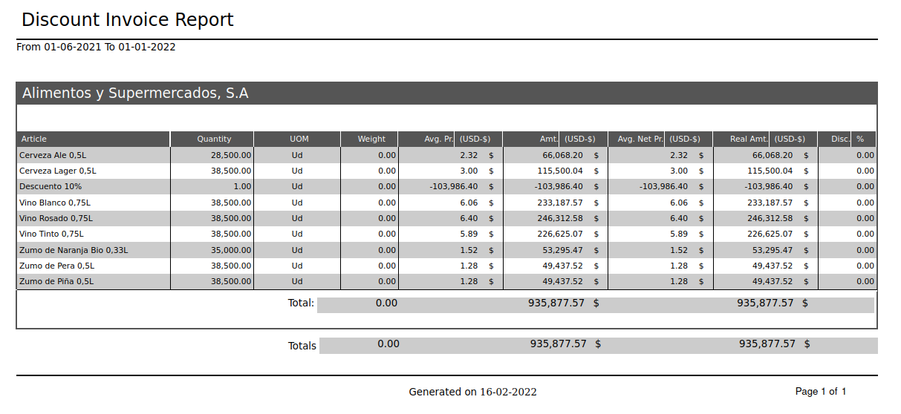

For the example in the above image, according to the filters, the result will show information about sales invoices for the business partner “Alimentos y Supermercados, S.A.” from the date “01-06-2021” to the date “01-01-2022”. The amounts will be in USD.

Columns to note:

-   **Quantity:** is the total quantity sold for each product and business partner.
-   **Avg. Pr:** is the average price for one product and business partner without taking into account discounts.
-   **Amt:** is the Avg. Pr. multiplied by the quantity.
-   **Avg. Net Pr.:** is the real average price for one product and business partner, taking into account discounts.
-   **Real amount:** the real amount sold for one product and business partner without taxes.
-   **Discount (%):** is the discount applied for the product and business partner.

In the image below, the same report is shown, but having checked the filter “Show only Discounted”. In comparison to the previous report, this report shows only those lines in which the discount is not equal to zero.

## Stock for Open Orders

### Introduction

This section shows the lines of the pending orders with the actual stock of each product.

## Orders Awaiting Invoice Report

### Introduction

**Orders Awaiting Invoice Report** shows the information about the Sales Orders that are not fully invoiced yet.

Only Sales Orders with *Do Not Invoice* Invoice Term are not displayed in the report, but all other orders are present in the output, independently if the Invoice Term condition is met or not. For example, if **Invoice Term** is "After Delivery" and products are not shipped yet, Sales Order is displayed.

### Parameters Window

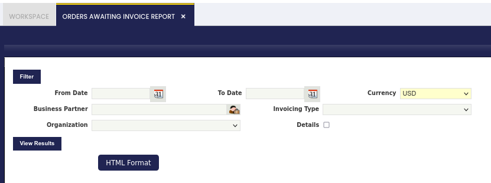

All filters refer to corresponding fields of the **Sales Order**.

All monetary values (like **Amount**, **Price**, **Base**) in the report are displayed in two currencies. The first one is the Sales Order currency, and the second one is regulated by the Currency parameter field (defaulted to the system currency). 

!!! warning
    Please note that Conversion Rate to the report Currency should be specified for the report to work.

### Sample Report Output

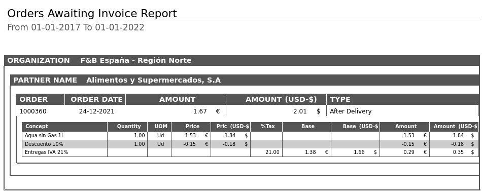

!!! info
    Please note that the report gives information about sales orders and products included in it without reflecting the information of already delivered and invoiced quantities.

## Orders Awaiting Delivery Report

### Introduction

**Orders Awaiting Delivery Report** shows the information about the Sales Orders that are awaiting (pending) to be delivered (shipped).

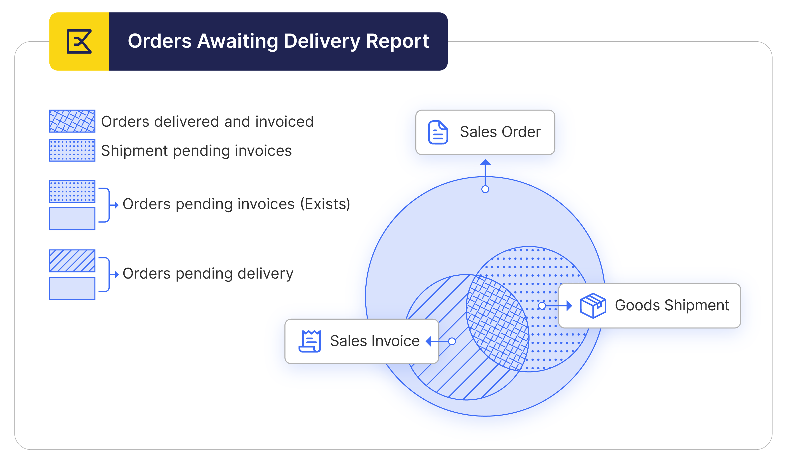

### Parameters Window

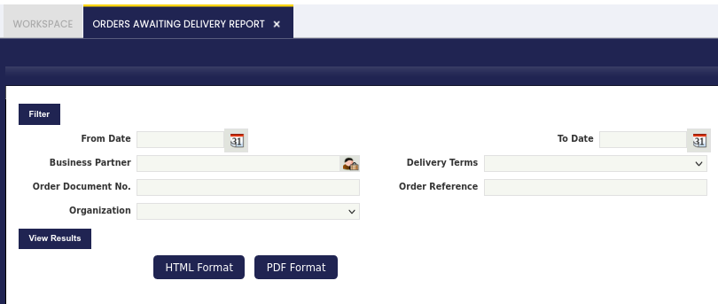

All filters refer to corresponding fields of the Sales Order.

### Sample Report Output

## Sales Invoice Dimensional Report

### Introduction

This is a dimensional type of report that shows information about registered sales invoices (Sales Invoices in a status *Completed* or *Voided*) during a selected period of time.

This report can display ratings of products and top customers based on the sales revenue, show profit and margin of sales and answer many other questions related to the company´s sales invoicing activity.

### Parameters Window

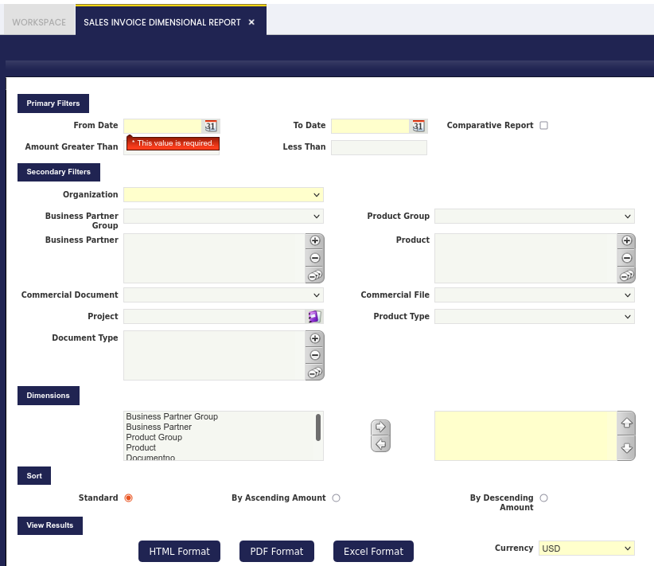

Fields to note:

-   **Commercial Document:** allows the user to filter results by Sales Representative field from the Sales Invoice window, which is normally inherited from Sales Order.
-   **Commercial File:** allows the user to filter results by Sales Representative field from the Customer tab of the Business Partner window, which normally contains the person responsible for this customer (for example, account manager).

!!! info
    In the majority of cases, filtering by the fields mentioned above gives the same results. They could differ if a customer has one main responsible person, but different sales team members can book orders. Or if a customer is moved from one sales representative to another. The new sales representatives might want to use the second filter to see the activities of all their customers (regardless of who closed the deal) while the old sales representatives might want to use the first filter to see the orders they closed, regardless of who manages the customer at present.

-   **Project:** allows the user to show invoicing information for a particular project.
-   **Product Type:** filter that displays results for selected Product Types.

### Sample Report Output

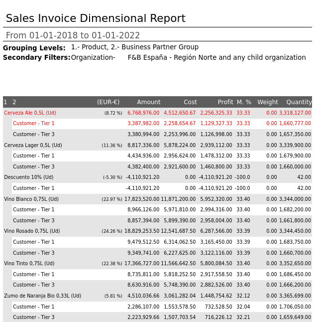

Columns to note:

-   **Currency column, ex. (EUR-€):** percentage of the particular row **Amount** in the report **Total Amount**. All rows should sum up to 100%.
-   **Amount:** is the **net** amount from the Sales Invoice converted to the report **Currency**.
-   **Cost:** cost of the goods sold (as per the corresponding cost of the product).
    -   There could be product transactions whose cost has not yet been calculated yet, therefore the cost of that transactions is estimated as a "proportional" cost based on the known transaction's cost.
        -   In this case, the estimated cost is shown in red color.
-   **Profit:** is the difference between **Amount** and **Cost**.
-   **M.%:** sales margin as a ratio of **Profit** to **Amount**.
-   **Weight:** of the invoiced product if specified in the **Product** window.

**How the estimated cost is calculated:**

In case there is not a calculated cost for some of the retrieved records, it is necessary to estimate it. In order to do so, a generic Unitary Cost for the records with calculated cost is retrieved and, using it, the estimation is performed. The formula works in the following way:

Example: If there is a Product with an Invoice Line of 100€ and it has a calculated cost of 30€, for a line of 200€, the estimated cost should be 60€.

200€ line net amount \* (30€ calculated cost/100€ transactions with calculated cost) = 60€. (30€ calculated cost/100€ transactions with calculated cost) is the Unitary Cost.

In a generic scenario, that is not dependent on any dimension like Product:

**Estimated Cost = Total Line Net Amount \* (Total Calculated Cost/Total Line Net Amount of Transactions with Calculated Cost)**. Being (Total Calculated Cost/Total Line Net Amount of Transactions with Calculated Cost) the Unitary Cost

This means that the estimation is dependent on the retrieved records. The more records there are and the more grouped they are, the more precise the estimation will be. If the report is split by different dimensions, the estimations can be different and, therefore, the totals can have a minor variation.

There is also possibility to export this report to a PDF or a XLS file:

PDF format shows the same fields explained before, but in XLS format new fields are added related to selected invoice:

-   **Organization**
-   **Business Partner Group**
-   **Business Partner**
-   **Document No.**
-   **Invoice Date**
-   **Product Category**
-   **Product**
-   **Product Search Key**
-   **Unit Price**
-   **Sales Representative**
-   **Project**
-   **Ship to Address**

At the top of the report, the secondary filters are now shown.

Also, this report now shows the total of cost, profit, margin-% and quantity.

At the end of the report, there is a new table showing the number of documents per document type.
