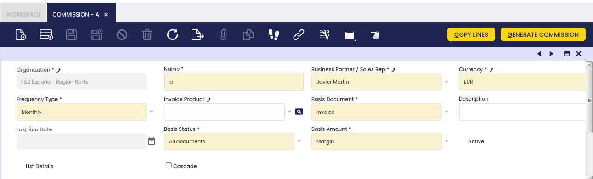

## Overview

This section describes the different windows that are necessary to set up the sales process in Etendo. These are:

[:material-file-document-outline:Condition of the Goods](../../../../user-guide/etendo-classic/basic-features/sales-management/setup.md#condition-of-the-goods){ .md-button .md-button--primary }  

[:material-file-document-outline:Sales Region](../../../../user-guide/etendo-classic/basic-features/sales-management/setup.md#sales-region){ .md-button .md-button--primary }  

[:material-file-document-outline:Commission](../../../../user-guide/etendo-classic/basic-features/sales-management/setup.md#commission){ .md-button .md-button--primary }  

[:material-file-document-outline:Channel](../../../../user-guide/etendo-classic/basic-features/sales-management/setup.md#channel){ .md-button .md-button--primary }  

[:material-file-document-outline:Sales Campaign](../../../../user-guide/etendo-classic/basic-features/sales-management/setup.md#sales-campaign){ .md-button .md-button--primary }  

[:material-file-document-outline:Reject Reason](../../../../user-guide/etendo-classic/basic-features/sales-management/setup.md#reject-reason){ .md-button .md-button--primary }  

## Condition of the goods

:material-menu: `Application` > `Sales Management` > `Setup` > `Condition of the goods`

In this window, the user defines in which status the goods come from the customer. These values are used in the **Return Material Receipt** window.

## Sales Region

:material-menu: `Application` > `Sales Management` > `Setup` > `Sales Region`

In this section, the user can create sales regions to be used in sales operations and define a sales region to be used in the sales process.

## Commission

<iframe width="560" height="315" src="https://www.youtube.com/embed/vQGzo7cbCYQ?si=1CLcSz5b4iY_J4hy" title="YouTube video player" frameborder="0" allow="accelerometer; autoplay; clipboard-write; encrypted-media; gyroscope; picture-in-picture; web-share" referrerpolicy="strict-origin-when-cross-origin" allowfullscreen></iframe>

:material-menu: `Application` > `Sales Management` > `Setup` > `Commission`

The user can define **how and when commissions** are going to be calculated and to **whom they are going to be paid**.

Commissions can be calculated based on two documents: **Sales Orders and Sales Invoices**. In both documents the sales representative should be selected, as commissions can be calculated per sales representative. Once the commission amount is calculated, a purchase invoice can be created, the business partner of that purchase invoice is the sales representative defined for that commission.

Prior to use commissions, some configurations need to be done:

-   Create a sales representative. The way to do that is:
    -   first create an Etendo user, as the sales representative can be an Etendo user who logs in in Etendo and issues sales orders/invoices.
    -   then create a Business Partner. It is required to create a business partner because the sales representative could be someone who is going to issue an invoice in order to get the commissions paid.  If that is the case,  that business partner should be marked as *Vendor* in the Vendor tab and have a *PO Payment Method*, a *PO Payment Term* and a *Purchase Pricelist* defined for it.  

        Besides, it is required to mark the Business Partner as Sales Representative in the Employee tab.
    -   and finally link them both. The way to do that is:
        -   to select the business partner just created in the field *Business Partner* of the user window. 
-   Create a product and get it part of a Price List without pricing information, in case a purchase invoice is required to be created in order to get the commissions invoiced.

The overall flow is:

-   Define the commission in the **Commission window**.
-   Create the Sales Orders and Sales Invoices linked to a sales representative.
-   Generate the commission in the Commission window for a given sales representative by using the process button **Generate Commission**.
-   and then from the [Commission Payment](../../../etendo-classic/basic-features/sales-management/transactions.md#commission-payment) window, create an invoice if required by using the process button **Create Invoice**. 

#### Header (within Commission) 

The user can define a sales commission to be used in the sales process.

The header lists main terms that will be used to calculate the commission:

-   **Business partner / Sales representative**: Used to create a purchase invoice or used to calculate the commission
-   **Frequency**: The process takes the orders/invoices that fits the corresponding period.
-   **Invoice product**: If an invoice is required, the new invoice will have this product.
-   **Basis Document**: Whether the commission is calculated based on invoices or orders.
-   **Last Run Date**: Last date when the process Generate Commission was performed.
-   **Basis Status**: Whether the commission is calculated based on all documents or fully paid documents
-   **Basis Amount**: Whether the commission is calculated based on net amount or margin.
-   **List details**: See the result of the commission grouped or line by line. When the commission is calculated based on margin the list details is always checked.
-   **Cascade**: Able to manage complex commissions (exclude some invoice/order lines, apply different multiplier quantity/amount for some invoice/order lines...). When this field is checked the result of the commission is grouped on line by line.

There are two buttons:

-   **Copy Lines**: Allows to copy the configuration of other commissions.
-   **Generate Commission**: Based on the header and lines, the commission is generated. For example, if Monthly frequency is defined and the starting date is 01/03/2012 only orders/invoices of March will be taken into account.

#### Lines

The user can edit the selected commission amount.

Lines tab allows the user to define in deep the conditions of the commission:

-   **Exclude**: If the Cascade box is checked, marked order/invoices lines that satisfied the commission line conditions will not take into account to calculate the commission. This flag will only be visible when in the header Cascade flag is checked.
-   **Based on Sales Rep.**: If the flag is marked, only orders/invoices that have the same sales representative as in the header are taken into account to calculate the commission.
-   **Business partner category**: Only orders/invoices with business partners that belong to that category are taken into account to calculate the commission.
-   **Business partner**: Only orders/invoices with that business partner are taken into account to calculate the commission.
-   **Product category**: Only orders/invoices with products that belong to that category are taken into account to calculate the commission.
-   **Product**: Only orders/invoices with that product are taken into account to calculate the commission.
-   **Subtract Quantity**: The total quantity calculated based on the above criteria is subtracted by this quantity therefore from this number begins to calculate the commission.
-   **Multiplier Quantity**: Price multiplying the result of the above quantity.

Finally, the result of the commission will be the combination of these three lines.

## Channel

:material-menu: `Application` > `Sales Management` > `Setup` > `Channel`

In this section, the user can create specific sales channels to be used in sales operations and define a sales channel to be used in the sales process.

## Sales Campaign

:material-menu: `Application` > `Sales Management` > `Setup` > `Sales Campaign`

In this section, the user can create specific sales campaigns to be used in sales operations and define a sales campaign to be used in the sales process.

## Reject Reason

:material-menu: `Application` > `Sales Management` > `Setup` > `Reject Reason`

In this window, the user defines the reasons to reject quotations. These values are used in the **Sales Quotation** window.

---
This work is a derivative of [Sales Management](http://wiki.openbravo.com/wiki/Sales_Management) by [Openbravo Wiki](http://wiki.openbravo.com/wiki/Welcome_to_Openbravo), used under [CC BY-SA 2.5 ES](https://creativecommons.org/licenses/by-sa/2.5/es/). This work is licensed under [CC BY-SA 2.5](https://creativecommons.org/licenses/by-sa/2.5/) by [Etendo](https://etendo.software).