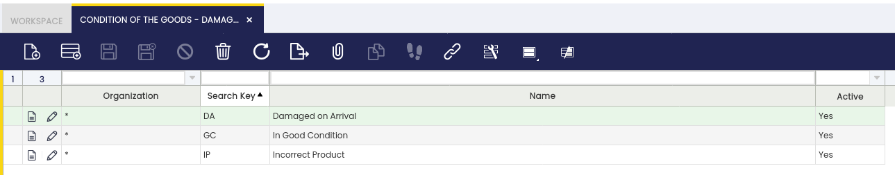
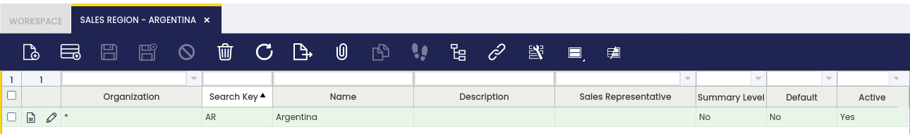
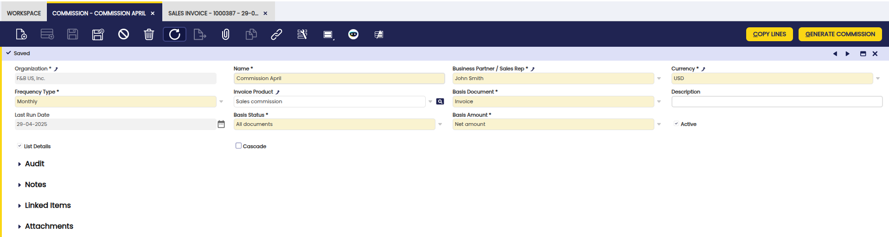
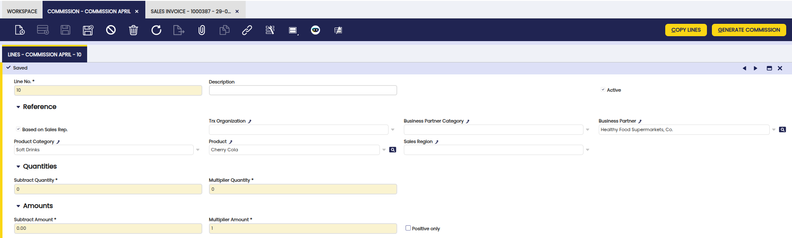
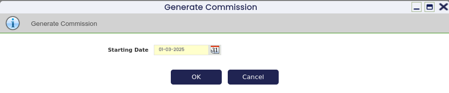
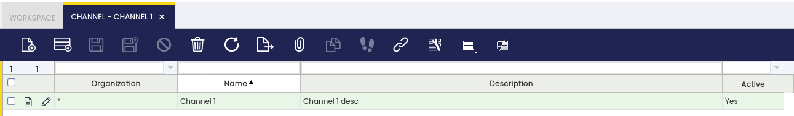
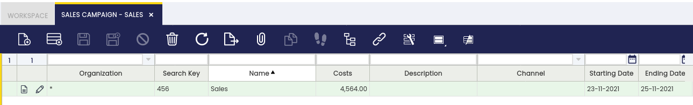
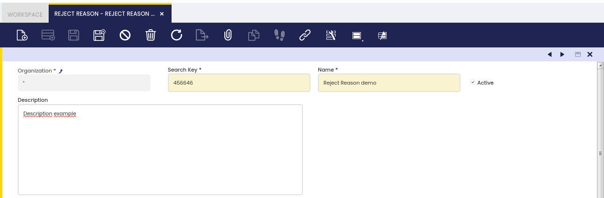

## Overview

This section describes the different windows that are necessary to set up the sales process in Etendo. These are:

[:material-file-document-outline:Condition of the Goods](../../../../user-guide/etendo-classic/basic-features/sales-management/setup.md#condition-of-the-goods){ .md-button .md-button--primary }  

[:material-file-document-outline:Sales Region](../../../../user-guide/etendo-classic/basic-features/sales-management/setup.md#sales-region){ .md-button .md-button--primary }  

[:material-file-document-outline:Commission](../../../../user-guide/etendo-classic/basic-features/sales-management/setup.md#commission){ .md-button .md-button--primary }  

[:material-file-document-outline:Channel](../../../../user-guide/etendo-classic/basic-features/sales-management/setup.md#channel){ .md-button .md-button--primary }  

[:material-file-document-outline:Sales Campaign](../../../../user-guide/etendo-classic/basic-features/sales-management/setup.md#sales-campaign){ .md-button .md-button--primary }  

[:material-file-document-outline:Reject Reason](../../../../user-guide/etendo-classic/basic-features/sales-management/setup.md#reject-reason){ .md-button .md-button--primary }  

## Condition of the goods

:material-menu: `Application` > `Sales Management` > `Setup` > `Condition of the goods`

In this window, the user defines in which status the goods come from the customer. These values are used in the **Return Material Receipt** window.

## Sales Region

:material-menu: `Application` > `Sales Management` > `Setup` > `Sales Region`

In this section, the user can create sales regions to be used in sales operations and define a sales region to be used in the sales process.

## Commission

:material-menu: `Application` > `Sales Management` > `Setup` > `Commission`

<iframe width="560" height="315" src="https://www.youtube.com/embed/vQGzo7cbCYQ?si=1CLcSz5b4iY_J4hy" title="YouTube video player" frameborder="0" allow="accelerometer; autoplay; clipboard-write; encrypted-media; gyroscope; picture-in-picture; web-share" referrerpolicy="strict-origin-when-cross-origin" allowfullscreen></iframe>

###Overview

The Commission functionality in Etendo begins with the **Commission window**, where users configure the general settings for commission calculation which allows defining **how and when commissions** are going to be calculated and to **whom they are going to be paid**. Commissions can be calculated based on the sales defined in two documents: **Sales Orders and Sales Invoices**. From the Commission window, more detailed criteria are defined, including filters by business partner, product, or region, along with the actual commission structure. A key feature is the ability to assign a **sales representative** directly when creating sales documents (orders and/or invoices), which allows Etendo to link those transactions to the appropriate commission plan and ensures accurate filtering. 

Once all conditions are set, the system generates the corresponding commission, which is displayed in the [**Commission Payment**](../../../etendo-classic/basic-features/sales-management/transactions.md#commission-payment) window, where users can review a detailed breakdown of the calculation and even generate a [**purchase invoice**](../../../etendo-classic/basic-features/procurement-management/transactions.md#purchase-invoice) to process the commission payment to the sales representative.

To sum up, the overall flow is:

-   Define the commission in the **Commission window**.
-   Create the Sales Orders and Sales Invoices linked to a sales representative.
-   Generate the commission in the Commission window for a given sales representative by using the process button **Generate Commission**.
-   and then from the [Commission Payment](../../../etendo-classic/basic-features/sales-management/transactions.md#commission-payment) window, create an invoice if required by using the process button **Create Invoice**. 

Prior to use commissions, some **configurations** need to be done:

-   Create a sales representative. The way to do that is:
    -   First it is possible to create an [Etendo user](../../../etendo-classic/basic-features/general-setup/security/user.md), as the sales representative can be an Etendo user who logs in in Etendo and issues sales orders/invoices.
    -   Then create a [Business Partner](../../../etendo-classic/basic-features/master-data-management/master-data.md#business-partner). It is required to create a business partner because the sales representative could be someone who is going to issue an invoice in order to get the commissions paid.  If that is the case,  that business partner should be marked as *Vendor* in the **Vendor tab** and have a *PO Payment Method*, a *PO Payment Term* and a *Purchase Pricelist* defined for it. Besides, it is required to mark the Business Partner as Sales Representative in the **Employee tab**.
    -   And finally if the user was created, link them both. The way to do that is to select the business partner just created in the field **Business Partner** of the **User** window. 
    - Create a [Product](../../../etendo-classic/basic-features/master-data-management/master-data.md#product) and get it part of a **Price List** without pricing information as part of the required concept when the commission purchase invoice is created. 

### Header 

The user can define a sales commission to be used in the sales process. The header lists main terms that will be used to calculate the commission:

-   **Business partner / Sales representative**: Used to create a purchase invoice or used to calculate the commission
-   **Frequency**: The process takes the orders/invoices that fits the corresponding period.
-   **Invoice product**: If an invoice is required, the new invoice will have this product.
-   **Basis Document**: Whether the commission is calculated based on invoices or orders.
-   **Last Run Date**: Last date when the process Generate Commission was performed.
-   **Basis Status**: Whether the commission is calculated based on all documents or fully paid documents.
-   **Basis Amount**: Whether the commission is calculated based on net amount or margin.
-   **List details**: See the result of the commission grouped or line by line. When the commission is calculated based on margin the list details is always checked.
-   **Cascade**: Able to manage complex commissions (exclude some invoice/order lines, apply different multiplier quantity/amount for some invoice/order lines, exclude products from already defined product cathegories). When this field is checked the result of the commission is grouped on line by line.

### Lines

The user can edit the selected commission amount.

Line tab allows the user to define in deep the conditions of the commission:

-   **Exclude**: order/invoice lines that meet the conditions set in the commission line will not be taken into account for calculating the commission. This flag will only be visible when the Cascade field is checked in the header.
-   **Based on Sales Rep.**: If the flag is marked, only orders/invoices that have the same sales representative as in the header are taken into account to calculate the commission.
-   **Business partner category**: Only orders/invoices with business partners that belong to that category are taken into account to calculate the commission.
-   **Business partner**: Only orders/invoices with that business partner are taken into account to calculate the commission.
-   **Product category**: Only orders/invoices with products that belong to that category are taken into account to calculate the commission.
-   **Product**: Only orders/invoices with that product are taken into account to calculate the commission.
-   **Subtract Quantity**: The total quantity calculated based on the above criteria is subtracted by this quantity therefore from this number Etendo begins to calculate the commission.
-   **Multiplier Quantity**: Price multiplying the result of the above quantity.
-   **Subtract Amount**: The total net amount calculated based on the above criteria is subtracted by this amount therefore, from this number Etendo begins to calculate the commission.
-   **Multiplier Amount**: cohefficient (percentage) multiplying the result of the above amount. 

Let's see some examples:

- I want to pay 10 euros per unit sold over 3000 units: 
**Subtract Quantity**: 3000
**Multiplier Quantity**: 10
**Subtract Amount**: The total amount calculated based on the above criteria (business partner, etc) is subtracted by this amount therefore, from this number Etendo begins to calculate the commission.
**Multiplier Amount**: percentage multiplying the result of the above amount

- I want to pay 15% per amount sold over 25000 euros:
**Subtract Amount**: 25000
**Multiplier Quantity**: 0.15
**Positive Only**: If the result of, for example, (Total amount - Subtract Amount) is lower than zero then it is not taken into account for the commission.

!!! info
    Please note that quantity and amount fields can be used in combination.

- A complex commission example:

I want to calculate commission at 5% for business partner *Healthy Food Supermarkets, Co.*.
I want to exclude *soft drinks* products.
For 'Cola 0.5L' I want the commission to be 10%. Not 10% plus the 5% calculated in the first line. So this line will remove what was calculated previously for 'Cola 0.5L'.
So, in the header you will have to check **Cascade**.
In lines tab, the first line will have in business partner *Healthy Food Supermarkets, Co.* and multiplier amount 0.05.
In lines tab, the second line will have exclude marked and in product 'Cola 0.5L'.
In lines tab, the third line will have in product 'Cola 0.5L' and multiplier amount 0.10.

Finally, the result of the commission will be the combination of these three lines.

### Buttons

-   **Copy Lines**: Allows to copy the configuration of other commissions.
-   **Generate Commission**: Based on the header and lines, the commission is generated. For example, if Monthly frequency is defined and the starting date is 01/03/2025 only orders/invoices of March will be taken into account.
    

## Channel

:material-menu: `Application` > `Sales Management` > `Setup` > `Channel`

In this section, the user can create specific sales channels to be used in sales operations and define a sales channel to be used in the sales process.

## Sales Campaign

:material-menu: `Application` > `Sales Management` > `Setup` > `Sales Campaign`

In this section, the user can create specific sales campaigns to be used in sales operations and define a sales campaign to be used in the sales process.

## Reject Reason

:material-menu: `Application` > `Sales Management` > `Setup` > `Reject Reason`

In this window, the user defines the reasons to reject quotations. These values are used in the **Sales Quotation** window.

---

This work is a derivative of [Sales Management](http://wiki.openbravo.com/wiki/Sales_Management){target="_blank"} by [Openbravo Wiki](http://wiki.openbravo.com/wiki/Welcome_to_Openbravo){target="_blank"}, used under [CC BY-SA 2.5 ES](https://creativecommons.org/licenses/by-sa/2.5/es/){target="_blank"}. This work is licensed under [CC BY-SA 2.5](https://creativecommons.org/licenses/by-sa/2.5/){target="_blank"} by [Etendo](https://etendo.software){target="_blank"}.