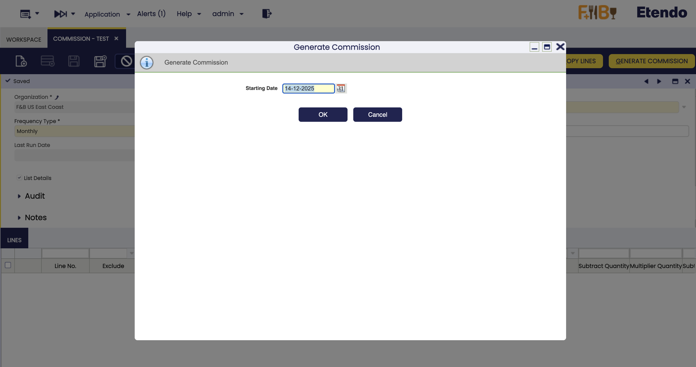

## Commission

:material-menu: `Application` > `Sales Management` > `Setup` > `Commission`

<iframe width="560" height="315" src="https://www.youtube.com/embed/vQGzo7cbCYQ?si=1CLcSz5b4iY_J4hy" title="YouTube video player" frameborder="0" allow="accelerometer; autoplay; clipboard-write; encrypted-media; gyroscope; picture-in-picture; web-share" referrerpolicy="strict-origin-when-cross-origin" allowfullscreen></iframe>

### Overview

The Commission functionality in Etendo begins with the **Commission window**, where users configure the general settings for commission calculation which allows defining **how and when commissions** are going to be calculated and to **whom they are going to be paid**. Commissions can be calculated based on the sales defined in two documents: **Sales Orders and Sales Invoices**. 

From the Commission window, more detailed criteria are defined, including filters by business partner, product, or region, along with the actual commission structure. A key feature is the ability to assign a **sales representative** directly when creating sales documents (orders and/or invoices), which allows Etendo to link those transactions to the appropriate commission plan and ensures accurate filtering. 

Once all conditions are set, the system generates the corresponding commission, which is displayed in the [**Commission Payment**](../../../../etendo-classic/basic-features/sales-management/transactions.md#commission-payment) window, where users can review a detailed breakdown of the calculation and even generate a [**purchase invoice**](../../../../etendo-classic/basic-features/procurement-management/transactions.md#purchase-invoice) to process the commission payment to the sales representative.

To sum up, the overall flow is:

-   Define the commission in the **Commission window**.
-   Create the Sales Orders and Sales Invoices linked to a sales representative.
-   Generate the commission in the Commission window for a given sales representative by using the process button **Generate Commission**.
-   and then from the [Commission Payment](../../../../etendo-classic/basic-features/sales-management/transactions.md#commission-payment) window, create an invoice if required by using the process button **Create Invoice**. 

Prior to use commissions, some **configurations** need to be done:

-   Create a sales representative. The way to do that is:
    -   First it is possible to create an [Etendo user](../../../../etendo-classic/basic-features/general-setup/security/user.md), as the sales representative can be an Etendo user who logs in in Etendo and issues sales orders/invoices.
    -   Then create a [Business Partner](../../../../etendo-classic/basic-features/master-data-management/master-data.md#business-partner). It is required to create a business partner because the sales representative could be someone who is going to issue an invoice in order to get the commissions paid.  If that is the case,  that business partner should be marked as *Vendor* in the **Vendor tab** and have a *PO Payment Method*, a *PO Payment Term* and a *Purchase Pricelist* defined for it. Besides, it is required to mark the Business Partner as Sales Representative in the **Employee tab**.
    -   And finally if the user was created, link them both. The way to do that is to select the business partner just created in the field **Business Partner** of the **User** window. 
    - Create a [Product](../../../../etendo-classic/basic-features/master-data-management/master-data.md#product) and get it part of a **Price List** without pricing information as part of the required concept when the commission purchase invoice is created. 

### Header 

The user can define a sales commission to be used in the sales process. The header lists main terms that will be used to calculate the commission:

-   **Business partner / Sales representative**: Used to create a purchase invoice or used to calculate the commission
-   **Frequency**: The process takes the orders/invoices that fits the corresponding period.
-   **Invoice product**: If an invoice is required, the new invoice will have this product.
-   **Basis Document**: Whether the commission is calculated based on invoices or orders.
-   **Last Run Date**: Last date when the process Generate Commission was performed.
-   **Basis Status**: Whether the commission is calculated based on all documents or fully paid documents.
-   **Basis Amount**: Whether the commission is calculated based on **net amount** or **margin**. Etendo supports two main commission calculation methods: Net Amount (commissions based on total sales revenue) and Margin (commissions based on profit margins - selling price minus cost). This is a key setting that determines the calculation method (see [Commission Types](#commission-types) for detailed information).
-   **List details**: See the result of the commission grouped or line by line. When the commission is calculated based on margin the list details is always checked.
-   **Cascade**: Able to manage complex commissions (exclude some invoice/order lines, apply different multiplier quantity/amount for some invoice/order lines, exclude products from already defined product categories). When this field is checked the result of the commission is grouped on line by line.

#### Commission Types

Etendo supports two distinct commission calculation methods through the **Basis Amount** field, each designed for different business scenarios:

**Net Amount Commission**

Net Amount commissions are calculated based on the **total net sales amount** of the transactions. This is the most straightforward commission type and is suitable when the commission should be directly proportional to the revenue generated.

Key characteristics:

- Commission is calculated as a percentage or fixed amount of the net sales
- Based on the invoiced amount after discounts but before taxes
- Ideal for standard sales scenarios where commission directly correlates with revenue
- Allows for both percentage-based and fixed amount calculations

**Margin Commission**

Margin commissions are calculated based on the **profit margin** of each transaction. This method takes into account the cost of goods sold to determine the actual profit generated by the sale, making it ideal for businesses that want to incentivize profitability over pure sales volume.

!!! warning
    The Margin calculation method is **only available for Invoices**. It cannot be used when the **Basis Document** is set to Orders.

Key characteristics:

- Commission is calculated on the profit (selling price minus cost) rather than gross sales
- Requires accurate cost information for products in the system
- Encourages sales representatives to focus on profitable products and pricing
- When margin is selected, the **List Details** option is automatically enabled to show line-by-line calculations
- More complex calculation but provides better alignment with business profitability
- Only applicable when commissions are based on invoices, not orders

!!! note "Important Considerations"
    - **Net Amount**: Simpler to implement and understand, based on revenue
    - **Margin**: Requires accurate product costing, promotes profitability
    - The choice between these methods should align with your sales strategy and business objectives

**Combining Commission Types**

In complex sales scenarios, you can use the **Cascade** feature to create sophisticated commission structures that may combine different calculation methods for different products, customers, or sales scenarios within the same commission plan.

### Lines

The user can edit the selected commission amount.

Line tab allows the user to define in deep the conditions of the commission:

-   **Exclude**: order/invoice lines that meet the conditions set in the commission line will not be taken into account for calculating the commission. This flag will only be visible when the Cascade field is checked in the header.
-   **Based on Sales Rep.**: If the flag is marked, only orders/invoices that have the same sales representative as in the header are taken into account to calculate the commission.
-   **Business partner category**: Only orders/invoices with business partners that belong to that category are taken into account to calculate the commission.
-   **Business partner**: Only orders/invoices with that business partner are taken into account to calculate the commission.
-   **Product category**: Only orders/invoices with products that belong to that category are taken into account to calculate the commission.
-   **Product**: Only orders/invoices with that product are taken into account to calculate the commission.
-   **Subtract Quantity**: The total quantity calculated based on the above criteria is subtracted by this quantity therefore from this number Etendo begins to calculate the commission.
-   **Multiplier Quantity**: Price multiplying the result of the above quantity.
-   **Subtract Amount**: The total net amount calculated based on the above criteria is subtracted by this amount therefore, from this number Etendo begins to calculate the commission.
-   **Multiplier Amount**: coefficient (percentage) multiplying the result of the above amount. 

### Buttons

-   **Copy Lines**: Allows to copy the configuration of other commissions.
-   **Generate Commission**: Based on the header and lines, the commission is generated. For example, if Monthly frequency is defined and the starting date is 01/03/2025 only orders/invoices of March will be taken into account.   
    

### Examples

**Net Amount Commission Examples**

The following examples demonstrate commission calculations based on **net sales amount**:

*Example 1: Fixed amount per unit above threshold*

I want to pay my sales representative €10 for each unit of *Ale Beer* sold above 3000 units.

**Configuration:**

- In the header: Set **Basis Amount** to "Net Amount"
- Line 1: 
    - **Product**: Ale Beer
    - **Subtract Quantity**: 3000
    - **Multiplier Quantity**: 10
- **Result**: Commission = (Units sold - 3000) × €10

*Example 2: Percentage of amount above threshold*

I want to pay my sales representative 15% commission on sales to business partner *Healthy Food Supermarkets, Co.* for amounts exceeding €25,000.

**Configuration:**

- In the header: Set **Basis Amount** to "Net Amount"
- Line 1:
    - **Business Partner**: Healthy Food Supermarkets, Co.
    - **Subtract Amount**: 25000
    - **Multiplier Amount**: 0.15
- **Result**: Commission = (Total net amount - €25,000) × 15%
- **Note**: If the result of (Total amount - Subtract Amount) is lower than zero, it is not taken into account for the commission.

*Example 3: Tiered commission by product category*

I want to pay different commission rates based on product categories: 10% for *Alcoholic* and 5% for *Fruit juice*.

**Configuration:**

- In the header: Set **Basis Amount** to "Net Amount" and check **Cascade**
- Line 1:
    - **Product Category**: Alcoholic
    - **Multiplier Amount**: 0.10
- Line 2:
    - **Product Category**: Fruit juice
    - **Multiplier Amount**: 0.05
- **Result**: Alcoholic sales earn 10% commission, Fruit juice earn 5%

**Margin Commission Examples**

When **Basis Amount** is set to "Margin", commissions are calculated based on profit margins. Remember that this option is only available when **Basis Document** is set to *Invoice*.

!!! info
    For this type of commission, cost information must be accurately maintained in the system to ensure correct profit margin calculations.

*Example 1: Percentage of profit margin*

I want to pay my sales representative 20% of the profit margin on all sales of *Lemonade*.

**Configuration:**

- In the header: 
    - Set **Basis Document** to "Invoice"
    - Set **Basis Amount** to "Margin"
- Line 1:
    - **Product**: Lemonade
    - **Multiplier Amount**: 0.20
- **Result**: Commission = (Selling Price - Cost Price) × 20%

*Example 2: Graduated margin commission*

I want to pay higher commission rates on higher-margin products in the *Soft Drinks* category:
- 25% commission for items with margin above €1000
- 15% commission for items with margin between €500-€1000  
- 10% commission for items with margin below €500

**Configuration:**

- In the header:
    - Set **Basis Document** to "Invoice"
    - Set **Basis Amount** to "Margin"
    - Check **Cascade**
- Line 1:
    - **Product Category**: Soft Drinks
    - **Subtract Amount**: 1000
    - **Multiplier Amount**: 0.25
- Line 2:
    - **Product Category**: Soft Drinks
    - **Subtract Amount**: 500
    - **Multiplier Amount**: 0.15
- Line 3:
    - **Product Category**: Soft Drinks
    - **Multiplier Amount**: 0.10
- **Result**: Commission is calculated on the profit margin at different rates depending on the margin threshold

*Example 3: Margin-based commission for specific customer segment*

I want to pay 18% commission on profit margins for all sales to business partners in the *Customer - Tier 2* category, but only for invoices that are fully paid.

**Configuration:**

- In the header:
    - Set **Basis Document** to "Invoice"
    - Set **Basis Status** to "Fully Paid"
    - Set **Basis Amount** to "Margin"
- Line 1:
    - **Business Partner Category**: Customer - Tier 2
    - **Multiplier Amount**: 0.18
- **Result**: Commission = (Selling Price - Cost Price) × 18% for fully paid invoices to Customer - Tier 2 customers

!!! info
    Please note that quantity and amount fields can be used in combination for both commission types.

**Complex Commission Example (Net Amount with Cascade)**

A complex commission example using **Net Amount** basis with cascade functionality:

I want to calculate commission at 5% for business partner *Healthy Food Supermarkets, Co.*.
I want to exclude *Soft Drinks* products.
For 'Cola 0.5L' I want the commission to be 10%. Not 10% plus the 5% calculated in the first line. So this line will remove what was calculated previously for 'Cola 0.5L'.

**Configuration:**

- In the header: Check **Cascade** and set **Basis Amount** to "Net Amount"
- Line 1: Business partner *Healthy Food Supermarkets, Co.* and **Multiplier Amount**: 0.05
- Line 2: **Exclude** marked and **Product**: 'Cola 0.5L'
- Line 3: **Product**: 'Cola 0.5L' and **Multiplier Amount**: 0.10

Finally, the result of the commission will be the combination of these three lines, calculated on the net sales amounts.

---

This work is a derivative of [Sales Management](http://wiki.openbravo.com/wiki/Sales_Management){target="_blank"} by [Openbravo Wiki](http://wiki.openbravo.com/wiki/Welcome_to_Openbravo){target="_blank"}, used under [CC BY-SA 2.5 ES](https://creativecommons.org/licenses/by-sa/2.5/es/){target="_blank"}. This work is licensed under [CC BY-SA 2.5](https://creativecommons.org/licenses/by-sa/2.5/){target="_blank"} by [Etendo](https://etendo.software){target="_blank"}.