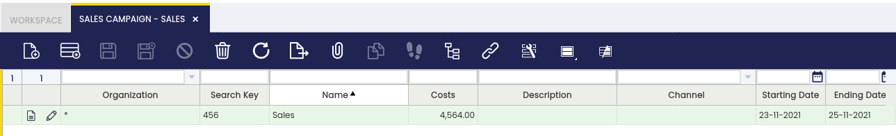
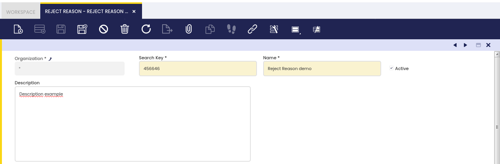

## Overview

This section describes the different windows that are necessary to set up the sales process in Etendo. These are:

[:material-file-document-outline:Condition of the Goods](#condition-of-the-goods){ .md-button .md-button--primary }  

[:material-file-document-outline:Sales Region](#sales-region){ .md-button .md-button--primary }  

[:material-file-document-outline:Commission](#commission){ .md-button .md-button--primary }  

[:material-file-document-outline:Channel](#channel){ .md-button .md-button--primary }  

[:material-file-document-outline:Sales Campaign](#sales-campaign){ .md-button .md-button--primary }  

[:material-file-document-outline:Reject Reason](#reject-reason){ .md-button .md-button--primary }  

## Condition of the goods

:material-menu: `Application` > `Sales Management` > `Setup` > `Condition of the goods`

In this window, the user defines in which status the goods come from the customer. These values are used in the **Return Material Receipt** window.

## Sales Region

:material-menu: `Application` > `Sales Management` > `Setup` > `Sales Region`

In this section, the user can create sales regions to be used in sales operations and define a sales region to be used in the sales process.

## Commission

:material-menu: `Application` > `Sales Management` > `Setup` > `Commission`

In this window, users can configure commission plans for sales representatives. The Commission functionality allows defining how and when commissions are calculated, and to whom they are paid. Commissions can be calculated based on net sales amount or profit margins, with support for complex scenarios through filters by business partner, product, or region.

For detailed information about commission configuration, calculation methods, and examples, see the [Commission](../../../../user-guide/etendo-classic/basic-features/sales-management/setup/commission.md) section.

 

## Channel

:material-menu: `Application` > `Sales Management` > `Setup` > `Channel`

In this section, the user can create specific sales channels to be used in sales operations and define a sales channel to be used in the sales process.

## Sales Campaign

:material-menu: `Application` > `Sales Management` > `Setup` > `Sales Campaign`

In this section, the user can create specific sales campaigns to be used in sales operations and define a sales campaign to be used in the sales process.

## Reject Reason

:material-menu: `Application` > `Sales Management` > `Setup` > `Reject Reason`

In this window, the user defines the reasons to reject quotations. These values are used in the **Sales Quotation** window.

---

This work is a derivative of [Sales Management](http://wiki.openbravo.com/wiki/Sales_Management){target="_blank"} by [Openbravo Wiki](http://wiki.openbravo.com/wiki/Welcome_to_Openbravo){target="_blank"}, used under [CC BY-SA 2.5 ES](https://creativecommons.org/licenses/by-sa/2.5/es/){target="_blank"}. This work is licensed under [CC BY-SA 2.5](https://creativecommons.org/licenses/by-sa/2.5/){target="_blank"} by [Etendo](https://etendo.software){target="_blank"}.