## Overview

This section describes the windows related to warehouse reports in Etendo. These are:

[:material-file-document-outline: Pareto Product Report](../../../../user-guide/etendo-classic/basic-features/warehouse-management/analysis-tools.md#pareto-product-report){ .md-button .md-button--primary }  

[:material-file-document-outline: Material Transaction Report](../../../../user-guide/etendo-classic/basic-features/warehouse-management/analysis-tools.md#material-transaction-report){ .md-button .md-button--primary }  

[:material-file-document-outline: Stock Report](../../../../user-guide/etendo-classic/basic-features/warehouse-management/analysis-tools.md#stock-report){ .md-button .md-button--primary }  

[:material-file-document-outline: Stock History](../../../../user-guide/etendo-classic/basic-features/warehouse-management/analysis-tools.md#stock-history){ .md-button .md-button--primary }  

[:material-file-document-outline: Valued Stock Report](../../../../user-guide/etendo-classic/basic-features/warehouse-management/analysis-tools.md#valued-stock-report){ .md-button .md-button--primary }  

[:material-file-document-outline: Product Movements Report](../../../../user-guide/etendo-classic/basic-features/warehouse-management/analysis-tools.md#product-movements-report){ .md-button .md-button--primary }  

## Pareto Product Report

### **Introduction**

**Pareto Product Report** distributes products into three classes (A, B or C) according to the cost value that each product inventory has in the warehouse. Based on this classification the frequency of counting cycle can be decided (e.g. A products are counted weekly, B products monthly and C products yearly).

Following distribution is used: A products represent 80% value of the warehouse, B - 15% and C- 5%.
> 
!!! info
    The classification is based on the cost of the product. That is why it is needed to have a Costing Rule validated and the Material Transaction costs of the product calculated up to date.

### **Parameters window**

**Currency** field defines currency in which all monetary values (like **Cost**, **Value**) of the report are shown. Field is defaulted to the system currency.

!!! warning
    Please note that **Conversion Rate** to the report **Currency** should be specified for the report to work.

**Update ABC** button fills in **ABC** field (updates value if the record exists or creates new record otherwise) of Org. Specific tab of the **Product** window for the organizations of the report output.

### **Sample Report Output**

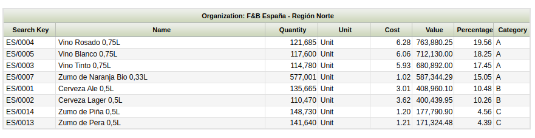

Columns to note:

-   **Quantity:** is the current stock of the product (Quantity on Hand) in the warehouse selected.
-   **Value:** that is the sum of all the material transaction costs of the product.
-   **Cost:** this cost is calculated as the ratio between the product value and the product quantity above
-   **Percentage:** that percentage is the ratio between the product value and the Total Value of the warehouse (which is the sum of all report lines).

### **Persisted information**

Aggregated information calculated for the Valued Stock can be used. Please refer to the  Valued Stock Report documentation for more details about how to generate the aggregated information.

!!! note
    Exactly as for the Valued Stock Report, the Pareto Product Report can also be launched without aggregated data. However, this feature is specially useful in high volume environments when you experience performance issues launching the report.

## Material Transaction Report

Material Transaction Report lists all documents (outgoing shipments and incoming receipts) grouped by Business Partner and document. For each document number data, product, warehouse, bin and quantity are shown.

### Window Parameters

Information on this report can be filtered using movement date, business partner, warehouse and project. Reports can be generated on HTML and PDF format.

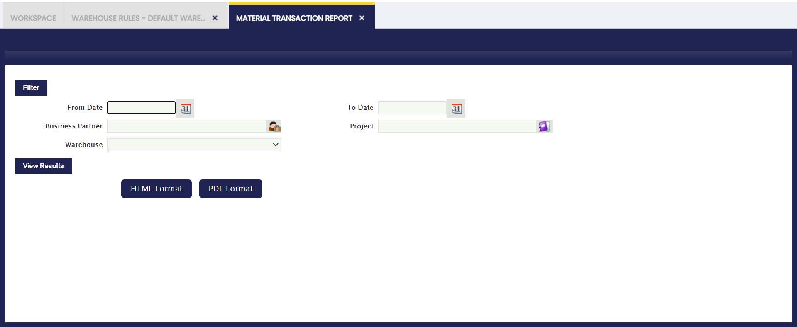

### Sample Report Output

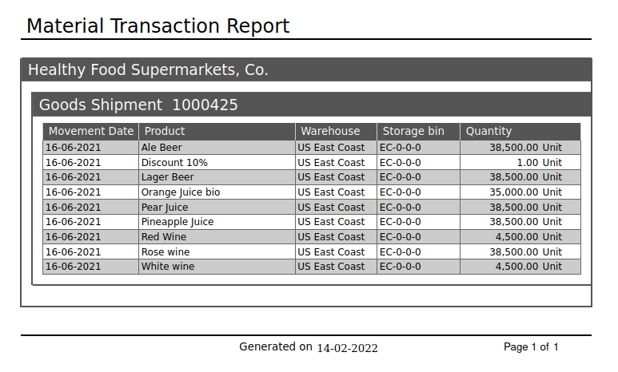

## Stock Report

Stock Report shows a stock level of all products (that have quantity on hand different from zero) and their location (warehouse and storage bin) grouped by product category. For each row product, quantity, unit, attribute, shelves, column, height and warehouse.

### **Parameters window**

The outcome of this report can be filtered by using movement date, product category, product and warehouse locators.

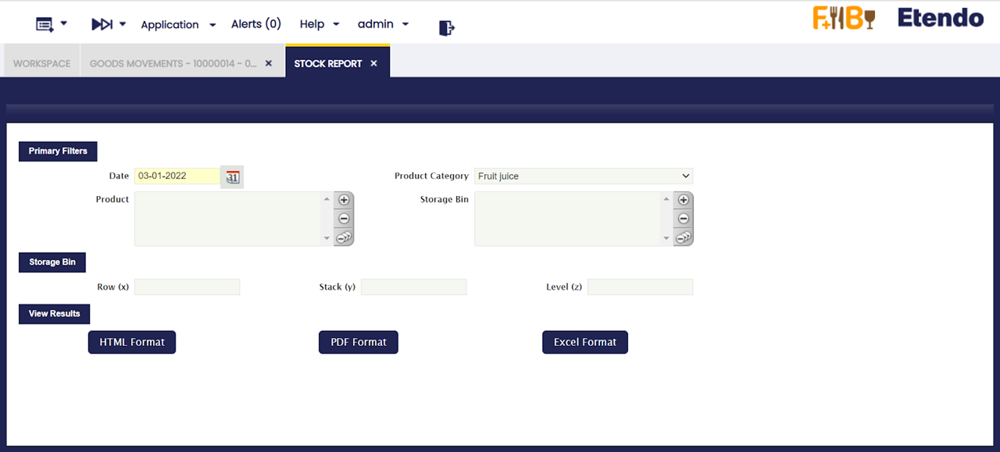

The outcome of this report can be viewed in HTML and PDF format.

**Shelves (x)**, **Column (y)**, **Height (z)** fields correspond to **Row (X)**, **Stack (Y)** and **Level (Z)** of the Storage Bin.

**Sample Report output**

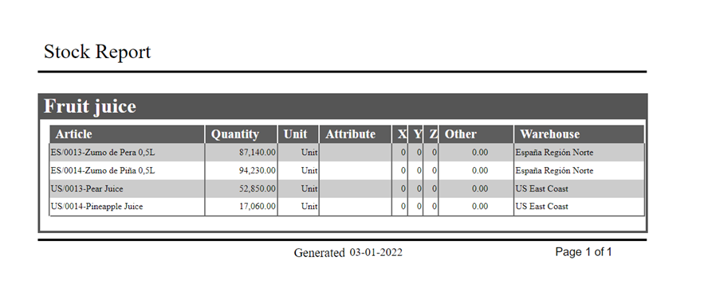

## Stock History

!!! info
    To be able to include this functionality, the Warehouse Extensions Bundle must be installed. To do that, follow the instructions from the marketplace: [Warehouse Extensions Bundle](https://marketplace.etendo.cloud/#/product-details?module=EFDA39668E2E4DF2824FFF0A905E6A95){target="_blank"}. For more information about the available versions, core compatibility and new features, visit [Warehouse Extensions - Release notes](https://docs.etendo.software/whats-new/release-notes/etendo-classic/bundles/warehouse-extensions/release-notes/).
 

This is a read-only window in which the user is able to consult the daily stock. This functionality updates the daily information collected by the process in Background which was previously created for this purpose. 

The Stock History window is filled only by the background process "Create Stock History". It can be programmed from the 'Request Processing' window, where it can be assigned for which role and organization it is executed, and the periodicity with which it is executed.

!!! info
    Check the Technical documentation about Stock History to extend the process to calculate the registers for the daily stock history. 

No data will be displayed in the window until search filters are applied to the window. Once the filters are applied, click the button on the right to complete the process. 

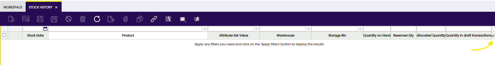

The window shows the following fields from which the user is able to filter and get the needed data: 
- Stock date 
- Product
- Attribute set value
- Warehouse
- Storage Bin
- Quantity on hand
- Reserved QtY
- Allocated Quantity
- Quantity in draft transaction
 
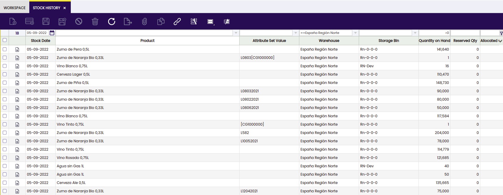

This functionality includes a process to close the stock and save the historical information.

## Valued Stock Report

### **Introduction**

Valued Stock Report shows the stock for a particular warehouse as well as the value of the stock.

The cost is calculated as a sum of the cost of each material transaction of the product in the warehouse. The cost of the product transactions is calculated by the Costing Server process.

### **Parameters Window**

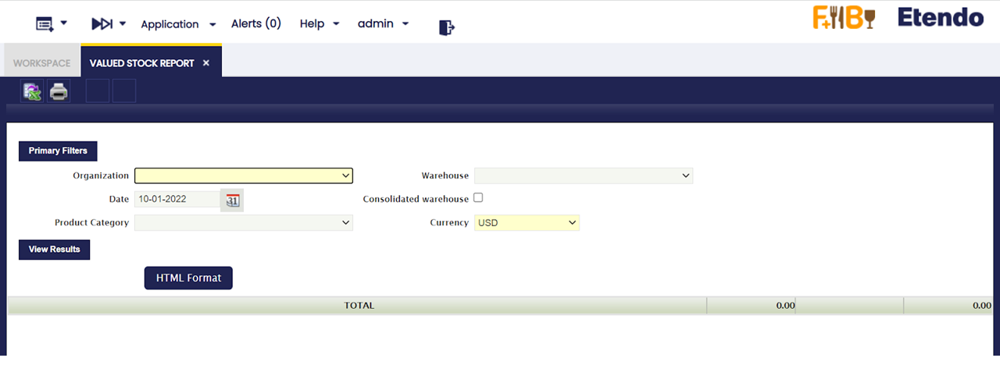

-   **Organization**: This field allows the user to select among  Organizations of type "Legal with Accounting" and "Generic".
-   **Warehouse**: If the selected organization is "Generic", then lists all warehouses that belong to it, else if the organization is "Legal with accounting" then no warehouse is displayed to be selected.
-   **Date**: The report is going to show information up to the selected date.
-   **Consolidated Warehouse**: If checked the information of the stock will be consolidated at Organization Level, otherwise, the information will be broken down by Warehouse.
-   **Product Category**: Allows to show information of only the Product Category selected.
-   **Currency**: Defines currency in which all monetary values (like Cost, Valuation) of the report are shown.

!!! warning
    Please note that Conversion Rate to the report Currency should be specified for the report to work.

### **Output Window** 

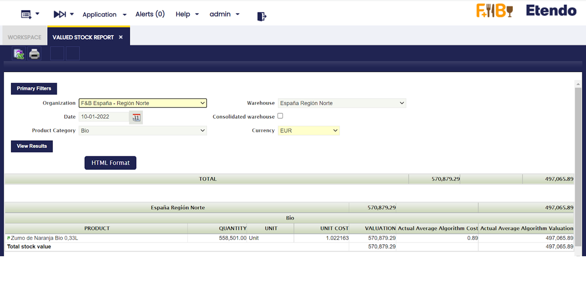

-   **Product**: Name of the Product.
-   **Quantity**: Stock of the Product on the selected date.
-   **Unit** : Unit in which the stock is measured.
-   **Unit Cost**: Cost of each particular unit. Ii is the result of dividing the Valuation between the Stock.
-   **Valuation**: Valuation of the Stock. It is calculated by adding up all the valuations of each transaction that has happened in the Warehouse.
-   **Actual Average/Standard Algorithm Cost**: Current Average/Standard Cost, the latest calculation of it's value.
-   **Actual Average/Standard Algorithm Valuation**: Valuation of the Stock based on the Actual Average/Standard Cost. Ii is the result of multiplying the Stock by the Actual Cost.

### **Persisted Information**

This step is not necessary in order to launch the Report. However, if there are performance problems, this can help to greatly improve the performance of the Report.

It is possible to aggregate information that allows for faster queries. This information is aggregated for each Closed Accounting Period, that means that accounting periods must be defined and, at least some of them, must be in a *Closed* or *Permanently Closed* Status. 

The information will persist until the first not closed Period. By doing so, it is possible to avoid looping through many records. However, no information will be aggregated after the first closed period and this can result in a non optimal performance of the report if it needs to retrieve plenty of information.

!!! info
    In order to use this functionality it is necessary to schedule the Background Process named *Generate Aggregated Data Background*. This can be done through the *Process Request* Window.

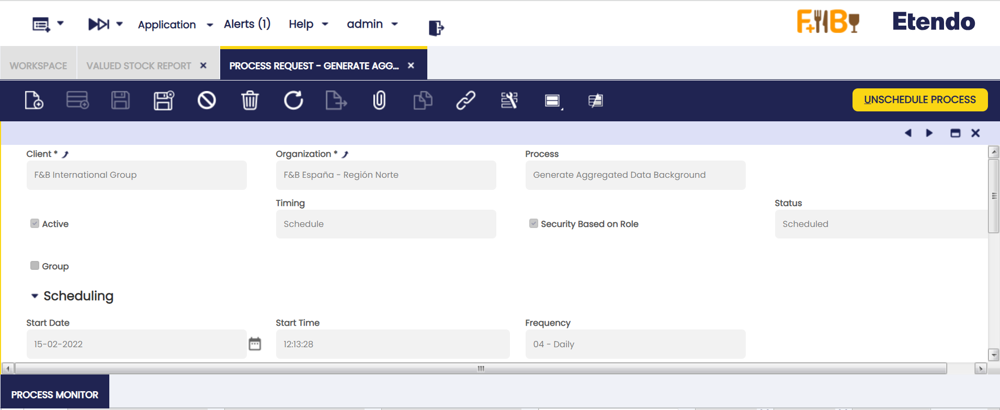

!!! info
    It is recommended to schedule it daily, at a moment when the System does not have plenty of activity. It will aggregate data only when a new Period is Closed or Permanently Closed.

### **Limitations**

By aggregating the information per each Closed Period, it is not possible to keep the date of each Transaction. So, when the Report is launched for a different Currency, all that information will be converted at the Period's Closing Date. This can result in minor discrepancies with the previous version due to conversions between currencies at different dates.

## Product Movements Report

Product Movements Report shows all receipts, shipments, moves and physical inventories grouped by Transaction Type and Business Partner. For each row, document number, date, description, locators and quantity are shown.

### Parameters Window

The outcome of this report can be filtered using movement date, product, attribute and business partner.

Additionally, the user can include or exclude these documents:

-   Shipment/Receipt
-   Physical Inventory
-   Inventory Movements
-   and Production.

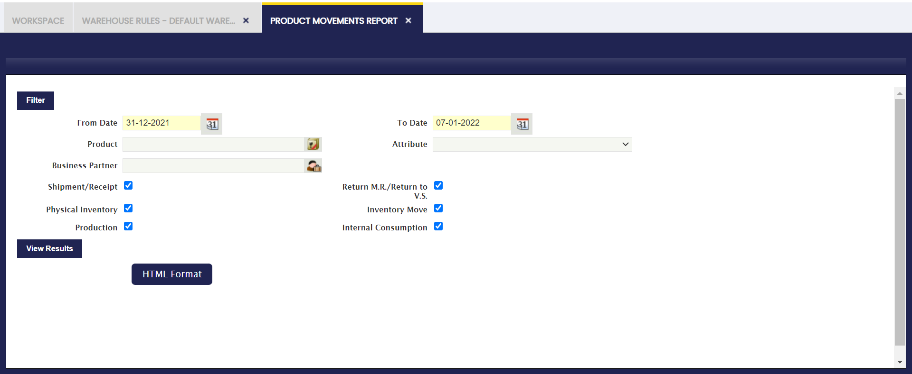

### Sample Report Output

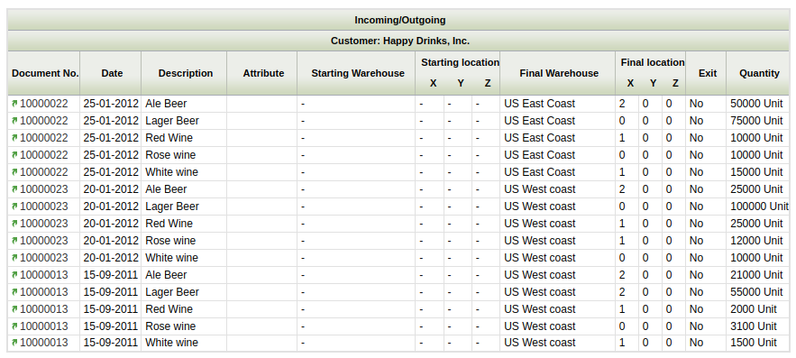