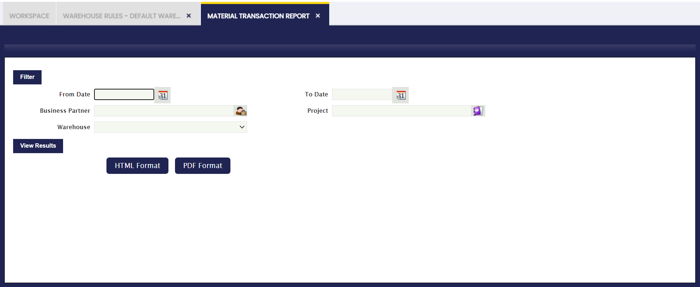
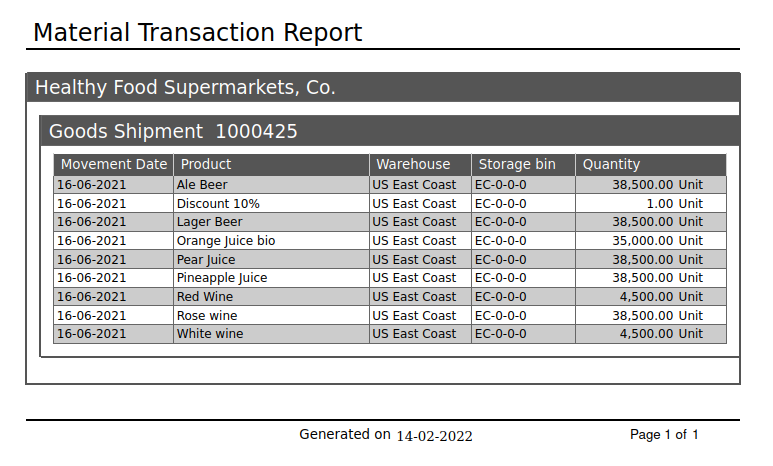

:material-menu: `Application` > `Warehouse Management` > `Analysis Tools` > `Material Transaction Report`

### **Overview**

The **Material Transaction Report** provides a consolidated view of all material movements recorded in the system, including outgoing shipments and incoming receipts. Transactions are grouped by Business Partner and document, making it straightforward to trace which products were shipped or received, in what quantities, and through which warehouse.

This report is useful for:

- Tracking inbound and outbound material movements over a specific period.
- Auditing inventory transactions to verify that shipments and receipts match expected quantities.
- Reconciling documents by Business Partner to ensure completeness and accuracy of recorded transactions.

### **Parameters Window**

The following parameters allow filtering the data included in the report:

-   **Movement Date (From / To):** Defines the date range for the report. Only transactions that occurred within this range will appear.
-   **Business Partner:** Filters transactions by a specific supplier or customer. When left empty, transactions for all Business Partners are included.
-   **Warehouse:** Restricts the report to transactions that occurred in the selected warehouse.
-   **Project:** Filters transactions associated with a specific project.

The report can be generated in **HTML** or **PDF** format.

### **Sample Report Output**

The report output is organized by **Business Partner** and, within each partner, by **document number**. For each transaction line, the following columns are displayed:

-   **Document Number:** The identifier of the shipment or receipt document.
-   **Product:** The name of the product involved in the transaction.
-   **Warehouse:** The warehouse where the transaction took place.
-   **Storage Bin:** The specific location (shelf, rack, or section) within the warehouse where the product was stored or retrieved.
-   **Quantity:** The quantity of the product moved in the transaction.

---

This work is a derivative of [Warehouse Management](http://wiki.openbravo.com/wiki/Warehouse_Management){target="\_blank"} by [Openbravo Wiki](http://wiki.openbravo.com/wiki/Welcome_to_Openbravo){target="\_blank"}, used under [CC BY-SA 2.5 ES](https://creativecommons.org/licenses/by-sa/2.5/es/){target="\_blank"}. This work is licensed under [CC BY-SA 2.5](https://creativecommons.org/licenses/by-sa/2.5/){target="\_blank"} by [Etendo](https://etendo.software){target="\_blank"}.
